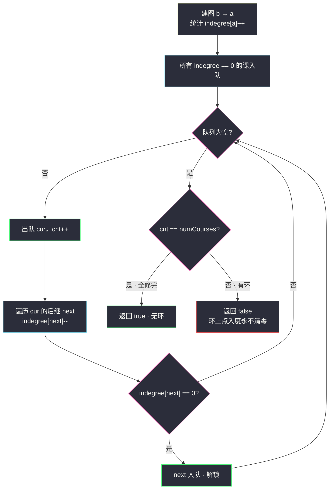
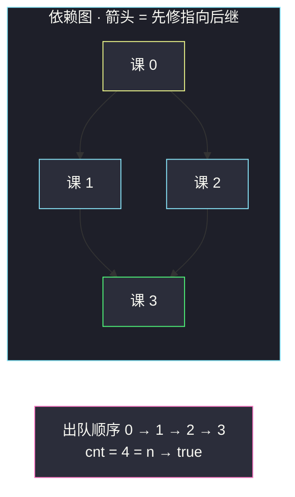

# 课程表（拓扑排序判环：入度清零计数）

## 一、问题描述

这个学期你必须选修 `numCourses` 门课程，记为 `0` 到 `numCourses - 1`。

有些课程有先修要求，`prerequisites[i] = [ai, bi]` 表示**想要学习课程 `ai`，必须先修完课程 `bi`**。

判断是否可能修完所有课程？可以返回 `true`，否则返回 `false`。

> 🔗 LeetCode 207：https://leetcode.cn/problems/course-schedule/
>
> 约束：`1 <= numCourses <= 2000`，`0 <= prerequisites.length <= 5000`，`prerequisites[i].length == 2`，无自环（`ai != bi`），先修关系无重复。

**示例 1**

```
输入：numCourses = 2, prerequisites = [[1,0]]
输出：true
解释：共 2 门课。修 1 之前得先修 0，顺序 0 → 1 即可全部修完
```

**示例 2**

```
输入：numCourses = 2, prerequisites = [[1,0],[0,1]]
输出：false
解释：修 1 要先修 0，修 0 又要先修 1，互相卡死（有环），不可能修完
```

**直观理解**

把课程看成点，把「先修 b 才能修 a」翻译成一条 **b → a 的有向边**，整个先修体系就是一张**有向图**。「能修完所有课」等价于「存在一个顺序，每门课轮到它时先修课都已完成」——这正是**拓扑序**。而**有向图存在拓扑序 ⇔ 图中无环**。于是问题从「排课」坍缩成一句话：**判断有向图是否有环**。拓扑排序的 BFS 写法（Kahn 算法）是这里的标准工具。

---

## 二、暴力解法（逐点 DFS 找环）

### 直观思路

对每个点发起 DFS，看从它出发**是否绕回到自己**——只要任何一点能转回来，就有环。搜索时用 `onPath` 标记当前路径上的点，遇到已在路径上的即命中。

```java
class Solution {
    public boolean canFinish(int numCourses, int[][] prerequisites) {
        List<List<Integer>> graph = new ArrayList<>();
        for (int i = 0; i < numCourses; i++) graph.add(new ArrayList<>());
        for (int[] p : prerequisites) graph.get(p[1]).add(p[0]);

        boolean[] visited = new boolean[numCourses]; // 全局搜过
        for (int i = 0; i < numCourses; i++) {
            if (hasCycle(graph, i, visited, new boolean[numCourses])) {
                return false;
            }
        }
        return true;
    }

    // 从 start 出发，onPath 记当前路径；每换起点都重新带一张新 onPath
    private boolean hasCycle(List<List<Integer>> graph, int cur,
                             boolean[] visited, boolean[] onPath) {
        if (onPath[cur]) return true;   // 转回到当前路径 → 有环
        if (visited[cur]) return false; // 这棵子树确认无环，剪枝
        onPath[cur] = true;
        visited[cur] = true;
        for (int next : graph.get(cur)) {
            if (hasCycle(graph, next, visited, onPath)) return true;
        }
        onPath[cur] = false;            // 回溯，撤销路径标记
        return false;
    }
}
```

### 复杂度

- **时间**：`O(n·(n+e))`——每个起点都要重走可达区域（`visited` 只做子树级剪枝，不同起点的可达区域大量重叠）
- **空间**：`O(n+e)`

### 🔴 瓶颈在哪里

「每个点单独问一次能不能绕回来」把同一片图搜了一遍又一遍。而我们真正关心的只有一件事：**有没有一整块谁也动不了的死锁区域（环）**。拓扑排序换个角度提问：不问「有没有环」，而是问「**有多少课能按顺序修掉**」——能全部修掉就是无环，这个正向推进的过程每门课只处理一次。

---

## 三、优化探索（核心章节）

### 3.1 观察特征

| 特征 | 说明 |
|------|------|
| 先修 = 有向边 | `[a, b]` 表示 b 先于 a，建边 **b → a**（方向建反是这题第一易错点） |
| 没有先修的课随时能上 | 入度为 0 的点不依赖任何人，是天然的「起点」 |
| 修完一门会解锁后继 | 课程完成 → 它指向的后继少一个未完成依赖（**入度 -1**） |
| 环的本质 | 环上每门课都互相等对方先修，**入度永远清不了零** |

### 3.2 优化：拓扑排序 BFS（Kahn 算法）

用「入度」做解锁计数，队列做待修清单：

1. 建图（邻接表）+ 统计每门课的**入度**（先修课数量）；
2. 入度为 0 的课全部入队——它们没有任何未完成的先修；
3. 不断出队：**出队 = 这门课修掉了**，`cnt++`；把它的每条出边砍掉（后继入度 -1），某后继入度减到 0 就入队；
4. 队列空时：**`cnt == numCourses` ⇔ 无环能修完**；`cnt` 少了说明剩下的是一个环（或若干环）永远进不了队列。



### 3.3 关键推导：为什么「计数对不上」就一定有环

- **充分性**：每个点最终恰好被出队一次（入过队就不会重复入队，因为入队条件「入度减到 0」在入度单调递减（只减不加）下至多成立一次）；无环时按拓扑序逐个清零，全部能出队，`cnt = n`。
- **必要性**：若 `cnt < n`，剩下的点构成非空子图。该子图中每个点的入度都没减到 0，即每个点都还有**未被出队的先修**——而所有能出队的都出完了，这些先修只能在剩下的点内部，于是剩下子图每个点内部至少有一条入边，**子图边数 ≥ 点数 → 必有环**。

一句话：**队列是「依赖已清零」的传播器，环是传不进去的死区。**

### 3.4 关键推导问题

| 问题 | 答案 |
|------|------|
| 边的方向到底怎么建？ | `prerequisites[i] = [a, b]` 是「a 依赖 b」，建 **b → a**；这样入度才是「先修课没修完的个数」 |
| 入度为 0 却不在队首怎么办？ | 没关系，拓扑序不唯一，谁先出队都合法；本题只数个数 |
| `[1,0]` 和 `[1,0]` 重复给两次会怎样？ | 入度被加两次，但对应的入队机会也只有一次 → `cnt` 永远追不上 n，误判有环（题面保证无重复，但自写变体要小心） |
| 队列能用普通数组吗？ | 可以，课源码 class059 就用 `int[] queue` + 双指针 `l/r`，比 `ArrayDeque` 更快 |
| DFS 判环还有更优雅的写法吗？ | 三色标记法（白未访/灰在栈/黑完成），见第七节对比 |

### 3.5 一句话核心

> **入度为零才能修，修掉就给后继减负；最后数出队次数，等于总课数就无环，少了就是被环卡死。**

---

## 四、代码实现详解

### Java（主解：Kahn 拓扑排序，对齐 class059 骨架）

> 课源码出处：`class059/Code02_TopoSortDynamicLeetcode.java`（课上收录的是 [#210 课程表 II](./course-schedule-ii.md) 的完整实现）。本题课源码未单独收录，按同一「邻接表 + 入度表 + 数组队列」骨架改写为计数判断版。

```java
// 课程表
// 测试链接 : https://leetcode.cn/problems/course-schedule/
import java.util.ArrayList;

class Solution {
    public boolean canFinish(int numCourses, int[][] prerequisites) {
        // 动态邻接表建图：边 b → a（先修 b 才能修 a）
        ArrayList<ArrayList<Integer>> graph = new ArrayList<>();
        for (int i = 0; i < numCourses; i++) {
            graph.add(new ArrayList<>());
        }
        int[] indegree = new int[numCourses];   // 入度表：先修课数量
        for (int[] edge : prerequisites) {
            graph.get(edge[1]).add(edge[0]);
            indegree[edge[0]]++;
        }

        int[] queue = new int[numCourses];      // 数组当队列，l 出 r 进
        int l = 0, r = 0;
        for (int i = 0; i < numCourses; i++) {
            if (indegree[i] == 0) {
                queue[r++] = i;                 // 无先修，直接可修
            }
        }

        int cnt = 0;                            // 已修掉的课数
        while (l < r) {
            int cur = queue[l++];
            cnt++;                              // 修掉 cur
            for (int next : graph.get(cur)) {
                if (--indegree[next] == 0) {    // cur 完成，给后继减负
                    queue[r++] = next;          // 依赖清零，可以修了
                }
            }
        }
        return cnt == numCourses;               // 全修完 ⇔ 无环
    }
}
```

### Java（附：三色标记 DFS 判环，另一种好记的写法）

```java
import java.util.ArrayList;

class Solution {
    // color: 0 未访问 · 1 在当前 DFS 栈上（灰）· 2 已完成（黑）
    private List<List<Integer>> graph;
    private int[] color;

    public boolean canFinish(int numCourses, int[][] prerequisites) {
        graph = new ArrayList<>();
        for (int i = 0; i < numCourses; i++) graph.add(new ArrayList<>());
        for (int[] p : prerequisites) graph.get(p[1]).add(p[0]);
        color = new int[numCourses];

        for (int i = 0; i < numCourses; i++) {
            if (color[i] == 0 && dfs(i)) {
                return false;   // 一旦发现环，立刻失败
            }
        }
        return true;
    }

    // 返回 true 表示发现环
    private boolean dfs(int cur) {
        color[cur] = 1;                     // 进栈
        for (int next : graph.get(cur)) {
            if (color[next] == 1) return true;   // 撞上灰点 → 有环
            if (color[next] == 0 && dfs(next)) return true;
        }
        color[cur] = 2;                     // 出栈：整棵子树无环，盖棺
        return false;
    }
}
```

### Python

```python
# 课程表（Kahn 拓扑排序）
# 测试链接 : https://leetcode.cn/problems/course-schedule/
from collections import deque

class Solution:
    def canFinish(self, numCourses: int, prerequisites: list[list[int]]) -> bool:
        graph = [[] for _ in range(numCourses)]
        indegree = [0] * numCourses
        for a, b in prerequisites:          # b → a
            graph[b].append(a)
            indegree[a] += 1

        queue = deque(i for i in range(numCourses) if indegree[i] == 0)
        cnt = 0
        while queue:
            cur = queue.popleft()
            cnt += 1                        # 修掉 cur
            for nxt in graph[cur]:
                indegree[nxt] -= 1
                if indegree[nxt] == 0:
                    queue.append(nxt)
        return cnt == numCourses            # 全修完 ⇔ 无环
```

---

## 五、具体例子演示

### 例 A：`numCourses = 2, prerequisites = [[1,0]]` → true

建图：`0 → 1`；入度：`indegree = [0, 1]`。

| 步 | 动作 | 队列（处理后） | indegree | cnt |
|----|------|----------------|----------|-----|
| 初始 | 入度 0 的课入队 | [0] | [0, 1] | 0 |
| 1 | 出队 0，cnt=1；后继 1 的入度 1→0，入队 | [1] | [0, 0] | 1 |
| 2 | 出队 1，cnt=2；无后继 | [] | [0, 0] | 2 |

队空，`cnt = 2 = numCourses` → **true**。修课顺序正是出队顺序 `0 → 1`。

### 例 B：`numCourses = 2, prerequisites = [[1,0],[0,1]]` → false

建图：`0 → 1`、`1 → 0`（互相依赖的环）；入度：`indegree = [1, 1]`。

| 步 | 动作 | 队列 | indegree | cnt |
|----|------|------|----------|-----|
| 初始 | 没有任何课入度为 0 | [] | [1, 1] | 0 |

队列一开始就是空的，`cnt = 0 ≠ 2` → **false**。环上的课谁也不肯先修，一步都动不了。

### 例 C：`numCourses = 4, prerequisites = [[1,0],[2,0],[3,1],[3,2]]`（多分叉完整跟踪）

```
建图：0 → 1, 0 → 2, 1 → 3, 2 → 3        indegree = [0, 1, 1, 2]
```

| 步 | 动作 | 队列（处理后） | indegree | cnt |
|----|------|----------------|----------|-----|
| 初始 | 课 0 入度为 0 入队 | [0] | [0,1,1,2] | 0 |
| 1 | 出队 0，cnt=1；后继 1 入度 1→0 入队、2 入度 1→0 入队 | [1,2] | [0,0,0,2] | 1 |
| 2 | 出队 1，cnt=2；后继 3 入度 2→1，未清零不入队 | [2] | [0,0,0,1] | 2 |
| 3 | 出队 2，cnt=3；后继 3 入度 1→0，入队 | [3] | [0,0,0,0] | 3 |
| 4 | 出队 3，cnt=4；无后继 | [] | [0,0,0,0] | 4 |



注意第 1 步：课 1 和课 2 同时入队——它们的先后无所谓（并列先修），这正是「拓扑序不唯一」的体现。课 3 要等两个先修**都**出队（入度连减两次）才解锁，第 2 步减到 1 时不入队是关键细节。

---

## 六、复杂度分析

| 方法 | 时间 | 空间 | 说明 |
|------|------|------|------|
| Kahn BFS（主解） | `O(n + e)` | `O(n + e)` | 每门课进出队一次、每条边砍一次；空间 = 邻接表 + 入度表 + 队列 |
| 三色 DFS | `O(n + e)` | `O(n + e)` | 每点进出一次、每边走一次；递归栈深 `O(n)` |
| 暴力逐点 DFS | `O(n·(n+e))` | `O(n+e)` | 换起点重复扫可达区域 |

---

## 七、方法对比与总结

### 易错点

1. **边方向建反**：`[a, b]` 是「a 依赖 b」，边必须 **b → a**。建反后判环结论恰好颠倒（自环外无环图反向仍无环，但本题两元素环例 B 对称看不出来；普通 DAG 建反会得到**反拓扑序**，计数仍能过 #207，但做 [#210](./course-schedule-ii.md) 输出顺序就露馅）。
2. **入队条件写 `indegree[next] > 0`**：方向反了，永远入不了队；必须是**减到恰好等于 0** 才入队。
3. **重复边 / 自环**：重复边会让入度虚高、`cnt` 永远追不上 n；自环（`a` 依赖自己）是长度 1 的环，本身就该返回 false。题面已保证，但变体题要自己防。
4. **忘了无先修课直接全入队**：初始循环别漏，图可能有多片连通分量。
5. **DFS 暴力版只带一张 onPath 不回溯**：会把「访问过」误当「在环上」，把无环图判死。

### Kahn BFS vs 三色 DFS

| | Kahn BFS | 三色 DFS |
|--|----------|----------|
| 判环 | 出队计数 `cnt == n` | 撞到灰色节点 |
| 顺便产出拓扑序 | 出队顺序就是（#210 直接用） | 需「后序逆序」（课程出栈顺序的倒序） |
| 递归栈 | 无（可数组队列） | 深链图可能爆栈（Java 默认栈深） |
| 记忆成本 | 一个队列一个计数，极低 | 三色状态机，略绕 |

### 模板口诀

> **建图先修指后继，入度清零才入队；出队加一砍出边，砍到归零又入队；数到最后若不满，必有环上死锁鬼。**

---

## 八、举一反三

| 题目 | 链接 | 迁移点 |
|------|------|--------|
| 210. 课程表 II | https://leetcode.cn/problems/course-schedule-ii/ | 同一张图，出队顺序存下来就是答案，与本文互引 |
| 269. 火星词典 | https://leetcode.cn/problems/alien-dictionary/ | 课源码 class059 Code04 原题：字符串顺序抽边 + 拓扑排序 |
| 802. 找到最终的安全状态 | https://leetcode.cn/problems/find-eventual-safe-states/ | 反向建图 + 拓扑：出度清零的是安全点 |
| 1136. 平行课程 | https://leetcode.cn/problems/parallel-courses/ | 拓扑按「层」数学期数：BFS 分层统计 |
| 2115. 从给定原材料中找到所有可获得的食材 | https://leetcode.cn/problems/find-all-possible-recipes-from-given-supplies/ | 同构换皮：材料 = 入度 0 起点逐层解锁 |

**迁移一句**：题面一旦出现「依赖」「先……才能……」「顺序执行所有任务」，先翻译成有向图 + 入度表，拓扑排序三板斧（建图、入队、砍边）直接上——判环看计数，要顺序看出队。
