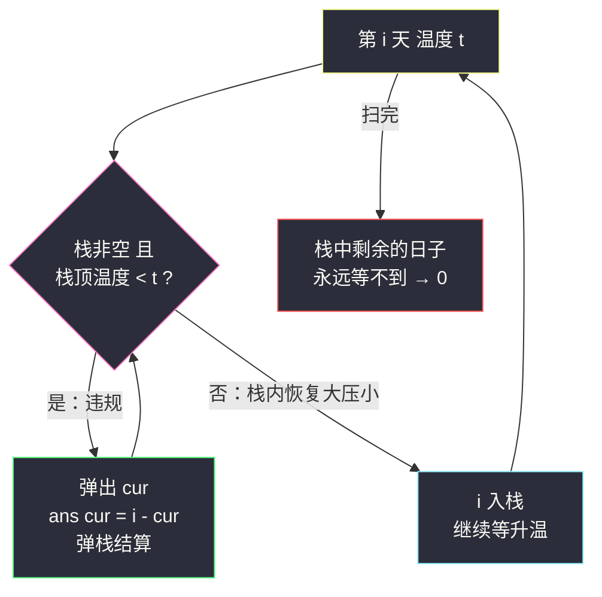
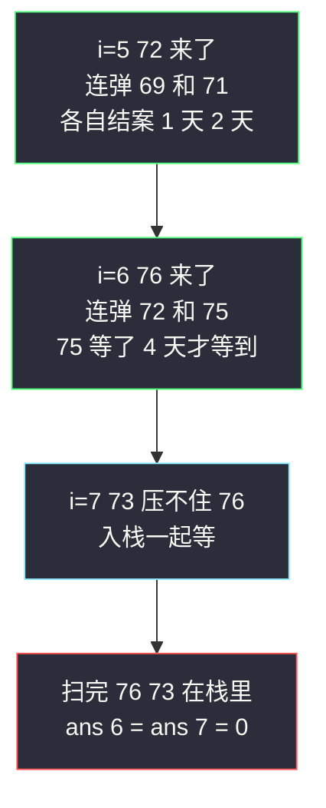

# 每日温度（单调栈 · 大压小，弹栈结算）

## 一、问题描述

给定一个整数数组 `temperatures` 表示每天的温度，返回一个数组 `answer`，其中 `answer[i]` 是指对于第 `i` 天，**下一个更高温度出现在几天后**。如果气温在这之后都不会升高，请在该位置用 `0` 来代替。

> 🔗 LeetCode 739：https://leetcode.cn/problems/daily-temperatures/
>
> 约束：`1 <= temperatures.length <= 10^5`，`30 <= temperatures[i] <= 100`。数据规模摆明了 `O(n²)` 暴力会超时，线性解法是本题考点。

**示例 1**

```
输入：temperatures = [73,74,75,71,69,72,76,73]
输出：[1,1,4,2,1,1,0,0]
解释：
  73 → 次日 74 更高，等 1 天
  75 → 一直等到 76（第 6 天），等 4 天
  76 → 之后没有更高，0
```

**示例 2**

```
输入：temperatures = [30,40,50,60]
输出：[1,1,1,0]
解释：前三天次日就升温；最后一天 60 之后没有更高温，等 0 天
```

**示例 3**

```
输入：temperatures = [30,60,90]
输出：[1,1,0]
```

**直观理解**

每个位置都在问同一件事：「我右边第一个比我高的，离我几天？」从左往右走，手里攥一摞「还没等到升温的日子」——新来一天温度更高时，这一摞里所有比它凉的日子**同时等到答案**，等待天数就是当前下标减去自己的下标。越晚入栈的越凉、也越先等到升温，用**栈**维护正合适。课源码 class052 `Code02_DailyTemperatures` 就是本题原题，核心一句话：**大压小的栈，新高温一来，违规的凉天数全弹出结算**。

---

## 二、暴力解法（每个位置向右扫）

### 直观思路

对每一天 `i`，从 `i+1` 天起向右逐天找，遇到第一个比 `temperatures[i]` 高的就记下距离 `j - i`，扫到底都没有就记 `0`：

```java
class Solution {
    public int[] dailyTemperatures(int[] temperatures) {
        int n = temperatures.length;
        int[] ans = new int[n];
        for (int i = 0; i < n; i++) {
            for (int j = i + 1; j < n; j++) {
                if (temperatures[j] > temperatures[i]) {
                    ans[i] = j - i;
                    break;
                }
            }
        }
        return ans;
    }
}
```

### 复杂度

- **时间**：`O(n²)`——最坏（整体递减如 `[100,99,98,...]`）每个位置都要扫到末尾
- **空间**：`O(1)`（不计输出）

### 🔴 瓶颈在哪里

1. **同一片区域被反复扫**：`i` 和 `i+1` 的向右搜索高度重叠，谁也不帮谁；
2. 没利用「一个升温日可以**批量结案**所有更凉的日子」这个结构；
3. 每天独立作战，`n = 10^5` 时 `10^10` 次比较直接超时。

---

## 三、优化探索（核心章节）

### 3.1 观察特征

| 特征 | 说明 |
|------|------|
| 问的是「右边第一个更大」 | 单调栈的标志性问题（同 #496 下一个更大元素） |
| 答案是**距离**不是值 | 栈里必须存**下标**，结算时 `i - cur` 才算得出天数 |
| 温度可能相等 | 「更高」才是答案，相等不算——相等的天**一起入栈**，等到真正升温时一起弹（课注释原话：相等时候的处理，相等也加入单调栈） |
| 没等到升温的注定等不到 | 扫描结束时还在栈里的，右边没有任何更高温 → 答案保持 0 |

### 3.2 暴力 → 优化：大压小单调栈，违规即弹栈结算

栈维护**大压小**不变式：从栈底到栈顶，下标对应的温度**递减**（底热顶凉）。新的一天 `i` 到来时：

- 若它比栈顶**更热**——栈顶「违规」了（凉日子压着热日子在下），弹出结算：`ans[cur] = i - cur`；
- 弹到栈顶不比它凉为止，`i` 入栈继续等。

```
dailyTemperatures:
    stack = 空栈（存下标，底到顶温度递减）
    for i in 0..n-1:
        while 栈非空 且 temperatures[栈顶] < temperatures[i]:
            cur = 栈顶弹出
            ans[cur] = i - cur          ← 弹栈结算：等了 i - cur 天
        stack.push(i)                   ← 相等的也入栈，一起等
    栈中剩余 → ans 保持 0（右边没有更高温）
```



### 3.3 关键推导问题

| 问题 | 答案 |
|------|------|
| 为什么弹出时恰好等到了答案？ | 栈顶 `cur` 还在栈里，说明 `cur` 之后到 `i` 之前没有任何天比 `cur` 更热（否则早被弹走了）；现在 `t[i] > t[cur]` 且 `i` 是这段里第一个更热的——`i - cur` 就是等待天数 |
| 为什么必须存下标而不是存温度？ | 答案是**距离**，结算要两个下标相减；只存温度算不出天数（这正是与 #496 存值版的本质区别） |
| 相等的温度为什么也入栈？ | 「更高」才触发答案，相等不算。让相等的都进栈排成一摞，等真正更热的一天来时**逐个弹出**、逐个结算，谁也不少 |
| 没弹出的怎么处理？ | 什么都不用做——`ans` 初始全 0，正好就是「右边没有更高温」的正确答案，连清算阶段都省了 |
| 弹栈条件为什么是严格 `<`？ | 相等的日子不能被相等的日子「结案」；写 `<=` 会把等温日提前结算成一个错误答案 |
| 栈内为什么自然递减？ | 新下标入栈前，比它凉的都被弹光了，留下的都比它热——大压小，永远成立 |

### 3.4 一句话核心

> **凉日子大压小排排坐，哪天升温哪天弹——弹一个结一案，天数就是下标差。**

---

## 四、代码实现详解

### Java（主解：ArrayDeque 单调栈，对齐 class052 课源码）

```java
// 每日温度：answer[i] = 下一个更高温出现在几天后
// 测试链接 : https://leetcode.cn/problems/daily-temperatures/
// 对齐课源码 class052 Code02_DailyTemperatures（课上为数组模拟栈版，此处 ArrayDeque 同骨架）
class Solution {
    public int[] dailyTemperatures(int[] temperatures) {
        int n = temperatures.length;
        int[] ans = new int[n];
        Deque<Integer> stack = new ArrayDeque<>();   // 大压小：底到顶温度递减，存下标
        for (int i = 0; i < n; i++) {
            // 新的一天更热 -> 栈顶违规，弹栈结算
            while (!stack.isEmpty() && temperatures[stack.peek()] < temperatures[i]) {
                int cur = stack.pop();
                ans[cur] = i - cur;                   // 等待天数 = 下标差
            }
            stack.push(i);   // 相等的也入栈，一起等真正升温
        }
        return ans;          // 栈中剩余：右边没有更高温，ans 保持 0
    }
}
```

课源码用 `int[] stack` + 指针 `r` 模拟（竞赛风格静态空间），弹栈结算那行 `ans[cur] = i - cur` 与课上完全一致；站点版换成 `ArrayDeque` 只为好读好写。

### Python（同思路）

```python
class Solution:
    def dailyTemperatures(self, temperatures: list[int]) -> list[int]:
        n = len(temperatures)
        ans = [0] * n
        stack: list[int] = []                     # 大压小：底到顶温度递减，存下标
        for i, t in enumerate(temperatures):
            while stack and temperatures[stack[-1]] < t:
                cur = stack.pop()
                ans[cur] = i - cur                # 弹栈结算
            stack.append(i)                       # 相等也入栈
        return ans
```

---

## 五、具体例子演示

### 例 1：`[73,74,75,71,69,72,76,73]`，答案 `[1,1,4,2,1,1,0,0]`

只看下标与温度，逐步跟踪栈（记法：左侧为栈底，括号内为温度）：

| 步 | i（温度） | 栈顶比较 | 动作 | 栈（底→顶） | 结算 |
|----|-----------|----------|------|-------------|------|
| 1 | 0 (73) | 栈空 | 入栈 | [0] | — |
| 2 | 1 (74) | 73 < 74 | 弹 0，ans[0]=1-0=1；入栈 | [1] | `ans[0]=1` |
| 3 | 2 (75) | 74 < 75 | 弹 1，ans[1]=1；入栈 | [2] | `ans[1]=1` |
| 4 | 3 (71) | 75 > 71 不弹 | 入栈 | [2,3] | — |
| 5 | 4 (69) | 71 > 69 不弹 | 入栈 | [2,3,4] | — |
| 6 | 5 (72) | 69 < 72 | 弹 4，ans[4]=1；71 < 72 弹 3，ans[3]=2；75 > 72 停；入栈 | [2,5] | `ans[4]=1`、`ans[3]=2` |
| 7 | 6 (76) | 72 < 76 | 弹 5，ans[5]=1；75 < 76 弹 2，ans[2]=4；栈空；入栈 | [6] | `ans[5]=1`、`ans[2]=4` |
| 8 | 7 (73) | 76 > 73 不弹 | 入栈 | [6,7] | — |
| 9 | 扫完 | — | 栈剩 6、7：右边没有更高温 | [] | ans[6]=ans[7]=0 |

输出 `[1,1,4,2,1,1,0,0]` ✅



**关键看点**：第 6、7 步是「批量结案」——`76` 一来连弹 `72`、`75` 两个，每根柱子一生只被弹一次，这就是线性复杂度的来源；`75` 在第 3 步入栈后一直垫底苦等，直到第 7 步才结算 `4` 天。

### 例 2：整体递减 `[90,80,70]`

三天谁也不比栈顶热，栈一路长成 `[0,1,2]`（大压小最完美形态），全程零弹栈，`ans = [0,0,0]`——单调栈最坏栈深 `O(n)`，全在等一个永远不来的升温。

### 例 3：等温 `[73,73,74]`

`i=1` 的 73 **不弹** `i=0` 的 73（`<` 不成立，相等不算升温），两个 73 叠在栈里；`i=2` 的 74 来了连弹两个，`ans[1]=1`、`ans[0]=2`。若误用 `<=`，`ans[0]` 会被错误结算成 1。

---

## 六、复杂度分析

| 项目 | 暴力向右扫 | 单调栈（主解） |
|------|------------|----------------|
| 时间 | `O(n²)` | **`O(n)`** |
| 空间 | `O(1)` | `O(n)`：栈最坏存满（整体递减时） |

**为什么是 O(n)**：每个下标恰好入栈一次、出栈至多一次，总操作数 ≤ 2n——「每天只排一次队、结一次案」。虽然单步 `while` 可能连弹多个，但弹掉的都是之前攒下的，摊还到每个下标上是常数。

---

## 七、方法对比与总结

### 写法对比

| | 暴力向右扫 | 单调栈（主解） | 从右往左单调栈 |
|--|------------|----------------|----------------|
| 时间 | `O(n²)` | `O(n)` | `O(n)` |
| 空间 | `O(1)` | `O(n)` | `O(n)` |
| 思路 | 查询即计算 | 新热批量结案 | 栈顶即「右边第一个更高」 |
| 面试定位 | 讲思路起点 | ✅ 必须默写 | 二选一练熟即可 |

### 易错点

1. **弹栈条件写成 `<=`**：等温日被错误提前结算（见例 3）。
2. **栈里存温度而不是下标**：结算需要 `i - cur`，存值算不出距离。
3. **忘了初始化 ans 为 0**：Java `new int[n]` 天生是 0，但 Python 手写 `ans = [0] * n` 别写成空列表再 append。
4. **`while` 写成 `if`**：一个升温日可能连弹一摞（例 1 第 6、7 步），只弹一个会漏结案。
5. **结尾手痒加清算阶段**：本题不需要——剩在栈里的答案就是默认值 0，硬加反而画蛇添足（对照 #84 的清算阶段，那里剩的柱子还要用 `n` 当右边界结算）。

### 模板口诀

> **温度一升凉全弹，弹一个记一差；栈里剩的没人热，答案是零不用管。**

---

## 八、举一反三

| 题目 | 链接 | 迁移点 |
|------|------|--------|
| 496. 下一个更大元素 I | https://leetcode.cn/problems/next-greater-element-i/ | 完全同骨架的入门版，答案要「值」不要距离（站内已有题解 next-greater-element-i.md） |
| 503. 下一个更大元素 II | https://leetcode.cn/problems/next-greater-element-ii/ | 循环数组版：序列逻辑上扫两遍（`i % n`），栈弹两次机会 |
| 84. 柱状图中最大的矩形 | https://leetcode.cn/problems/largest-rectangle-in-histogram/ | 大压小反过来（小压大）：矮柱违规时弹栈**结算面积**，单调栈封神题（站内本批已有题解） |
| 85. 最大矩形 | https://leetcode.cn/problems/maximal-rectangle/ | #84 逐行复用，矩阵压缩成直方图（站内本批已有题解） |
| 901. 股票价格跨度 | https://leetcode.cn/problems/online-stock-span/ | 同一个栈反过来问「左边连续 ≤ 自己的天数」，在线版单调栈 |

**迁移一句**：见到「**右边第一个比我大/小**」闭眼单调栈——大压小（或小压大）排好，谁违规谁离场，**弹栈即答案**；要值就存值、要距离就存下标。
