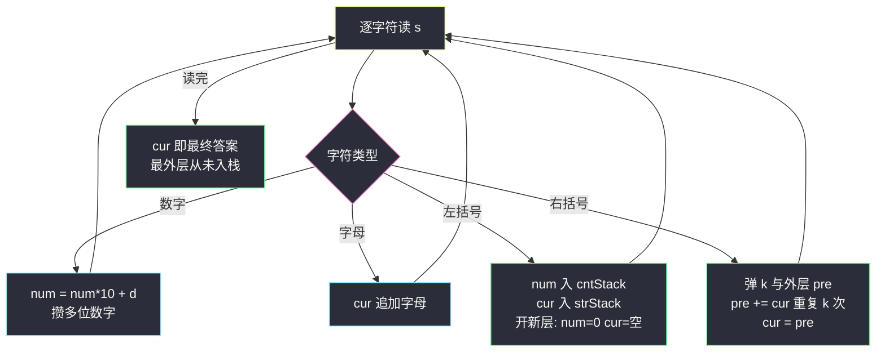
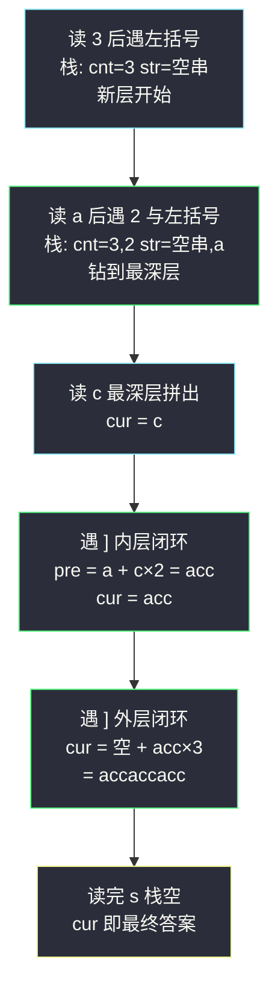

# 字符串解码（双栈模拟展开 + 递归下降）

## 一、问题描述

给定一个经过编码的字符串，返回它解码后的字符串。编码规则为 `k[encoded_string]`，表示方括号内部的 `encoded_string` 正好重复 `k` 次。注意 `k` 保证为正整数，且输入字符串保证合法——数字只表示重复次数，方括号可以嵌套。

> 🔗 LeetCode 394：https://leetcode.cn/problems/decode-string/
>
> 约束：`1 <= s.length <= 30`；`s` 由小写英文字母、数字和方括号 `[]` 组成；`1 <= k <= 300`；题目保证输出长度不超过 `10^4`。

**示例 1**

```
输入：s = "3[a]2[bc]"
输出："aaabcbc"
```

**示例 2**

```
输入：s = "3[a2[c]]"
输出："accaccacc"
```

**示例 3**

```
输入：s = "2[abc]3[cd]ef"
输出："abcabccdcdcdef"
```

**直观理解**

嵌套的 `k[...]` 像洋葱：里层必须先展开，外层才知道自己乘的是什么。纯手工模拟的难点在「乘法是**延迟执行**的」——读到 `3[` 时并不知道要重复什么，得先钻进去把内层算完，回头再乘 3。这种「下钻暂存上文、回来接着算」的节奏，正是**栈**的主场：`[` 时把外层上下文（拼到一半的串、攒下的数字）压栈保存，`]` 时弹栈恢复、把内层结果乘上去接回外层。课源码收录本题原码：`class039` 的 `Code02_DecodeString`，用的是递归下降 + 全局 `where` 指针版本，思路与双栈版完全同构（函数调用栈替代手工栈）。

---

## 二、暴力解法（反复找最内层，原地展开）

### 直观思路

既然嵌套像洋葱，那就一层层剥：每轮扫描整个串，找到**最内层**的一段——形如 `k[纯字母]`（方括号里没有再嵌套）——原地展开替换掉，串变短，嵌套层数少一层。重复直到串里没有 `[`，剩下的就是答案。

```java
class Solution {
    public String decodeString(String s) {
        String cur = s;
        while (cur.indexOf('[') >= 0) {                 // 还有嵌套就继续剥
            int close = cur.indexOf(']');               // 第一个 ] 必属最内层
            int open = cur.lastIndexOf('[', close);     // 与它配对的 [ 就是最内层
            int numStart = open;
            while (numStart > 0 && Character.isDigit(cur.charAt(numStart - 1))) {
                numStart--;                             // 数字可能多位
            }
            int k = Integer.parseInt(cur.substring(numStart, open));
            String inner = cur.substring(open + 1, close);
            StringBuilder piece = new StringBuilder();
            for (int i = 0; i < k; i++) {
                piece.append(inner);                    // 内层展开
            }
            cur = cur.substring(0, numStart) + piece + cur.substring(close + 1);
        }
        return cur;
    }
}
```

### 复杂度

- **时间**：`O(d × n)`，d 为嵌套深度——每轮整体重建字符串，剥 d 层就重建 d 次
- **空间**：`O(n)` 每轮副本

### 🔴 瓶颈在哪里

1. **同一片区域反复展开**：外层每乘一次，就把内层已经拼好的结果**整体复制一遍**，最坏指数放大（`2[2[2[...]]]`）；
2. 每轮全串扫描 + 子串重建，已确定的左右两端也被拖着搬运；
3. 浪费的本质：模拟的是「洋葱怎么剥」，而机器更适合「顺着读一遍、用栈记住该记的」。

---

## 三、优化探索（核心章节）

### 3.1 观察特征

| 特征 | 说明 |
|------|------|
| 嵌套结构 | `[` 下钻、`]` 回溯，与表达式求值里括号的处理同构 |
| 乘法延迟执行 | 读到 `3[` 时操作数未知，数字必须**暂存**到 `]` 才用 |
| 内层先完成 | `]` 出现时，方括号内的串**已经拼好**（嵌套的内层 `]` 先出现） |
| 线性单遍 | `s` 只读一遍，没有回头路，适合流式处理 |

### 3.2 暴力 → 优化：双栈一遍扫描

维护四个状态：当前正在拼的串 `cur`、当前攒的数字 `num`、重复次数栈 `cntStack`、外层串栈 `strStack`。

```
for c in s:
    数字:  num = num * 10 + d              ← 多位数逐位攒
    字母:  cur.append(c)                   ← 直接拼进当前层
    '[' :  cntStack.push(num); num = 0     ← 数字入栈，开新层
           strStack.push(cur); cur = ""
    ']' :  k = cntStack.pop()              ← 恢复外层，内层乘 k 接回去
           pre = strStack.pop()
           cur = pre + cur × k
```

**不变式**：任意时刻，`strStack` + `cntStack`（自底向上）恰好是「所有还没闭环的外层上下文」；`cur` 是当前最深一层已拼出的内容。读到 `]`，最深层闭环，向上一层归还结果。



### 3.3 关键推导问题

| 问题 | 答案 |
|------|------|
| 为什么数字要 `num*10 + d`？ | `k` 可能多位，如 `12[ab]`。逐位攒是最稳的写法，比正则切分好默写 |
| 为什么数字在 `[` 时才入栈？ | 数字**属于它后面的那一层**；读到 `[` 才确认归属，顺便把 `num` 清零，不影响后续数字 |
| 为什么最外层不用特殊处理？ | 最外层从未被 `[` 压栈，`cur` 从头到尾就是它的内容；串读完 `cur` 直接是答案 |
| `]` 时为什么是「内层乘 k 接回外层」而不是「存起来以后再乘」？ | 内层串在 `]` 处已经完整；此刻乘法的信息（k 与外层）全部就位，就地结算，栈里不留糊涂账 |
| 双栈版和课源码递归版什么关系？ | 同构：`[` 对应「递归下钻」（课上 `f(s, i+1)`），`]` 对应「return + `where` 告诉上游从哪继续」。递归版由函数调用栈自动保管上文，双栈版手工保管，一个意思 |
| 为什么用 StringBuilder / list 拼串？ | Java 的 `String +` 每次都新建对象，嵌套展开下会退化成 `O(n²)`；可变容器保证拼接摊还 O(1) |

### 3.4 一句话核心

> **左括号存上文开新层，右括号弹上文、把拼好的内层乘 k 接回去——栈就是手工版的递归调用栈。**

---

## 四、代码实现详解

### Java（主解：双栈迭代版）

```java
// 字符串解码 s = "3[a2[c]]" -> "accaccacc"
// 测试链接 : https://leetcode.cn/problems/decode-string/
// 思路对齐 class039 Code02_DecodeString（课上为递归下降版，此处为双栈等价实现）
class Solution {
    public String decodeString(String s) {
        Deque<Integer> cntStack = new ArrayDeque<>();        // 外层攒下的重复次数
        Deque<StringBuilder> strStack = new ArrayDeque<>();  // 外层拼到一半的串
        StringBuilder cur = new StringBuilder();             // 当前层正在拼的串
        int num = 0;                                         // 当前攒的数字
        for (char c : s.toCharArray()) {
            if (Character.isDigit(c)) {
                num = num * 10 + (c - '0');
            } else if (c == '[') {
                cntStack.push(num);
                strStack.push(cur);
                num = 0;
                cur = new StringBuilder();
            } else if (c == ']') {
                int k = cntStack.pop();
                StringBuilder pre = strStack.pop();
                for (int i = 0; i < k; i++) {
                    pre.append(cur);     // 内层结果重复 k 次接回外层
                }
                cur = pre;
            } else {
                cur.append(c);
            }
        }
        return cur.toString();
    }
}
```

### Java（可选：课源码递归下降版，对齐 class039）

```java
// 课上版本：递归下降 + 全局 where 指针（返回时告诉上游从哪继续读）
class Solution {
    private int where;   // 全局下标，f 返回时指向 ] 或串尾

    public String decodeString(String str) {
        where = 0;
        return f(str.toCharArray(), 0);
    }

    // s[i....] 开始计算，遇到串尾或 ] 停止，返回本段展开结果
    private String f(char[] s, int i) {
        StringBuilder path = new StringBuilder();
        int cnt = 0;
        while (i < s.length && s[i] != ']') {
            if (Character.isLetter(s[i])) {
                path.append(s[i++]);
            } else if (Character.isDigit(s[i])) {
                cnt = cnt * 10 + s[i++] - '0';
            } else {   // 遇到 [，下钻算内层
                path.append(f(s, i + 1).repeat(cnt));
                i = where + 1;   // 从 ] 的下一格继续
                cnt = 0;
            }
        }
        where = i;
        return path.toString();
    }
}
```

`String.repeat`（Java 11+）替代课上的手写 `get(cnt, str)` 辅助函数，语义一致。

### Python（双栈同思路）

```python
class Solution:
    def decodeString(self, s: str) -> str:
        cnt_stack: list[int] = []
        str_stack: list[str] = []
        cur = ""
        num = 0
        for c in s:
            if c.isdigit():
                num = num * 10 + int(c)
            elif c == '[':
                cnt_stack.append(num)
                str_stack.append(cur)
                num, cur = 0, ""
            elif c == ']':
                k = cnt_stack.pop()
                cur = str_stack.pop() + cur * k
            else:
                cur += c
        return cur
```

Python 字符串不可变但本题规模小（输出 ≤ 10^4），直接拼也过；大规模场景换 list 收尾 join。

---

## 五、具体例子演示

### 例 1：`s = "3[a2[c]]"`，答案 `"accaccacc"`

逐字符跟踪（栈记法：左侧为底；`cur` 空白表示空串）：

| 步 | 字符 | num | cntStack | strStack | cur | 说明 |
|----|------|-----|----------|----------|-----|------|
| 1 | `3` | 3 | [] | [] | "" | 攒数字 |
| 2 | `[` | 0 | [3] | [""] | "" | 上文入栈，开第 1 层 |
| 3 | `a` | 0 | [3] | [""] | `a` | 字母直接拼 |
| 4 | `2` | 2 | [3] | [""] | `a` | 攒数字 |
| 5 | `[` | 0 | [3,2] | ["",`a`] | "" | `a` 与 2 入栈，开第 2 层 |
| 6 | `c` | 0 | [3,2] | ["",`a`] | `c` | 内层拼完 |
| 7 | `]` | 0 | [3] | [""] | `acc` | 弹 k=2、pre=`a`：`a`+`c`×2 = `acc` |
| 8 | `]` | 0 | [] | [] | `accaccacc` | 弹 k=3、pre=``：``+`acc`×3 |
| 9 | 读完 | — | — | — | **`accaccacc`** | 最外层从未入栈，cur 即答案 ✅ |



**关键看点**：第 5 步连读 `2` + `[` 时，外层的 `a` 和 3 一并沉入栈底「冬眠」；第 7、8 步两个 `]` 接力归还，内层结果像滚雪球一样被外层逐层放大。

### 例 2：`s = "2[abc]3[cd]ef"`，答案 `"abcabccdcdcdef"`

| 步 | 字符 | cntStack | strStack | cur |
|----|------|----------|----------|-----|
| 1 | `2`,`[` | [2] | [""] | "" |
| 2 | `a`,`b`,`c` | [2] | [""] | `abc` |
| 3 | `]` | [] | [] | `abcabc` |
| 4 | `3`,`[` | [3] | [`abcabc`] | "" |
| 5 | `c`,`d` | [3] | [`abcabc`] | `cd` |
| 6 | `]` | [] | [] | `abcabccdcdcd` |
| 7 | `e`,`f` | [] | [] | `abcabccdcdcdef` ✅ |

两段并列的 `k[...]` 依次闭环，前后互不干扰；尾部的裸字母直接拼在 `cur` 上。

### 例 3：递归版同一例上的 `where` 走位（简看）

对 `"3[a2[c]]"`，最内层递归读完 `c` 后遇到 `]`，把 `where` 指到 `]` 的下标再返回；上游拿 `i = where + 1` 正好跳过 `]` 继续读——这就是课上「全局 where 为了上游函数知道从哪继续」的注释含义，与双栈版「弹栈恢复上文」一一对应。

---

## 六、复杂度分析

| 项目 | 暴力剥洋葱 | 双栈一遍扫描（主解） |
|------|------------|------------------------|
| 时间 | `O(d × n × 放大量)` | **`O(S)`**，S 为最终输出长度：每个输出字符由一次 append 产生，与输入长度无关的乘法只是搬运已生成的段 |
| 空间 | `O(n)` 每轮副本 | `O(S)` 输出 + `O(d)` 两个栈（d 为嵌套深度） |

下界说明：任何正确算法至少要把答案写出来，`O(S)` 已经最优。最坏情况 S 随嵌套指数增长（如 `300[300[...]]`），但那是输出本身的规模，不是算法的锅。

---

## 七、方法对比与总结

### 写法对比

| | 暴力剥洋葱 | 双栈迭代（主解） | 递归下降（课源码版） |
|--|------------|------------------|----------------------|
| 时间 | `O(d·n)` 起步且重复展开 | `O(S)` | `O(S)` |
| 结构直觉 | 像人手剥皮 | 手工栈管上下文 | 函数调用栈管上下文 |
| 风险 | 多轮重建易错 | 全局状态少、好默写 ✅ | 全局 `where` 要记得重置 |
| 场景 | 讲思路用 | 面试主推 | 嵌套不规则时也好写 |

### 易错点

1. **`num` 用完忘清零**：`[` 入栈后必须归零，否则 `2[a]3[b]` 会变成 `23[b]` 之类的灾难。
2. **数字多位处理**：逐位 `num*10 + d`，不要假设 k 是一位数。
3. **`cur` 在 `[` 时要换新对象**：Java 里若只 `cur.setLength(0)` 会把已入栈的同一个对象也清掉——strStack 里的外层串会被内层覆写。
4. **用 `String +` 拼接**：规模一大退化 `O(n²)`，Java 用 StringBuilder、Python 大规模用 list。
5. **递归版忘重置 `where`**：全局变量跨用例残留，经典 WA 来源。

### 模板口诀

> **数字进 cur 前先攒好，左括号存文上新层；右括号弹文上乘 k，内层接回外层中。**

---

## 八、举一反三

| 题目 | 链接 | 迁移点 |
|------|------|--------|
| 726. 原子的数量 | https://leetcode.cn/problems/number-of-atoms/ | class039 `Code03_NumberOfAtoms` 原题：嵌套化学式计数，同款递归下降 + 计数栈 |
| 880. 索引处的解码字符串 | https://leetcode.cn/problems/decoded-string-at-index/ | 只问第 K 个字符——不许真展开，逆向用「长度回溯」，与本题正反对照 |
| 150. 逆波兰表达式求值 | https://leetcode.cn/problems/evaluate-reverse-polish-notation/ | 同批次站内题解（互引）：栈处理「结算时机」的另一种形态 |
| 227. 基本计算器 II | https://leetcode.cn/problems/basic-calculator-ii/ | 同款「数字栈 + 符号延迟结算」结构，乘除优先即延迟执行 |
| 71. 简化路径 | https://leetcode.cn/problems/simplify-path/ | 另一种「栈兜住上文」的经典：路径段进出栈 |

**迁移一句**：见到**嵌套 + 延迟结算**（乘法、优先级、括号、缩进），先想栈——`[` 压栈存上文、`]` 弹栈做结算；递归版和迭代版只是「谁替你管上下文」的区别，双写一遍彻底打通。
