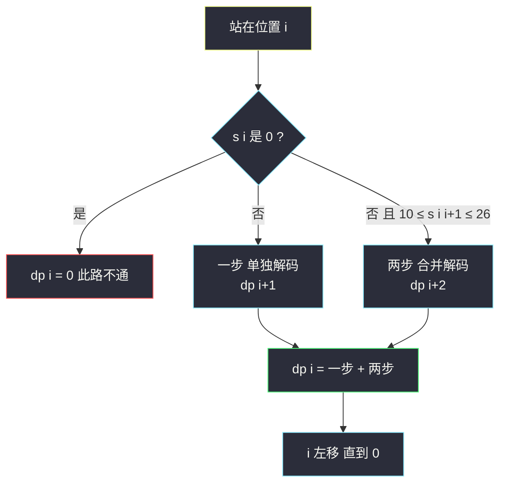

# 解码方法（分情况转移：一步走或两步走，0 是陷阱）

## 一、问题描述

一条包含字母 A-Z 的消息通过如下映射编码：`'A' -> "1"`、`'B' -> "2"`、……、`'Z' -> "26"`。解码时所有数字必须基于该映射反向映射回字母。给你一个只含数字的**非空**字符串 `s`，计算并返回解码方法的**总数**。

注意：`"06"` 不能映射为 `"F"`（前导 0 非法），`"6"` 与 `"06"` 不等价。

> 🔗 LeetCode 91：https://leetcode.cn/problems/decode-ways/

**示例 1**

```
输入：s = "226"
输出：3
解释："226" 可以解码为 "BZ"(2|26)、"VF"(22|6)、"BBF"(2|2|6)，共 3 种。
```

**示例 2**

```
输入：s = "06"
输出：0
解释：前导 0 无法映射任何字母，整个串不可解码。
```

**直观理解**

解码是从左到右把数字串切成若干段、每段是 1 到 26 的过程。站在位置 `i` 面对第一个未解码字符，只有两种选择：**吃掉 1 个字符**（`s[i]` 为 1..9 才合法）或**吃掉 2 个字符**（`s[i..i+1]` 为 10..26 才合法）。这就是与爬楼梯同型的「一步 / 两步」递推——但每步都有**合法性门槛**，`0` 是最大的陷阱。

> 课源码出处：class066 Code03_DecodeWays.java（解码方法），课上给了完整的四版演进：暴力递归 → 记忆化 → 严格位置依赖 → 空间压缩。

---

## 二、暴力解法（入门）

### 直观思路

把「在位置 `i` 怎么吃」直接翻译成递归（课上 `numDecodings1` / `f1`）：

```java
// 解码方法：直接递归（对齐 class066 Code03 的 f1）
public static int numDecodings1(String s) {
    return f1(s.toCharArray(), 0);
}

// s[i....] 有多少种有效的转化方案
public static int f1(char[] s, int i) {
    if (i == s.length) {
        return 1; // 整串吃完，拼出一种完整解码
    }
    int ans;
    if (s[i] == '0') {
        ans = 0; // '0' 开头：一步两步都非法
    } else {
        ans = f1(s, i + 1);                       // 吃 1 个字符
        if (i + 1 < s.length && ((s[i] - '0') * 10 + s[i + 1] - '0') <= 26) {
            ans += f1(s, i + 2);                  // 吃 2 个字符（拼成 10..26）
        }
    }
    return ans;
}
```

### 复杂度

- **时间**：`O(2ⁿ)`（无 0 干扰时是斐波那契型指数增长）
- **空间**：`O(n)`，递归栈

### 🔴 瓶颈在哪里

`f(i)` 会调 `f(i+1)` 和 `f(i+2)`——与爬楼梯同型的**重叠子问题**：`f(0)` 展开的树里 `f(2)`、`f(3)` 反复出现。`n` 上百即超时。

---

## 三、优化探索（核心章节）

### 3.1 观察特征

| 特征 | 说明 |
|------|------|
| 可变参数只有一个 | `i`（当前位置），一张一维表就够 |
| 无后效性 | `s[i..]` 的方案数只由后缀决定，前面怎么切的无关 |
| 爬楼梯同型递推 | 依赖 `i+1`、`i+2` 两格——但每条边带**合法性条件** |
| 合法性条件 | 一步：`s[i] != '0'`；两步：`10 ≤ s[i..i+1] ≤ 26`（含两位时首字符必为 1 或 2） |

### 3.2 dp 定义与四步演进（对齐 class066）

课上讲这类「从左往右的尝试模型」时给过标准四步演进，本题逐字适用：

1. **暴力递归**（`f1`）：如上，`O(2ⁿ)`
2. **记忆化搜索**（`f2`）：递归照旧，加 `dp` 数组缓存，算过的 `f(i)` 直接返回 → `O(n)`
3. **严格位置依赖**（`f3`）：观察到 `f(i)` 只依赖 `f(i+1)`、`f(i+2)`，干脆从右往左填表：

```
dp[i] : s[i....] 后缀的解码方案数
dp[n] = 1                                    （空串，恰好拼完算一种）
dp[i] = 0                                    若 s[i] == '0'
dp[i] = dp[i+1] + dp[i+2]                    否则：
        ↑ 单独解码 s[i]     ↑ s[i..i+1] 拼成 10..26 时（i+1 不越界）
答案 = dp[0]
```

4. **空间压缩**（`f4`）：只依赖右边两格，两个滚动变量 `next`（dp[i+1]）、`nextNext`（dp[i+2]）→ `O(1)` 空间

依赖方向：`dp[i]` 看右边（`i+1`、`i+2`）→ **从右往左**填表（注意与爬楼梯从左到右相反，因为定义的是「后缀方案数」）。



### 3.3 关键推导问题

| 问题 | 答案 |
|------|------|
| 为什么 `dp[n] = 1` 而不是 0？ | 「恰好把串吃完」本身是一种成功路径的终点；递归里 `i == s.length` 返回 1 与之对应 |
| `"0"` 开头为什么直接 0？ | 0 不对应任何字母；而 "0x" 里 0 不能与后面拼（前导 0 非法），两条边都断 |
| 两步合法怎么判？ | 数字值 `s[i]*10 + s[i+1]` 落在 10..26。等价地：首字符是 '1'（后面任意）或 '2'（后面 0..6） |
| "100" 为什么是 0？ | i=1 的 '0' 使 dp[1]=0；i=0 的 '1' 一步到 dp[1]=0，两步 "10" 合法但到 dp[2]=0（又一个 '0'）——两条路全灭 |
| 从右往左还是从左往右？ | 课上定义「后缀方案数」→ 从右往左填。若定义「前缀方案数」（dp[i] = s[0..i-1] 的方案数）则从左往右填，两者对称等价 |
| 与爬楼梯的本质区别？ | 爬楼梯每步无条件可用；本题每条边有合法性门槛，0 会**斩断依赖边** |

### 3.4 一句话核心

> **dp[i] = 后缀 s[i..] 的方案数：s[i] 是 0 归零，否则 dp[i+1] +（两位在 10..26 时）dp[i+2]；从右往左填。**

---

## 四、代码实现详解

### Java（主解：严格位置依赖 dp，课上 f3）

```java
// 解码方法
// 'A' -> "1", 'B' -> "2", ..., 'Z' -> "26"
// 计算只含数字的非空字符串 s 的解码方法总数
// 测试链接 : https://leetcode.cn/problems/decode-ways/
// 对齐 class066 Code03_DecodeWays 的 numDecodings3：从右往左填一维表
public class Solution {

    // dp[i] : s[i....] 后缀的解码方案数
    // 转移：s[i]=='0' -> dp[i]=0；否则 dp[i] = dp[i+1] (+ dp[i+2] 若两位拼成 10..26)
    // 依赖方向：只依赖右边 i+1、i+2 两格，从右往左填
    // 时间复杂度 O(n)，空间复杂度 O(n)
    public static int numDecodings(String str) {
        char[] s = str.toCharArray();
        int n = s.length;
        int[] dp = new int[n + 1];
        dp[n] = 1; // 空后缀：一种（恰好拼完）
        for (int i = n - 1; i >= 0; i--) {
            if (s[i] == '0') {
                dp[i] = 0; // 前导 0，两条边都断
            } else {
                dp[i] = dp[i + 1]; // 一步：单独解码 s[i]
                if (i + 1 < n && ((s[i] - '0') * 10 + s[i + 1] - '0') <= 26) {
                    dp[i] += dp[i + 2]; // 两步：s[i..i+1] 拼成 10..26
                }
            }
        }
        return dp[0];
    }
}
```

### Java（记忆化版 + 空间压缩版：课上 f2 / f4）

```java
// 演进过程：先记忆化搜索，再空间压缩到两个变量
public class Solution {

    // 记忆化搜索：递归 + 缓存（课上 f2）
    public static int numDecodings2(String s) {
        int[] dp = new int[s.length()];
        Arrays.fill(dp, -1);
        return f(s.toCharArray(), 0, dp);
    }

    public static int f(char[] s, int i, int[] dp) {
        if (i == s.length) {
            return 1;
        }
        if (dp[i] != -1) {
            return dp[i];
        }
        int ans;
        if (s[i] == '0') {
            ans = 0;
        } else {
            ans = f(s, i + 1, dp);
            if (i + 1 < s.length && ((s[i] - '0') * 10 + s[i + 1] - '0') <= 26) {
                ans += f(s, i + 2, dp);
            }
        }
        dp[i] = ans;
        return ans;
    }

    // 空间压缩（课上 f4）：只留 dp[i+1]、dp[i+2]
    // 时间 O(n)，空间 O(1)
    public static int numDecodings4(String s) {
        int next = 1;     // dp[i+1]
        int nextNext = 0; // dp[i+2]
        for (int i = s.length() - 1, cur; i >= 0; i--) {
            if (s.charAt(i) == '0') {
                cur = 0;
            } else {
                cur = next;
                if (i + 1 < s.length() && ((s.charAt(i) - '0') * 10 + s.charAt(i + 1) - '0') <= 26) {
                    cur += nextNext;
                }
            }
            nextNext = next;
            next = cur;
        }
        return next; // dp[0]
    }
}
```

### Python（同思路）

```python
# 解码方法：从右往左填一维表，O(n) / O(n)
class Solution:
    def numDecodings(self, s: str) -> int:
        n = len(s)
        dp = [0] * (n + 1)
        dp[n] = 1  # 空后缀恰好拼完
        for i in range(n - 1, -1, -1):
            if s[i] == '0':
                dp[i] = 0  # 前导 0，两条边都断
            else:
                dp[i] = dp[i + 1]  # 一步：单独解码
                if i + 1 < n and int(s[i:i + 2]) <= 26:
                    dp[i] += dp[i + 2]  # 两步：合并成 10..26
        return dp[0]
```

```python
# 空间压缩版：两个滚动变量，O(n) / O(1)
class Solution:
    def numDecodings(self, s: str) -> int:
        nxt, nxt_nxt = 1, 0  # dp[i+1], dp[i+2]
        for i in range(len(s) - 1, -1, -1):
            if s[i] == '0':
                cur = 0
            else:
                cur = nxt
                if i + 1 < len(s) and int(s[i:i + 2]) <= 26:
                    cur += nxt_nxt
            nxt, nxt_nxt = cur, nxt
        return nxt
```

---

## 五、具体例子演示

### 例 A：`s = "226"`（n = 3，无 0）

**暴力递归树（看重复）：**

```
f(0)
 ├─ 一步 "2" → f(1)
 │             ├─ 一步 "2" → f(2)
 │             │             └─ 一步 "6" → f(3) = 1
 │             │             （"6" 到头，f(2) = 1）
 │             └─ 两步 "26" → f(3) = 1        → f(1) = 2
 └─ 两步 "22" → f(2) ←────────── 重复展开      → f(0) = 2 + 1 = 3
```

**dp 表逐格填充（从右往左）：**

| i | s[i..] | 判定 | 一步项 dp[i+1] | 两步项 dp[i+2] | dp[i] |
|---|--------|------|----------------|-----------------|-------|
| 3 | ""（空） | 终点 | — | — | **1** |
| 2 | "6" | '6'≠'0'；"6" 后无字符，无两步 | dp[3]=1 | — | **1** |
| 1 | "26" | '2'≠'0'；两位 "26"≤26 | dp[2]=1 | dp[3]=1 | **2** |
| 0 | "226" | '2'≠'0'；两位 "22"≤26 | dp[1]=2 | dp[2]=1 | **3** |

返回 `dp[0] = 3` ✓（对应 BZ / VF / BBF 三种切法）。

### 例 B：`s = "2101"`（n = 4，中间埋一个 0）

| i | s[i..] | 判定 | 一步项 | 两步项 | dp[i] | 说明 |
|---|--------|------|--------|--------|-------|------|
| 4 | "" | 终点 | — | — | **1** | |
| 3 | "1" | '1'≠'0'；后面没字符 | dp[4]=1 | — | **1** | |
| 2 | "01" | **'0' 开头** | — | — | **0** | 两条边全断 |
| 1 | "101" | '1'≠'0'；两位 "10"≤26 | dp[2]=0 | dp[3]=1 | **1** | 一步死路，只能走 "10" |
| 0 | "2101" | '2'≠'0'；两位 "21"≤26 | dp[1]=1 | dp[2]=0 | **1** | 一步经 "21|0..."，0 处全灭 |

返回 `dp[0] = 1`：唯一切法 `2 | 10 | 1`（BJA）。**0 的杀伤链**清晰可见：`dp[2]=0` 把所有「路过它」的方案清零。

### 例 C：坏边界速查

| 输入 | 结果 | 原因 |
|------|------|------|
| `"06"` | 0 | 首字符 '0'，dp[0]=0 |
| `"100"` | 0 | 两个 '0'：dp[2]=0、dp[1]=0；dp[0] 一步到 0、两步 "10" 也到 0 |
| `"10"` | 1 | dp[0]：一步到 dp[1]=0（'0'），两步 "10" 到 dp[2]=1 → 1（"J"） |

---

## 六、复杂度分析

| 版本 | 时间 | 空间 | 说明 |
|------|------|------|------|
| 暴力递归（f1） | `O(2ⁿ)` | `O(n)` | 斐波那契型重复展开 |
| 记忆化搜索（f2） | `O(n)` | `O(n)` | 每个 f(i) 只算一次 + 递归栈 |
| 位置依赖填表（f3，主解） | `O(n)` | `O(n)` | 显式一维表 |
| 空间压缩（f4） | `O(n)` | `O(1)` | 只留右边两格 |

---

## 七、方法对比与总结

### 与爬楼梯家族的对照

| | #70 爬楼梯 | #91 解码方法 |
|---|---|---|
| 递推形态 | f(i) = f(i-1) + f(i-2) | dp[i] = dp[i+1] + dp[i+2]（反向） |
| 每步条件 | 无条件 | **一步要求非 '0'，两步要求 10..26** |
| 0 的角色 | 不存在 | **斩断依赖边，制造 0 方案** |
| 边界 | f(1)=1, f(2)=2 | dp[n]=1，'0' 处归零 |

### 易错点

1. **`dp[n] = 1` 写成 0**：空串终点是「一种成功」，写 0 全盘归零。
2. **两位判定用字符串比较**：`"27" ≤ "26"` 按字典序成立但数值不成立——必须转数值 `(s[i]-'0')*10 + (s[i+1]-'0')` 再比 26。
3. **忽略前导 0**：`"06"` 应为 0 而不是 1；'0' 开头的格子必须直接归零。
4. **滚动方向搞反**：定义的是「后缀方案数」，从右往左填；若从左往右填需要换成「前缀」定义并重推边界。
5. **两步判断忘查越界**：`i+1 < n` 要在取 `s[i+1]` 之前判断。

### 模板口诀

> **一步两步学爬梯，每步先把合法性查；逢 0 归零两位看 26，从右往左滚两格。**

---

## 八、举一反三

| 题目 | 链接 | 迁移点 |
|------|------|--------|
| 70. 爬楼梯（站内已有题解） | https://leetcode.cn/problems/climbing-stairs/ | 无条件版的同型递推 |
| 639. 解码方法 II | https://leetcode.cn/problems/decode-ways-ii/ | 加通配符 `*`，方案数乘上候选数，class066 Code04 原题 |
| 746. 使用最小花费爬楼梯（站内本批题解） | https://leetcode.cn/problems/min-cost-climbing-stairs/ | 一步/两步 + min 融合（最值版） |
| 91 附加：返回具体解码串 | https://leetcode.cn/problems/decode-ways/ | 显式 dp 表上回溯来源即可 |
| 509. 斐波那契数 | https://leetcode.cn/problems/fibonacci-number/ | 本家族递推的原型，class066 Code01 |

**迁移一句**：「一步 / 两步 + 每步合法性」是**分情况转移**的原子模板——把「吃 1 个 / 吃 2 个」换成「偷 / 不偷」（打家劫舍）、「选 / 不选」（0-1 背包），判断条件换掉、骨架不变。见到字符串/序列切分计数题，先画这条「一步 / 两步」决策图。
