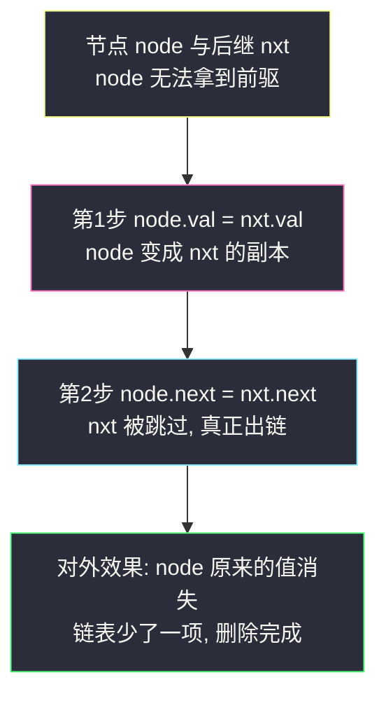

# 删除链表中的节点（后继覆盖法，脑筋急转弯）

## 一、问题描述

有一个单链表的头节点 `head`，题目**只给你要删除的节点 `node`**（不给链表，也不给头节点），请你**原地删除**这个节点。

题目保证：

- 链表中节点的值**互不相同**；
- 给定的节点 `node` **不是链表的尾节点**，也**不是头节点**之外随便传入的——它一定是链表中的有效节点。

节点的定义为：

```java
public class ListNode {
    int val;
    ListNode next;
}
```

> 🔗 LeetCode 237：https://leetcode.cn/problems/delete-node-in-a-linked-list/

**示例 1**

```
输入：head = [4,5,1,9], node = 5
输出：[4,1,9]
解释：给你值为 5 的节点，删除后链表变为 4 → 1 → 9。
```

**示例 2**

```
输入：head = [4,5,1,9], node = 1
输出：[4,5,9]
```

**直观理解**

常规删链表节点 = 让**前驱**跳过我：`prev.next = node.next`。

但这题的陷阱在于：**你手里只有 `node`，拿不到它的前驱**！链表单向，`node` 只知道「下一个是谁」，永远不知道「上一个是谁」。既不能从头找（没有 `head`），又不能回头——怎么删「自己」？

---

## 二、暴力解法（入门）

### 先说清楚：常规删除为什么行不通

```java
// 常规删除需要前驱，伪代码：
prev.next = node.next; // prev 从哪来？没有 head 无法从头找，单向链表无法回头
```

「老老实实删掉这个节点」这条路被堵死了：

| 需要什么 | 手里有什么 |
|----------|-----------|
| `prev`（前驱节点） | ❌ 拿不到 |
| `head`（从头遍历） | ❌ 没给 |
| 从 `node` 往回走 | ❌ 单向链表没有 `prev` 指针 |

有人会想：把 `node` 前面所有节点找到再来删？做不到，**起点本身就是缺失的**。

这不是暴力不暴力的问题，而是「删除」这个目标本身定错了对象。

### 🔴 瓶颈在哪里

1. 问题卡死在「没有前驱」上，任何「常规删除」思路都是死路。
2. 必须换一个提问方式：能不能让**这个节点不再需要被删除**？

---

## 三、优化探索（核心章节）

### 3.1 观察特征

| 特征 | 说明 |
|------|------|
| 删除的本质效果 | 删除后链表**呈现的内容**少了一项 |
| 节点 = 值 + 指针 | 「删掉一个节点」和「让链表输出少一个值」，从外部看可以等价 |
| 保证 `node` 不是尾节点 | `node.next` 一定存在，可以安全读取和复制 |
| 保证值互不相同 | 复制后继的值不会引起歧义 |

### 3.2 换个视角：我删不了自己，但我可以「变成别人」

既然无法把 `node` 从链表里摘出去，那就让 `node` **冒名顶替它的后继**：

1. 把后继的值抄过来：`node.val = node.next.val` —— 现在 `node` 与后继内容一样；
2. 跳过后继：`node.next = node.next.next` —— 后继被真正从链表中摘除。

从外部看链表：`4 → 5(壳) → 1 → 9` 变成 `4 → 1(借尸还魂的 5) → 9`，**内容上 5 确实消失了一项**。物理上死的是后继节点，逻辑上死的是 `node`。



### 3.3 关键推导问题

| 问题 | 答案 |
|------|------|
| 为什么不能直接 `node = node.next`？ | 这只是把**局部变量** `node` 改指向别的节点，链表一根指针都没动，调用方看到的链表原封不动 |
| 删除的到底是哪个节点？ | 物理上被摘出链表的是**后继** `node.next`；逻辑上「消失的值」是 `node` 原来的值 |
| 为什么保证不是尾节点？ | 尾节点没有后继可抄值、可跳过，「变成后继」无后继可变，此法失效 |
| 值重复会怎样？ | 假设值不互不相同，抄值方案仍能「少一个值」，但外部语义（删的是哪个节点）会混乱，题目干脆禁止 |
| 时间空间开销？ | 一次抄值 + 一次改指针，`O(1)` / `O(1)`，理论下界 |
| 这在真实工程里能这么干吗？ | 不建议：节点身份（引用）可能在别处被持有，被「顶包」后语义漂移。这是**面试/竞赛技巧题**，考的是打破思维定势 |

### 3.4 一句话核心

> **删不掉自己，就把自己变成下一个，再把下一个删掉。**

---

## 四、代码实现详解

### Java（后继覆盖 · 主解）

```java
class Solution {
    public void deleteNode(ListNode node) {
        node.val = node.next.val;  // ① 冒名顶替：抄后继的值
        node.next = node.next.next;// ② 借刀杀人：跳过后继
    }
}
```

两行，`O(1)`。注意题目签名返回 `void`——不需要也不允许返回头节点，因为调用方持有整条链表的引用，改动在原地生效。

### Python（同思路）

```python
class Solution:
    def deleteNode(self, node: ListNode) -> None:
        node.val = node.next.val   # ① 冒名顶替
        node.next = node.next.next # ② 跳过后继
```

### 参照：常规删除（有前驱时）

如果给的是 `head` 和要删的值，标准写法是 dummy + 前驱跳过，用来对照「为什么这题不行」：

```java
// 对照代码: 需要 head、能定位前驱时的常规删除
class Solution {
    public ListNode removeElements(ListNode head, int val) {
        ListNode dummy = new ListNode(0, head);
        ListNode cur = dummy;
        while (cur.next != null) {
            if (cur.next.val == val) {
                cur.next = cur.next.next; // 前驱跳过被删节点
            } else {
                cur = cur.next;
            }
        }
        return dummy.next;
    }
}
```

本题两者都没有，所以必须走覆盖法。

---

## 五、例子演示

以 `head = 4 → 5 → 1 → 9`，`node = 5` 为例，逐步跟踪。

### 初始状态

```
手里只有 node → 这个装着 5 的节点（没有 head、没有前驱）

4 → [5] → 1 → 9
     ↑node
```

### 第 ① 步：抄后继的值

```
node.val = node.next.val  即 5 ← 1

4 → [1] → 1 → 9
     ↑node    （节点还是原来那个节点, 值已变成 1）
```

此刻链表里出现两个连续的 `1`——这正是「顶包」的中间态，下一步把它消掉。

### 第 ② 步：跳过后继

```
node.next = node.next.next  即 [1].next 从指向后继 1 改为指向 9

4 → [1] → 9
     ↑node   （后面那个装着 1 的原后继被彻底出链）
```

### 最终效果

```
链表内容: 4 → 1 → 9
对外看: 值 5 消失了, 位置数少一, 与「删除节点 5」的效果一致 ✓
```



```mermaid
flowchart LR
    subgraph S0["初始"]
        direction LR
        A0["4"] --> B0["node<br/>val=5"] --> C0["1"] --> D0["9"]
    end
    subgraph S1["① 抄值后"]
        direction LR
        A1["4"] --> B1["node<br/>val=1"] --> C1["1"] --> D1["9"]
    end
    subgraph S2["② 跳过后继, 完成"]
        direction LR
        A2["4"] --> B2["node<br/>val=1"] --> D2["9"]
    end
    S0 --> S1 --> S2

    style S0 fill:#1e1f29,stroke:#f1fa8c,color:#f8f8f2
    style S1 fill:#1e1f29,stroke:#ff79c6,color:#f8f8f2
    style S2 fill:#1e1f29,stroke:#50fa7b,color:#f8f8f2
    style A0 fill:#2b2d3a,stroke:#8be9fd,color:#f8f8f2
    style B0 fill:#2b2d3a,stroke:#ff79c6,color:#f8f8f2
    style C0 fill:#2b2d3a,stroke:#8be9fd,color:#f8f8f2
    style D0 fill:#2b2d3a,stroke:#8be9fd,color:#f8f8f2
    style A1 fill:#2b2d3a,stroke:#8be9fd,color:#f8f8f2
    style B1 fill:#2b2d3a,stroke:#ff79c6,color:#f8f8f2
    style C1 fill:#2b2d3a,stroke:#ff5555,color:#f8f8f2
    style D1 fill:#2b2d3a,stroke:#8be9fd,color:#f8f8f2
    style A2 fill:#2b2d3a,stroke:#8be9fd,color:#f8f8f2
    style B2 fill:#2b2d3a,stroke:#50fa7b,color:#f8f8f2
    style D2 fill:#2b2d3a,stroke:#8be9fd,color:#f8f8f2
```

**边界**：题目保证 `node` 不是尾节点，所以 `node.next` 永不为 `null`，两行代码没有任何空指针风险；也不存在单节点链表的用例（单节点即尾节点）。

---

## 六、复杂度分析

| 方法 | 时间 | 额外空间 | 说明 |
|------|------|----------|------|
| **后继覆盖** | **`O(1)`** | **`O(1)`** | 主解，两步定乾坤 |
| 常规删除（本题不可用） | `O(n)` | `O(1)` | 需要从头找前驱，但没有 `head` |

---

## 七、对比总结

### 易错点

1. **想找前驱**：没有 `head`、单向不可回头，这条路一开始就不存在，别绕远。
2. **写成 `node = node.next`**：只改了形参的指向，链表纹丝不动；要改的是 `node.val` 和 `node.next` 这两个**成员**。
3. **只抄值不跳过**：链表里留下重复值，长度没变，等于没删。
4. **先跳过后抄值**：`node.next` 已被改掉，后继丢了，值也就抄不到了——两步顺序不可换。
5. **纠结「被删的到底是谁」**：物理上出链的是后继、逻辑上消失的是 `node` 的旧值，分清这两层就不会自我怀疑。

### 「删除链表节点」的两种姿势

| | 常规删除 | 后继覆盖 |
|--|------|------|
| 前提 | 拿得到前驱（有 `head` 或 `prev`） | 后继存在（非尾节点） |
| 操作 | `prev.next = cur.next` | 抄值 + 跳过 |
| 节点身份 | 被删节点真正出链 | 后继真正出链，本体被顶包 |
| 复杂度 | `O(n)` 定位 + `O(1)` 删除 | `O(1)` |

### 模板口诀

> **拿不到前驱别硬刚，抄来后继换心肠；一步跳过真身藏，逻辑删除它最强。**

---

## 八、举一反三

| 题目 | 链接 | 迁移点 |
|------|------|--------|
| 203. 移除链表元素 | https://leetcode.cn/problems/remove-linked-list-elements/ | 常规删除的正统版：dummy + 前驱跳过 |
| 19. 删除链表的倒数第 N 个结点 | https://leetcode.cn/problems/remove-nth-node-from-end-of-list/ | 常规删除 + 快慢指针定位前驱 |
| 2095. 删除链表的中间节点 | https://leetcode.cn/problems/delete-the-middle-node-of-a-linked-list/ | 快慢找中点后做前驱跳过 |
| 83. 删除排序链表中的重复元素 | https://leetcode.cn/problems/remove-duplicates-from-sorted-list/ | 前驱跳过的连续应用 |
| 1171. 从链表中删去总和值为零的连续节点 | https://leetcode.cn/problems/remove-zero-sum-consecutive-nodes-from-linked-list/ | 「跳过一段」的推广，同样靠改 `next` |

**迁移一句**：链表「删除」的本质从来不是消灭节点，而是**让某个引用消失在链表的串联里**——改 `prev.next` 也好、顶包后继也好，都是这句话的变体。
