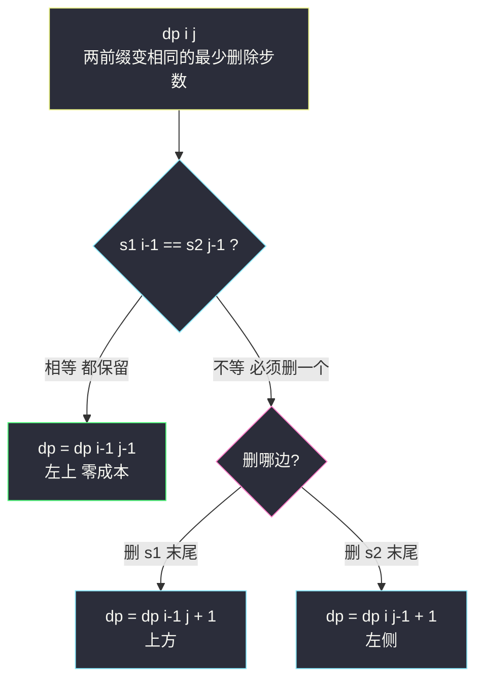
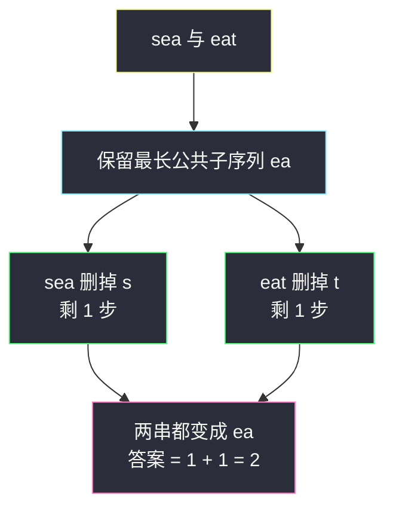

# 两个字符串的删除操作（编辑距离家族：只有删除的版本）

## 一、问题描述

给定两个单词 `word1` 和 `word2`，每步可以**从任意一个字符串中删除一个字符**，返回使得 `word1` 和 `word2` **相同**所需的**最少步数**。

> 🔗 LeetCode 583：https://leetcode.cn/problems/delete-operation-for-two-strings/

**示例 1**

```
输入：word1 = "sea", word2 = "eat"
输出：2
解释：第一步删掉 "sea" 的 's'，第二步删掉 "eat" 的 't'，两个串都变成 "ea"
```

**示例 2**

```
输入：word1 = "leetcode", word2 = "etco"
输出：4
解释：删掉 "leetcode" 的 l、d、e（第二个），删掉 "etco" 的... 最终都变 "etco"
```

**直观理解**

这就是编辑距离（#72，站内已写）**砍掉「替换」和「插入」**后的退化版：只剩「删 s1 末尾」和「删 s2 末尾」两种操作。另一条更快的路：删到最后两个串都变成某个**公共子序列**——为了让删除步数最少，这个公共子序列要尽可能长。所以答案 = `n + m - 2 × LCS`，直接复用 #1143（站内已写）。

---

## 二、暴力解法

### 直观思路

双前缀尝试 `f(i, j)`：`s1` 前缀长度 `i` 与 `s2` 前缀长度 `j` 变相同的最少删除步数。末尾不等时，只能删 s1 末尾或删 s2 末尾：

```java
// 暴力递归：两前缀变相同的最少删除步数
public static int minDistance1(char[] s1, char[] s2, int i, int j) {
    // s1 剩 i 个只能全删
    if (i == 0 || j == 0) {
        return i + j;
    }
    if (s1[i - 1] == s2[j - 1]) {
        // 末尾相等，双双保留，零成本对齐
        return minDistance1(s1, s2, i - 1, j - 1);
    }
    // 删 s1 末尾（i-1, j）或删 s2 末尾（i, j-1）
    return 1 + Math.min(minDistance1(s1, s2, i - 1, j),
                        minDistance1(s1, s2, i, j - 1));
}
```

### 复杂度

- **时间**：`O(2^(n+m))` 级别，指数级
- **空间**：`O(n + m)` 递归栈

### 🔴 瓶颈在哪里

`(i, j)` 状态只有 `(n+1)*(m+1)` 个，递归树却指数展开——经典重叠子问题，填表即解。

---

## 三、优化探索

### 3.1 可变参数分析

`(i, j)` 两个可变参数 → 二维表（课上方法论：**几个可变参数就是几维表**）：

| dp 定义 | 含义 |
|---------|------|
| `dp[i][j]` | `s1` 前缀长度 `i` 与 `s2` 前缀长度 `j` 变相同的最少删除步数 |

### 3.2 转移方程推导（对比 #72：少了两个分支）

看两个前缀的末尾 `s1[i-1]` 与 `s2[j-1]`：

- **相等**：这对字符都保留，零成本对齐 → `dp[i][j] = dp[i-1][j-1]`
- **不等**：只能删——

```
dp[i][j] = min( dp[i-1][j] + 1,   // 删 s1 末尾（上）
                dp[i][j-1] + 1 )  // 删 s2 末尾（左）
```

和编辑距离的唯一区别：**没有「替换」（左上 + 1）和「插入」**——插入其实等价于「删对面」，所以只剩两分支。

### 3.3 初始化

- `dp[i][0] = i`：s2 空，s1 剩 i 个全删
- `dp[0][j] = j`：s1 空，s2 剩 j 个全删

### 3.4 第二条路：LCS 视角（一步到位）

删除后两串的共同归宿必然是某个**公共子序列**；删的步数 = `(n - L) + (m - L)`。要让步数最少 ⟺ 公共子序列 `L` 最长 ⟺ `L = LCS(word1, word2)`：

```
答案 = n + m - 2 * LCS(word1, word2)
```

这正是 #1143（站内已写 `longest-common-subsequence.md`）的一行变体。两条路殊途同归：本题转移方程里「末尾相等走左上」留下的正是 LCS 的轨迹。

### 3.5 关键问题

| 问题 | 答案 |
|------|------|
| 为什么不用「替换」？ | 题面只允许删除；替换在 #72 里是左上 + 1，这里禁止 |
| 「插入」去哪了？ | 在 s1 插入 = 在 s2 删除，两者等价，保留一个即可 |
| LCS 视角为什么最优？ | 删除只减不增，最终保留集必须同属两串且保序 = 公共子序列；定长目标下步数随 L 增大而减小 |
| 依赖方向？ | 依赖左上/上/左 → 从上到下、从左到右填表 |

### 3.6 一句话核心

> **尾等双双保留回左上；尾异删一个，上/左取小加一——本质是 n+m−2×LCS。**



---

## 四、代码实现

### Java（主解：直接 DP，编辑距离砍分支版）

```java
// 两个字符串的删除操作
// 每步可从任一字符串删除一个字符，返回使两串相同的最少步数
// 测试链接 : https://leetcode.cn/problems/delete-operation-for-two-strings/
// 课上无原题：按 class068 Code02_EditDistance 骨架对齐（砍掉替换/插入，a=0,b=c=1）
public class Solution {

    // 时间复杂度 O(n*m)，空间复杂度 O(n*m)
    public int minDistance(String word1, String word2) {
        char[] s1 = word1.toCharArray();
        char[] s2 = word2.toCharArray();
        int n = s1.length, m = s2.length;
        // dp[i][j] : s1 前缀 i 与 s2 前缀 j 变相同的最少删除步数
        int[][] dp = new int[n + 1][m + 1];
        for (int i = 1; i <= n; i++) {
            dp[i][0] = i; // s2 空 : s1 全删
        }
        for (int j = 1; j <= m; j++) {
            dp[0][j] = j; // s1 空 : s2 全删
        }
        // 依赖方向 : 左上 / 上 / 左 → 行优先填表
        for (int i = 1; i <= n; i++) {
            for (int j = 1; j <= m; j++) {
                if (s1[i - 1] == s2[j - 1]) {
                    // 末尾相等 : 都保留，零成本对齐
                    dp[i][j] = dp[i - 1][j - 1];
                } else {
                    // 删 s1 末尾(上) 或 删 s2 末尾(左)，取小 + 1
                    dp[i][j] = Math.min(dp[i - 1][j], dp[i][j - 1]) + 1;
                }
            }
        }
        return dp[n][m];
    }
}
```

### Java（对照版：LCS 一步到位，复用 #1143 代码）

```java
// 答案 = n + m - 2 * LCS
// LCS 部分对齐 class067 Code03_LongestCommonSubsequence 的主解
public class Solution {

    public int minDistance(String word1, String word2) {
        return word1.length() + word2.length()
                - 2 * lcs(word1, word2);
    }

    // 最长公共子序列长度（与 #1143 完全同款）
    public static int lcs(String str1, String str2) {
        char[] s1 = str1.toCharArray();
        char[] s2 = str2.toCharArray();
        int n = s1.length, m = s2.length;
        int[][] dp = new int[n + 1][m + 1];
        for (int i = 1; i <= n; i++) {
            for (int j = 1; j <= m; j++) {
                if (s1[i - 1] == s2[j - 1]) {
                    dp[i][j] = 1 + dp[i - 1][j - 1];
                } else {
                    dp[i][j] = Math.max(dp[i - 1][j], dp[i][j - 1]);
                }
            }
        }
        return dp[n][m];
    }
}
```

### Python

```python
# 主解：直接 DP（删除版编辑距离）
class Solution:
    def minDistance(self, word1: str, word2: str) -> int:
        n, m = len(word1), len(word2)
        # dp[i][j] : 两前缀变相同的最少删除步数
        dp = [[0] * (m + 1) for _ in range(n + 1)]
        for i in range(1, n + 1):
            dp[i][0] = i
        for j in range(1, m + 1):
            dp[0][j] = j
        for i in range(1, n + 1):
            for j in range(1, m + 1):
                if word1[i - 1] == word2[j - 1]:
                    dp[i][j] = dp[i - 1][j - 1]        # 都保留
                else:
                    dp[i][j] = 1 + min(
                        dp[i - 1][j],   # 删 s1 末尾
                        dp[i][j - 1],   # 删 s2 末尾
                    )
        return dp[n][m]
```

```python
# 对照版：n + m - 2 * LCS
class Solution:
    def minDistance(self, word1: str, word2: str) -> int:
        n, m = len(word1), len(word2)
        dp = [[0] * (m + 1) for _ in range(n + 1)]
        for i in range(1, n + 1):
            for j in range(1, m + 1):
                if word1[i - 1] == word2[j - 1]:
                    dp[i][j] = 1 + dp[i - 1][j - 1]
                else:
                    dp[i][j] = max(dp[i - 1][j], dp[i][j - 1])
        return n + m - 2 * dp[n][m]
```

---

## 五、具体例子演示

以 `word1 = "sea"`、`word2 = "eat"` 为例，dp 表尺寸 `4 × 4`。

### dp 表逐格填充

初始化：第 0 行 `0,1,2,3`，第 0 列 `0,1,2,3`。

| 格 | 字符 | 分支 | 计算过程 | 值 |
|----|------|------|----------|-----|
| dp[1][1] | s vs e ★ | min(上1, 左1)+1 | 1+1 | 2 |
| dp[1][2] | s vs a ★ | min(上2, 左2)+1 | 2+1 | 3 |
| dp[1][3] | s vs t ★ | min(上3, 左3)+1 | 3+1 | 4 |
| dp[2][1] | e vs e 相等 | dp[1][0] = 1 | 直接搬 | **1** |
| dp[2][2] | e vs a ★ | min(上2, 左1)+1 | 1+1 | 2 |
| dp[2][3] | e vs t ★ | min(上3, 左2)+1 | 2+1 | 3 |
| dp[3][1] | a vs e ★ | min(上1, 左3)+1 | 1+1 | 2 |
| dp[3][2] | a vs a 相等 | dp[2][1] = 1 | 直接搬 | **1** |
| dp[3][3] | a vs t ★ | min(上2, 左1)+1 | 1+1 | **2** |

最终 `dp[3][3] = 2` → 返回 **2**。完整表：

```
        ""  e   a   t
    ""   0  1   2   3
    s    1  2   3   4
    e    2  1   2   3
    a    3  2   1   2
```

### LCS 视角对照

两串的 LCS = `"ea"`，长度 2 → 答案 = `3 + 3 − 2×2 = 2` ✓。删除轨迹：s 串删 `s`，t 串删 `t`。



两条路在 `dp[3][3]` 处合流：LCS 的「配对」正对应删除版 DP 的「相等走左上零成本」。

---

## 六、复杂度分析

| 版本 | 时间 | 空间 | 说明 |
|------|------|------|------|
| 暴力递归 | `O(2^(n+m))` | `O(n+m)` | 指数展开 |
| 二维 dp（主解） | `O(n*m)` | `O(n*m)` | 每格 O(1) 转移 |
| LCS 视角 | `O(n*m)` | `O(n*m)` | 与主解同阶，代码可直接复用 #1143 |
| 空间压缩 | `O(n*m)` | `O(min(n,m))` | 与 #72/#1143 同款一维滚动 |

`n, m ≤ 500`，O(25 万) 秒过。

---

## 七、方法对比与总结

### 编辑距离家族光谱（家族互引）

| 题 | 允许操作 | 不等时转移 | 关系 |
|----|---------|-----------|------|
| #72 编辑距离（站内已写） | 插入+删除+替换 | min(左上,上,左)+1 | 完全体 |
| **#583 本题** | 只有删除 | min(上,左)+1 | 砍掉替换/插入 |
| #1143 LCS（站内已写） | ——（求最长公共） | max(上,左) | 保留轨迹即本题答案 |
| #712 最小 ASCII 删除和 | 删除（代价=ASCII） | min(上,左)+代价 | 本题的加权版 |

### 易错点

1. **误加「替换」分支**：题面没有替换操作，加左上 +1 会算出偏小的错误答案（如 `s` 对 `t` 会想 1 步替换解决）。
2. **相等时不回左上**：把相等也写成 min(上,左)+1，会破坏「零成本对齐」语义。
3. **LCS 公式系数**：是 `n + m − 2×LCS`，别写成 `n + m − LCS`（两边各删一次）。
4. **边界初始化**：`dp[i][0]=i`、`dp[0][j]=j`，与 #72 同款。

### 模板口诀

> **只删不改：尾等回左上，尾异上左取小加一；答案即 n+m−2×LCS。**

---

## 八、举一反三

| 题目 | 链接 | 迁移点 |
|------|------|--------|
| 72. 编辑距离 | https://leetcode.cn/problems/edit-distance/ | 加回「替换」的完全体（站内已写题解） |
| 1143. 最长公共子序列 | https://leetcode.cn/problems/longest-common-subsequence/ | 一行公式复用（站内已写题解） |
| 712. 两个字符串的最小 ASCII 删除和 | https://leetcode.cn/problems/minimum-ascii-delete-sum-for-two-strings/ | 删除代价换成字符 ASCII 和，骨架不变 |
| 1216. 验证回文字符串 III | https://leetcode.cn/problems/valid-palindrome-iii/ | 最多删 k 个变回文 ⟺ n − 最长回文子序列 ≤ k |
| 1035. 不相交的线 | https://leetcode.cn/problems/uncrossed-lines/ | LCS 的几何换皮（站内已写题解） |

**迁移一句**：**「两串各删一些字符后相等 / 最长公共部分」**是同一枚硬币的两面——会了 #72 与 #1143，本题和它的所有加权变体都是改一两行转移的事。
