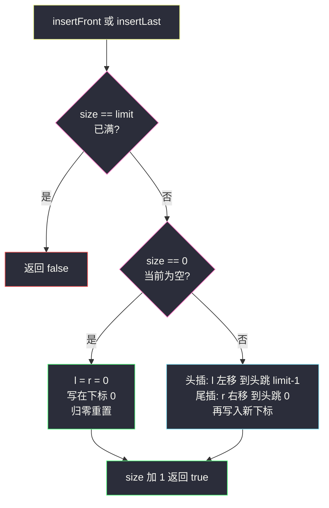
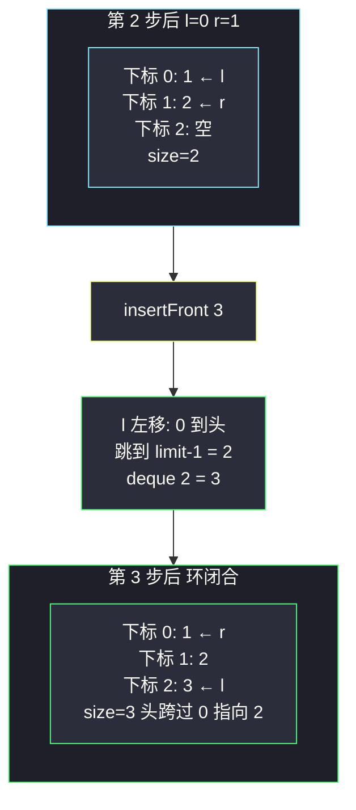

# 设计循环双端队列（数组双端回绕：l/r 各指真实的头尾元素，空了就归零重置）

## 一、问题描述

设计实现一个**双端队列**（Deque）：两端都能插入和删除，容量上限为 k。

- `MyCircularDeque(k)`：构造函数，双端队列最大为 k
- `insertFront()`：头部插入，成功 true
- `insertLast()`：尾部插入，成功 true
- `deleteFront()`：头部删除，成功 true
- `deleteLast()`：尾部删除，成功 true
- `getFront()`：从头获得元素，空返回 -1
- `getRear()`：从尾获得元素，空返回 -1
- `isEmpty()` / `isFull()`：判空 / 判满

> 🔗 LeetCode 641：https://leetcode.cn/problems/design-circular-deque/
>
> 约束：`1 <= k <= 1000`；`0 <= value <= 1000`；最多调用 `4000` 次。

**示例 1**

```
输入：
["MyCircularDeque", "insertLast", "insertLast", "insertFront", "insertFront",
 "getRear", "isFull", "deleteLast", "insertFront", "getFront"]
[[3], [1], [2], [3], [4], [], [], [], [4], []]
输出：
[null, true, true, true, false, 2, true, true, true, 4]

解释：容量 3。尾部进 1、2，头部进 3 → [3,1,2] 满了；
     头部进 4 失败；队尾是 2；删掉队尾 2 后头部再进 4 → [4,3,1]，队头是 4。
```

**直观理解**

双端队列是队列的「双端放开」版：头尾都能进出，四个操作全要 `O(1)`。数组实现与 #622 循环队列同宗——数组首尾接成环、指针回绕；区别在于**指针要两头跑**：`l` 指向真实队头、`r` 指向真实队尾（注意：与 #622 的「r 指下一个写入位」不同！），插入前先把指针挪到空格再写。这就带来一个新边界：**队列被删空之后，l、r 停在哪儿都行不通，干脆归零重置**——这是课源码 class016 `MyCircularDeque2` 的点睛处理，记住「空了就 `l = r = 0`」这条军规，四对操作全部秒写。

---

## 二、暴力解法（双向链表直接包装）

### 直观思路

Java 的 `LinkedList` 本身就是双向链表，天生支持两端 `O(1)` 插入删除——课源码 class016 的 `MyCircularDeque1` 就是这么干的：

```java
class MyCircularDeque {
    private Deque<Integer> deque = new LinkedList<>();
    private int size, limit;

    public MyCircularDeque(int k) {
        size = 0;
        limit = k;
    }

    public boolean insertFront(int value) {
        if (isFull()) return false;
        deque.offerFirst(value);
        size++;
        return true;
    }

    public boolean insertLast(int value) {
        if (isFull()) return false;
        deque.offerLast(value);
        size++;
        return true;
    }

    public boolean deleteFront() {
        if (isEmpty()) return false;
        deque.pollFirst();
        size--;
        return true;
    }

    public boolean deleteLast() {
        if (isEmpty()) return false;
        deque.pollLast();
        size--;
        return true;
    }

    public int getFront() { return isEmpty() ? -1 : deque.peekFirst(); }
    public int getRear()  { return isEmpty() ? -1 : deque.peekLast(); }
    public boolean isEmpty() { return size == 0; }
    public boolean isFull()  { return size == limit; }
}
```

能过题（LC 数据量小），**但不算「实现」了双端队列**——面试官问的就是让你手写结构，直接调库等于把考题还给考官。

### 复杂度

- **时间**：各操作名义 `O(1)`，但双向链表每个操作都要 new/gc 节点，常数大
- **空间**：`O(k)`

### 🔴 瓶颈在哪里

1. **调库没有训练价值**：本题考点是「数组上如何维护两个会回绕的指针」；
2. 链表节点散落堆内存，缓存不友好，笔试大数据下常数吃亏（课源码注释原话：常数操作慢）；
3. 数组版一劳永逸：四对操作全部是对称的三目回绕，写对一个等于写对八个。

---

## 三、优化探索（核心章节）

### 3.1 观察特征

| 特征 | 说明 |
|------|------|
| 头尾都要 O(1) 操作 | 数组 + 双指针是唯一朴素解：`l` 管头、`r` 管尾，两头对称 |
| 指针要双向移动 | 头插 `l` 左移、尾插 `r` 右移、头删 `l` 右移、尾删 `r` 左移——0 的左邻居是 `limit-1`，`limit-1` 的右邻居是 0 |
| 空队列指针无处指 | l/r 必须指向**真实元素**（双端都要读），空态没有元素 → **归零重置**：从空开始插入时统一 `l = r = 0` 写 `queue[0]` |
| 空满判断 | 与 #622 相同靠 `size`：`size == 0` 空、`size == limit` 满 |

### 3.2 暴力 → 优化：l/r 指真实头尾 + 回绕 + 空归零

定义（对齐 class016 课上版）：

- `l`：**队头元素**所在下标；`r`：**队尾元素**所在下标（都指向真实存在的元素）
- `size`：元素个数；`limit`：容量 k

四个插入/删除的指针动作（先挪指针，后写值/生效）：

```
insertFront(v):
    满 → false
    若空: l = r = 0, queue[0] = v          ← 空态归零重置
    否则: l = (l == 0) ? limit-1 : l-1     ← l 左移，越过 0 跳到 limit-1
          queue[l] = v
    size++

insertLast(v):
    满 → false
    若空: l = r = 0, queue[0] = v          ← 同一条军规
    否则: r = (r == limit-1) ? 0 : r+1     ← r 右移，越过 limit-1 跳回 0
          queue[r] = v
    size++

deleteFront(): l = (l == limit-1) ? 0 : l+1;  size--
deleteLast():  r = (r == 0) ? limit-1 : r-1;  size--

getFront() = queue[l]；getRear() = queue[r]   ← 不回退！l/r 本来就指真元素
```

**不变式**：非空时 `l`、`r` 总指向真实队头/队尾；`size` 恒等于环上从 `l` 到 `r` 的元素个数。



### 3.3 关键推导问题

| 问题 | 答案 |
|------|------|
| 为什么 l/r 指真实元素，不像 #622 让 r 指下一空位？ | 双端队列尾删后 r 要能立刻读出「新的队尾」；若 r 是空位语义，头尾四个操作要混两种语义，心智模型爆炸。指真元素 + 空态归零，是更对称的选择——两道题两个约定，都自洽 |
| 「空了归零」是必须的吗？ | 逻辑上不是（可以记 `size==0` 后随便放 l/r，下次插入前先归位），但**不归零就必须在每个插入里处理任意脏指针**；课上把这条规则显式写成 `if (isEmpty()) l = r = 0`，八个操作全部变简单。军规的价值在压缩边界情况 |
| 头插时 l 左移为什么写在赋值前？ | 新元素要放在现有队头的**左边一格**：先把 l 挪到空格（`l-1`，绕环），再 `queue[l] = v`。顺序颠倒会覆盖旧队头 |
| 尾删后 r 左移、头删后 l 右移，会不会与剩余元素失联？ | 不会：size 同步减一，被删元素下标划出有效区；l/r 始终夹着 size 个有效元素（环上） |
| deleteFront/deleteLast 要不要判「删完为空后归零」？ | 不用立即归零——下次插入时有 `isEmpty()` 分支兜底归零。删除只管指针走一步 + size 减一，职责单一 |
| getFront/getRear 为什么不用回退？ | l/r 本来就指真实元素，直接读；这正是「指真元素」语义的福利（#622 的 Rear 还得退一格） |
| 回绕三目写反了会怎样？ | 典型症状：`l == 0` 时头插写到 `-1` 下标，数组越界异常——双端队列两个方向都有回绕，比 #622 多一倍出镜率 |

### 3.4 一句话核心

> **l 管头 r 管尾，两头挪完再落子；头尾都指真元素，删空归零从头来。**

---

## 四、代码实现详解

### Java（主解：数组版，对齐 class016 课上 MyCircularDeque2）

```java
// 设计循环双端队列：数组 + l/r 指真实头尾 + 空态归零
// 测试链接 : https://leetcode.cn/problems/design-circular-deque/
// 对齐 class016 CircularDeque.MyCircularDeque2
class MyCircularDeque {
    private int[] deque;    // 环形数组
    private int l, r;       // l = 队头下标；r = 队尾下标（都指真实元素）
    private int size, limit;

    public MyCircularDeque(int k) {
        deque = new int[k];
        l = r = size = 0;
        limit = k;
    }

    public boolean insertFront(int value) {
        if (isFull()) {
            return false;
        }
        if (isEmpty()) {
            l = r = 0;
            deque[0] = value;                        // 空态归零重置
        } else {
            l = (l == 0) ? (limit - 1) : (l - 1);    // l 左移回绕
            deque[l] = value;
        }
        size++;
        return true;
    }

    public boolean insertLast(int value) {
        if (isFull()) {
            return false;
        }
        if (isEmpty()) {
            l = r = 0;
            deque[0] = value;                        // 同一条军规
        } else {
            r = (r == limit - 1) ? 0 : (r + 1);      // r 右移回绕
            deque[r] = value;
        }
        size++;
        return true;
    }

    public boolean deleteFront() {
        if (isEmpty()) {
            return false;
        }
        l = (l == limit - 1) ? 0 : (l + 1);          // 队头右移即删除
        size--;
        return true;
    }

    public boolean deleteLast() {
        if (isEmpty()) {
            return false;
        }
        r = (r == 0) ? (limit - 1) : (r - 1);        // 队尾左移即删除
        size--;
        return true;
    }

    public int getFront() { return isEmpty() ? -1 : deque[l]; }
    public int getRear()  { return isEmpty() ? -1 : deque[r]; }
    public boolean isEmpty() { return size == 0; }
    public boolean isFull()  { return size == limit; }
}
```

### Python（同思路）

```python
class MyCircularDeque:
    def __init__(self, k: int):
        self.deque: list[int] = [0] * k
        self.l = 0            # 队头下标（指真实元素）
        self.r = 0            # 队尾下标（指真实元素）
        self.size = 0
        self.limit = k

    def insertFront(self, value: int) -> bool:
        if self.isFull():
            return False
        if self.isEmpty():
            self.l = self.r = 0
            self.deque[0] = value                 # 空态归零重置
        else:
            self.l = self.limit - 1 if self.l == 0 else self.l - 1
            self.deque[self.l] = value
        self.size += 1
        return True

    def insertLast(self, value: int) -> bool:
        if self.isFull():
            return False
        if self.isEmpty():
            self.l = self.r = 0
            self.deque[0] = value
        else:
            self.r = 0 if self.r == self.limit - 1 else self.r + 1
            self.deque[self.r] = value
        self.size += 1
        return True

    def deleteFront(self) -> bool:
        if self.isEmpty():
            return False
        self.l = 0 if self.l == self.limit - 1 else self.l + 1
        self.size -= 1
        return True

    def deleteLast(self) -> bool:
        if self.isEmpty():
            return False
        self.r = self.limit - 1 if self.r == 0 else self.r - 1
        self.size -= 1
        return True

    def getFront(self) -> int:
        return -1 if self.isEmpty() else self.deque[self.l]

    def getRear(self) -> int:
        return -1 if self.isEmpty() else self.deque[self.r]

    def isEmpty(self) -> bool:
        return self.size == 0

    def isFull(self) -> bool:
        return self.size == self.limit
```

---

## 五、具体例子演示

### 例 1：LC 示例逐步跟踪（k = 3）

记法：`[头...尾]` 表示有效区，`l`/`r` 标下标。初始 `l = r = 0, size = 0`。

| 步 | 操作 | 数组（0/1/2） | 有效队列 | l | r | size | 返回 | 说明 |
|----|------|---------------|----------|---|---|------|------|------|
| 1 | `insertLast(1)` | **1**, ?, ? | [1] | 0 | 0 | 1 | true | 空态归零：写在下标 0，l=r=0 |
| 2 | `insertLast(2)` | **1, 2**, ? | [1,2] | 0 | 1 | 2 | true | r 右移 0→1，写 2 |
| 3 | `insertFront(3)` | **3, 1, 2** | [3,1,2] | 2 | 1 | 3 | true | l 左移 0→2（**回绕到 limit-1**），下标 2 写 3 |
| 4 | `insertFront(4)` | 3, 1, 2 | [3,1,2] | 2 | 1 | 3 | **false** | size == limit，满拒绝 |
| 5 | `getRear()` | 3, 1, 2 | [3,1,2] | 2 | 1 | 3 | **2** | deque[r]=deque[1]=2 ✅ |
| 6 | `isFull()` | 3, 1, 2 | [3,1,2] | 2 | 1 | 3 | **true** | |
| 7 | `deleteLast()` | 3, 1, 作废2 | [3,1] | 2 | 0 | 2 | true | r 左移 1→0，2 出局 |
| 8 | `insertFront(4)` | 3, **4**, 1 | [4,3,1] | 1 | 0 | 3 | true | l 左移 2→1，写 4 |
| 9 | `getFront()` | 3, 4, 1 | [4,3,1] | 1 | 0 | 3 | **4** | deque[l]=deque[1]=4 ✅ |

验证第 8 步有效区：从 l=1 沿环两步到 r=0：deque[1]=4 → deque[2]=3 → deque[0]=1，队头 4、队尾 1，与操作语义一致。



**第 3 步是头插回绕的精华**：队头原本在下标 0，左边没有格子了——环上「0 的左边」就是 `limit-1 = 2`，3 落在下标 2，队列在逻辑上变成 `[3,1,2]` 跨越数组首尾。

### 例 2：删空 → 归零重置 → 重开

接着例 1 第 9 步（`[4,3,1]`，l=1, r=0, size=3）：

| 步 | 操作 | 有效队列 | l | r | size | 返回 | 说明 |
|----|------|----------|---|---|------|------|------|
| 1 | `deleteFront()` | [3,1] | 2 | 0 | 2 | true | 4 出局，l 右移 1→2 |
| 2 | `deleteFront()` | [1] | **0** | 0 | 1 | true | 3 出局，l=2 右移到头跳回 0 |
| 3 | `deleteLast()` | 空 | 0 | **2** | 0 | true | 1 出局，r 左移 0→2；size=0，l、r 已经「失联」 |
| 4 | `insertLast(9)` | [9] | 0 | 0 | 1 | true | **空态军规：l = r = 0**，写在下标 0，脏指针作废 |
| 5 | `insertFront(8)` | [8,9] | **2** | 0 | 2 | true | l 左移 0→2 回绕，写 8 |
| 6 | `getFront()` / `getRear()` | [8,9] | 2 | 0 | 2 | **8** / **9** | deque[2]=8、deque[0]=9 ✅ |

第 3→4 步演示军规的必要性：删空后 l=0、r=2 是两个无意义脏指针；如果 insertLast 不做归零重置、直接「r 右移再写」，会写到下标 2+1=3（越界）或 0（碰巧对）——行为依赖脏指针纯属碰运气。**归零重置把「从空开始」变成唯一确定的起点**，这就是它配叫军规的原因。

---

## 六、复杂度分析

| 项目 | 双向链表包装版 | 数组回绕版（主解） |
|------|----------------|--------------------|
| insertFront / insertLast | `O(1)`（链表节点分配，常数大） | **`O(1)`**（纯下标运算） |
| deleteFront / deleteLast | `O(1)`（gc 常数） | **`O(1)`** |
| getFront / getRear | `O(1)` | `O(1)` |
| isEmpty / isFull | `O(1)` | `O(1)` |
| 空间 | `O(k)`（k 个链表节点，散落堆上） | `O(k)`（连续数组，缓存友好） |

八个核心操作全部三目回绕一步到位，无搬移、无分配——数组版是固定容量双端队列的标准形态。

---

## 七、方法对比与总结

### 写法对比

| | 链表包装（调库） | 数组 + l/r 指真元素（主解） | 沿用 #622 的 r 空位语义 |
|--|------------------|------------------------------|--------------------------|
| 代码量 | 最短 | 中（八个操作对称好写） | 长（双端时空位语义两头打架） |
| 常数 | 慢（节点分配） | **快** | 快 |
| 空态处理 | 不需要 | **删空归零 l=r=0** | 天然自洽 |
| 面试定位 | 只配当对照组 | ✅ 必须默写 | 不推荐，容易绕晕 |

### 易错点

1. **忘写空态归零**：删空后脏指针随机漂移，下次插入写到越界下标或覆盖错位——八大易错之首。
2. **先写值后挪指针**：头插必须「l 先左移、后写值」，颠倒会覆盖现有队头。
3. **两个方向的回绕写串**：l 左移是 `(l == 0) ? limit-1 : l-1`，r 右移是 `(r == limit-1) ? 0 : r+1`——四个三目高度相似，默写时逐个核对方向。
4. **getRear 套用 #622 的回退逻辑**：本题 r 指真元素，直接读；混用两篇的记忆会平白多一步错误回退。
5. **判满只看 `l`/`r` 相对位置**：空满区分依旧靠 `size`，跟 #622 同一条铁律。
6. **insertXxx 忘记 `size++` / deleteXxx 忘记 `size--`**：操作都对、计数漂了，判满判空全歪。

### 模板口诀

> **头 l 尾 r 指真元素，两头挪完再落子；删空归零 l=r=0，空满还是 size 说了算。**

---

## 八、举一反三

| 题目 | 链接 | 迁移点 |
|------|------|--------|
| 622. 设计循环队列 | https://leetcode.cn/problems/design-circular-queue/ | 单端版姊妹题（本站题解）：对比两篇 r 的语义约定（空位 vs 真元素），理解设计权衡 |
| 1670. 设计前中后队列 | https://leetcode.cn/problems/design-front-middle-back-queue/ | 双端队列上加「中点插入删除」，常见的进阶 follow-up |
| 155. 最小栈 | https://leetcode.cn/problems/min-stack/ | 设计家族（本站题解）：主容器 + 辅助信息同步 |
| 239. 滑动窗口最大值 | https://leetcode.cn/problems/sliding-window-maximum/ | 双端队列的算法向应用：单调队列两头操作（与本题的结构操作互为镜像） |
| 232. 用栈实现队列 | https://leetcode.cn/problems/implement-queue-using-stacks/ | 设计家族（本站已有题解）：受限容器组合出队列 |

**迁移一句**：双端队列是「环上给两个指针双向通行权」。结构操作练熟 #622 + #641 这对姊妹题，算法向直接晋级 #239 单调队列——那个「队头出队过期、队尾弹掉违规」的结构，底座正是本题的手写 Deque。
