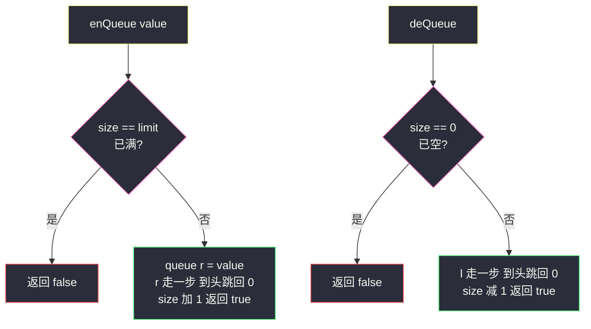
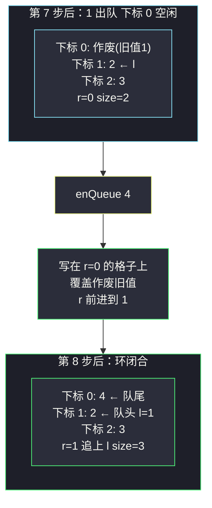

# 设计循环队列（数组回绕：size 记数量，l/r 走到头跳回 0）

## 一、问题描述

设计实现一个**固定长度**的循环队列：

- `MyCircularQueue(k)` 初始化，队列长度为 k
- `enQueue(value)` 向队列插入元素，成功返回 true
- `deQueue()` 从队列删除元素，成功返回 true
- `Front()` 获取队头元素，空返回 -1
- `Rear()` 获取队尾元素，空返回 -1
- `isEmpty()` / `isFull()` 判空 / 判满

> 🔗 LeetCode 622：https://leetcode.cn/problems/design-circular-queue/
>
> 约束：`1 <= k <= 1000`；值域 `0 <= value <= 1000`；最多调用 `3000` 次。

**示例 1**

```
输入：
["MyCircularQueue", "enQueue", "enQueue", "enQueue", "enQueue",
 "Rear", "isFull", "deQueue", "enQueue", "Rear"]
[[3], [1], [2], [3], [4], [], [], [], [4], []]
输出：
[null, true, true, true, false, 3, true, true, true, 4]

解释：容量 3。1、2、3 依次入队后满了，4 进不去；
     队尾是 3；出队一个（1 出去）后 4 能进了，队尾变成 4。
```

**直观理解**

普通数组队列的麻烦：每次队头出队，后面所有元素都得整体前移一格，`O(n)`。循环队列的思路是**队头出队后那格不浪费、也不搬数据**——数组首尾逻辑上接成一个环，下标走到头就跳回 0，腾出来的格子留给新元素继续用。要撑起这个环，只需三个变量：`l` 指队头、`r` 指下一个写入位置、`size` 记当前元素个数（`l == r` 既可能是空也可能是满，必须有 `size` 才能区分）。课源码 class013 `QueueStackAndCircularQueue.MyCircularQueue` 正是这套 `l/r/size/limit` 写法，回绕一行三目搞定。

---

## 二、暴力解法（数组 + 出队整体前移）

### 直观思路

拿一个普通数组从头到尾实打实存：队头永远在下标 0，出队时把后面元素全部左移一格：

```java
class MyCircularQueue {
    private int[] queue;
    private int size;

    public MyCircularQueue(int k) {
        queue = new int[k];
        size = 0;
    }

    public boolean enQueue(int value) {
        if (isFull()) return false;
        queue[size++] = value;          // 追加到尾部
        return true;
    }

    public boolean deQueue() {
        if (isEmpty()) return false;
        for (int i = 1; i < size; i++) { // 整体前移一格，O(n)
            queue[i - 1] = queue[i];
        }
        size--;
        return true;
    }

    public int Front() { return isEmpty() ? -1 : queue[0]; }

    public int Rear() { return isEmpty() ? -1 : queue[size - 1]; }

    public boolean isEmpty() { return size == 0; }
    public boolean isFull()  { return size == queue.length; }
}
```

### 复杂度

- **时间**：`deQueue` 是 `O(n)`，其余 `O(1)`
- **空间**：`O(k)`

### 🔴 瓶颈在哪里

1. **搬数据纯属人祸**：出队只影响队头一个位置，却让整队挪窝；
2. 数组前面的格子出队后**永远闲置**，空间利用率越来越差；
3. 根源：把「队头」钉死在下标 0。让队头**可以移动**，出队就只是 `l` 走一格——这就是循环队列。

---

## 三、优化探索（核心章节）

### 3.1 观察特征

| 特征 | 说明 |
|------|------|
| 容量固定为 k | 数组长度开 k 就够，无需扩容——天然适合静态数组 |
| 出队只需标记「头走了」 | 队头格子空出来后，数据不动、只动指针，格子即可复用 |
| 指针会越过数组边界 | 下标 `k-1` 之后再走要跳回 0——「环」是逻辑上的，取模或三目实现 |
| `l == r` 二义 | 空和满时都可能 `l == r`，必须引入 `size`（或牺牲一格）来区分 |

### 3.2 暴力 → 优化：l/r 双指针 + size 计数 + 回绕

定义（对齐 class013 课上版）：

- `l`：队头元素所在下标
- `r`：**下一个**写入位置（队尾元素的后面一格）
- `size`：当前元素个数；`limit`：容量 k
- 入队：写 `queue[r]`，然后 `r` 前进一步；出队：`l` 前进一步

**前进一步 = 回绕**：

```
r = (r == limit - 1) ? 0 : (r + 1)     ← 走到头跳回 0
等价写法：r = (r + 1) % limit           ← 取模版，稍慢一点
```

判空判满**只看 size**：`isEmpty: size == 0`；`isFull: size == limit`。`l == r` 从此不背锅。

**Rear 的取法**是本题唯一的小弯：`r` 指的是「下一个写入位」，真正的队尾在它**后退一格**的位置：

```
last = (r == 0) ? (limit - 1) : (r - 1)
Rear = queue[last]
```



### 3.3 关键推导问题

| 问题 | 答案 |
|------|------|
| 为什么必须要有 `size`？ | 空队列 `l == r`；满队列转一圈后同样 `l == r`（r 追上了 l）——一个条件判不出两种状态。加 `size` 是最省心的方案 |
| 不加 size 行不行？ | 行：牺牲一格法，数组开 `k+1`，`(r + 1) % limit == l` 视为满、`l == r` 视为空。省了一个字段、多了一个心眼，容易在边界绕晕；课上与本题解都选 size 计数 |
| r 为什么指「下一个写入位」而不是队尾本身？ | 队列为空时不存在「队尾元素」，指针无处安放；指「下一个写入位」时空态也自洽（l == r）。代价是 `Rear` 要回退一格取 |
| 回绕用三目还是取模？ | `(r + 1) % limit` 与 `r == limit-1 ? 0 : r+1` 语义等价；取模运算稍慢，竞赛常写三目，面试写哪个都行，讲清「跳回 0」即可 |
| 出队后的旧格子要不要清零？ | 不用：它已被 `size` 划出有效范围，下次入队会直接覆盖。留旧值不影响任何读操作（Front/Rear 都只读有效区） |
| `Front` / `Rear` 为什么要判空？ | 题目规定空队列返回 -1；不判直接读数组会返回脏数据 |
| 循环队列比链表队列好在哪？ | 固定容量下无逐节点内存分配、缓存友好、常数小；链表版（`LinkedList` 包装）代码短但每操作都 new 节点，笔试大数据下吃亏 |

### 3.4 一句话核心

> **头 l 尾 r 各自走，走到头跳回 0；空满全凭 size 说话，r 前一格才是队尾。**

---

## 四、代码实现详解

### Java（主解：l/r/size/limit，对齐 class013 课上版）

```java
// 设计循环队列：数组 + 头尾指针回绕 + size 计数
// 测试链接 : https://leetcode.cn/problems/design-circular-queue/
// 对齐 class013 QueueStackAndCircularQueue.MyCircularQueue
class MyCircularQueue {
    private int[] queue;    // 环形数组
    private int l, r;       // l = 队头；r = 下一个写入位置
    private int size, limit;

    public MyCircularQueue(int k) {
        queue = new int[k];
        l = r = size = 0;
        limit = k;
    }

    public boolean enQueue(int value) {
        if (isFull()) {
            return false;
        }
        queue[r] = value;                               // 写在 r 上
        r = (r == limit - 1) ? 0 : (r + 1);             // r 前进，到头跳回 0
        size++;
        return true;
    }

    public boolean deQueue() {
        if (isEmpty()) {
            return false;
        }
        l = (l == limit - 1) ? 0 : (l + 1);             // 队头走一步即出队
        size--;
        return true;
    }

    public int Front() {
        return isEmpty() ? -1 : queue[l];
    }

    public int Rear() {
        if (isEmpty()) {
            return -1;
        }
        int last = (r == 0) ? (limit - 1) : (r - 1);    // r 的前一格是队尾
        return queue[last];
    }

    public boolean isEmpty() { return size == 0; }
    public boolean isFull()  { return size == limit; }
}
```

### Python（同思路）

```python
class MyCircularQueue:
    def __init__(self, k: int):
        self.queue: list[int] = [0] * k
        self.l = 0            # 队头下标
        self.r = 0            # 下一个写入位置
        self.size = 0
        self.limit = k

    def enQueue(self, value: int) -> bool:
        if self.isFull():
            return False
        self.queue[self.r] = value
        self.r = 0 if self.r == self.limit - 1 else self.r + 1
        self.size += 1
        return True

    def deQueue(self) -> bool:
        if self.isEmpty():
            return False
        self.l = 0 if self.l == self.limit - 1 else self.l + 1
        self.size -= 1
        return True

    def Front(self) -> int:
        return -1 if self.isEmpty() else self.queue[self.l]

    def Rear(self) -> int:
        if self.isEmpty():
            return -1
        last = self.limit - 1 if self.r == 0 else self.r - 1
        return self.queue[last]

    def isEmpty(self) -> bool:
        return self.size == 0

    def isFull(self) -> bool:
        return self.size == self.limit
```

---

## 五、具体例子演示

### 例 1：LC 示例逐步跟踪（k = 3，数组三格记作下标 0/1/2）

初始 `l = r = size = 0`。记法：**写入用 r，写完 r 才前进**；`Front` 读 `queue[l]` 不动指针。

| 步 | 操作 | 数组（0/1/2） | l | r | size | 返回 | 说明 |
|----|------|---------------|---|---|------|------|------|
| 1 | `enQueue(1)` | **1**, ?, ? | 0 | 1 | 1 | true | 写在下标 0，r → 1 |
| 2 | `enQueue(2)` | **1, 2**, ? | 0 | 2 | 2 | true | 写在下标 1，r → 2 |
| 3 | `enQueue(3)` | **1, 2, 3** | 0 | **0** | 3 | true | 写在下标 2，r 到头**跳回 0**；满了，r 恰好追上 l |
| 4 | `enQueue(4)` | 1, 2, 3 | 0 | 0 | 3 | **false** | size == limit，满拒绝 |
| 5 | `Rear()` | 1, 2, 3 | 0 | 0 | 3 | **3** | r=0 → 环上退到下标 2，queue[2]=3 |
| 6 | `isFull()` | 1, 2, 3 | 0 | 0 | 3 | **true** | |
| 7 | `deQueue()` | 1→作废, **2, 3** | 1 | 0 | 2 | true | 队头 1 出局，l → 1（数据一格没动） |
| 8 | `enQueue(4)` | **4**, 2, 3 | 1 | **1** | 3 | true | 写在 r=0 的格子上（原队头格，复用！），r → 1；又满，r 又追上 l |
| 9 | `Rear()` | 4, 2, 3 | 1 | 1 | 3 | **4** | r=1 → 退到下标 0，queue[0]=4 ✅ |
| 10 | `Front()` | 4, 2, 3 | 1 | 1 | 3 | **2** | queue[l]=queue[1]=2 ✅ |

有效队列始终是「从 l 出发沿环数 size 格」：第 8 步后从 l=1 起依次是 queue[1]=2 → queue[2]=3 → queue[0]=4，队头 2、队尾 4，与 Front/Rear 的返回一致。



**两个精华看点**：

1. **格子复用（第 8 步）**：下标 0 出队后没浪费、没搬数据，直接装下新元素 4——环闭合了，这就是「循环」的价值。
2. **r 追上 l（第 3、8 步）**：两次满队列都出现 `l == r`——r 转一圈恰好追上 l；而空队列也是 `l == r`。**同一个指针状态两种含义，这就是必须用 size 区分空满的根本原因**。手写时绕环跟踪容易糊，永远以「写入后 r 才前进」为准绳即可。

### 例 2：连续出队到空，再入队

接着例 1 第 10 步的状态（数组 `[4, 2, 3]`，`l=1, r=1, size=3`）：

| 步 | 操作 | 有效队列 | l | r | size | 返回 | 说明 |
|----|------|----------|---|---|------|------|------|
| 1 | `deQueue()` | 3, 4 | 2 | 1 | 2 | true | 2 出局，l → 2 |
| 2 | `Rear()` | 3, 4 | 2 | 1 | 2 | **4** | r=1 → 退到下标 0，queue[0]=4 ✅ |
| 3 | `deQueue()` | 4 | **0** | 1 | 1 | true | l=2 到头跳回 0，3 出局 |
| 4 | `Front()` | 4 | 0 | 1 | 1 | **4** | queue[0]=4 |
| 5 | `deQueue()` | 空 | 1 | 1 | 0 | true | 4 出局，l → 1，size=0 |
| 6 | `isEmpty()` | 空 | 1 | 1 | 0 | **true** | 同样 l == r，但 size=0 → 空 |
| 7 | `Front()` | 空 | — | — | 0 | **-1** | 空返回 -1 |
| 8 | `enQueue(9)` | 9 | 1 | 2 | 1 | true | 空队列照常写 r 位置，无缝续用 |

第 6 步再次印证：`l == r` 时看 size 才知道是空（size=0）还是满（size=limit）——指针撞车不可怕，size 一票定音。

---

## 六、复杂度分析

| 项目 | 暴力前移版 | 循环队列（主解） |
|------|------------|------------------|
| enQueue | `O(1)` | **`O(1)`** |
| deQueue | `O(n)` | **`O(1)`** |
| Front / Rear | `O(1)` | `O(1)`（Rear 多一次下标回退计算） |
| isEmpty / isFull | `O(1)` | `O(1)` |
| 空间 | `O(k)` | `O(k)`（一个数组，无额外容器） |

全程无搬数据、无节点分配，n 次操作总代价 `O(n)`——固定容量场景下这是队列的最优实现形态。

---

## 七、方法对比与总结

### 写法对比

| | 数组前移版 | l/r + size（主解） | 牺牲一格法 |
|--|------------|--------------------|------------|
| deQueue | `O(n)` | `O(1)` | `O(1)` |
| 空满判断 | size 直判 | size 直判 | `(r+1)%limit==l` 判满、`l==r` 判空 |
| 数组长度 | k | k | k+1 |
| 心智负担 | 低但慢 | **低且快（推荐）** | 省一字段、绕一脑子 |

### 易错点

1. **`l == r` 当判空判满用**：满时 r 追上 l，两个状态撞车——必配 `size`。
2. **Rear 忘了回退**：`r` 是「下一个写入位」，直接返回 `queue[r]` 是脏数据；`r == 0` 还要特判退到 `limit-1`。
3. **回绕只写 `r+1` 没写跳 0**：数组越界，恰好满一圈时崩溃。
4. **enQueue/deQueue 先动指针再写/读**：顺序反了会写到作废格。口诀：**写入用 r，写完才前进；读取用 l，读完不动**（deQueue 先确认非空再 l 前进）。
5. **空队列调 Front/Rear 不判空**：返回 -1 是题目契约，漏判直接读脏值。

### 模板口诀

> **l 指队头 r 指空位，走到头跳回零；空满只认 size，队尾要退一格找。**

---

## 八、举一反三

| 题目 | 链接 | 迁移点 |
|------|------|--------|
| 641. 设计循环双端队列 | https://leetcode.cn/problems/design-circular-deque/ | 本题双端升级版（本站题解）：l/r 两端都能进出，注意两篇 r 语义的差异 |
| 232. 用栈实现队列 | https://leetcode.cn/problems/implement-queue-using-stacks/ | 队列的另一种实现形态（本站已有题解）：双栈倒手 |
| 155. 最小栈 | https://leetcode.cn/problems/min-stack/ | 同为「数组/栈 + 辅助信息」设计家族（本站题解） |
| 933. 最近的请求次数 | https://leetcode.cn/problems/number-of-recent-calls/ | 循环队列思想的应用：滑动时间窗内计数 |
| 1670. 设计前中后队列 | https://leetcode.cn/problems/design-front-middle-back-queue/ | 循环双端队列的经典进阶：中点插入 |

**迁移一句**：循环队列 = **固定数组 + 会回绕的头尾指针 + 一个 size**。理解了「`l == r` 的二义性靠 size 化解」，再看 #641 只是让 `l` 也能后退、`r` 也能读取——环没变，变的只是指针的权限。
