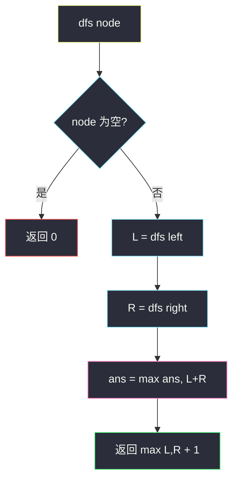
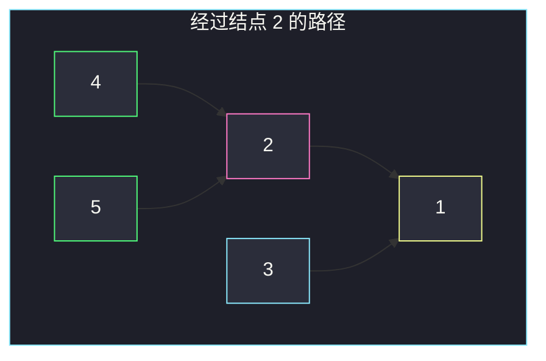
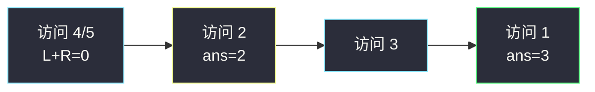

# 二叉树的直径（后序求深度，顺带更新直径）

## 一、问题描述

给你一棵二叉树的根节点 `root`，返回该树的**直径**。

二叉树的直径是任意两个结点路径长度中的**最大值**。这条路径可能穿过根，也可能完全在某一侧子树里。  
路径长度用**边的数量**表示（不是结点个数）。

> 🔗 LeetCode 543：https://leetcode.cn/problems/diameter-of-binary-tree/

**示例 1（简单）**

```
输入：root = [1,2,3,4,5]
输出：3
解释：路径 [4,2,1,3] 或 [5,2,1,3]，长度均为 3。
树形：
      1
     / \
    2   3
   / \
  4   5
```

**示例 2（直径不经过根）**

```
输入：一棵左子树特别「深」、右子树几乎为空的树
输出：直径可能完全落在左子树内部
解释：全局最长路径不一定经过根节点——这正是暴力「只看根」会漏答案的原因。
```

**直观理解**

任意一条路径，都可以看成「经过某个结点 `u`，向左下走一段 + 向右下走一段」。  
对每个 `u`，若左子树深度为 `L`、右子树深度为 `R`，则**经过 `u` 的最长路径边数**是 `L + R`。  
整棵树的直径 = 所有结点上 `L + R` 的最大值。

---

## 二、暴力解法（入门）

### 直观思路

对每个结点 `u`：

1. 单独算左子树高度 `L`、右子树高度 `R`；
2. 用 `L + R` 更新全局答案；
3. 再递归处理左右子树。

高度函数本身又是一遍 DFS，于是每个结点都会触发对子树的重复遍历。

```java
class Solution {
    public int diameterOfBinaryTree(TreeNode root) {
        if (root == null) return 0;
        int throughRoot = depth(root.left) + depth(root.right);
        int left = diameterOfBinaryTree(root.left);
        int right = diameterOfBinaryTree(root.right);
        return Math.max(throughRoot, Math.max(left, right));
    }

    private int depth(TreeNode node) {
        if (node == null) return 0;
        return 1 + Math.max(depth(node.left), depth(node.right));
    }
}
```

### 复杂度

- **时间**：`O(n²)`。每个结点算深度时会再扫一遍子树；最坏链状时接近平方。
- **空间**：`O(h)`，递归栈，`h` 为树高。

### 🔴 瓶颈在哪里

算直径时已经访问了左右子树，却又为了「深度」再各扫一遍——**同一棵子树被算了很多次深度**。

```
对结点 u 求 diameter
  ├─ depth(u.left)   ← 扫左子树
  ├─ depth(u.right)  ← 扫右子树
  ├─ diameter(u.left)  ← 内部又 depth 又 diameter …
  └─ diameter(u.right)
```

`n` 到 `10⁴` 时，链状树会明显变慢。目标：一次后序遍历，**边求深度边更新直径**。

---

## 三、优化探索（核心章节）

### 3.1 观察特征

| 特征 | 说明 |
|------|------|
| 路径必有「最高点」 | 任意路径有一个最靠上的结点 `u`，路径 = 左下最长 + 右下最长 |
| 子问题：深度 | `depth(u) = 1 + max(depth(left), depth(right))` |
| 直径候选 | 经过 `u` 的边数 = `depth(left) + depth(right)`（注意：这里 depth 是边数意义下的高度，空树为 0） |
| 需要左右都算完 | **后序**：先左右，再处理自己 |

### 3.2 暴力 → 优化：后序一遍搞定

定义递归函数 `dfs(node)`：**返回以 `node` 为根的子树高度**（边数：空为 0，单结点为 1？——本题约定叶子高度为 1，空为 0，则 `L+R` 正好是边数）。

在返回高度之前：

```
ans = max(ans, L + R)   // 经过当前结点的最长路径
return max(L, R) + 1    // 向上贡献的高度
```

这样每个结点只访问一次，直径在全局变量（或数组盒子）里同步更新。



**高度与直径的关系（示意）**



对结点 `1`：`L=2`（经 2 到 4/5），`R=1`（到 3），`L+R=3` → 直径候选 3。  
对结点 `2`：`L=1`，`R=1`，`L+R=2` → 更短。最终 `ans=3`。

### 3.3 关键问题（树形后序）

- **为何必须后序？** 直径候选依赖左右高度，必须先拿到 `L`、`R`。
- **返回值 vs 副作用？** 返回值只向上交「高度」；直径用外部变量更新——一次 DFS 干两件事。
- **为何不是结点数？** 题目要边数：`L+R` 已是边数；若有人用结点数定义高度，别忘了减 1。
- **空树 / 单结点？** 空 → 0；单结点左右都是 0 → 直径 0。

### 3.4 核心思想（一句话）

**后序遍历每个结点，用「左高度 + 右高度」更新直径，再把「较高一侧 + 1」返回给父结点。**

---

## 四、代码实现详解

### Java（逐行）

```java
class Solution {
    private int ans; // 全局最大直径（边数）

    public int diameterOfBinaryTree(TreeNode root) {
        ans = 0;
        depth(root);   // 只为副作用：更新 ans；返回值可丢弃
        return ans;
    }

    /** 返回以 node 为根的子树高度（叶子=1，空=0） */
    private int depth(TreeNode node) {
        if (node == null) {
            return 0;
        }
        int L = depth(node.left);   // 左子树高度
        int R = depth(node.right);  // 右子树高度
        ans = Math.max(ans, L + R); // 经过 node 的最长路径
        return Math.max(L, R) + 1;  // 向上：多一条边到 node
    }
}
```

| 变量 / 步骤 | 含义 |
|-------------|------|
| `ans` | 全局直径，初值 0 |
| `L` / `R` | 左右子树高度（边意义：空 0） |
| `L + R` | 以当前结点为「拐点」的路径边数 |
| `max(L,R)+1` | 父结点需要的「从这边往下能走多深」 |

### Python（同结构）

```python
class Solution:
    def diameterOfBinaryTree(self, root: TreeNode | None) -> int:
        self.ans = 0

        def depth(node: TreeNode | None) -> int:
            if not node:
                return 0
            L = depth(node.left)
            R = depth(node.right)
            self.ans = max(self.ans, L + R)
            return max(L, R) + 1

        depth(root)
        return self.ans
```

---

## 五、具体例子演示

### 例 1：`[1,2,3,4,5]`

后序访问顺序大致：`4 → 5 → 2 → 3 → 1`

| 当前结点 | L | R | 更新 ans | 返回高度 |
|----------|---|---|----------|----------|
| 4 | 0 | 0 | max(0,0)=0 | 1 |
| 5 | 0 | 0 | 0 | 1 |
| 2 | 1 | 1 | max(0,2)=**2** | 2 |
| 3 | 0 | 0 | 2 | 1 |
| 1 | 2 | 1 | max(2,3)=**3** | 3 |

答案：`3`。



### 例 2：链状树 `1 → 2 → 3`（只有左孩子）

| 当前 | L | R | ans | 返回 |
|------|---|---|-----|------|
| 3 | 0 | 0 | 0 | 1 |
| 2 | 1 | 0 | 1 | 2 |
| 1 | 2 | 0 | 2 | 3 |

直径 = 2（边：`1-2-3`）。说明：即使没有右子树，`L+R` 仍可能沿链变长；真正「拐弯」的路径在有两侧深度时更长。

### 例 3：单结点

`L=0,R=0` → `ans=0`，符合题意。

---

## 六、复杂度分析

| 方法 | 时间 | 空间 | 说明 |
|------|------|------|------|
| 暴力：每点重算深度 | `O(n²)` | `O(h)` | 子树深度重复计算 |
| **后序一遍** | **`O(n)`** | `O(h)` | 每结点恰访问一次 |

`h` 最坏 `O(n)`（链），平均/平衡时 `O(log n)`。

---

## 七、方法对比与总结

| | 暴力 | 后序一遍 |
|--|------|----------|
| 遍历次数 | 多次扫同一子树 | **一次** |
| 面试期望 | 可作第一版 | **标准答案** |
| 易错 | 漏掉「直径不在根」 | 高度定义、边/点搞混 |

**易错点**

1. 返回的是**高度**，全局维护的是**直径**——别把返回值当成答案。
2. 直径是 `L + R`，不是 `L + R + 1`（`+1` 用在向父结点交高度时）。
3. 空结点高度必须是 `0`，否则叶子上 `L+R` 会错。
4. 忘记初始化 / 重置 `ans`（多测时）。

**模板（树形：后序求高 + 边更新全局）**

```java
int ans = 0;
int depth(TreeNode node) {
    if (node == null) return 0;
    int L = depth(node.left), R = depth(node.right);
    ans = Math.max(ans, L + R);       // 本题：直径
    // ans = Math.max(ans, ...);      // 换题：换这一行
    return Math.max(L, R) + 1;
}
```

---

## 八、举一反三

| 题目 | 关系 |
|------|------|
| [104. 二叉树的最大深度](https://leetcode.cn/problems/maximum-depth-of-binary-tree/) | 只要 `return max(L,R)+1`，不要更新直径 |
| [110. 平衡二叉树](https://leetcode.cn/problems/balanced-binary-tree/) | 后序求高，顺带检查 `|L-R|≤1`，不平衡可提前返回 -1 |
| [124. 二叉树中的最大路径和](https://leetcode.cn/problems/binary-tree-maximum-path-sum/) | 同一骨架：返回「单边贡献」，全局更新「左右都要」的路径和 |
| [687. 最长同值路径](https://leetcode.cn/problems/longest-univalue-path/) | 后序 + 仅当子结点值相等才累加长度 |

**思想迁移**

```
树上看「经过某点的左右贡献」类问题
  ↓
后序：先拿左右信息
  ↓
返回给父：只能选一侧（高度 / 单边路径）
副作用：左右都用上 → 更新全局最优（直径 / 最大路径和）
```

**记忆口诀**：后序摸高，左右一加更新直径；向上只交较高那一侧。
