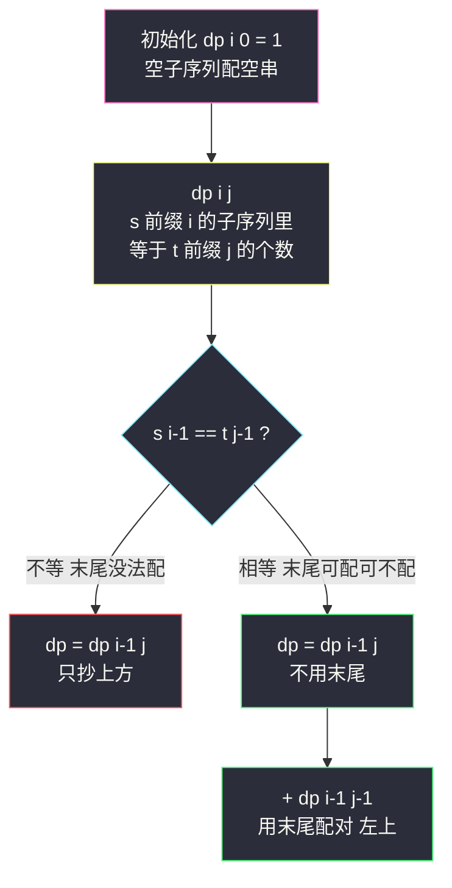

# 不同的子序列（Hard 计数 DP：s 的子序列里有几个 t）

## 一、问题描述

给定两个字符串 `s` 和 `t`，返回 `s` 的**子序列**中 `t` 出现的**个数**。题目保证答案在 32 位整数范围内（新版已改为答案对 `1000000007` 取模，与课上版本一致，两种约束解法相同）。

> 🔗 LeetCode 115：https://leetcode.cn/problems/distinct-subsequences/

**示例 1**

```
输入：s = "rabbbit", t = "rabbit"
输出：3
解释：s 中有 3 个子序列（以下划线标出被删字符）等于 "rabbit"
      rabbbit → ra_bbit / rab_bit / rabb_it
```

**示例 2**

```
输入：s = "babgbag", t = "bag"
输出：5
解释：ba..g / b..g / b...g / .b..g / ..b..g 共 5 种选法
```

**直观理解**

前面双串题（#72 / #583 / #1143）求的是**最值**（min/max），本题求**计数**——转移从「取 min/max」变成「加法累加」。老套路：两个可变参数 `(i, j)` → 二维表；看两前缀末尾，`s` 的末尾字符**要么不出现在配对里，要么去配对 `t` 的末尾**。计数 DP 最重要的纪律是**不重不漏**：每个子序列恰好被一条转移路径统计一次。

---

## 二、暴力解法

### 直观思路

定义尝试 `f(i, j)`：`s` 前缀长度 `i` 的所有子序列中，等于 `t` 前缀长度 `j` 的个数。看 `s[i-1]`（`t` 的末尾谁来配）：

- **不用 `s[i-1]`**：子序列只能从前 `i-1` 个里选 → `f(i-1, j)`
- **用 `s[i-1]` 配对 `t` 的末尾**（前提 `s[i-1] == t[j-1]`）：锁定这对字符，剩下的去配 `t` 前 `j-1` 个 → `f(i-1, j-1)`

```java
// 暴力递归（对齐 class068 Code01 的尝试模型）
public static int numDistinct1(char[] s, char[] t, int i, int j) {
    // t 空了 : 空子序列恰好等于空串，算 1 种
    if (j == 0) {
        return 1;
    }
    // s 空了但 t 不空 : 配不出，0 种
    if (i == 0) {
        return 0;
    }
    // 不用 s 的末尾
    int ans = numDistinct1(s, t, i - 1, j);
    // 用 s 的末尾去配 t 的末尾
    if (s[i - 1] == t[j - 1]) {
        ans += numDistinct1(s, t, i - 1, j - 1);
    }
    return ans;
}
```

### 复杂度

- **时间**：`O(2^(n+m))` 级别，指数级
- **空间**：`O(n + m)` 递归栈

### 🔴 瓶颈在哪里

`(i, j)` 状态只有 `(n+1)*(m+1)` 个，递归树却指数展开。加缓存 / 填表即 DP。

---

## 三、优化探索

### 3.1 可变参数分析（对齐 class068 Code01）

两个可变参数 → 二维表：

| dp 定义 | 含义 |
|---------|------|
| `dp[i][j]` | `s` 前缀长度 `i` 的所有子序列中，等于 `t` 前缀长度 `j` 的个数 |

### 3.2 转移方程推导（不重不漏的分类）

`f(i, j)` 按「**s 的末尾字符用不用在配对里**」分类——对**每一个**具体的子序列，`s[i-1]` 要么在其中要么不在，恰好一类：

```
dp[i][j] = dp[i-1][j]                              // 不用 s[i-1]
dp[i][j] += dp[i-1][j-1]   （若 s[i-1] == t[j-1]） // 用 s[i-1] 配 t[j-1]
```

**为什么相加不重复**：两类子序列集合互斥（一个含 `s[i-1]`、一个不含）；**为什么不漏**：所有以 `s[0..i-1]` 为来源的子序列必然落进其中一类。这就是计数 DP 的「按末尾归属分类」纪律。

### 3.3 初始化（本题最精妙的一格）

- `dp[i][0] = 1`（对任意 `i`，包括 0）：**空串是任何串的子序列**，且空子序列等于空串的方式恰有 1 种——「什么都不选」
- `dp[0][j] = 0`（`j ≥ 1`）：空串配不出非空 `t`
- `dp[0][0] = 1` 已含于第一条

### 3.4 依赖方向与遍历顺序

`dp[i][j]` 依赖**上一行的同列（上）和左上** → `i` 从 1 到 n、`j` 从 1 到 m，行优先（从上到下、从左到右）填表。

### 3.5 关键问题

| 问题 | 答案 |
|------|------|
| 为什么 `dp[i][0] = 1` 不是 0？ | 空 `t` 恰有 1 个子序列与之相等：空子序列本身。这是所有计数的「1 的来源」 |
| `s[i-1] == t[j-1]` 时能不能**必须用**（只取左上）？ | 不能。`s = "rab"`, `t = "ab"`：末尾 b 可配可不配，只取一种会漏算 |
| `s[i-1] != t[j-1]` 时为什么直接抄上格？ | `s[i-1]` 无法参与配对，子序列只能来自前 `i-1` 个字符 |
| 会不会溢出？ | 旧版保证答案 ≤ int 上界；新版要取模 `1000000007`（课上 numDistinct3 加了取模）。计数 DP 务必先想溢出 |
| 与 LCS/#72 的表像吗？ | 同一张 `(i, j)` 表，但「求什么」从最值变成计数，min/max 全换成 `+=` |

### 3.6 一句话核心

> **不用末尾抄上格；末尾相等再加一份左上。第 0 列全 1 是计数之源。**



---

## 四、代码实现

### Java（主解：二维 dp，对齐 class068 Code01 的 numDistinct1）

```java
// 不同的子序列
// 返回 s 的子序列中 t 出现的个数
// 测试链接 : https://leetcode.cn/problems/distinct-subsequences/
// 对齐 class068 Code01_DistinctSubsequences
public class Solution {

    // 时间复杂度 O(n*m)，空间复杂度 O(n*m)
    public int numDistinct(String s, String t) {
        char[] ss = s.toCharArray();
        char[] ts = t.toCharArray();
        int n = ss.length, m = ts.length;
        // dp[i][j] : s 前缀 i 的子序列中等于 t 前缀 j 的个数
        int[][] dp = new int[n + 1][m + 1];
        for (int i = 0; i <= n; i++) {
            dp[i][0] = 1; // 空子序列配空串，1 种
        }
        // 依赖方向 : 上一行同列 + 左上 → 行优先填表
        for (int i = 1; i <= n; i++) {
            for (int j = 1; j <= m; j++) {
                // 不用 s 的末尾字符
                dp[i][j] = dp[i - 1][j];
                if (ss[i - 1] == ts[j - 1]) {
                    // 用 s 的末尾配 t 的末尾
                    dp[i][j] += dp[i - 1][j - 1];
                }
            }
        }
        return dp[n][m];
    }
}
```

### Java（进阶：空间压缩到一维，对齐 class068 Code01 的 numDistinct2/3）

```java
// 每行只依赖上一行 → 一维滚动
// 注意 : 依赖左上（上一行的 dp[j-1]），所以 j 必须倒序更新，防止左上被本行覆盖
// 时间复杂度 O(n*m)，空间复杂度 O(m)
public class Solution {

    public int numDistinct(String s, String t) {
        char[] ss = s.toCharArray();
        char[] ts = t.toCharArray();
        int n = ss.length, m = ts.length;
        int[] dp = new int[m + 1];
        dp[0] = 1;
        for (int i = 1; i <= n; i++) {
            // 倒序 : dp[j-1] 更新 dp[j] 时仍是上一行的值（即左上角）
            for (int j = m; j >= 1; j--) {
                if (ss[i - 1] == ts[j - 1]) {
                    dp[j] += dp[j - 1];
                }
            }
        }
        return dp[m];
    }
}
```

```java
// 若题目要求取模（新版 10^9+7），对齐 class068 Code01 的 numDistinct3：
public class Solution {

    public int numDistinct(String s, String t) {
        int mod = 1000000007;
        char[] ss = s.toCharArray();
        char[] ts = t.toCharArray();
        int n = ss.length, m = ts.length;
        int[] dp = new int[m + 1];
        dp[0] = 1;
        for (int i = 1; i <= n; i++) {
            for (int j = m; j >= 1; j--) {
                if (ss[i - 1] == ts[j - 1]) {
                    dp[j] = (dp[j] + dp[j - 1]) % mod;
                }
            }
        }
        return dp[m];
    }
}
```

### Python

```python
# 二维 dp（主解同思路）
class Solution:
    def numDistinct(self, s: str, t: str) -> int:
        n, m = len(s), len(t)
        # dp[i][j] : s 前缀 i 的子序列中等于 t 前缀 j 的个数
        dp = [[0] * (m + 1) for _ in range(n + 1)]
        for i in range(n + 1):
            dp[i][0] = 1          # 空子序列配空串
        for i in range(1, n + 1):
            for j in range(1, m + 1):
                dp[i][j] = dp[i - 1][j]      # 不用 s 的末尾
                if s[i - 1] == t[j - 1]:
                    dp[i][j] += dp[i - 1][j - 1]  # 用末尾配对
        return dp[n][m]
```

```python
# 一维滚动 + 倒序（Python 天然大数，取模版只需在累加处 % MOD）
class Solution:
    def numDistinct(self, s: str, t: str) -> int:
        m = len(t)
        dp = [1] + [0] * m
        for ch in s:
            for j in range(m, 0, -1):
                if ch == t[j - 1]:
                    dp[j] += dp[j - 1]
        return dp[m]
```

---

## 五、具体例子演示

以 `s = "babgbag"`、`t = "bag"` 为例，dp 表尺寸 `8 × 4`（行 = s 前缀，列 = t 前缀）。

### 初始化

第 0 列全 1；`dp[0][1..3] = 0`。

### dp 表逐格填充（只标关键行，★ = 字符相等）

| 格 | 字符 | 计算 | 值 |
|----|------|------|-----|
| dp[1][1] | b vs b ★ | 上 0 + 左上 dp[0][0]=1 | **1** |
| dp[1][2] | b vs a | 抄上 | 0 |
| dp[1][3] | b vs g | 抄上 | 0 |
| dp[2][1] | a vs b | 抄上 | 1 |
| dp[2][2] | a vs a ★ | 上 0 + 左上 dp[1][1]=1 | **1** |
| dp[2][3] | a vs g | 抄上 | 0 |
| dp[3][1] | b vs b ★ | 上 1 + 左上 dp[2][0]=1 | **2** |
| dp[3][2] | b vs a | 抄上 | 1 |
| dp[3][3] | b vs g | 抄上 | 0 |
| dp[4][1] | g vs b | 抄上 | 2 |
| dp[4][2] | g vs a | 抄上 | 1 |
| dp[4][3] | g vs g ★ | 上 0 + 左上 dp[3][2]=1 | **1** |
| dp[5][1] | b vs b ★ | 上 2 + 左上 1 | **3** |
| dp[5][2] | b vs a | 抄上 | 1 |
| dp[5][3] | b vs g | 抄上 | 1 |
| dp[6][1] | a vs b | 抄上 | 3 |
| dp[6][2] | a vs a ★ | 上 1 + 左上 dp[5][1]=3 | **4** |
| dp[6][3] | a vs g | 抄上 | 1 |
| dp[7][1] | g vs b | 抄上 | 3 |
| dp[7][2] | g vs a | 抄上 | 4 |
| dp[7][3] | g vs g ★ | 上 1 + 左上 dp[6][2]=4 | **5** |

最终 `dp[7][3] = 5` → 返回 **5**。完整表：

```
        ""  b   a   g
    ""   1  0   0   0
    b    1  1   0   0
    a    1  1   1   0
    b    1  2   1   0
    g    1  2   1   1
    b    1  3   1   1
    a    1  3   4   1
    g    1  3   4   5
```

### 5 个子序列从哪来（沿转移回溯）

```mermaid
flowchart TD
    A["dp 7 3 = 5<br/>g == g 上1 + 左上4"] -->|"来源1 上 dp 6 3 = 1<br/>最后的 g 不用"] --> B1["bag = b a g<br/>用第4个字符 g"]
    A -->|"来源2 左上 dp 6 2 = 4<br/>最后的 g 配 g" --> B2["4 种配出 ba 再接 g"]
    B2 --> C1["b 1 a 2 g 7"]
    B2 --> C2["b 1 a 2 g 4"]
    B2 --> C3["b 3 a 2 g 4"]
    B2 --> C4["b 3 a 6 g 7"]
    B1 --> D["合计 1 + 4 = 5 种"]

    style A fill:#2b2d3a,stroke:#f1fa8c,color:#f8f8f2
    style B1 fill:#2b2d3a,stroke:#8be9fd,color:#f8f8f2
    style B2 fill:#2b2d3a,stroke:#50fa7b,color:#f8f8f2
    style C1 fill:#2b2d3a,stroke:#8be9fd,color:#f8f8f2
    style C2 fill:#2b2d3a,stroke:#8be9fd,color:#f8f8f2
    style C3 fill:#2b2d3a,stroke:#8be9fd,color:#f8f8f2
    style C4 fill:#2b2d3a,stroke:#8be9fd,color:#f8f8f2
    style D fill:#2b2d3a,stroke:#ff79c6,color:#f8f8f2
```

`dp[7][3]` 拆成「不用最后的 g（1 种）」+「用最后的 g（4 种）」——不重不漏。

---

## 六、复杂度分析

| 版本 | 时间 | 空间 | 说明 |
|------|------|------|------|
| 暴力递归 | `O(2^(n+m))` | `O(n+m)` | 指数展开 |
| 二维 dp（主解） | `O(n*m)` | `O(n*m)` | 每格 O(1) 转移 |
| 一维滚动 | `O(n*m)` | `O(m)` | j 倒序，保护左上角 |

`n ≤ 1000, m ≤ 1000`，主解 O(10^6) 稳过。

---

## 七、方法对比与总结

### 双串 DP 家族四件套（同一张表的三种语义）

| 题 | 相等时 | 不等时 | 语义 | 边界特色 |
|----|--------|--------|------|---------|
| #1143 LCS（站内已写） | 左上 + 1 | max(上, 左) | 最值 | 第 0 行/列全 0 |
| #72 编辑距离（站内已写） | 左上 + 0 | min(左上,上,左) + 1 | 最值 | 边界 = i 或 j |
| #583 删除操作（站内已写） | 左上 + 0 | min(上, 左) + 1 | 最值 | 同上 |
| **#115 本题** | 上 + 左上 | 上（抄） | **计数** | **第 0 列全 1** |

### 易错点

1. **`dp[i][0] = 1` 写成 0**：空串那 1 种「什么都不选」是全部计数的源头，错则全表归零。
2. **相等时忘了「不用末尾」那份**：只加左上会把 `rabbbit` 算少（多个 b 可以不配对）。
3. **一维滚动 j 用正序**：左上角被本行覆盖，`dp[j-1]` 变成本行新值，计数虚高——必须倒序。
4. **不取模直接交新版题**：新版判题要 `% 1000000007`；Java `int` 相加在取模前不会溢出（各 ≤ 10^9，和 ≤ 2×10^9 超 int！）——所以累加后立刻取模，或用 long（课上 numDistinct3 的写法）。
5. **把「子序列」当「子串」**：允许跳着选，不是连续。

### 模板口诀

> **抄上格是底数，尾等再加左上一份；零列全一莫忘记，滚动更新须倒行。**

---

## 八、举一反三

| 题目 | 链接 | 迁移点 |
|------|------|--------|
| 940. 不同的子序列 II | https://leetcode.cn/problems/distinct-subsequences-ii/ | 单串去重计数，课上 class066 Code08 |
| 72. 编辑距离 | https://leetcode.cn/problems/edit-distance/ | 同表最值版（站内已写题解） |
| 583. 两个字符串的删除操作 | https://leetcode.cn/problems/delete-operation-for-two-strings/ | 同表最值版（站内已写题解） |
| 1143. 最长公共子序列 | https://leetcode.cn/problems/longest-common-subsequence/ | 同表基础（站内已写题解） |
| 剑指 Offer 63 之外的计数变形 | 同骨架：数「s 的子序列等于 t 的个数」再套一层选择 | 例如 #1159 有效票据等会员题不必碰 |

**迁移一句**：双串题里把「最少/最多」换成「有多少种」，转移就从 min/max 变成 `+=`，初始化里「空配空 = 1」是计数 DP 的万能起手式。
