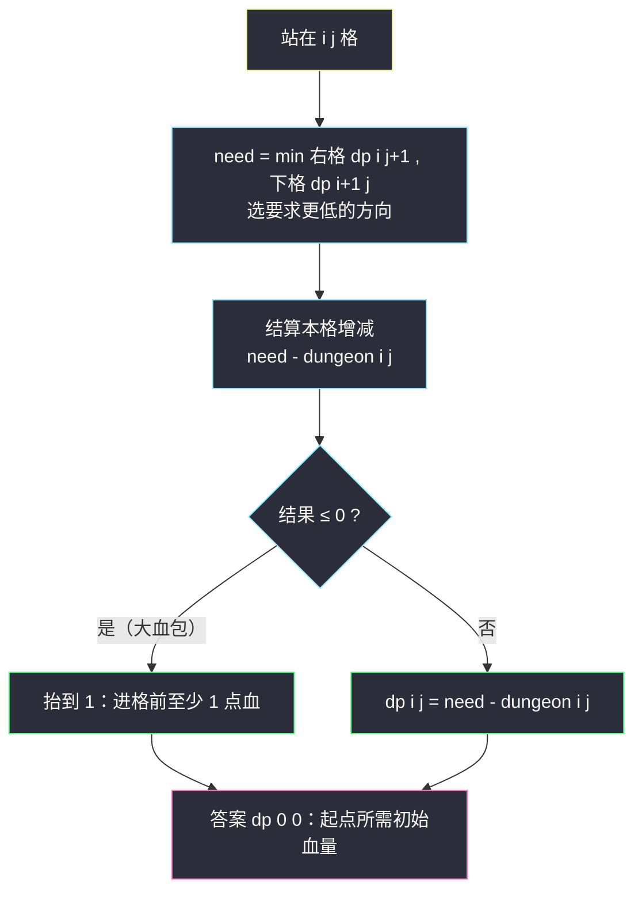
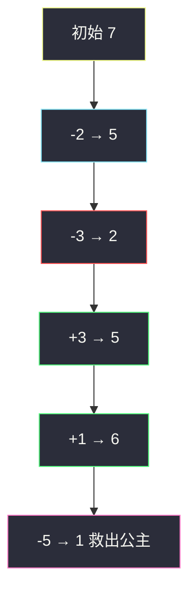

# 地下城游戏（逆向 DP：从公主房间倒推）

## 一、问题描述

恶魔抓走了公主并将她关在**地下城** `m × n` 网格的右下角。骑士初始位于左上角 `(0, 0)`，任何时候血量都**不能低于 1**。他每步只能向右或向下移动一格，进入格子 `(i, j)` 时血量增减 `dungeon[i][j]`（负数扣血、正数回血）。求**确保能救到公主所需的最低初始血量**。

> 🔗 LeetCode 174：https://leetcode.cn/problems/dungeon-game/

**示例 1**

```
输入：dungeon = [[-2,-3,3],[-5,-10,1],[10,30,-5]]
输出：7
解释：初始血量 7，走 右→右→下→下（-2,-3,3,1,-5），
     途中血量 5,2,5,6,1，全程 ≥ 1 ✓
```

**示例 2**

```
输入：dungeon = [[0]]
输出：1
```

**直观理解**

与「最小路径和」（#64）形似而神异：#64 只关心**终点的总花费**，本题约束的是**全程每一格的血量下限**。而且血量会先扣后回，「终点剩得多」不等于「路上死不了」——这个差别决定了它**不能正推**，必须从右下角**逆向**推导。

---

## 二、暴力解法（正推的诱惑与陷阱）

### 直观思路（错误示范：正推维护最大剩余血量）

最直觉的做法是仿照最小路径和：`dp[i][j]` = 到达 `(i, j)` 时的**最大剩余血量**，由上方/左方取 max 转移。这是**错的**，先看反例：

```
两条通往同一格子的路（初始血量 x）：
路 1：先 -20，后 +30 → 到达时剩余 x + 10，途中最低点 x - 20
路 2：先 -5， 后 0  → 到达时剩余 x - 5， 途中最低点 x - 5
```

「到达剩余最大」选路 1；但走路 1 需要 `x ≥ 21` 才不至于中途死亡，走路 2 只需 `x ≥ 6`。**剩余血量最大 ≠ 初始血量最小**——正推状态丢掉了「途中最低点」这个关键信息，而补上它需要同时记「剩余」与「历史最低」两个维度，还要做困难的合并。

### 复杂度

- **时间**：即使补维度正推 `O(mn)`，合并逻辑也极易写错
- **空间**：`O(mn)`

### 🔴 瓶颈在哪里

信息方向错了：**未来的路况决定现在需要多少血**。骑士站在 `(i, j)` 时，他需要多少血只取决于 `(i, j)` 之后会遇到什么——这是「后缀信息」。正推只能看前缀。把 DP 方向**整个反过来**，从终点向起点倒推，问题豁然开朗。

---

## 三、优化探索（核心章节）

### 3.1 逆向状态定义

```
dp[i][j] : 骑士「进入 (i, j) 格之前」必须拥有的最低血量
           （保证从 (i,j) 走到右下角全程血量 ≥ 1，含本格结算）
```

注意是**进入前**，本格 `dungeon[i][j]` 的增减在转移里结算。这样定义后：

- 下一步走向 `need = min(dp[i+1][j], dp[i][j+1])`（哪边要求低走哪边）
- 结算本格：`dp[i][j] = max(1, need - dungeon[i][j])`

`max(1, ...)` 的含义：就算本格是大血包（`need - dungeon` 算出来 ≤ 0），**进入任何格子前血量也至少为 1**。

### 3.2 推导与依赖方向

```
起点（右下角）：dp[m-1][n-1] = max(1, 1 - dungeon[m-1][n-1])
最后一行：dp[i][n-1] = max(1, dp[i+1][n-1] - dungeon[i][n-1])   （只能往右→右边格）
最后一列：dp[m-1][j] = max(1, dp[m-1][j+1] - dungeon[m-1][j])   （只能往下→下边格）
一般格：dp[i][j] = max(1, min(dp[i+1][j], dp[i][j+1]) - dungeon[i][j])
答案：dp[0][0]
```

依赖方向：`dp[i][j]` 依赖**右、下**的格子，所以 `i` 从大到小、`j` 从大到小（从右下角往左上角）填表。



### 3.3 关键推导问题

| 问题 | 答案 |
|------|------|
| 为什么不能正推「最大剩余血量」？ | 见 2 节反例：剩余高可能靠「先大扣后大补」，途中最低点致命；正推一维状态丢失最低点信息 |
| 为什么逆向就对了？ | `dp[i][j]` 把「从本格到终点的全部未来」压缩成一个数——所需最低血量；未来信息天然站在后缀视角，倒推恰好一次算清 |
| `max(1, ...)` 什么时候触发？ | 本格血包大于后续需求时（如题例中 `30` 格）；约束来自题目「血量不能低于 1」，与能否走到终点无关 |
| 答案为什么不是「终点剩余血量最大」？ | 题目问的是**最低初始血量**，只要全程 ≥ 1 且能到达公主房间即可，剩多少无所谓 |
| 初始化为什么不用哨兵 `+∞`？ | 用「先填最后一行/列再填中间」的写法不需要哨兵；若用哨兵技巧，需把不可达方向设为 `+∞` 才不会被 `min` 选中 |
| 转移里 `min` 而不是 `max`？ | 血量够走任一方向即可，选**要求更低**的那边走，才是「最低初始血量」 |

### 3.4 一句话核心

> **从公主房间倒推：`dp[i][j] = max(1, min(右,下) - dungeon[i][j])`，右下角起步，填回左上角。**

---

## 四、代码实现

### Java（主解：逆向填表）

```java
// 地下城游戏
// 每步只能右/下，全程血量 ≥ 1，求救公主的最低初始血量
// 测试链接 : https://leetcode.cn/problems/dungeon-game/
public class Solution {

    // dp[i][j] : 进入 (i,j) 前所需的最低血量（含本格结算，保证到终点全程 ≥ 1）
    // 转移：dp[i][j] = max(1, min(dp[i+1][j], dp[i][j+1]) - dungeon[i][j])
    // 依赖方向：右、下 → i 从大到小，j 从大到小，从右下角填回左上角
    // 时间复杂度 O(mn)，空间复杂度 O(mn)
    public static int calculateMinimumHP(int[][] dungeon) {
        int m = dungeon.length, n = dungeon[0].length;
        int[][] dp = new int[m][n];
        // 终点：走完最后一格后血量至少 1
        dp[m - 1][n - 1] = Math.max(1, 1 - dungeon[m - 1][n - 1]);
        // 最后一列：只能往下
        for (int i = m - 2; i >= 0; i--) {
            dp[i][n - 1] = Math.max(1, dp[i + 1][n - 1] - dungeon[i][n - 1]);
        }
        // 最后一行：只能往右
        for (int j = n - 2; j >= 0; j--) {
            dp[m - 1][j] = Math.max(1, dp[m - 1][j + 1] - dungeon[m - 1][j]);
        }
        // 一般格：右、下取要求更低者
        for (int i = m - 2; i >= 0; i--) {
            for (int j = n - 2; j >= 0; j--) {
                int need = Math.min(dp[i + 1][j], dp[i][j + 1]);
                dp[i][j] = Math.max(1, need - dungeon[i][j]);
            }
        }
        return dp[0][0];
    }
}
```

### Java（可选：滚动数组压空间到 O(n)）

```java
// 每行只依赖下一行，可用一维 dp 滚动；注意 j 复用时 dp[j+1] 是本行新值
public static int calculateMinimumHP2(int[][] dungeon) {
    int m = dungeon.length, n = dungeon[0].length;
    int[] dp = new int[n];
    dp[n - 1] = Math.max(1, 1 - dungeon[m - 1][n - 1]);
    for (int j = n - 2; j >= 0; j--) {
        dp[j] = Math.max(1, dp[j + 1] - dungeon[m - 1][j]);
    }
    for (int i = m - 2; i >= 0; i--) {
        dp[n - 1] = Math.max(1, dp[n - 1] - dungeon[i][n - 1]);
        for (int j = n - 2; j >= 0; j--) {
            int need = Math.min(dp[j], dp[j + 1]); // dp[j] 是下一行，dp[j+1] 是本行
            dp[j] = Math.max(1, need - dungeon[i][j]);
        }
    }
    return dp[0];
}
```

### Python（同思路：逆向填表）

```python
class Solution:
    def calculateMinimumHP(self, dungeon: List[List[int]]) -> int:
        m, n = len(dungeon), len(dungeon[0])
        dp = [[0] * n for _ in range(m)]
        dp[m - 1][n - 1] = max(1, 1 - dungeon[m - 1][n - 1])
        for i in range(m - 2, -1, -1):
            dp[i][n - 1] = max(1, dp[i + 1][n - 1] - dungeon[i][n - 1])
        for j in range(n - 2, -1, -1):
            dp[m - 1][j] = max(1, dp[m - 1][j + 1] - dungeon[m - 1][j])
        for i in range(m - 2, -1, -1):
            for j in range(n - 2, -1, -1):
                need = min(dp[i + 1][j], dp[i][j + 1])
                dp[i][j] = max(1, need - dungeon[i][j])
        return dp[0][0]
```

---

## 五、具体例子演示

用示例 1 的网格，从右下角逐格逆推（`d` 表示 `dungeon`）：

```
d:  -2  -3   3          填表顺序（从 ⑤ 往 ①）：
    -5 -10   1              ⑤ dp[2][2] → ④ 最后一行 → ③ 最后一列
    10  30  -5              → ② 中间行 → ① 第一行，答案 dp[0][0]
```

**第 ⑤ 步：右下角**

```
dp[2][2] = max(1, 1 - d[2][2]) = max(1, 1-(-5)) = 6
```

**第 ④ 步：最后一行（只能往右）**

| 格 | 计算 | dp 值 |
|------|------|------|
| (2,1) | max(1, dp[2][2] - 30) = max(1, 6-30=-24) | **1** ← 大血包抬回 1 |
| (2,0) | max(1, dp[2][1] - 10) = max(1, 1-10=-9) | **1** |

**第 ③ 步：最后一列（只能往下）**

| 格 | 计算 | dp 值 |
|------|------|------|
| (1,2) | max(1, dp[2][2] - 1) = max(1, 5) | **5** |
| (0,2) | max(1, dp[1][2] - 3) = max(1, 2) | **2** |

**第 ② 步：中间行 (1,0)、(1,1)**

| 格 | 计算 | dp 值 |
|------|------|------|
| (1,1) | min(dp[1][2], dp[2][1]) = min(5,1) = 1；max(1, 1-(-10)=11) | **11** |
| (1,0) | min(dp[1][1], dp[2][0]) = min(11,1) = 1；max(1, 1-(-5)=6) | **6** |

**第 ① 步：第一行 (0,0)、(0,1)**

| 格 | 计算 | dp 值 |
|------|------|------|
| (0,1) | min(dp[0][2], dp[1][1]) = min(2,11) = 2；max(1, 2-(-3)=5) | **5** |
| (0,0) | min(dp[0][1], dp[1][0]) = min(5,6) = 5；max(1, 5-(-2)=7) | **7** ← 答案 |

最终 dp 表：

```
 7   5   2
 6  11   5
 1   1   6
```

**正向验证**（初始血量 7，走右右下下）：血量依次 `7-2=5 → 5-3=2 → 2+3=5 → 5+1=6 → 6-5=1`，全程 ≥ 1 ✓。若初始只有 6：第一段后 6-2-3 = 1，再入血包 3 → 4 → 5 → 0 ✗ 死在公主门前。



---

## 六、复杂度分析

| 版本 | 时间 | 空间 | 说明 |
|------|------|------|------|
| 正推（错误示范） | — | — | 状态定义不成立，见反例 |
| 逆向二维填表（主解） | `O(mn)` | `O(mn)` | 每格 `O(1)` 转移 |
| 逆向滚动一维 | `O(mn)` | `O(n)` | 只依赖下一行 |

---

## 七、方法对比与总结

### 易错点

1. **方向写反**：这是本题第一大坑。正推「剩余血量最大」看似自然，实为错误状态；必须从右下角倒推「所需最低血量」。
2. **`max(1, ...)` 忘写**：血包格会把 `need - dungeon` 算成 0 或负数，但「进入前至少 1 血」是题目硬约束。
3. **终点初始化错**：是 `max(1, 1 - dungeon[终])` 而不是 `1 - dungeon[终]`；`dungeon[终] = 0` 或正数时仍需 1。
4. **min/max 用混**：选方向取 `min`（要求低者），保底取 `max`（抬到 1），两者缺一不可。
5. **边界行列先填**：最后一行/列没有两个邻居，若内层直接取 `min` 会越界或用到垃圾值。

### 模板口诀

> **终点倒推所需血，右下取小再扣本格；不足 1 就抬到 1，填回左上即答案。**

---

## 八、举一反三

| 题目 | 链接 | 迁移点 |
|------|------|--------|
| 64. 最小路径和 | https://leetcode.cn/problems/minimum-path-sum/ | 正推可解的姊妹题——对比体会「为什么那题能正推」 |
| 120. 三角形最小路径和 | https://leetcode.cn/problems/triangle/ | 也可倒推的网格 DP，练「从底向上」填表 |
| 931. 下降路径最小和 | https://leetcode.cn/problems/minimum-falling-path-sum/ | 网格 DP 基础题，依赖方向变体 |
| 2304. 网格中的最小路径代价 | https://leetcode.cn/problems/minimum-path-cost-in-a-grid/ | 转移代价带映射表，同族练习 |
| 741. 摘樱桃 | https://leetcode.cn/problems/cherry-pickup/ | 「往返双程」的进阶网格 DP，逆向思维再升级 |

**迁移一句**：一旦约束落在**过程中**（血量不能低于 1、体力不能为负），而终点又「回血」的题，先问一句「**正推的状态能携带全部约束信息吗**」；不能，就把 DP 方向整个反过来，从终点倒推「从这里出发的最低要求」。
