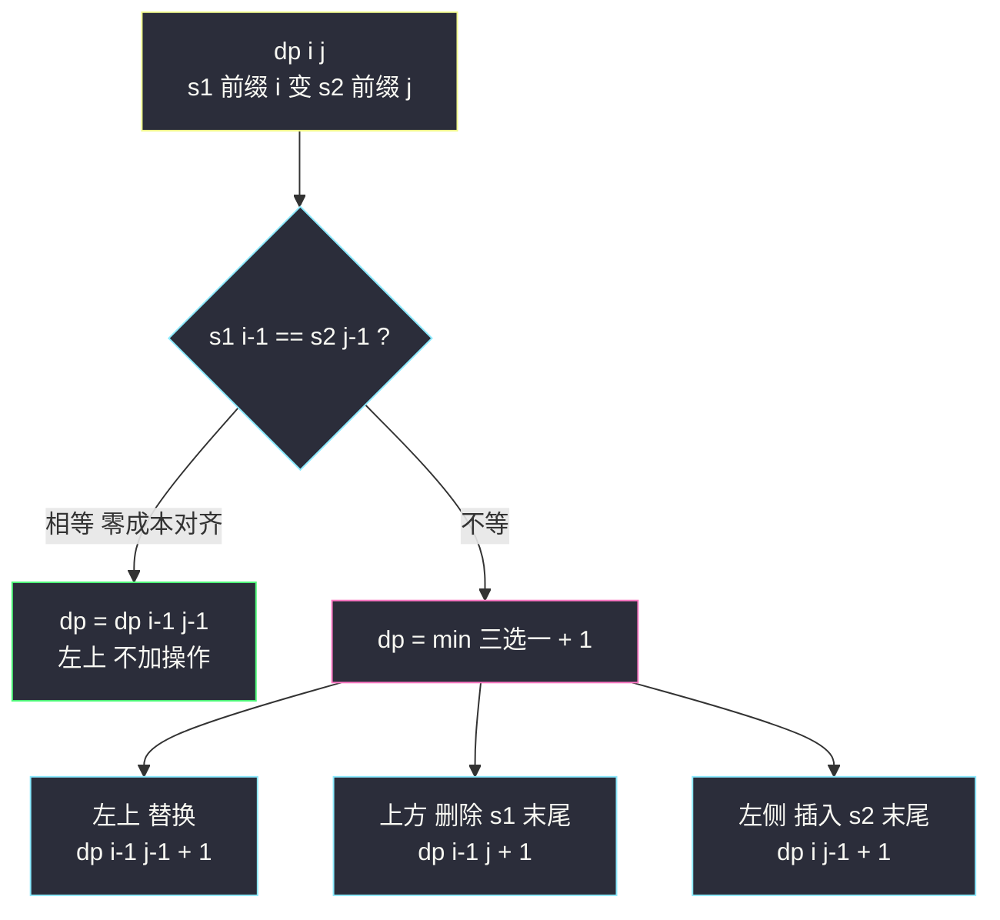
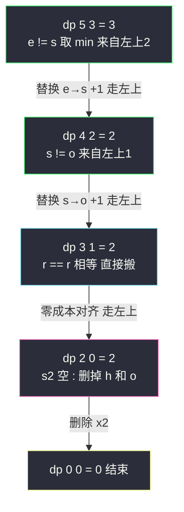

# 编辑距离（双串 DP 封神之作：插入/删除/替换的统一账本）

## 一、问题描述

给你两个单词 `word1` 和 `word2`，返回将 `word1` 转换成 `word2` 所需的**最少操作数**。每次可以做三种操作：插入一个字符、删除一个字符、替换一个字符。

> 🔗 LeetCode 72：https://leetcode.cn/problems/edit-distance/

**示例 1**

```
输入：word1 = "horse", word2 = "ros"
输出：3
解释：horse → rorse (替换 h 为 r) → rose (删除 r) → ros (删除 e)
```

**示例 2**

```
输入：word1 = "intention", word2 = "execution"
输出：5
解释：intention → inention (删除 t) → exention (替换 i 为 e)
     → exection (替换 n 为 c) → execution (插入 u)... 共 5 步
```

**直观理解**

两个串的「相似度」怎么量化？编辑距离给了一个经典答案：**把一个串改成另一个串最少要花几步操作**。它就是 git diff、DNA 序列比对、拼写纠错的数学模型。和 LCS（#1143）一样是**双串二维 DP**：两个可变参数 `i`、`j` → 二维表；但决策从「配不配对」升级成「插入/删除/替换三种操作选最便宜的」，是双串 DP 的天花板题。

---

## 二、暴力解法

### 直观思路

定义尝试 `f(i, j)`：`s1[前缀长度 i]` 变成 `s2[前缀长度 j]` 的最少操作数。看**两个前缀的末尾**：

- **末尾字符相等**：这对字符零成本对齐，`f(i,j) = f(i-1, j-1)`
- **末尾不等**：三种操作各试一遍取最小——**替换**（把 `s1[i-1]` 改成 `s2[j-1]`，双双回退）、**删除**（删掉 `s1[i-1]`，i 回退）、**插入**（在 s1 末尾补一个 `s2[j-1]`，j 回退）

```java
// 暴力递归：s1 前缀长度 i 变成 s2 前缀长度 j 的最少操作数
public static int editDistance1(char[] s1, char[] s2, int i, int j) {
    // s1 空了：只能把 s2 剩下的 j 个字符全部插入
    if (i == 0) {
        return j;
    }
    // s2 空了：只能把 s1 剩下的 i 个字符全部删除
    if (j == 0) {
        return i;
    }
    if (s1[i - 1] == s2[j - 1]) {
        // 末尾相等，零成本对齐
        return editDistance1(s1, s2, i - 1, j - 1);
    }
    int replace = 1 + editDistance1(s1, s2, i - 1, j - 1); // 替换
    int delete  = 1 + editDistance1(s1, s2, i - 1, j);     // 删除 s1 末尾
    int insert  = 1 + editDistance1(s1, s2, i, j - 1);     // 末尾插入 s2[j-1]
    return Math.min(replace, Math.min(delete, insert));
}
```

### 复杂度

- **时间**：`O(3^(n+m))` 级别，指数爆炸
- **空间**：`O(n + m)` 递归栈

### 🔴 瓶颈在哪里

`(i, j)` 组合大量重复展开（删除后插入、插入后删除会绕回同一状态）。状态总数只有 `(n+1)*(m+1)` 个 → 加缓存 / 直接填表。

---

## 三、优化探索

### 3.1 可变参数分析（对齐 class068 Code02）

课上方法论：**几个可变参数就是几维表**。`(i, j)` 两个参数 → `dp[i][j]` 二维表：

| dp 定义 | 含义 |
|---------|------|
| `dp[i][j]` | `s1` 前缀长度 `i` 变成 `s2` 前缀长度 `j` 的**最少操作数** |

课上给的是通用代价版（插入代价 a、删除代价 b、替换代价 c），本题 a=b=c=1。

### 3.2 转移方程推导（核心：三种操作各对应哪一格）

看 `s1[i-1]` 与 `s2[j-1]`（两前缀的末尾字符）：

**末尾相等**：这对字符直接对齐，不用花钱——

```
dp[i][j] = dp[i-1][j-1]
```

**末尾不等**：三种操作，每一种都把问题「变小」，落在三个不同格子：

| 操作 | 物理动作 | 转移到的子问题 | 方向 |
|------|---------|---------------|------|
| 替换 | 把 `s1[i-1]` 改成 `s2[j-1]`，两边末尾都对齐了 | `dp[i-1][j-1] + 1` | 左上 |
| 删除 | 删掉 `s1[i-1]`（s1 短了，s2 不变） | `dp[i-1][j] + 1` | 上 |
| 插入 | 在 s1 末尾**插入** `s2[j-1]`（新字符立刻和 s2 末尾对齐消掉，s2 短了） | `dp[i][j-1] + 1` | 左 |

```
dp[i][j] = min( dp[i-1][j-1] + 1,   // 替换
                dp[i-1][j]   + 1,   // 删除
                dp[i][j-1]   + 1 )  // 插入
```

**为什么不重不漏**：任何最优方案处理到「末尾对齐」这一步，要么末尾字符本来就相同，要么第一步操作必然是这三种之一——按**第一个动作**分类，三类互斥且穷尽。

### 3.3 初始化（边界行/列的账本含义）

- `dp[0][0] = 0`：空前缀变空前缀，0 步
- `dp[i][0] = i`：s1 有 `i` 个字符、s2 为空 → 只能**全删**，i 步
- `dp[0][j] = j`：s1 为空、s2 有 `j` 个字符 → 只能**全插**，j 步

### 3.4 依赖方向与遍历顺序

`dp[i][j]` 依赖**左上、上、左**三格 → 双重循环 `i` 从 1 到 n、`j` 从 1 到 m，从上到下、从左到右填表。

### 3.5 关键问题

| 问题 | 答案 |
|------|------|
| 末尾相等时敢不敢「直接对齐，不加操作」？ | 敢。反证：若最优解还要动这对字符，改成直接对齐不会更差（课上同 LCS 配对引理） |
| 末尾相等时还要不要也看看插入/删除？ | 不必。`dp[i-1][j-1] ≤ dp[i-1][j] + 1` 且 `≤ dp[i][j-1] + 1`（多做一步只会更贵），左上 + 0 永远不劣 |
| 插入和删除是不是「同一件事的两面」？ | 是。在 s1 插入一个字符 = 在 s2 删除一个字符，所以 `dist(s1,s2) = dist(s2,s1)`，表是对称逻辑 |
| 结果会超过 int 吗？ | 不会，`n, m ≤ 500`，答案最多 `n + m = 1000` |
| 课上通用版怎么写？ | class068 Code02 的 `editDistance2(str1, str2, a, b, c)`：三种操作各带代价，边界 `dp[i][0] = i*b`、`dp[0][j] = j*a`，转移同骨架 |

### 3.6 一句话核心

> **末尾相等白对齐回左上；不等时左上替换、上删、左插，三格取最小再 +1。**



---

## 四、代码实现

### Java（主解：严格位置依赖 DP，对齐 class068 Code02）

```java
// 编辑距离
// 返回将 word1 转换成 word2 所需的最少操作数
// 插入、删除、替换一个字符均算一次操作
// 测试链接 : https://leetcode.cn/problems/edit-distance/
// 对齐 class068 Code02_EditDistance（课上为通用代价 a/b/c 版，本题 a=b=c=1）
public class Solution {

    // 时间复杂度 O(n*m)，空间复杂度 O(n*m)
    public int minDistance(String word1, String word2) {
        char[] s1 = word1.toCharArray();
        char[] s2 = word2.toCharArray();
        int n = s1.length, m = s2.length;
        // dp[i][j] : s1 前缀长度 i 变成 s2 前缀长度 j 的最少操作数
        int[][] dp = new int[n + 1][m + 1];
        for (int i = 1; i <= n; i++) {
            dp[i][0] = i; // s2 空 : 全删
        }
        for (int j = 1; j <= m; j++) {
            dp[0][j] = j; // s1 空 : 全插
        }
        // 依赖方向 : 左上 / 上 / 左 → 从上到下、从左到右
        for (int i = 1; i <= n; i++) {
            for (int j = 1; j <= m; j++) {
                if (s1[i - 1] == s2[j - 1]) {
                    // 末尾相等 : 零成本对齐，回左上
                    dp[i][j] = dp[i - 1][j - 1];
                } else {
                    // 替换(左上) / 删除(上) / 插入(左) 三选一 + 1
                    dp[i][j] = Math.min(Math.min(dp[i - 1][j - 1], dp[i - 1][j]),
                            dp[i][j - 1]) + 1;
                }
            }
        }
        return dp[n][m];
    }
}
```

### Java（进阶：空间压缩到一维，对齐 class068 Code02 的 editDistance3）

```java
// 每行只依赖上一行 + 左上角 → 一维数组滚动，leftUp 备份左上角
// 时间复杂度 O(n*m)，空间复杂度 O(min(n,m))
public class Solution {

    public int minDistance(String word1, String word2) {
        char[] s1 = word1.toCharArray();
        char[] s2 = word2.toCharArray();
        int n = s1.length, m = s2.length;
        int[] dp = new int[m + 1];
        for (int j = 1; j <= m; j++) {
            dp[j] = j; // 第 0 行 : 全插
        }
        for (int i = 1, leftUp, backUp; i <= n; i++) {
            leftUp = dp[0];         // 上一行的 dp[0] = i-1，正是本格左上角
            dp[0] = i;              // 本行第 0 列 : 全删 i 个
            for (int j = 1; j <= m; j++) {
                backUp = dp[j];     // 先备份 : 下一轮的 leftUp
                if (s1[i - 1] == s2[j - 1]) {
                    dp[j] = leftUp;
                } else {
                    dp[j] = Math.min(Math.min(leftUp, dp[j]), dp[j - 1]) + 1;
                }
                leftUp = backUp;
            }
        }
        return dp[m];
    }
}
```

### Python

```python
# 二维 dp 表（主解同思路）
class Solution:
    def minDistance(self, word1: str, word2: str) -> int:
        n, m = len(word1), len(word2)
        # dp[i][j] : word1 前缀 i 变成 word2 前缀 j 的最少操作数
        dp = [[0] * (m + 1) for _ in range(n + 1)]
        for i in range(1, n + 1):
            dp[i][0] = i
        for j in range(1, m + 1):
            dp[0][j] = j
        for i in range(1, n + 1):
            for j in range(1, m + 1):
                if word1[i - 1] == word2[j - 1]:
                    dp[i][j] = dp[i - 1][j - 1]      # 零成本对齐
                else:
                    dp[i][j] = 1 + min(
                        dp[i - 1][j - 1],  # 替换
                        dp[i - 1][j],      # 删除
                        dp[i][j - 1],      # 插入
                    )
        return dp[n][m]
```

---

## 五、具体例子演示

以 `word1 = "horse"`、`word2 = "ros"` 为例，dp 表尺寸 `6 × 4`（行 = s1 前缀长度，列 = s2 前缀长度）。

### 第 0 行 / 第 0 列初始化

```
        ""  r   o   s
    ""   0  1   2   3      ← dp[0][j] = j（s1 空，全插）
    h    1  ?   ?   ?
    o    2  ?   ?   ?
    r    3  ?   ?   ?
    s    4  ?   ?   ?
    e    5  ?   ?   ?      ← dp[i][0] = i（s2 空，全删）
```

### dp 表逐格填充（标 ★ 的格是「不等」分支）

| 格 | 字符 | 分支 | 计算过程 | 值 |
|----|------|------|----------|-----|
| dp[1][1] | h vs r ★ | min(左上0, 上1, 左1)+1 | min+1 = 1 | **1** |
| dp[1][2] | h vs o ★ | min(左上1, 上2, 左1)+1 | 1+1 | 2 |
| dp[1][3] | h vs s ★ | min(左上2, 上3, 左2)+1 | 2+1 | 3 |
| dp[2][1] | o vs r ★ | min(左上1, 上1, 左2)+1 | 1+1 | 2 |
| dp[2][2] | **o vs o 相等** | dp[1][1] 直接搬 | = 1 | **1** |
| dp[2][3] | o vs s ★ | min(左上1, 上3, 左1)+1 | 1+1 | 2 |
| dp[3][1] | **r vs r 相等** | dp[2][0] = 2 | = 2 | **2** |
| dp[3][2] | r vs o ★ | min(左上1, 上1, 左2)+1 | 1+1 | 2 |
| dp[3][3] | r vs s ★ | min(左上1, 上2, 左2)+1 | 1+1 | 2 |
| dp[4][1] | s vs r ★ | min(左上3, 上3, 左0)+1 | 0+1 | **1** |
| dp[4][2] | s vs o ★ | min(左上2, 上2, 左1)+1 | 1+1 | 2 |
| dp[4][3] | **s vs s 相等** | dp[3][2] = 2 | = 2 | **2** |
| dp[5][1] | e vs r ★ | min(左上4, 上4, 左1)+1 | 1+1 | 2 |
| dp[5][2] | e vs o ★ | min(左上2, 上2, 左2)+1 | 2+1 | 3 |
| dp[5][3] | e vs s ★ | min(左上2, 上2, 左3)+1 | 2+1 | **3** |

最终 `dp[5][3] = 3` → 返回 **3**。完整表：

```
        ""  r   o   s
    ""   0  1   2   3
    h    1  1   2   3
    o    2  2   1   2
    r    3  2   2   2
    s    4  1   2   2
    e    5  2   3   3
```

### 回溯还原操作序列（从 dp[5][3] 逆着依赖方向走）



从终点逆推得到方案：`h→r 替换`（h 对 r 位置）、再 `o 对 o`、`r 对 r` 零成本对齐、`s 替换成 o`、`e 删除`——共 3 步，与题目解释一致。

---

## 六、复杂度分析

| 版本 | 时间 | 空间 | 说明 |
|------|------|------|------|
| 暴力递归 | `O(3^(n+m))` | `O(n+m)` | 指数展开 |
| 二维 dp（主解） | `O(n*m)` | `O(n*m)` | 每格 O(1) 转移，可回溯还原方案 |
| 空间压缩 | `O(n*m)` | `O(min(n,m))` | 一维滚动 + leftUp 备份 |

`n, m ≤ 500`，主解约 25 万次转移，毫无压力。

---

## 七、方法对比与总结

### 双串 DP 家族：同一张表，不同转移

| 题 | 相等时 | 不等时 | 语义 |
|----|--------|--------|------|
| #1143 LCS（站内已写） | 左上 + 1 | max(上, 左) | 求**最长** |
| #72 编辑距离 | 左上（+0） | min(左上, 上, 左) + 1 | 求**最少**，多了「替换」分支 |
| #583 两串删除操作 | 左上（+0） | min(上, 左) + 1 | 编辑距离砍掉「替换」 |
| #115 不同子序列 | 上 + 左上 | 上 | **计数**（不是最值） |

一句话：**末尾相等/不等是双串题的第一层分叉；操作集合决定转移分支；min/max/+ 决定求什么。**

### 易错点

1. **三种操作的方向搞反**：删除 s1 末尾 → i 回退（上）；插入的字符是 `s2[j-1]` → j 回退（左）。方向反了表就废。
2. **边界忘乘代价语义**：本题 a=b=c=1 所以 `dp[i][0]=i`；通用版是 `dp[i][0]=i*b`、`dp[0][j]=j*a`（class068）。
3. **相等时多余地取 min**：逻辑不错但白白慢一点，更重要的是暴露「没想清为什么左上不劣」。
4. **空间压缩时左上角被覆盖**：先 `backUp = dp[j]` 再更新，`leftUp = backUp` 收尾（与 LCS 同一技巧）。

### 模板口诀

> **尾等白走左上；尾异三格取小加一——左上替换、上删、左插。**

---

## 八、举一反三

| 题目 | 链接 | 迁移点 |
|------|------|--------|
| 583. 两个字符串的删除操作 | https://leetcode.cn/problems/delete-operation-for-two-strings/ | 编辑距离砍掉「替换」，只留插入/删除（站内已写题解） |
| 712. 两个字符串的最小 ASCII 删除和 | https://leetcode.cn/problems/minimum-ascii-delete-sum-for-two-strings/ | 删除代价从 1 变成字符 ASCII 值，骨架不变 |
| 72 通式 | 剑指 Offer II 020（回文子字符串）之外，课上 class068 Code02 | a/b/c 通用代价版：改初值即可 |
| 1143. 最长公共子序列 | https://leetcode.cn/problems/longest-common-subsequence/ | 同一张表的开端（站内已写题解） |
| 161. 相隔为 1 的编辑距离 | https://leetcode.cn/problems/one-edit-distance/ | 只问「距离是不是 1」，可 O(n) 特判 |

**迁移一句**：双串 DP 看到「把 A 变成 B 最少几步 / 最多保留多少 / 有多少种方式」，先画 `(i, j)` 前缀表，再按「末尾相等 / 不等 × 操作集合」穷举转移分支——编辑距离是这套框架的完全体。
