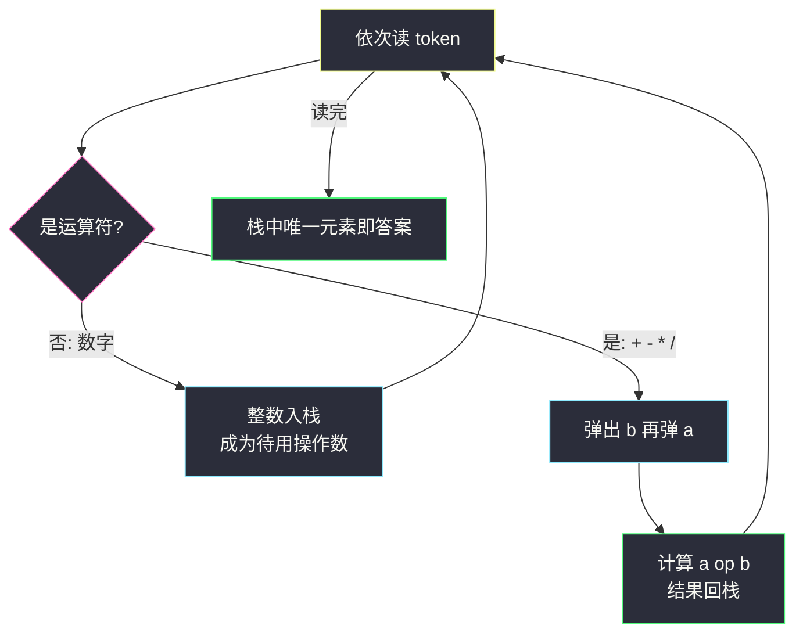
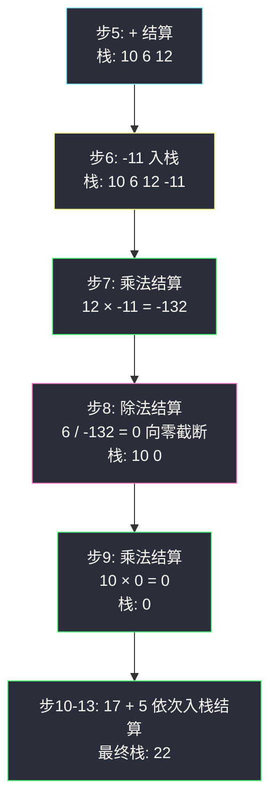

# 逆波兰表达式求值（后缀表达式 + 栈求值）

## 一、问题描述

给你一个字符串数组 `tokens`，表示一个根据**逆波兰表示法**（后缀表达式）表示的算术表达式，请你求出该表达式的值。

- 有效的运算符为 `+`、`-`、`*`、`/`。每个操作数可以是整数，也可以是另一个表达式。
- 两个整数之间的**除法总是向零截断**（truncate toward zero，即去掉小数部分向 0 靠拢）。
- 保证表达式合法，不存在除零，中间结果与最终结果都落在 32 位整数范围内。

> 🔗 LeetCode 150：https://leetcode.cn/problems/evaluate-reverse-polish-notation/
>
> 约束：`1 <= tokens.length <= 10^4`；`tokens[i]` 是运算符或 `[-200, 200]` 的整数。

**示例 1**

```
输入：tokens = ["2","1","+","3","*"]
输出：9
解释：该表达式转化为常见中缀算术表达式为：((2 + 1) * 3) = 9
```

**示例 2**

```
输入：tokens = ["10","6","9","3","+","-11","*","/","*","17","+","5","+"]
输出：22
解释：中缀形式为 ((10 * (6 / ((9 + 3) * -11))) + 17) + 5 = 22
```

**直观理解**

中缀表达式 `2 + 3 * 4` 之所以难算，是因为有**优先级**和**括号**：算到 `+` 时不能立刻结算，得先等乘法。逆波兰（后缀）表达式把运算符**挪到两个操作数后面**——`2 3 4 * +`——运算符一出现，它的两个操作数**必然刚刚就位**，拿到就能结算，天然无需括号、无需优先级。这正是当年为计算机发明的表达式写法：一台只会「压数、弹数结算」的栈机就能算。本题课源码未收录原码，骨架对齐 `class039` 的表达式求值系列（`Code01_BasicCalculatorIII`：操作数集合 + 遇运算符结算），逆波兰相当于把中缀版的优先级判断整个省掉的「无脑版」。

---

## 二、暴力解法（每轮重扫，找第一个运算符就地结算）

### 直观思路

完全模拟人手算：每轮从左往右扫描，找到**第一个**运算符位置 `i`——按后缀规则，它的两个操作数必然就是紧挨着的 `tokens[i-2]` 和 `tokens[i-1]`。把这三个位置替换成一个计算结果，数组缩短 2 格；重复直到只剩一个元素，它就是答案。

```java
class Solution {
    public int evalRPN(String[] tokens) {
        List<String> list = new ArrayList<>(Arrays.asList(tokens));
        while (list.size() > 1) {
            int i = 0;
            while (!isOp(list.get(i))) {          // 找第一个运算符
                i++;
            }
            int b = Integer.parseInt(list.get(i - 1));   // 右操作数
            int a = Integer.parseInt(list.get(i - 2));   // 左操作数
            int res = calc(a, b, list.get(i));
            list.remove(i);                        // 三格并一格
            list.remove(i - 1);
            list.set(i - 2, String.valueOf(res));
        }
        return Integer.parseInt(list.get(0));
    }

    private boolean isOp(String t) {
        return t.equals("+") || t.equals("-") || t.equals("*") || t.equals("/");
    }

    private int calc(int a, int b, String op) {
        switch (op) {
            case "+": return a + b;
            case "-": return a - b;
            case "*": return a * b;
            default:  return a / b;
        }
    }
}
```

### 复杂度

- **时间**：`O(n²)`——每轮 O(n) 扫描 + 删格挪移，最多 (n-1)/2 轮
- **空间**：`O(n)` 列表副本

### 🔴 瓶颈在哪里

1. **已结算的前缀被反复扫**：每轮都从头找运算符，其实结算过的部分再也轮不到；
2. `remove` / `set` 整体挪动字符串数组，常数大还容易写出边界 bug；
3. 浪费的本质：第一个运算符之前的内容全是操作数，它们早已「就位」，应该**用一个容器把它们托住**，算完一格就收一格——那就是栈。

---

## 三、优化探索（核心章节）

### 3.1 观察特征

| 特征 | 说明 |
|------|------|
| 运算符出现顺序 = 计算顺序 | 后缀编码了优先级，见运算符即可结算，无需前瞻 |
| 操作数「刚好就位」 | 运算符的两个操作数是**最近生成的两个值**——一个「只在一端进出」的容器完美匹配 |
| 结算结果变新操作数 | 算完的中间结果压回去，继续参与后续运算，天然的栈循环 |
| token 只有一遍 | 顺序流式处理，不存在「回头看」，一遍扫完出答案 |

### 3.2 暴力 → 优化：栈一遍流式结算

```
evalRPN:
    stack = 空栈
    for t in tokens:
        if t 是运算符:
            b = stack.pop()        ← 后弹的是右操作数
            a = stack.pop()        ← 先弹的是左操作数
            stack.push(a t b)      ← 结算结果回栈，成为新操作数
        else:
            stack.push(整数 t)
    return stack.pop()             ← 唯一剩的就是答案
```

**不变式**：任意时刻，栈中（从底到顶）恰好是「已算完的中间结果，按生成先后排列」。遇运算符弹两个、压一个，不变式保持；结束时栈里必剩唯一结果。



### 3.3 关键推导问题

| 问题 | 答案 |
|------|------|
| 为什么先弹的是**右**操作数？ | 左操作数更早入栈，被右操作数压在下面。例：`6 132 /` 想算 6÷132，6 先压、132 后压，弹栈顺序是 132（右）、6（左）。减法除法对顺序敏感，这里搞反是本题第二大坑 |
| 除法「向零截断」什么意思？ | 商的小数部分直接扔掉、向 0 靠拢。`7 / (-2)` 数学值 -3.5，截断为 **-3**。Java 的 `/` 对 int 天然就是这个语义；Python 的 `//` 是**向下取整**得 -4，**必须改写**为 `int(a / b)` |
| 怎么区分负数 token 和减号？ | `"-"` 是运算符、`"-11"` 是数字——只差一个字符，**必须整串 equals 比较**，不能用首字符判断，否则 `"-11"` 首字符是 `-` 会被误判 |
| 中间结果会溢出吗？ | 题目保证所有中间结果与最终结果都在 32 位 int 范围内，直接 `int` 运算即可 |
| 后缀为什么不需要括号？ | 括号与优先级的本质是「控制结算时机」；后缀直接把结算时机编码进了顺序——谁的运算符先出现谁先算 |
| 栈最深处多少？ | 全是数字时达 `⌈n/2⌉ + 1` 个，量级 `O(n)`，不会退化 |

### 3.4 一句话核心

> **数字进栈候着，运算符一到：弹二、结算、压回——后缀表达式就是给栈机量身定做的指令流。**

---

## 四、代码实现详解

### Java（主解：ArrayDeque 一遍流式结算）

```java
// 逆波兰（后缀）表达式求值
// 测试链接 : https://leetcode.cn/problems/evaluate-reverse-polish-notation/
// 骨架对齐 class039 表达式求值系列（Code01_BasicCalculatorIII 的"遇运算符结算"）
class Solution {
    public int evalRPN(String[] tokens) {
        Deque<Integer> stack = new ArrayDeque<>();
        for (String t : tokens) {
            switch (t) {
                case "+":
                    stack.push(stack.pop() + stack.pop());
                    break;
                case "-": {
                    int b = stack.pop(), a = stack.pop();
                    stack.push(a - b);
                    break;
                }
                case "*":
                    stack.push(stack.pop() * stack.pop());
                    break;
                case "/": {
                    int b = stack.pop(), a = stack.pop();
                    stack.push(a / b);   // Java 整数除法天然向零截断
                    break;
                }
                default:
                    stack.push(Integer.parseInt(t));
            }
        }
        return stack.pop();
    }
}
```

两个细节：`+` 和 `*` 满足交换律，连弹两次直接算，顺序无所谓；`-` 和 `/` 必须先接住 `b`（右）再接 `a`（左）。负数 token 靠 `default` 分支兜底——只有四个运算符精确匹配 case，其余整串必然是数字。

### Python（同思路，注意除法陷阱）

```python
class Solution:
    def evalRPN(self, tokens: list[str]) -> int:
        stack: list[int] = []
        for t in tokens:
            if t in ("+", "-", "*", "/"):
                b = stack.pop()          # 右操作数
                a = stack.pop()          # 左操作数
                if t == "+":
                    stack.append(a + b)
                elif t == "-":
                    stack.append(a - b)
                elif t == "*":
                    stack.append(a * b)
                else:
                    stack.append(int(a / b))   # 向零截断！不是 a // b
            else:
                stack.append(int(t))
        return stack[0]
```

**`int(a / b)` 不能写 `a // b`**：`//` 向下取整，负商时差 1（见第五章专项演示）。

---

## 五、具体例子演示

### 例 1：`["2","1","+","3","*"]`，答案 `9`

| 步 | token | 动作 | 栈（底→顶） |
|----|-------|------|-------------|
| 1 | 2 | 入栈 | [2] |
| 2 | 1 | 入栈 | [2, 1] |
| 3 | + | 弹 1、2，算 2+1=3 压回 | [3] |
| 4 | 3 | 入栈 | [3, 3] |
| 5 | * | 弹 3、3，算 3*3=9 压回 | [9] |

输出 **9** ✅

### 例 2：`["10","6","9","3","+","-11","*","/","*","17","+","5","+"]`，答案 `22`

对应中缀 `((10 * (6 / ((9 + 3) * -11))) + 17) + 5`，逐 token 跟踪：

| 步 | token | 动作 | 栈（底→顶） |
|----|-------|------|-------------|
| 1 | 10 | 入栈 | [10] |
| 2 | 6 | 入栈 | [10, 6] |
| 3 | 9 | 入栈 | [10, 6, 9] |
| 4 | 3 | 入栈 | [10, 6, 9, 3] |
| 5 | + | 9+3=12 | [10, 6, 12] |
| 6 | -11 | 入栈（负数 token，整串识别） | [10, 6, 12, -11] |
| 7 | * | 12 × (-11) = -132 | [10, 6, -132] |
| 8 | / | 6 / (-132) = **0**（向零截断） | [10, 0] |
| 9 | * | 10 × 0 = 0 | [0] |
| 10 | 17 | 入栈 | [0, 17] |
| 11 | + | 0+17=17 | [17] |
| 12 | 5 | 入栈 | [17, 5] |
| 13 | + | 17+5=22 | [22] |

输出 **22** ✅ 第 8 步是本题暗藏的除法考点。



### 例 3：除法截断专项演示 `["7","-2","/"]`

- 数学值：7 ÷ (-2) = -3.5
- **Java**：`7 / -2` 整数除法直接得 **-3** ✅
- **Python**：`7 // -2` 得 **-4** ❌（向下取整到 -4）；正确写法 `int(7 / -2)` = **-3** ✅

同一段代码换个语言结果差 1——这是本题最经典的跨语言坑，判题时负数除法必被安排。

---

## 六、复杂度分析

| 项目 | 暴力逐轮重扫 | 栈一遍结算（主解） |
|------|--------------|---------------------|
| 时间 | `O(n²)` | **`O(n)`**：每个 token 处理 O(1)，无回头路 |
| 空间 | `O(n)` 列表副本 | `O(n)` 栈，最深处 ⌈n/2⌉+1 个操作数 |

栈版每个 token 只被触碰一次，数字进栈一次、运算符弹两个压一个——总量与 n 成正比，是最优渐进复杂度。

---

## 七、方法对比与总结

### 写法对比

| | 暴力逐轮重扫 | 栈一遍结算（主解） |
|--|--------------|---------------------|
| 时间 | `O(n²)` | `O(n)` |
| 实现 | 要管理数组删格挪移 | 一遍 switch 直出 |
| 思路定位 | 讲给人听的模拟 | 讲给机器听的指令流 ✅ |

### 易错点

1. **Python 用 `//` 算除法**：负商向零截断 vs 向下取整差 1，必须 `int(a / b)`。
2. **减法/除法操作数顺序颠倒**：先弹的是右操作数 `b`，`a - b`、`a / b` 别写成 `b - a`。
3. **用首字符判断 token 类型**：`"-11"` 首字符是 `-`，会被误判为减号——一律整串比较。
4. **Java switch 忘 break**：穿透到 default 把运算符当数字 parse，直接抛 NumberFormatException。
5. **返回时用 `peek` 还是 `pop`**：都行，但保证结束时栈里只剩一个元素，若剩多个说明题读错或代码有 bug。

### 模板口诀

> **数字进栈，运算弹双；先弹是右，结算回舱；除法向零，Java 无恙、Python 提防。**

---

## 八、举一反三

| 题目 | 链接 | 迁移点 |
|------|------|--------|
| 394. 字符串解码 | https://leetcode.cn/problems/decode-string/ | 同为「栈处理编码结构」：数字 + 方括号嵌套，本站已有题解（互引） |
| 224. 基本计算器 | https://leetcode.cn/problems/basic-calculator/ | 中缀 + 括号 + 正负号，栈处理「结算时机」的进阶 |
| 227. 基本计算器 II | https://leetcode.cn/problems/basic-calculator-ii/ | 中缀四则运算的优先级处理，与本题「无优先级」形成对照 |
| 772. 基本计算器 III | https://leetcode.cn/problems/basic-calculator-iii/ | class039 `Code01_BasicCalculatorIII` 原题：括号嵌套 + 四则（会员题），递归下降版结算骨架 |
| 20. 有效的括号 | https://leetcode.cn/problems/valid-parentheses/ | 栈家族入门题（站内已有题解），同款「最近匹配」直觉 |

**迁移一句**：表达式题的万变不离其宗——**括号和优先级本质都是「控制结算时机」**。后缀把时机编码进顺序（本题秒杀），中缀要栈或递归显式管理时机；吃透这一点，224/227/772 都是同一道题换了皮。
