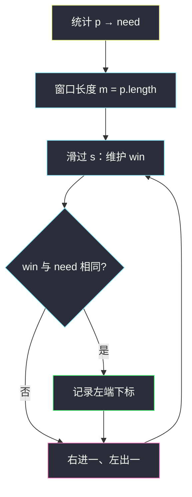
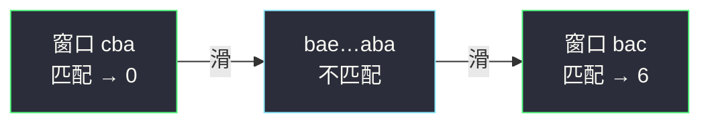

# 找到字符串中所有字母异位词（定长窗口 + 计数）

## 一、问题描述

给定两个字符串 `s` 和 `p`，找到 `s` 中所有 `p` 的**字母异位词**的子串，返回这些子串的**起始索引**（任意顺序即可）。

字母异位词：字母相同、出现次数也相同，但顺序可以不同。例如 `"abc"` 的异位词有 `"acb"`、`"bac"` 等。

> 🔗 LeetCode 438：https://leetcode.cn/problems/find-all-anagrams-in-a-string/

**示例 1（经典）**

```
输入：s = "cbaebabacd", p = "abc"
输出：[0, 6]
解释：
- 下标 0 开始的子串 "cba" 是 "abc" 的异位词
- 下标 6 开始的子串 "bac" 是 "abc" 的异位词
```

**示例 2**

```
输入：s = "abab", p = "ab"
输出：[0, 1, 2]
解释："ab" / "ba" / "ab" 都是异位词。
```

**直观理解**

在 `s` 上找所有长度 = `p.length()` 的窗口，窗口内字母频次与 `p` 完全一致。

---

## 二、暴力解法（入门）

### 直观思路

枚举每个起点 `i`，取出 `s[i .. i+|p|-1]`，排序后和排序后的 `p` 比较（或各自计数再比）。

```java
public List<Integer> findAnagrams(String s, String p) {
    List<Integer> ans = new ArrayList<>();
    int n = s.length(), m = p.length();
    if (n < m) return ans;
    char[] target = p.toCharArray();
    Arrays.sort(target);
    String key = new String(target);
    for (int i = 0; i <= n - m; i++) {
        char[] win = s.substring(i, i + m).toCharArray();
        Arrays.sort(win);
        if (key.equals(new String(win))) ans.add(i);
    }
    return ans;
}
```

### 复杂度

- **时间**：`O((n-m+1)·m log m)`，每个窗口排序。
- **空间**：`O(m)`。

### 🔴 瓶颈在哪里

相邻窗口只差一头一尾，字母计数几乎一样，却每次重新排序/重扫。  
`n` 到 `3×10⁴` 时偏慢，应**定长滑窗 + 差分更新计数**。

---

## 三、优化探索（核心章节）

### 3.1 观察特征

| 特征 | 说明 |
|------|------|
| 子串长度固定为 `\|p\|` | **定长滑动窗口** |
| 异位词 = 频次相同 | 维护 26 个小写字母计数即可 |
| 相邻窗口差 1 个字符 | `+进 −出`，O(1) 更新 |

### 3.2 暴力 → 优化：窗口计数对齐

1. 统计 `p` 的频次数组 `need[26]`。
2. 在 `s` 上维护同样长度的窗口频次 `win[26]`。
3. 先填满第一个窗口；之后每次右进一个、左出一个。
4. 若 `win` 与 `need` 完全相等 → 记录窗口左端下标。

比较两个长度 26 的数组是 `O(26)=O(1)`。



### 3.3 更快一档：用「还差几个字符」代替整表比对

维护 `diff`：还需要多少种「计数未对齐」的字母（或还差多少个字符，写法多种）。

常见写法：

- `need[c]`：`p` 中还需要的 `c` 的个数（初始为 `p` 的频次）。
- 右端进入字符 `x`：`need[x]--`；若从 `1→0` 说明多满足一种；若从 `0→-1` 说明多拿了。
- 左端踢出字符 `y`：`need[y]++`；对称更新。
- 当窗口内「有效匹配长度」或 `diff==0` 时记录答案。

下面代码用更直观的「双数组 + Arrays.equals」；面试讲清差分即可，进阶再上 `diff`。

### 3.4 一句话核心

> **定长窗口滑过 s，用计数表判断窗口是否为 p 的异位词；每次只更新进出的两个字符。**

---

## 四、代码实现详解

### Java（逐行说明）

```java
class Solution {
    public List<Integer> findAnagrams(String s, String p) {
        List<Integer> ans = new ArrayList<>();
        int n = s.length(), m = p.length();
        if (n < m) return ans;

        int[] need = new int[26];
        int[] win = new int[26];
        for (int i = 0; i < m; i++) {
            need[p.charAt(i) - 'a']++;
            win[s.charAt(i) - 'a']++;   // 先装第一个窗口 [0, m)
        }
        if (Arrays.equals(need, win)) ans.add(0);

        // i 是新进入窗口的右端下标；踢出的是 i - m
        for (int i = m; i < n; i++) {
            win[s.charAt(i) - 'a']++;
            win[s.charAt(i - m) - 'a']--;
            if (Arrays.equals(need, win)) {
                ans.add(i - m + 1);     // 窗口左端
            }
        }
        return ans;
    }
}
```

**变量含义**

| 变量 | 含义 |
|------|------|
| `need` | 模式串 `p` 的字母频次 |
| `win` | 当前长度为 `m` 的窗口频次 |
| `i` | 滑动时新进入的字符下标 |
| `i - m` | 刚好被踢出窗口的下标 |
| `i - m + 1` | 当前窗口左端（答案要的起始索引） |

**循环不变式**：进入 `for` 的第 `i` 轮之前，`win` 对应子串 `s[i-m .. i-1]`；更新后对应 `s[i-m+1 .. i]`。

### Java（diff 写法，少做 26 次比较）

```java
class Solution {
    public List<Integer> findAnagrams(String s, String p) {
        List<Integer> ans = new ArrayList<>();
        int n = s.length(), m = p.length();
        if (n < m) return ans;

        int[] cnt = new int[26]; // >0 表示还缺；<0 表示多拿
        for (int i = 0; i < m; i++) {
            cnt[p.charAt(i) - 'a']++;
            cnt[s.charAt(i) - 'a']--;
        }
        int diff = 0;
        for (int c : cnt) if (c != 0) diff++;

        if (diff == 0) ans.add(0);

        for (int i = m; i < n; i++) {
            int in = s.charAt(i) - 'a';
            // 进入 in：cnt[in] 减少 1
            if (cnt[in] == 1) diff--;      // 1→0，少一种不对齐
            else if (cnt[in] == 0) diff++; // 0→-1，多一种不对齐
            cnt[in]--;

            int out = s.charAt(i - m) - 'a';
            // 踢出 out：cnt[out] 增加 1
            if (cnt[out] == -1) diff--;    // -1→0
            else if (cnt[out] == 0) diff++; // 0→1
            cnt[out]++;

            if (diff == 0) ans.add(i - m + 1);
        }
        return ans;
    }
}
```

### Python（双数组版）

```python
class Solution:
    def findAnagrams(self, s: str, p: str) -> list[int]:
        n, m = len(s), len(p)
        if n < m:
            return []
        need = [0] * 26
        win = [0] * 26
        for i in range(m):
            need[ord(p[i]) - 97] += 1
            win[ord(s[i]) - 97] += 1
        ans = [0] if need == win else []
        for i in range(m, n):
            win[ord(s[i]) - 97] += 1
            win[ord(s[i - m]) - 97] -= 1
            if need == win:
                ans.append(i - m + 1)
        return ans
```

---

## 五、具体例子演示

`s = "cbaebabacd"`，`p = "abc"`，`m = 3`。

`need`: a:1, b:1, c:1

| 窗口 | 子串 | win | 匹配? | 左端 |
|------|------|-----|-------|------|
| [0,3) | cba | a1 b1 c1 | ✅ | 0 |
| [1,4) | bae | a1 b1 e1 | ❌ | — |
| [2,5) | aeb | a1 b1 e1 | ❌ | — |
| [3,6) | eba | a1 b1 e1 | ❌ | — |
| [4,7) | bab | a1 b2 | ❌ | — |
| [5,8) | aba | a2 b1 | ❌ | — |
| [6,9) | bac | a1 b1 c1 | ✅ | 6 |
| [7,10) | acd | a1 c1 d1 | ❌ | — |

答案：`[0, 6]`。



---

## 六、复杂度分析

| 方法 | 时间 | 空间 | 说明 |
|------|------|------|------|
| 每窗口排序 | `O(n·m log m)` | `O(m)` | 重复排序 |
| 定长窗 + 双数组 | `O(n·Σ)`，Σ=26 | `O(Σ)` | equals 每次 O(26) |
| 定长窗 + diff | `O(n)` | `O(Σ)` | 每次只改进出字符 |

---

## 七、方法对比与总结

| | 排序比对 | 计数滑窗 |
|--|----------|----------|
| 想法 | 每个窗口排完再比 | 频次数组差分更新 |
| 适用 | 理解题意 | **本题默认解** |

**易错点**

1. `s` 比 `p` 短时直接返回空列表。
2. 答案是**起始下标** `i - m + 1`，不是右端 `i`。
3. 踢出下标是 `i - m`（窗口右端到 `i` 时，左端是 `i-m+1`，踢掉旧左端 `i-m`）。
4. 只含小写字母才能开 `int[26]`；若题面扩大字符集改用 `HashMap`。

**模板（定长 + 计数）**

```java
// 装第一个窗口 → 判断
// for i = m .. n-1:
//   win[in]++ ; win[out]-- ; 判断
```

---

## 八、举一反三

| 题目 | 关系 |
|------|------|
| [567. 字符串的排列](https://leetcode.cn/problems/permutation-in-string/) | 几乎同题：判断 `s2` 是否包含 `s1` 的异位词（有一个即可） |
| [76. 最小覆盖子串](https://leetcode.cn/problems/minimum-window-substring/) | **变长**窗口 + 计数，覆盖所需字符后收缩 |
| [3. 无重复字符的最长子串](https://leetcode.cn/problems/longest-substring-without-repeating-characters/) | 变长窗口 + 字符集合/计数 |
| [643. 子数组最大平均数 I](https://leetcode.cn/problems/maximum-average-subarray-i/) | 同属定长窗口，统计量从「和」换成「频次」 |

**思想迁移**

- 「长度固定 + 某种多重集合相等」→ 定长滑窗 + 计数。
- 「最短/最长且满足字符约束」→ 变长滑窗 + 计数（76 / 3）。
