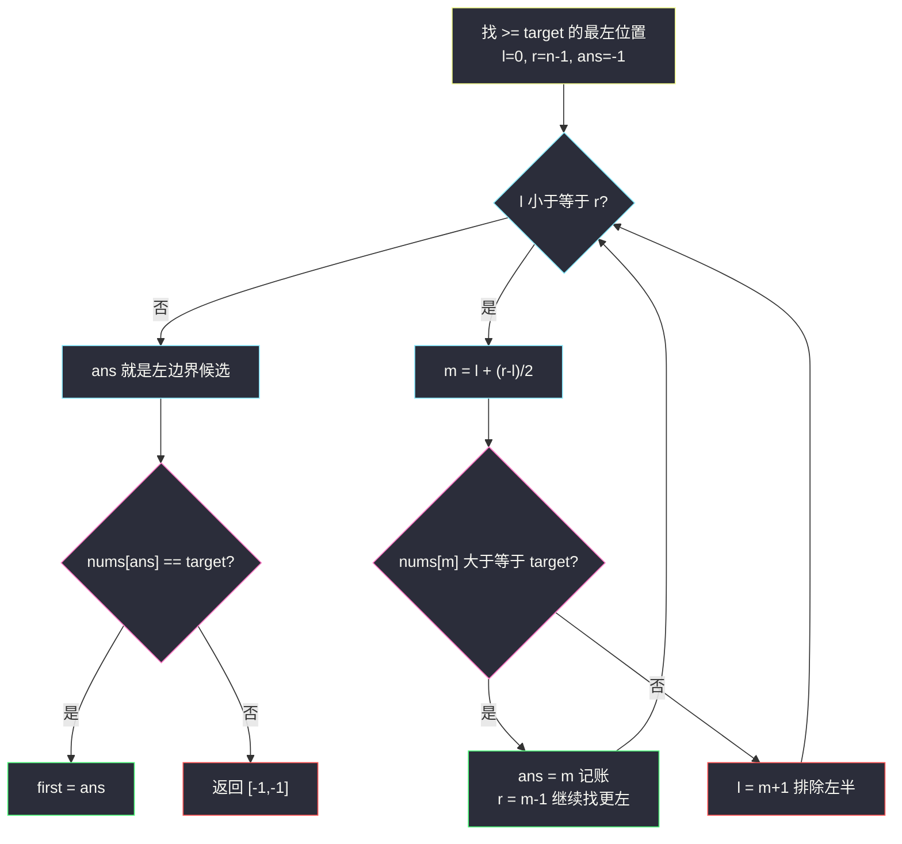
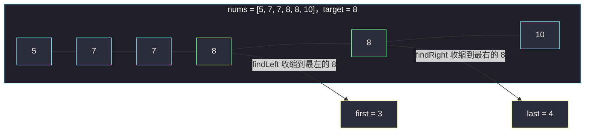

# 在排序数组中查找元素的第一个和最后一个位置（左右边界二分）

## 一、问题描述

给你一个按照**非递减顺序**排列的整数数组 `nums`，和一个目标值 `target`。请你找出给定目标值在数组中的**开始位置和结束位置**。

如果数组中不存在目标值 `target`，返回 `[-1, -1]`。

要求设计并实现时间复杂度为 `O(log n)` 的算法解决此问题。

> 🔗 LeetCode 34：https://leetcode.cn/problems/find-first-and-last-position-of-element-in-sorted-array/

**示例 1**

```
输入：nums = [5,7,7,8,8,10], target = 8
输出：[3,4]
```

**示例 2**

```
输入：nums = [5,7,7,8,8,10], target = 6
输出：[-1,-1]
```

**直观理解**

#704 找到 `target` 就立刻返回，但 `target` 可能**重复出现**。本题要的是它第一次出现的下标（左边界）和最后一次出现的下标（右边界）。  
「找边界」和「找值」是两种不同的二分：命中 `nums[m] == target` **不能停**，还要继续往左压（或往右压）。

---

## 二、暴力解法（入门）

### 直观思路

扫一遍记录第一次和最后一次出现的位置：

```java
public int[] searchRange(int[] nums, int target) {
    int first = -1, last = -1;
    for (int i = 0; i < nums.length; i++) {
        if (nums[i] == target) {
            if (first == -1) {
                first = i;   // 只记第一次
            }
            last = i;        // 不断被后面覆盖
        }
    }
    return new int[]{first, last};
}
```

### 复杂度

- **时间**：`O(n)`，最坏全数组都是 `target`（如 `[8,8,8,8]`）
- **空间**：`O(1)`

### 🔴 瓶颈在哪里

题目**明确要求** `O(log n)`，线性扫不达标。更深层的原因：当 `[8,8,8,...,8]` 一百万个 8 时，其实第一轮比较就能砍掉一半，没必要一个个数。

---

## 三、优化探索（核心章节）

### 3.1 核心转化：「找边界」=「找 ≥/≤ 的最左/最右位置」

左程云课（class006）的经典转化：

- **左边界** = 有序数组中 **`>= target` 的最左位置**（`Code02_FindLeft`）
- **右边界** = 有序数组中 **`<= target` 的最右位置**（`Code03_FindRight`）

把「相等区间」放宽成「≥ / ≤」的比较后，二分的判断条件从三分类变成**二分类**（缩左还是缩右），模板极其清爽。最后再验证取到的位置上是不是真的 `target`：

- `first` 处 `nums[first] == target` ⇒ 真左边界，否则数组里没有 `target`
- `last` 同理

### 3.2 为什么命中不能返回：ans 记录 + 继续收缩

以找左边界为例，`nums[m] >= target` 时说明「答案可能是 m，也可能在更左边」，于是：

1. 用变量 `ans` **记下候选** `m`；
2. 继续往左缩 `r = m - 1`，看有没有更左的。

循环自然结束（`l > r`）时，`ans` 就是全数组最左的满足位置。**「先记账、再收缩、最后结算」**是找边界题的通用心法。



### 3.3 关键问题

| 问题 | 答案 |
|------|------|
| 为什么不用「命中即返回再左右扩散」？ | 扩散是 `O(n)`（全是 target 时退化），达不到 `O(log n)` |
| `>= target` 最左位置就一定是左边界吗？ | 不一定：若 target 不存在，该位置是第一个比它大的数，所以要**最后验证相等** |
| 找右边界为什么用 `<= target`？ | 对称地找「不大于 target 的最右位置」，命中记账后往右缩 `l = m + 1` |
| 两次二分可以合并成一次吗？ | 可以（一次定位后分头缩），但拆成两个独立函数更好记、不易写错，课上也这么拆 |

### 3.4 一句话核心

> **左边界找「≥ target 最左」，右边界找「≤ target 最右」；ans 记账 + 收缩，最后验证相等。**

---

## 四、代码实现详解

### Java（主解：对齐课源码 class006 Code02_FindLeft / Code03_FindRight）

> 课源码：`/Users/zy/ai_learn/algorithm-journey/src/class006/Code02_FindLeft.java`（找 `>=num` 最左）与 `Code03_FindRight.java`（找 `<=num` 最右），本题是两者拼接 + 相等验证。

```java
// 在排序数组中查找元素的第一个和最后一个位置
// 测试链接 : https://leetcode.cn/problems/find-first-and-last-position-of-element-in-sorted-array/
public class Solution {

    public static int[] searchRange(int[] nums, int target) {
        if (nums == null || nums.length == 0) {
            return new int[]{-1, -1};
        }
        int first = findLeft(nums, target);   // >= target 的最左位置
        if (first == -1 || nums[first] != target) {
            return new int[]{-1, -1};         // 数组里根本没有 target
        }
        int last = findRight(nums, target);   // <= target 的最右位置
        return new int[]{first, last};
    }

    // 有序数组中找 >= num 的最左位置（课源码 Code02_FindLeft）
    public static int findLeft(int[] arr, int num) {
        int l = 0, r = arr.length - 1, m = 0;
        int ans = -1;
        while (l <= r) {
            m = l + ((r - l) >> 1);
            if (arr[m] >= num) {
                ans = m;   // 记下候选，继续往左找更优
                r = m - 1;
            } else {
                l = m + 1;
            }
        }
        return ans;
    }

    // 有序数组中找 <= num 的最右位置（课源码 Code03_FindRight）
    public static int findRight(int[] arr, int num) {
        int l = 0, r = arr.length - 1, m = 0;
        int ans = -1;
        while (l <= r) {
            m = l + ((r - l) >> 1);
            if (arr[m] <= num) {
                ans = m;   // 记下候选，继续往右找更优
                l = m + 1;
            } else {
                r = m - 1;
            }
        }
        return ans;
    }
}
```

### Python

```python
# 在排序数组中查找元素的第一个和最后一个位置
# 测试链接 : https://leetcode.cn/problems/find-first-and-last-position-of-element-in-sorted-array/
class Solution:
    def searchRange(self, nums: list[int], target: int) -> list[int]:
        def find_left(arr: list[int], num: int) -> int:
            # 有序数组中找 >= num 的最左位置
            l, r, ans = 0, len(arr) - 1, -1
            while l <= r:
                m = l + ((r - l) >> 1)
                if arr[m] >= num:
                    ans = m
                    r = m - 1
                else:
                    l = m + 1
            return ans

        def find_right(arr: list[int], num: int) -> int:
            # 有序数组中找 <= num 的最右位置
            l, r, ans = 0, len(arr) - 1, -1
            while l <= r:
                m = l + ((r - l) >> 1)
                if arr[m] <= num:
                    ans = m
                    l = m + 1
                else:
                    r = m - 1
            return ans

        if not nums:
            return [-1, -1]
        first = find_left(nums, target)
        if first == -1 or nums[first] != target:
            return [-1, -1]
        return [first, find_right(nums, target)]
```

---

## 五、例子演示

### 例 A：`nums = [5,7,7,8,8,10]`，`target = 8`

**第一步 findLeft（找 `>= 8` 最左）**，初始 `l=0, r=5, ans=-1`：

| 轮次 | l | r | m | nums[m] | 判断 | 动作 | ans |
|------|---|---|---|---------|------|------|-----|
| 1 | 0 | 5 | 2 | 7 | 7 < 8 | `l = 3` | -1 |
| 2 | 3 | 5 | 4 | 8 | 8 ≥ 8 | `ans=4, r=3` | 4 |
| 3 | 3 | 3 | 3 | 8 | 8 ≥ 8 | `ans=3, r=2` | 3 |
| 4 | 3 | 2 | — | — | `l > r` 结束 | — | **3** |

验证 `nums[3] == 8` ✅，`first = 3`。

**第二步 findRight（找 `<= 8` 最右）**，初始 `l=0, r=5, ans=-1`：

| 轮次 | l | r | m | nums[m] | 判断 | 动作 | ans |
|------|---|---|---|---------|------|------|-----|
| 1 | 0 | 5 | 2 | 7 | 7 ≤ 8 | `ans=2, l=3` | 2 |
| 2 | 3 | 5 | 4 | 8 | 8 ≤ 8 | `ans=4, l=5` | 4 |
| 3 | 5 | 5 | 5 | 10 | 10 > 8 | `r = 4` | 4 |
| 4 | 5 | 4 | — | — | `l > r` 结束 | — | **4** |

返回 `[3, 4]` ✅。注意两步各自把候选推到「8 的区间」两端才罢休——这正是「记账 + 继续收缩」的意义。

### 例 B：`target = 6`（不存在）

findLeft（`>= 6` 最左）跟踪：

| 轮次 | l | r | m | nums[m] | 判断 | 动作 | ans |
|------|---|---|---|---------|------|------|-----|
| 1 | 0 | 5 | 2 | 7 | 7 ≥ 6 | `ans=2, r=1` | 2 |
| 2 | 0 | 1 | 0 | 5 | 5 < 6 | `l = 1` | 2 |
| 3 | 1 | 1 | 1 | 7 | 7 ≥ 6 | `ans=1, r=0` | 1 |
| 4 | 1 | 0 | — | — | 结束 | — | **1** |

验证 `nums[1] = 7 != 6` ❌ → 直接返回 `[-1, -1]`，**右边界都不用算了**（若 target 不存在，第一次验证就能拦下）。



---

## 六、复杂度分析

| 项目 | 复杂度 | 说明 |
|------|--------|------|
| 时间 | `O(log n)` | 两次独立二分，每次最多 ⌊log₂n⌋ + 1 轮 |
| 空间 | `O(1)` | 只有 l、r、m、ans 等常数变量 |

---

## 七、对比总结

### 方法对比

| 方法 | 时间 | 空间 | 说明 |
|------|------|------|------|
| 线性扫描 | `O(n)` | `O(1)` | 全是重复元素时最慢 |
| 命中后向两边扩散 | `O(n)` 最坏 | `O(1)` | 看似二分实则退化，不达标 |
| 两次边界二分 | `O(log n)` | `O(1)` | 本题最优解，课源码同构 |

### 易错点

1. **命中 `nums[m] == target` 就 `return`**：只找到「某个」target 而非最左/最右，正确姿势是记账后继续收缩。
2. **忘记最后的相等验证**：target 不存在时 `findLeft` 会返回第一个大于它的位置，直接返回会误报。
3. **findLeft 里缩成 `l = m`**：`m` 已检查过，必须 `r = m - 1`，否则可能死循环。
4. **`nums` 为空**：`findLeft` 返回 -1 前要判空数组（或先短路返回）。

### 模板口诀

> **左边找大于等，右边找小于等；ans 记账莫早退，末了验等再交卷。**

---

## 八、举一反三

| 题目 | 链接 | 迁移点 |
|------|------|--------|
| 704. 二分查找 | https://leetcode.cn/problems/binary-search/ | 家族地基：三分支找值 vs 本题二分支找边界 |
| 35. 搜索插入位置 | https://leetcode.cn/problems/search-insert-position/ | 就是裸的 findLeft，返回值不用验证相等 |
| 278. 第一个错误的版本 | https://leetcode.cn/problems/first-bad-version/ | 单调判定 `isBadVersion` 上找最左 true，同 findLeft 骨架 |
| 378. 有序矩阵中第 K 小的元素 | https://leetcode.cn/problems/kth-smallest-element-in-a-sorted-matrix/ | 「计数 + 边界二分」的进阶组合拳 |

**迁移一句**：所有「有序数组找第一个/最后一个满足 X 的位置」都套 class006 的 FindLeft/FindRight 骨架——先放宽成 `>= / <=` 二分类，再 ans 记账收缩，最后验证。这一对函数值得背到肌肉记忆。
