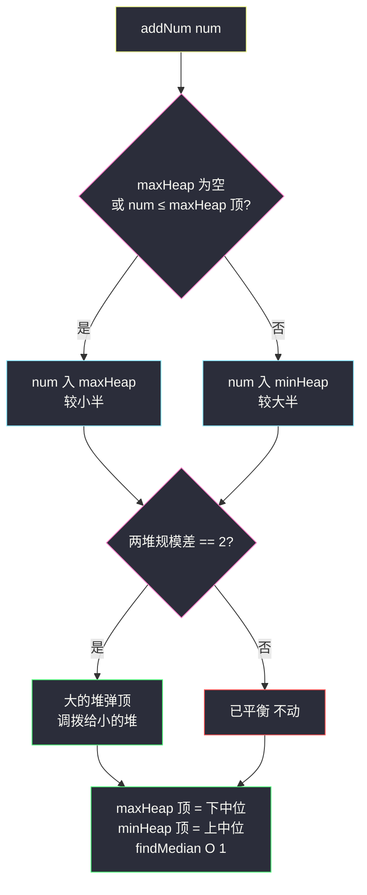
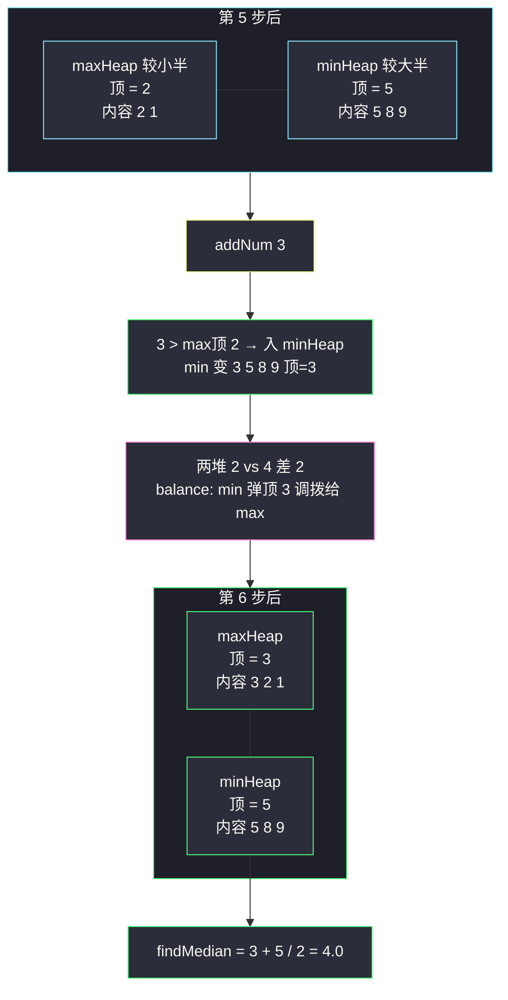

# 数据流的中位数（大小双堆对半分：小的一半进大根堆，大的一半进小根堆）

## 一、问题描述

**中位数**是有序整数列表中间的数：列表长度为奇数时是中间那个，偶数时是中间两个的平均值。

- `MedianFinder()` 初始化
- `void addNum(int num)` 从数据流中加入一个整数
- `double findMedian()` 返回目前所有元素的中位数

> 🔗 LeetCode 295：https://leetcode.cn/problems/find-median-from-data-stream/
>
> 约束：`-10^5 <= num <= 10^5`；`findMedian` 最多调用 `5 * 10^4` 次；保证有元素时才调用。
>
> 进阶：若全是 [0,100] 范围整数，能否不用堆？若 99% 的数在 [0,100]，其余任意，又如何？

**示例 1**

```
输入：
["MedianFinder", "addNum", "addNum", "findMedian", "addNum", "findMedian"]
[[], [1], [2], [], [3], []]
输出：[null, null, null, 1.5, null, 2.0]

解释：加入 1、2 → 中位数 (1 + 2) / 2 = 1.5；再加入 3 → 排序 [1,2,3]，中位数 2
```

**示例 2**

```
输入：["MedianFinder", "addNum", "findMedian"]  [[], [-5], []]
输出：[null, null, -5.0]
```

**直观理解**

中位数只需要「**正中间的一两个数**」：较小那一半的最大值（下中位）、较大那一半的最小值（上中位）——其余元素根本不用排序。「一堆数里的最大/最小」正是堆的看家本领：**大根堆装较小的一半（顶 = 下中位），小根堆装较大的一半（顶 = 上中位）**。新数来了按大小入对堆，哪边超员就把堆顶调拨给对面，两边规模差永远 ≤ 1。于是 `findMedian` 只看两个堆顶，`O(1)` 出答案。课源码 class035 `Code05_MedianFinder` 就是这套双堆结构：`addNum` 一行分流 + `balance` 差 2 即调拨，本篇主解与其逐行对齐。

---

## 二、暴力解法（有序数组 + 插入移位）

### 直观思路

用一个有序数组实时维护全序：`addNum` 二分找到插入位置、把后面元素整体右移一格；`findMedian` 直接取中间：

```java
class MedianFinder {
    private List<Integer> list = new ArrayList<>();

    public void addNum(int num) {
        int pos = 0;
        while (pos < list.size() && list.get(pos) < num) {   // 找插入位（可换二分）
            pos++;
        }
        list.add(pos, num);          // ArrayList 底层整体右移，O(n)
    }

    public double findMedian() {
        int n = list.size();
        return (n % 2 == 1)
                ? list.get(n / 2)
                : (list.get(n / 2 - 1) + list.get(n / 2)) / 2.0;
    }
}
```

另一个偷懒变体：`addNum` 直接 `O(1)` 追加，`findMedian` 时每次排序 `O(n log n)`——查询频繁时更慢。

### 复杂度

- **时间**：`addNum` `O(n)`（移位），`findMedian` `O(1)`；追加版则 `addNum O(1)`、`findMedian O(n log n)`
- **空间**：`O(n)`

### 🔴 瓶颈在哪里

1. **维护了用不到的全序**：为了正中间一两个数，把两侧所有元素的相对顺序都排好——`10^5` 量级、每次加入都移位，总代价 `O(n²)`；
2. 移位动作与「中位数」毫无关系：中位数只关心**两侧各自的边界值**，边界两侧内部怎么排根本无所谓；
3. 优化方向：把「维护全序」降级为「只维护两个边界」——每个数只需知道自己归属哪一半，一半内部的最大值/另一半内部的最小值交给堆。

---

## 三、优化探索（核心章节）

### 3.1 观察特征

| 特征 | 说明 |
|------|------|
| 中位数只取决于分界处的值 | 奇数个：下中位（较小半的最大）；偶数个：下、上中位均值——**两个「半边极值」** |
| 半边内部无需全序 | 较小半只暴露最大值 → 大根堆；较大半只暴露最小值 → 小根堆 |
| 数据只增不减 | 没有删除操作，堆只进不出（除调拨），无需懒删除等复杂处理 |
| 新数影响局部 | 每次加入只可能：进某半、或引起一次「顶上换防」——增量维护成本低 |

### 3.2 暴力 → 优化：大小双堆 + 规模平衡

两个堆的分工（命名对齐 class035）：

- `maxHeap`：**大根堆**，存较小的一半，堆顶 = **下中位**
- `minHeap`：**小根堆**，存较大的一半，堆顶 = **上中位**

三个动作：

```
addNum(num):
    若 maxHeap 空或 num ≤ maxHeap 顶:
        maxHeap 入 num                ← 属于较小半
    否则:
        minHeap 入 num                ← 属于较大半
    balance()                         ← 校正规模

balance():
    若两堆规模差 == 2:                ← 超员两个才调（课上阈值）
        大的那堆弹顶，给小的那堆      ← 堆顶正是「跨界者」

findMedian():
    两堆等大 → (maxHeap 顶 + minHeap 顶) / 2.0
    否则      → 规模大的那个堆的顶
```

**核心不变式**（任何时刻同时成立）：

1. **值序**：`maxHeap` 里所有数 ≤ `minHeap` 里所有数（每堆内部无需有序，堆顶除外）；
2. **规模**：`|size(maxHeap) - size(minHeap)| ≤ 1`。

有了这两条，中位数就是两个堆顶（或其一），`O(1)` 读取。



### 3.3 关键推导问题

| 问题 | 答案 |
|------|------|
| 为什么值序不变式不会被破坏？ | 新数入堆前先与 `maxHeap` 顶比较：`num ≤ 顶` 说明它属于较小半；`num > 顶 ≥ maxHeap 全体`，入 minHeap 也不违反「minHeap 全体 > maxHeap 全体」。balance 调拨的是大堆**堆顶**（该堆最靠近分界线的数），过界后恰是对方堆的合法成员 |
| 为什么阈值是差 2，不是差 1？ | 差 1 已经满足不变式（一边多一个，中位数取多的堆顶即可）；差 2 才是「超员」。阈值设 1 也能对（每次强制差 ≤ 1 并固定哪边可多），只是多做了不必要的调拨；课上的 2 是「能不动就不动」的懒平衡 |
| 差 2 时调拨为什么是弹**堆顶**而不是随便弹？ | 大堆多出的那个「越界者」正是堆顶：它是大堆中最接近中线的数，搬去小堆后仍保持两边值序。弹别的元素会立刻违反值序 |
| findMedian 偶数时为什么除以 2.0？ | Java 中两个 int 相加再 `/ 2` 是整除；必须 `(double)` 参与运算才保留小数（如 (2+5)/2=3 而正确答案是 3.5） |
| addNum 能不能固定「先压一边再倒另一边」？ | 能，常见变体：`maxHeap.offer(num); minHeap.offer(maxHeap.poll()); if (minHeap.size() > maxHeap.size()) maxHeap.offer(minHeap.poll());` 每次两步调拨，保证 maxHeap 恒 ≥。正确且好记，但每次都做 2~3 次堆操作；课上版「先分流再按需平衡」平均更省，且分支逻辑更能体现「数该归哪半」的思考 |
| 进阶问（值域 [0,100]）怎么答？ | 用长度 101 的计数数组：addNum `O(1)` 计数；findMedian 从头累加计数找第 n/2 个——查询 `O(101)`。99% 在 [0,100] 时再挂两个哨兵桶收尾部的 1%，查询时按比例定位。堆不是唯一解，**按值域选结构**才是本题进阶的考察点 |

### 3.4 一句话核心

> **小半进大根堆、大半进小根堆，两堆顶夹出中线；差 2 才调拨，堆顶即中位。**

---

## 四、代码实现详解

### Java（主解：大小双堆，对齐 class035 课上版）

```java
// 数据流的中位数：大根堆存较小半 + 小根堆存较大半
// 测试链接 : https://leetcode.cn/problems/find-median-from-data-stream/
// 对齐 class035 Code05_MedianFinder（仅 findMedian 均值计算改为防 int 溢出写法）
class MedianFinder {
    private PriorityQueue<Integer> maxHeap;   // 大根堆：较小的一半，顶 = 下中位
    private PriorityQueue<Integer> minHeap;   // 小根堆：较大的一半，顶 = 上中位

    public MedianFinder() {
        maxHeap = new PriorityQueue<>((a, b) -> b - a);
        minHeap = new PriorityQueue<>((a, b) -> a - b);
    }

    public void addNum(int num) {
        if (maxHeap.isEmpty() || maxHeap.peek() >= num) {
            maxHeap.add(num);                 // 属于较小半
        } else {
            minHeap.add(num);                 // 属于较大半
        }
        balance();
    }

    public double findMedian() {
        if (maxHeap.size() == minHeap.size()) {
            return ((double) maxHeap.peek() + minHeap.peek()) / 2;   // 防 int 溢出
        }
        return maxHeap.size() > minHeap.size() ? maxHeap.peek() : minHeap.peek();
    }

    // 两堆规模差到 2 才调拨：大的堆弹顶给小的堆
    private void balance() {
        if (Math.abs(maxHeap.size() - minHeap.size()) == 2) {
            if (maxHeap.size() > minHeap.size()) {
                minHeap.add(maxHeap.poll());
            } else {
                maxHeap.add(minHeap.poll());
            }
        }
    }
}
```

### Python（同思路）

```python
import heapq

class MedianFinder:
    def __init__(self):
        self.max_heap: list[int] = []    # 存负数模拟大根堆（Python 只有小根堆）
        self.min_heap: list[int] = []    # 小根堆：较大的一半

    def addNum(self, num: int) -> None:
        if not self.max_heap or -self.max_heap[0] >= num:
            heapq.heappush(self.max_heap, -num)      # 较小半，存负数
        else:
            heapq.heappush(self.min_heap, num)
        self._balance()

    def findMedian(self) -> float:
        if len(self.max_heap) == len(self.min_heap):
            return (-self.max_heap[0] + self.min_heap[0]) / 2
        if len(self.max_heap) > len(self.min_heap):
            return float(-self.max_heap[0])
        return float(self.min_heap[0])

    def _balance(self) -> None:
        if abs(len(self.max_heap) - len(self.min_heap)) == 2:
            if len(self.max_heap) > len(self.min_heap):
                heapq.heappush(self.min_heap, -heapq.heappop(self.max_heap))
            else:
                heapq.heappush(self.max_heap, -heapq.heappop(self.min_heap))
```

Python 的 `heapq` 只有小根堆，大根堆用「存相反数」模拟——出入堆取负号成对出现即可。

---

## 五、具体例子演示

### 例 1：完整操作序列 `5, 2, 8, 1, 9, 3, 7`（覆盖分流、两次调拨、奇偶交替）

记法：堆内容标注**顶**；`max` 指大根堆（较小半），`min` 指小根堆（较大半）。

| 步 | addNum | 分流判断 | max（较小半） | min（较大半） | balance | findMedian | 手工验证（已加入元素排序） |
|----|--------|----------|----------------|----------------|---------|------------|-----------------------------|
| 1 | 5 | max 空 → 入 max | **5** | 空 | 差 1，不动 | **5.0** | [5] 中位 5 ✅ |
| 2 | 2 | 5 ≥ 2 → 入 max | 5, **2**（顶 5） | 空 | **差 2！max 弹 5 给 min** → max: **2**, min: **5** | **3.5** | [2,5] 中位 3.5 ✅ |
| 3 | 8 | 2 < 8 → 入 min | **2** | 5, **8**（顶 5） | 差 1，不动 | **5.0** | [2,5,8] 中位 5 ✅ |
| 4 | 1 | 2 ≥ 1 → 入 max | 2, **1**（顶 2） | 5, 8 | 差 0，不动 | **3.5** | [1,2,5,8] 中位 (2+5)/2=3.5 ✅ |
| 5 | 9 | 2 < 9 → 入 min | 2, 1 | 5, 8, **9**（顶 5） | 差 1，不动 | **5.0** | [1,2,5,8,9] 中位 5 ✅ |
| 6 | 3 | 2 < 3 → 入 min | 2, 1 | 3, 5, 8, **9**（顶 3） | **差 2！min 弹 3 给 max** → max: 3, 2, **1**（顶 3）, min: 5, 8, 9 | **4.0** | [1,2,3,5,8,9] 中位 (3+5)/2=4 ✅ |
| 7 | 7 | 3 < 7 → 入 min | 3, 2, 1 | 5, 7, 8, **9**（顶 5） | 差 1，不动 | **5.0** | [1,2,3,5,7,8,9] 中位 5 ✅ |

**两次调拨是全剧精华**：

- **第 2 步**：max 堆积了 {5,2} 两个（顶 5），min 空——5 是「最接近中线的数」，弹给 min 后两边 {2} / {5}，值序、规模双双恢复；
- **第 6 步**：3 本来该进较小半，但 max 顶只有 2，3 > 2 按规则进了 min，导致 min 超员到 4——balance 弹 min 顶 3 回 max，**3 兜了一圈还是回了较小半**（这正是「分流判断只看堆顶、可能暂时放错边，靠调拨纠偏」的机制：不维护精确分界，只维护堆顶近似分界）。



### 例 2：LC 示例 1 复核

- `addNum(1)`：max 空 → max={**1**}，min={}，差 1 → `findMedian()` = 1.0（max 顶）✅
- `addNum(2)`：max 顶 1 < 2 → 入 min → max={1}, min={**2**}，差 0 → `findMedian()` = (1+2)/2 = **1.5** ✅
- `addNum(3)`：max 顶 1 < 3 → 入 min → max={1}, min={2, **3**}（顶 2），差 1 → `findMedian()` = **2.0**（min 顶）✅

### 例 3：递减流 `9, 7, 5, 3`（全部挤进较小半）

| 步 | addNum | 分流 | max | min | balance 后 | 中位数 |
|----|--------|------|-----|-----|------------|--------|
| 1 | 9 | 空→max | **9** | 空 | 不动 | 9.0 |
| 2 | 7 | 9 ≥ 7→max | 9, **7** | 空 | 差 2 → 9 调拨 → max: **7**, min: **9** | 8.0 |
| 3 | 5 | 7 ≥ 5→max | 7, **5** | 9 | 差 1 不动 | 7.0 |
| 4 | 3 | 5 ≥ 3→max | 7, 5, **3** | 9 | 差 2 → 7 调拨 → max: 5, **3**, min: 7, **9** | (5+7)/2=6.0 ✅ |

递减流让 max 反复超员、每两步触发一次调拨——**最坏情形下 balance 依然只是单次堆操作，摊还 `O(log n)` 不变**；且每次调拨的都是当前堆顶（9、7 恰为跨界者），值序始终无恙。

---

## 六、复杂度分析

| 项目 | 有序数组移位（暴力） | 每次查询排序（暴力变体） | 大小双堆（主解） |
|------|----------------------|---------------------------|------------------|
| addNum | `O(n)` | `O(1)` | **`O(log n)`**：入堆 + 至多一次调拨（两次堆操作） |
| findMedian | `O(1)` | `O(n log n)` | **`O(1)`**：读堆顶 |
| 空间 | `O(n)` | `O(n)` | `O(n)`（两堆合计恰存全部元素） |

`5 * 10^4` 次调用下，双堆总代价约 `n log n ≈ 5·10^4 × 17`，轻松通过；移位版是 `O(n²)` 约 `2.5 * 10^9`，必然超时——Hard 难度卡的就是这一步。

---

## 七、方法对比与总结

### 写法对比

| | 有序数组 | 大小双堆（主解） | 双有序集/平衡树 |
|--|----------|------------------|-----------------|
| addNum | `O(n)` 移位 | **`O(log n)`** | `O(log n)` |
| findMedian | `O(1)` | **`O(1)`** | `O(1)`~`O(log n)` |
| 实现难度 | 低（但慢） | 中（两个堆 + 三段逻辑） | 高（Java 无内置平衡树） |
| 面试定位 | 讲思路起点 | ✅ 必须默写 | 口头提一嘴即可 |

### 易错点

1. **两个堆的比较器写反**：`maxHeap` 要 `(a, b) -> b - a`（大根）、`minHeap` 要 `(a, b) -> a - b`（小根）；写反后值序颠倒，样例 [1,2] 就会输出错。
2. **`(a, b) -> b - a` 的 int 溢出**：值域到 ±10^5 本题安全；极端值域（接近 int 边界）时改用 `Comparator.reverseOrder()`。同理 `findMedian` 求均值先转 `double`，防两个大负 int 相加溢出（课上原版 `(double)(a+b)/2` 在 a+b 溢出时出错，站点版改为先转再相加）。
3. **balance 阈值判断写成 `>= 2` 之外的条件**：只允许差 2 触发（`== 2`）；若写成 `> 1` 等价、写成 `>= 1` 会把合法的差 1 状态也调拨——结果仍对但白费操作；写成 `== 1` 直接破坏正确性。
4. **调拨弹错对象**：必须弹**大堆的堆顶**给小堆；弹别的元素（或方向反了）立刻违反值序不变式。
5. **空堆 `peek()`**：题面保证 findMedian 前至少加过一个数，但自己写变体时记得先处理空态。
6. **Python 忘了取负**：`heapq` 模拟大根堆，入堆 `-num`、出堆 `-heap[0]`，漏一处符号全乱。

### 模板口诀

> **小半大根堆，大半小根堆，两顶夹中线；差二才搬家，堆顶即中位。**

---

## 八、举一反三

| 题目 | 链接 | 迁移点 |
|------|------|--------|
| 215. 数组中的第K个最大元素 | https://leetcode.cn/problems/kth-largest-element-in-an-array/ | 堆思想前置题（本站题解）：k 容量小根堆 + 快速选择，与本篇组成堆家族双子星 |
| 480. 滑动窗口中位数 | https://leetcode.cn/problems/sliding-window-median/ | 本题 + 滑动窗口：窗口滑动带来**删除**，需延迟删除 + 惰性平衡的堆 |
| 502. IPO | https://leetcode.cn/problems/ipo/ | 双堆协作的贪心应用：小根堆按成本、大根堆按利润交替取用 |
| 703. 数据流中的第 K 大元素 | https://leetcode.cn/problems/kth-largest-element-in-a-stream/ | 「数据流 + 堆维护聚合值」的入门版，先做它再回来做本题更顺 |
| 414. 第三大的数 | https://leetcode.cn/problems/third-maximum-number/ | 三个变量的「手工三堆」，体会固定 K 时可以不用堆 |

**迁移一句**：**「两个堆各管一半、堆顶互为邻居」是中位数问题的通用架构**——静态数组用双指针夹（#4 思想），数据流用双堆夹（本篇），滑动窗口再叠加删除处理（#480）。从 #215 的单堆到 #295 的双堆，堆家族的题一通百通。
