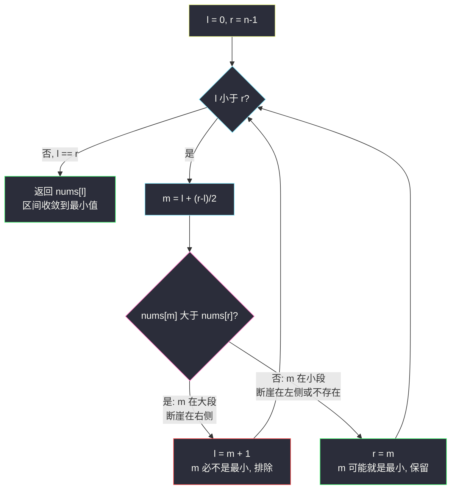
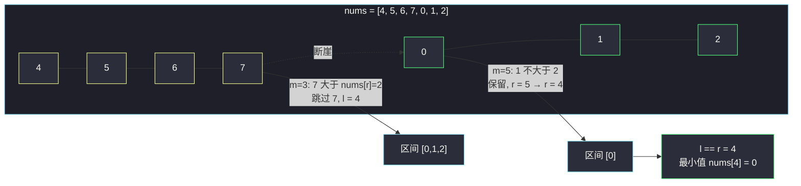

# 寻找旋转排序数组中的最小值（while l < r 模板的教科书）

## 一、问题描述

已知一个长度为 `n` 的数组，**预先按照升序排列**，并通过 `1` 到 `n` 次**旋转**后，得到输入数组 `nums`。例如原数组 `[0,1,2,4,5,6,7]` 旋转 4 次得到 `[4,5,6,7,0,1,2]`。

请找出并返回数组中的**最小元素**。数组中**不存在重复**元素。要求 `O(log n)`。

> 🔗 LeetCode 153：https://leetcode.cn/problems/find-minimum-in-rotated-sorted-array/

**示例 1**

```
输入：nums = [3,4,5,1,2]
输出：1
```

**示例 2**

```
输入：nums = [4,5,6,7,0,1,2]
输出：0
```

**直观理解**

升序数组旋转后是「两段有序」，最小值恰好是**右段的第一个元素**（断崖右侧的第一格）。  
与 #33「在旋转数组里找 target」相比，本题目标更纯粹：不比大小找特定值，而是**收敛到一个边界点**——最适合 `while (l < r)` 模板练手。

---

## 二、暴力解法（入门）

### 直观思路

扫一遍取 min：

```java
public int findMin(int[] nums) {
    int min = nums[0];
    for (int i = 1; i < nums.length; i++) {
        min = Math.min(min, nums[i]);
    }
    return min;
}
```

### 复杂度

- **时间**：`O(n)`
- **空间**：`O(1)`

### 🔴 瓶颈在哪里

其实扫到「第一个比前一个小的元素」就能停（那正是断崖口），最坏仍是 `O(n)`。要求 `O(log n)` 时必须让每轮比较都砍掉一半。

---

## 三、优化探索（核心章节）

### 3.1 核心观察：nums[m] 与 nums[r] 的比较必出结论

旋转数组（无重复）有一个干净的不变量：

- 若 `nums[m] > nums[r]`：`m` 落在**左段**（大段）。断崖在 `m` 右边 ⇒ **最小值在 `[m+1, r]`**，且 `m` 本身必不是最小。
- 若 `nums[m] <= nums[r]`：`m` 落在**右段**（小段，含未旋转情形）。断崖在 `m` 左边或不存在 ⇒ **最小值在 `[l, m]`**，且 `m` **可能就是**最小值，不能排除。

为什么不和 `nums[l]` 比？`nums[m] > nums[l]` 时无法区分「整个数组没旋转」和「m 在左段」两种情况（信息量不足）；而右端点 `r` 永远在小段，比较结果**单向可靠**。

### 3.2 while l < r 模板：收缩到 l == r 汇合于答案

本题不找特定值、不记 ans，而是让区间**收敛成一个点**：

- 循环条件 `l < r`：区间还多于 1 个元素就继续收缩；
- `l == r` 时区间只剩答案，`nums[l]` 即最小值。

收缩规则保证**答案始终被区间包含**，且区间严格变小，所以汇合点必是答案。



### 3.3 为什么 r = m 不会死循环

死循环的经典来源是「收缩后区间不变」。这里 `m = l + (r-l)/2` 是**下取整**，当 `l < r` 时必有 `l <= m < r`：

- 走 `r = m` 分支：`m < r` ⇒ 区间右端至少左移 1 格；
- 走 `l = m + 1` 分支：`m + 1 > l` ⇒ 区间左端至少右移 1 格。

两个分支都严格缩小区间，必然在 `O(log n)` 内汇合。**「下取整中点 + r = m」是安全组合**；若改用上取整中点又配 `r = m` 才会卡死——这是 `while l < r` 模板最重要的工程细节。

### 3.4 关键问题

| 问题 | 答案 |
|------|------|
| 数组完全没旋转（k = 0）怎么办？ | 整个数组都是「小段」，`nums[m] <= nums[r]` 恒真，一直 `r = m` 向左收敛，最终回到 `nums[0]`，天然正确 |
| 为什么 `nums[m] > nums[r]` 时敢写 `l = m + 1`？ | 无重复元素下 `nums[m] > nums[r]` 说明 m 在大段，大段里所有值都大于右段首元素，m 必不是最小 |
| `nums[m] <= nums[r]` 为何用 `<=`？ | 无重复时 `m == r`（区间只剩两个元素）也成立，且 `m` 可能恰是最小，必须保留 |
| 与 #33 的模板差异？ | #33 找具体值，`while l <= r` 三分支可提前返回；本题找边界点，`while l < r` 收敛汇合，不可提前退出 |

### 3.5 一句话核心

> **只跟右端点比：大段（`nums[m] > nums[r]`）就跳过 m 去右，小段就带着 m 收缩；l 与 r 汇合处即最小值。**

---

## 四、代码实现详解

### Java（主解）

> 说明：课源码未收录本题原题，主解按 class006 二分家族的边界模板（`while l < r` + 下取整中点 + 收缩汇合）对齐书写，变量命名沿用课上 `l/r/m`。

```java
// 寻找旋转排序数组中的最小值
// 测试链接 : https://leetcode.cn/problems/find-minimum-in-rotated-sorted-array/
public class Solution {

    public static int findMin(int[] nums) {
        int l = 0, r = nums.length - 1, m = 0;
        while (l < r) {
            m = l + ((r - l) >> 1);
            if (nums[m] > nums[r]) {
                // m 落在大段：断崖在 m 右侧，m 一定不是最小
                l = m + 1;
            } else {
                // m 落在小段：m 可能就是最小，保留
                r = m;
            }
        }
        return nums[l];
    }
}
```

### Java（附：一次对比找出 target 与最小值的位置关系思路）

```java
// 拓展：先跑 findMin 定位断崖 k，再判断 target 在哪一段，
// 用 #704 的普通二分在对应有序段里找 —— #33 的「两次二分」解法骨架
public static int searchRotated(int[] nums, int target) {
    int k = findMinIndex(nums); // 最小值下标 = 右段起点
    int n = nums.length;
    if (target >= nums[k] && target <= nums[n - 1]) {
        return plainSearch(nums, k, n - 1, target);      // 右段找
    }
    return plainSearch(nums, 0, k - 1, target);           // 左段找
}

public static int findMinIndex(int[] nums) {
    int l = 0, r = nums.length - 1, m = 0;
    while (l < r) {
        m = l + ((r - l) >> 1);
        if (nums[m] > nums[r]) {
            l = m + 1;
        } else {
            r = m;
        }
    }
    return l;
}

public static int plainSearch(int[] nums, int l, int r, int target) {
    while (l <= r) {
        int m = l + ((r - l) >> 1);
        if (nums[m] == target) {
            return m;
        } else if (nums[m] > target) {
            r = m - 1;
        } else {
            l = m + 1;
        }
    }
    return -1;
}
```

### Python

```python
# 寻找旋转排序数组中的最小值
# 测试链接 : https://leetcode.cn/problems/find-minimum-in-rotated-sorted-array/
class Solution:
    def findMin(self, nums: list[int]) -> int:
        l, r = 0, len(nums) - 1
        while l < r:
            m = l + ((r - l) >> 1)
            if nums[m] > nums[r]:
                # m 落在大段：断崖在 m 右侧
                l = m + 1
            else:
                # m 落在小段：m 可能就是最小
                r = m
        return nums[l]
```

---

## 五、例子演示

### 例 A：`nums = [3,4,5,1,2]`（逐步跟踪）

初始 `l = 0`，`r = 4`：

| 轮次 | l | r | m | nums[m] | nums[r] | 判断 | 动作 | 剩余区间 |
|------|---|---|---|---------|---------|------|------|----------|
| 1 | 0 | 4 | 2 | 5 | 2 | 5 > 2 ⇒ m 在大段 | `l = 3` | `[1,2]` |
| 2 | 3 | 4 | 3 | 1 | 2 | 1 ≤ 2 ⇒ m 在小段 | `r = 3` | `[1]` |
| 3 | 3 | 3 | — | — | — | `l == r` 汇合 | **返回 nums[3] = 1** ✅ | — |

### 例 B：`nums = [4,5,6,7,0,1,2]`

初始 `l = 0`，`r = 6`：

| 轮次 | l | r | m | nums[m] | nums[r] | 判断 | 动作 |
|------|---|---|---|---------|---------|------|------|
| 1 | 0 | 6 | 3 | 7 | 2 | 7 > 2 ⇒ 大段 | `l = 4` |
| 2 | 4 | 6 | 5 | 1 | 2 | 1 ≤ 2 ⇒ 小段 | `r = 5` |
| 3 | 4 | 5 | 4 | 0 | 1 | 0 ≤ 1 ⇒ 小段 | `r = 4` |
| 4 | 4 | 4 | — | — | — | 汇合 | **返回 nums[4] = 0** ✅ |

### 例 C：数组不旋转 `nums = [1,2,3,4,5]`（k = 0 的退化情形）

| 轮次 | l | r | m | nums[m] | nums[r] | 判断 | 动作 |
|------|---|---|---|---------|---------|------|------|
| 1 | 0 | 4 | 2 | 3 | 5 | 3 ≤ 5 ⇒ 小段 | `r = 2` |
| 2 | 0 | 2 | 1 | 2 | 3 | 2 ≤ 3 ⇒ 小段 | `r = 1` |
| 3 | 0 | 1 | 0 | 1 | 2 | 1 ≤ 2 ⇒ 小段 | `r = 0` |
| 4 | 0 | 0 | — | — | — | 汇合 | **返回 nums[0] = 1** ✅ |

全程没有进过大段分支，一路向左收敛到下标 0——印证「不旋转时整段都是小段」的分析。



---

## 六、复杂度分析

| 项目 | 复杂度 | 说明 |
|------|--------|------|
| 时间 | `O(log n)` | 每轮区间严格减半，直到 l 与 r 汇合 |
| 空间 | `O(1)` | 常数变量 |

---

## 七、对比总结

### 方法对比

| 方法 | 时间 | 空间 | 说明 |
|------|------|------|------|
| 线性扫 min | `O(n)` | `O(1)` | 简单但不满足要求 |
| while l <= r + ans 记账 | `O(log n)` | `O(1)` | 可行但绕：需要额外变量和分支 |
| while l < r 收敛汇合（主解） | `O(log n)` | `O(1)` | 分支最少、最难写错，边界模板代表作 |

### 易错点

1. **拿 `nums[m]` 和 `nums[l]` 比**：`m == l`（区间剩两个元素）或数组未旋转时信息不足，方向判断会错。**固定和右端点比**。
2. **`r = m - 1`**：小段的 `m` 可能正是最小值，踢掉它就丢答案；必须 `r = m` 保留。
3. **返回 `nums[m]` 或 `nums[r]`**：循环退出时 `m` 停在最后一轮的旧中点，汇合点在 `l`（此时 `l == r`，返回哪个都行，但写 `nums[l]` 语义最清楚）。
4. **把本题模板直接搬到 #154（含重复）**：`nums[m] == nums[r]` 时无法断定 m 在哪段，需额外 `r--` 缩边，最坏退化 `O(n)`。

### 模板口诀

> **最小值在崖底，中点只跟右端比；大于右端跳过去，不大于就带着缩；左右汇合即答案。**

---

## 八、举一反三

| 题目 | 链接 | 迁移点 |
|------|------|--------|
| 33. 搜索旋转排序数组 | https://leetcode.cn/problems/search-in-rotated-sorted-array/ | 同款断崖结构找 target；「先 findMin 再分段普通二分」的两段式解法 |
| 154. 寻找旋转排序数组中的最小值 II | https://leetcode.cn/problems/find-minimum-in-rotated-sorted-array-ii/ | 含重复元素：`nums[m] == nums[r]` 时 `r--` 缩边，最坏 `O(n)` |
| 704. 二分查找 | https://leetcode.cn/problems/binary-search/ | `while l <= r` 三分支模板，与本题 `while l < r` 互补 |
| 162. 寻找峰值 | https://leetcode.cn/problems/find-peak-element/ | 同为 `while` 收缩类二分，但比较对象是相邻坡度而非端点 |

**迁移一句**：`while l < r` + 下取整中点 + 「保留可能答案一侧」的收敛模板，是所有「找边界/找极值点」二分的母版——#153 是它最干净的形态，值得作为肌肉记忆的第一块砖。
