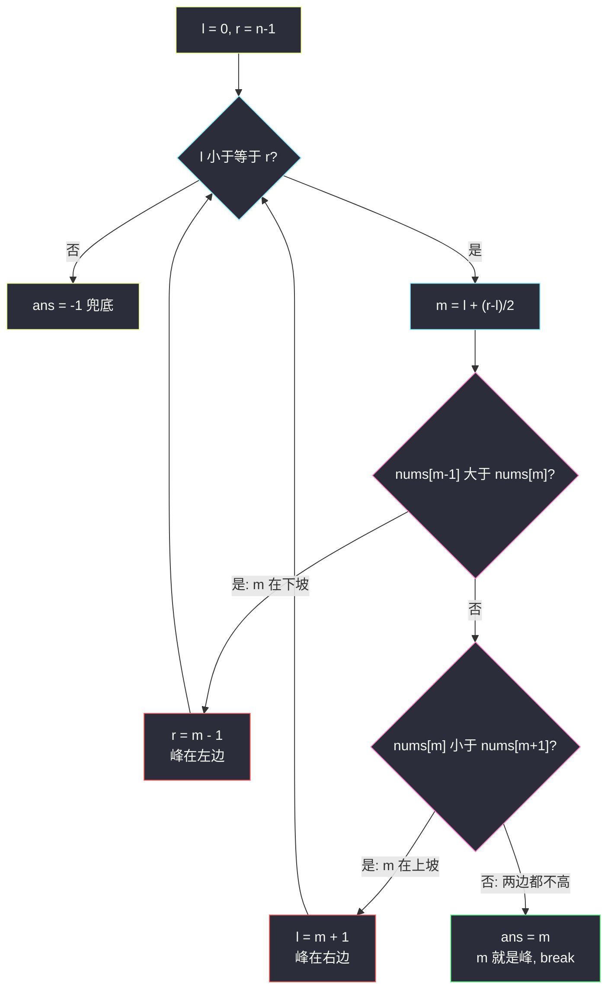
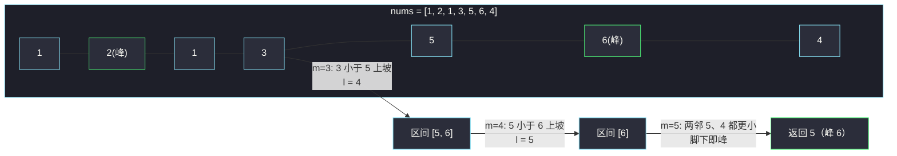

# 寻找峰值（无序数组也能二分）

## 一、问题描述

峰值元素是指其值**严格大于左右相邻值**的元素。

给你一个整数数组 `nums`，已知**任何相邻两个值都不相等**，找到峰值元素并返回其下标。数组可能包含多个峰值，在这种情况下，**返回任何一个峰值所在位置**即可。

你可以假设 `nums[-1] = nums[n] = 负无穷`（数组边界外视为无穷小）。必须实现时间复杂度为 `O(log n)` 的算法。

> 🔗 LeetCode 162：https://leetcode.cn/problems/find-peak-element/

**示例 1**

```
输入：nums = [1,2,3,1]
输出：2
解释：3 是峰值元素，返回下标 2
```

**示例 2**

```
输入：nums = [1,2,1,3,5,6,4]
输出：1 或 5
解释：数组有两个峰值（2 和 6），返回任何一个都算对
```

**直观理解**

数组完全**无序**，却要求 `O(log n)`——二分的第一反应被打破了。  
诀窍在于：**不需要有序**，只需要「往坡度上坡的方向走，一定会遇到峰」。相邻不相等 ⇒ 每个位置都有明确的坡度方向，坡度把数组切成一段段山坡，山顶必然存在。

---

## 二、暴力解法（入门）

### 直观思路

从左到右扫描，找到第一个「比右边大」的位置：

```java
public int findPeakElement(int[] nums) {
    for (int i = 0; i < nums.length - 1; i++) {
        if (nums[i] > nums[i + 1]) {
            return i; // 比右边大，且左边比它小（前面都比右边小）
        }
    }
    return nums.length - 1; // 一路爬坡到末尾，末尾是峰（边界外为 -∞）
}
```

### 复杂度

- **时间**：`O(n)`，最坏数组严格递增（如 `[1,2,3,4,5]`）
- **空间**：`O(1)`

### 🔴 瓶颈在哪里

题目**明确要求** `O(log n)`。线性扫每个位置只用了「局部两个值」的信息，其实坡度方向在远处同样有效——「往高处走必有峰」这个结论支持我们**一次跳半段**。

---

## 三、优化探索（核心章节）

### 3.1 核心洞察：坡度方向 + 两侧无穷小 ⇒ 峰必存在

把数组想象成连绵的山脉，边界外是 `-∞`（两边都是下坡进入数组）：

- 若整个数组严格递增 → 最后一个元素是峰；
- 否则**从左往右一定存在第一次「升转降」的位置**——它左边一路升上来，右边开始降，它就是峰。

同理「往高处走」永远不迷路：站在 `m`，若 `nums[m] < nums[m+1]`，右侧存在比 `nums[m]` 大的值，而边界外是 `-∞`，右半区间内**必然有一个峰**（最坏收敛到右边界）。

### 3.2 二分三分支：中点的三种坡度形态

对任意中点 `m`（相邻值不等），只有三种可能：

| 坡度形态 | 判断条件 | 结论 | 动作 |
|----------|----------|------|------|
| 下坡（\） | `nums[m-1] > nums[m]` | 峰在左侧（含 m-1） | `r = m - 1` |
| 上坡（/） | `nums[m] < nums[m+1]` | 峰在右侧（含 m+1） | `l = m + 1` |
| 谷底/峰顶 | 左右都不大于 m | **m 就是峰** | 返回 m |

前两种情况都能砍掉一半，且「答案仍在剩余区间内」的不变式成立，`O(log n)` 随之而来。



### 3.3 端点要先行特判（课源码的做法）

`m - 1` 和 `m + 1` 在区间中点时永远合法，但**端点 0 和 n-1 本身可能是峰**。课源码（class006 Code04）的处理是先把两个端点查掉：

- `n == 1` → 答案 0（唯一元素就是峰）；
- `nums[0] > nums[1]` → 答案 0（左边界外是 -∞，0 直接是峰）；
- `nums[n-1] > nums[n-2]` → 答案 n-1（右边界外是 -∞）。

排除端点后，主循环就可以放心地开在 `l = 1, r = n - 2`，`m-1` 和 `m+1` 永不越界——这是本题**最防越界**的写法，比在循环里塞边界判断干净得多。

### 3.4 关键问题

| 问题 | 答案 |
|------|------|
| 为什么「往高处走必有峰」？ | 右侧有更大的值，而最右边界外是 -∞；从更高处往右走要么继续升要么转降，转降处即峰；一直升则右端点是峰 |
| 为什么「谷底」（两邻都更小）可以直接返回？ | 相邻值不等，两边都小于 `nums[m]` 正是峰的定义；谷底是「两边都更大」，两者区分开 |
| 峰有多个，返回哪个？ | 任意一个都算对——二分的路径只保证「区间内至少有一个峰」，不保证特定那个 |
| 端点为什么单独判？ | 主循环要访问 `m-1`、`m+1`；先剥掉端点让下标恒安全，也顺带处理了 n=1 的退化 |

### 3.5 一句话核心

> **相邻不等 ⇒ 处处有坡度；顺坡而上必达峰——二分的本质不是有序，而是「能确定砍哪一半」。**

---

## 四、代码实现详解

### Java（主解：对齐课源码 class006 Code04_FindPeakElement）

> 课源码：`/Users/zy/ai_learn/algorithm-journey/src/class006/Code04_FindPeakElement.java`（带本题 LeetCode 测试链接，端点特判 + `l = 1..n-2` 三分支主循环，下文与其同构）。

```java
// 寻找峰值
// 测试链接 : https://leetcode.cn/problems/find-peak-element/
public class Solution {

    public static int findPeakElement(int[] arr) {
        int n = arr.length;
        if (arr.length == 1) {
            return 0;             // 唯一元素就是峰
        }
        if (arr[0] > arr[1]) {
            return 0;             // 左端点是峰（边界外视为 -∞）
        }
        if (arr[n - 1] > arr[n - 2]) {
            return n - 1;         // 右端点是峰
        }
        // 端点排除后，内部 [1, n-2] 任意中点的左右邻居都存在
        int l = 1, r = n - 2, m = 0, ans = -1;
        while (l <= r) {
            m = (l + r) / 2;
            if (arr[m - 1] > arr[m]) {
                r = m - 1;        // 下坡：峰在左边
            } else if (arr[m] < arr[m + 1]) {
                l = m + 1;        // 上坡：峰在右边
            } else {
                ans = m;          // 两边都不高：m 就是峰
                break;
            }
        }
        return ans;
    }
}
```

### Python

```python
# 寻找峰值
# 测试链接 : https://leetcode.cn/problems/find-peak-element/
class Solution:
    def findPeakElement(self, arr: list[int]) -> int:
        n = len(arr)
        if n == 1:
            return 0
        if arr[0] > arr[1]:
            return 0
        if arr[n - 1] > arr[n - 2]:
            return n - 1
        l, r = 1, n - 2
        while l <= r:
            m = (l + r) // 2
            if arr[m - 1] > arr[m]:
                r = m - 1     # 下坡：峰在左边
            elif arr[m] < arr[m + 1]:
                l = m + 1     # 上坡：峰在右边
            else:
                return m      # m 就是峰
        return -1
```

---

## 五、例子演示

### 例 A：`nums = [1,2,3,1]`（逐步跟踪）

先查端点：`n = 4`；`arr[0]=1 > arr[1]=2`？否；`arr[3]=1 > arr[2]=3`？否。进入主循环 `l = 1, r = 2`：

| 轮次 | l | r | m | arr[m-1] | arr[m] | arr[m+1] | 坡度 | 动作 |
|------|---|---|---|----------|--------|----------|------|------|
| 1 | 1 | 2 | 1 | 1 | 2 | 3 | `2 < 3` 上坡 | `l = 2` 峰在右 |
| 2 | 2 | 2 | 2 | 2 | 3 | 1 | 左不大于、右不大于 | **ans = 2** ✅ |

站在 `m=1`（值 2）看到上坡，果断跳去右半；`m=2`（值 3）两侧都更小——正是峰顶。

### 例 B：`nums = [1,2,1,3,5,6,4]`（走一条完整的爬山路线）

查端点：`arr[0]=1 > arr[1]=2`？否；`arr[6]=4 > arr[5]=6`？否。主循环 `l = 1, r = 5`：

| 轮次 | l | r | m | arr[m-1] | arr[m] | arr[m+1] | 坡度 | 动作 |
|------|---|---|---|----------|--------|----------|------|------|
| 1 | 1 | 5 | 3 | 1 | 3 | 5 | `3 < 5` 上坡 | `l = 4` 峰在右 |
| 2 | 4 | 5 | 4 | 3 | 5 | 6 | `5 < 6` 上坡 | `l = 5` 峰在右 |
| 3 | 5 | 5 | 5 | 5 | 6 | 4 | `5 > 6` 否；`6 < 4` 否 | **ans = 5** ✅ |

三步一条直线爬到峰顶 6：一路都是上坡就不断把左端推向右；到 `m=5` 时两邻 5 和 4 都更小，脚下即峰。本题另一个峰是下标 1（值 2），官方判题对 1 和 5 都接受——二分路径遇上哪个峰就返回哪个。



---

## 六、复杂度分析

| 项目 | 复杂度 | 说明 |
|------|--------|------|
| 时间 | `O(log n)` | 上坡/下坡分支每轮砍掉一半，峰分支直接结束 |
| 空间 | `O(1)` | 常数变量 |

---

## 七、对比总结

### 方法对比

| 方法 | 时间 | 空间 | 说明 |
|------|------|------|------|
| 线性扫第一个下降点 | `O(n)` | `O(1)` | 最坏严格递增数组要扫到底 |
| 二分坡度（主解） | `O(log n)` | `O(1)` | 无序数组二分的代表作 |

### 易错点

1. **端点越界**：直接在 `[0, n-1]` 上跑三分支，`m=0` 访问 `arr[-1]`、`m=n-1` 访问 `arr[n]` 直接崩——先特判端点，主循环开在 `[1, n-2]`。
2. **`n == 1` 忘记特判**：`arr[0] > arr[1]` 都会越界。
3. **以为要找「最大值」**：题目只要**任意一个峰**，不比全局最大；二分路径遇上哪个峰返回哪个。
4. **判断顺序**：先查 `arr[m-1] > arr[m]` 再查 `arr[m] < arr[m+1]`，两个条件不会同时成立（相邻不等），顺序其实无妨，但三条件写全缺一不可。

### 模板口诀

> **两侧无穷小，坡上必有峰；下坡往左砍，上坡往右砍；两边都不高，脚下就是峰。**

---

## 八、举一反三

| 题目 | 链接 | 迁移点 |
|------|------|--------|
| 852. 山脉数组的峰顶索引 | https://leetcode.cn/problems/peak-index-in-a-mountain-array/ | 限定「先升后降」唯一峰，`while l < r` 收缩版更短 |
| 1095. 山脉数组中查找目标值 | https://leetcode.cn/problems/find-in-mountain-array/ | 先二分找峰，再峰两侧各一次普通二分，三段式综合题 |
| 704. 二分查找 | https://leetcode.cn/problems/binary-search/ | 有序二分的模板题，与本题「无序也能二分」互为镜像 |
| 153. 寻找旋转排序数组中的最小值 | https://leetcode.cn/problems/find-minimum-in-rotated-sorted-array/ | 同为「比较相邻/端点信息决定收缩方向」的非典型二分 |

**迁移一句**：二分的适用面是「每轮能获得确定性的排除信息」，不限于有序数组——坡度方向（#162）、断崖位置（#153）、单调判定函数（#278）都是合法的「排除依据」。
