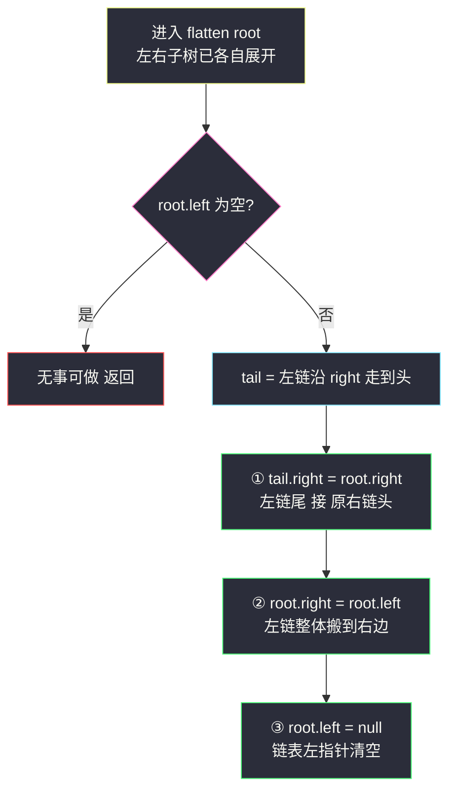
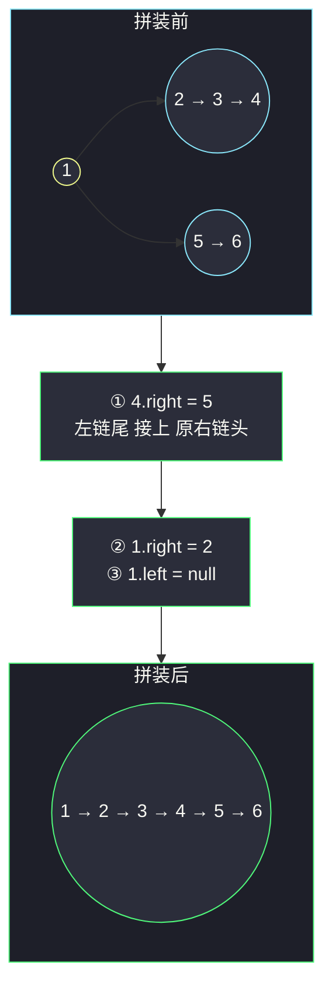

# 二叉树展开为链表（前序顺序 + 后序调整指针）

## 一、问题描述

给你二叉树的根节点 `root`，请你将它**展开为一个单链表**：

- 展开后的单链表同样使用 `TreeNode`，其中 `right` 指针指向链表中下一个节点，`left` 指针始终为 `null`；
- 展开后的链表与二叉树**前序遍历**顺序一致。

要求**原地**展开（O(1) 额外空间的迭代/递归是进阶目标）。

> 🔗 LeetCode 114：https://leetcode.cn/problems/flatten-binary-tree-to-linked-list/

**示例 1**

```
输入：root = [1,2,5,3,4,null,6]
输出：[1,null,2,null,3,null,4,null,5,null,6]
树形与结果：
      1                1
     / \                \
    2   5        →       2
   / \   \                \
  3   4   6                3
                            \
                             4
                              \
                               5
                                \
                                 6
前序遍历 1,2,3,4,5,6，链表即按此顺序串
```

**示例 2**

```
输入：root = []
输出：[]
```

**示例 3**

```
输入：root = [0]
输出：[0]        单节点，无需展开
```

**直观理解**

目标链 = 前序序列（根→左→右）串成一列。难点不是算顺序（[前序遍历](https://leetcode.cn/problems/binary-tree-preorder-traversal/)人人会写），而是**在树上原地改指针**：左子树要整体搬到右边、原来的右子树要接到搬过来的链**末尾**——谁先谁后、临时指针怎么暂存，一步错就丢整棵子树。课源码未收录本题原码，本篇按课上二叉树指针调整骨架（如 class037 树专题的递归写法）对齐思路，给出三种递进写法。

---

## 二、暴力解法（前序收集所有节点再重串）

### 直观思路

先用任意方式拿到前序序列（递归或显式栈都行），然后从左到右把节点逐个用 `right` 串起来、`left` 清空。思路零门槛：

```java
class Solution {
    public void flatten(TreeNode root) {
        List<TreeNode> list = new ArrayList<>();
        preorder(root, list);
        for (int i = 1; i < list.size(); i++) {
            TreeNode prev = list.get(i - 1);
            prev.right = list.get(i);   // 前一个接当前
            prev.left = null;
        }
    }

    private void preorder(TreeNode node, List<TreeNode> list) {
        if (node == null) {
            return;
        }
        list.add(node);
        preorder(node.left, list);
        preorder(node.right, list);
    }
}
```

### 复杂度

- **时间**：`O(n)`，遍历一遍、串接一遍
- **空间**：`O(n)` 节点列表 + `O(h)` 递归栈

### 🔴 瓶颈在哪里

序列先落进列表再重串，`O(n)` 显式空间；而且「先收集再重建」完全绕开了指针调整的核心训练——面试官问这题，多半就是想看你会不会**在树上原地搬家**。

---

## 三、优化探索（核心章节）

### 3.1 观察特征

| 特征 | 说明 |
|------|------|
| 目标顺序 = 前序 | 根 → 左子树全部 → 右子树全部 |
| 左子树搬右后要「垫底」 | 原右子树必须接在**左子树展开链的尾部**，不能丢 |
| 左链尾部藏在深处 | 左子树前序的最后一个节点，是其「最右下的链」的终点 |
| 天然后序结构 | 要拼 `root.left 的链尾 ↔ root.right 的链头`，两个孩子的展开结果必须先就位 → 后序 |

### 3.2 暴力 → 优化一：后序分治拼接

定义 `flatten(root)`：把以 `root` 为根的树**原地**展开成右链。**后序**三步走（左右子树先各自展开完，再在根处拼装）：

```
flatten(root):
    若 root 为空 → 返回
    flatten(root.left)          ← 左子树已变成一条右链
    flatten(root.right)         ← 右子树已变成一条右链
    若 root.left 为空 → 无需搬家，直接返回
    tail = 沿 root.left 的 right 一路走到头     ← 左链的尾
    tail.right = root.right     ← ① 左链尾接上原右链
    root.right = root.left      ← ② 左链整体搬到右边
    root.left = null            ← ③ 清空左指针
```

**为什么找尾便宜**：进入根节点时左子树已展开完毕（全靠 `right` 连），`tail` 就沿 `right` 一路滑到头；每个节点一生只属于一条「左链」，被扫最多一次，总代价 `O(n)`。



### 3.3 优化二：prev 反前序（一行核心的极简版）

换个视角：不拼装、**倒着接**。按「**右 → 左 → 根**」的顺序做后序遍历，每处理一个节点 `cur`，就执行：

```
cur.right = prev    ← prev 是 cur 在前序序列中的直接后继
cur.left  = null
prev = cur
```

为什么对？前序是「根→左→右」，反过来自底向上处理时，`prev` 恰好等于当前节点在最终链表里的**下一个节点**——每个节点只做一次「接后继、清左边」，链表从尾部向头部自动长成。代码全篇 6 行，是面试默写最快的版本。

### 3.4 关键推导问题

| 问题 | 答案 |
|------|------|
| 为什么必须后序（优化一）？ | 拼装需要「左链尾」和「右链头」同时就位，它们只有在孩子递归返回后才存在 |
| 三步顺序能换吗？ | ①② 不能颠倒：先把 `root.right` 指向左链，原右链的头就找不到了；必须先暂存/先接尾。③ 必须最后做 |
| prev 版为什么「右在左前」递归？ | 前序中右子树排在左子树**后面**；倒着接时后处理的接更靠前的，所以要「右→左→根」 |
| 原右子树什么时候断开的？ | 优化一里从未真正断开——它被 `tail.right = root.right` 无缝续上；prev 版里 `cur.right = prev` 直接覆盖，而 `prev` 链已包含原右子树，不丢 |
| 有 O(1) 空间解法吗？ | 有：Morris 思路——`cur` 的左子树中最右节点是前序直接前驱，把前驱的 `right` 接上 `cur` 的右子树即可整体平移（课源码 class124 是 Morris 遍历专题，同思路） |
| 展开后遍历链表是什么序？ | 前序。中序展开（BST 场景）对应 #897 递增顺序搜索树，套路同、顺序不同 |

### 3.5 一句话核心

> **后序三步：左链尾接原右链、左链搬到右边、左边清空；或者反过来——按「右左根」倒着接，每个节点接住自己的前序后继。**

---

## 四、代码实现详解

### Java（主解：后序分治拼接）

```java
// 二叉树展开为单链表（前序顺序，原地调整）
// 测试链接 : https://leetcode.cn/problems/flatten-binary-tree-to-linked-list/
// 骨架对齐课上二叉树后序递归指针调整
class Solution {
    public void flatten(TreeNode root) {
        if (root == null) {
            return;
        }
        flatten(root.left);        // 左子树 → 链
        flatten(root.right);       // 右子树 → 链
        if (root.left == null) {
            return;                // 没有左子树，天然已是链
        }
        TreeNode tail = root.left; // 左链（已全靠 right 连）滑到尾
        while (tail.right != null) {
            tail = tail.right;
        }
        tail.right = root.right;   // ① 尾接原右链
        root.right = root.left;    // ② 左链搬到右边
        root.left = null;          // ③ 清空左指针
    }
}
```

### Java（对照一：prev 反前序，最短默写版）

```java
class Solution {
    private TreeNode prev = null;

    public void flatten(TreeNode root) {
        if (root == null) {
            return;
        }
        flatten(root.right);       // 先右
        flatten(root.left);        // 后左
        root.right = prev;         // 接住前序后继
        root.left = null;
        prev = root;
    }
}
```

### Java（对照二：Morris 版，O(1) 空间）

```java
class Solution {
    public void flatten(TreeNode root) {
        TreeNode cur = root;
        while (cur != null) {
            if (cur.left != null) {
                TreeNode pre = cur.left;      // 找左子树最右节点 = 前序前驱
                while (pre.right != null) {
                    pre = pre.right;
                }
                pre.right = cur.right;        // 前驱接原右子树
                cur.right = cur.left;         // 左子树整体搬到右边
                cur.left = null;
            }
            cur = cur.right;                  // 一路向右走
        }
    }
}
```

### Python（同思路）

```python
# 主解：后序分治拼接
class Solution:
    def flatten(self, root: Optional[TreeNode]) -> None:
        if root is None:
            return
        self.flatten(root.left)
        self.flatten(root.right)
        if root.left is None:
            return
        tail = root.left               # 左链滑到尾
        while tail.right is not None:
            tail = tail.right
        tail.right = root.right        # ① 尾接原右链
        root.right = root.left         # ② 搬到右边
        root.left = None               # ③ 清空左边
```

```python
# prev 反前序版
class Solution:
    def __init__(self):
        self.prev = None

    def flatten(self, root: Optional[TreeNode]) -> None:
        if root is None:
            return
        self.flatten(root.right)
        self.flatten(root.left)
        root.right = self.prev
        root.left = None
        self.prev = root
```

---

## 五、具体例子演示

统一用示例 1 的树：

```
      1
     / \
    2   5
   / \   \
  3   4   6
```

### 例 1：主解（后序分治拼接）全跟踪

递归**完成**顺序恰好是后序：`3 → 4 → 2 → 6 → 5 → 1`，前 5 个节点各自拼装，最后在根汇合：

| 步骤 | flatten 完成于 | 树的状态（只看右链形态） | 动作说明 |
|------|----------------|--------------------------|----------|
| 1 | 3 | `3` | 叶子，左右皆空无事可做 |
| 2 | 4 | `4` | 叶子 |
| 3 | 2 | `2→3→4` | tail=3（左链尾）；①`3.right=4`；②`2.right=3`；③`2.left=null` |
| 4 | 6 | `6` | 叶子 |
| 5 | 5 | `5→6` | `5.left` 为空，直接返回（原右关系天然是链） |
| 6 | 1 | `1→2→3→4→5→6` ✅ | tail=4；①`4.right=5`；②`1.right=2`；③`1.left=null` |

第 6 步（根节点拼装）的指针变化分解：



### 例 2：prev 反前序版同树跟踪

按「右 → 左 → 根」的**处理**顺序 `6 → 5 → 4 → 3 → 2 → 1`，每步执行「接后继、清左边、prev 前移」：

| 处理节点 | prev（前序后继） | 执行后链形态 |
|----------|------------------|--------------|
| 6 | null（初值） | `6` |
| 5 | 6 | `5→6` |
| 4 | 5 | `4→5→6` |
| 3 | 4 | `3→4→5→6` |
| 2 | 3 | `2→3→4→5→6` |
| 1 | 2 | `1→2→3→4→5→6` ✅ |

链从尾部向头部「长」出来——每次接的 `prev` 恰是该节点在前序展开中的下一个，与主解殊途同归。

### 例 3：全右链 `root = [1,null,2,null,3]`

每个节点 `left` 都为空，主解一路「无事可做」直落到底，树保持 `1→2→3` 不变——已是目标形态，O(n) 只做检查。

---

## 六、复杂度分析

| 项目 | 前序收集（暴力） | 后序分治（主解） | prev 反前序 | Morris |
|------|------------------|------------------|-------------|--------|
| 时间 | `O(n)` | `O(n)`：每个节点至多被「滑过」一次 | `O(n)` | `O(n)` |
| 空间 | `O(n)` 列表 | `O(h)` 递归栈 | `O(h)` 递归栈 | **`O(1)`** |

`h` 为树高：平衡 `O(log n)`，链状 `O(n)`。Morris 版连递归栈都省了，是理论最优；但分治版最好讲、最不易错，面试先稳后炫。

---

## 七、方法对比与总结

### 四种写法对比

| | 前序收集重建 | 后序分治（主解） | prev 反前序 | Morris |
|--|--------------|------------------|-------------|--------|
| 思路难度 | ★ 零门槛 | ★★ 指针三步 | ★★ 换向思考 | ★★★ 前驱技巧 |
| 代码量 | 中（两个函数） | 短 | **最短（6 行）** | 中 |
| 空间 | `O(n)` | `O(h)` | `O(h)` | `O(1)` |
| 面试定位 | 讲思路用 | ✅ 首选主解 | 默写提速 | 加分项 |

### 易错点

1. **三步顺序颠倒**：先 `root.right = root.left` 再想接原右链——原右链的头已经拿不到了。要么先 `tail.right = root.right`，要么先把 `root.right` 存进临时变量。
2. **忘记 `root.left = null`**：链表形态不对，LC 上输出多出左孩子直接判错。
3. **找尾巴找错地方**：尾巴在**展开后的左链**（沿 `right` 滑）上，不是在原左子树里沿 `right` 滑——主解里两者恰好一致（因为 `flatten(root.left)` 已经先跑完），顺序不能倒。
4. **prev 版把左右递归顺序写反**：必须先 `flatten(root.right)` 后 `flatten(root.left)`，否则 prev 变成「前序前驱」整条链接反。
5. **以为要新链表节点**：原地题，复用原节点，不 new 不建虚拟头。
6. **`root.left == null` 时也去找尾巴**：`tail = root.left` 会 NPE，务必先判空提前返回。

### 模板口诀

> **左先链、右先链，尾巴接右头，左手搬右手，左边擦干净。**

---

## 八、举一反三

| 题目 | 链接 | 迁移点 |
|------|------|--------|
| 144. 二叉树的前序遍历 | https://leetcode.cn/problems/binary-tree-preorder-traversal/ | 展开顺序的本体，站内已有题解 |
| 897. 递增顺序搜索树 | https://leetcode.cn/problems/increasing-order-search-tree/ | BST 上按**中序**展开成右链，同一套指针搬家 |
| 426. 将二叉搜索树转化为排序的双向链表 | https://leetcode.cn/problems/convert-binary-search-tree-to-sorted-doubly-linked-list/ | 展开成**双向循环**链表，头尾对接再进一步 |
| 116. 填充每个节点的下一个右侧节点指针 | https://leetcode.cn/problems/populating-next-right-pointers-in-each-node/ | 同为「原地重接指针」，按层串而非前序串 |
| 129. 求根节点到叶节点数字之和 | https://leetcode.cn/problems/sum-root-to-leaf-numbers/ | 本站已有题解；与本题互为「前序序列」的两种消费方式 |

**迁移一句**：树上「原地改指针」题的共同心法是——**想清楚谁必须先就位**（左链尾、右链头、前序后继），把这句翻译成「后序拼装」或「倒序接线」，代码就自己长出来了；怕丢链，先暂存再覆盖。
