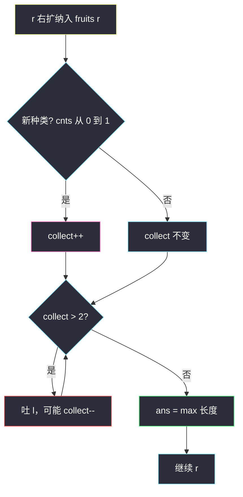

# 水果成篮（至多 2 种 · 最长窗口）

## 一、问题描述

你正在一条果树行上采水果。`fruits[i]` 表示第 `i` 棵树的水果种类。

规则：

- 只有 **两个篮子**，每个篮子只能装**一种**水果（同一种可以装任意多个）。
- 必须从某一棵树开始，**向右连续**采摘，不能跳过树。
- 一旦遇到第三种水果（两个篮子都已有种类且都不匹配），就停。

返回你能采到的水果的**最大数目**（即满足「种类 ≤ 2」的最长连续子数组长度）。

> 🔗 LeetCode 904：https://leetcode.cn/problems/fruit-into-baskets/

**示例 1**

```
输入：fruits = [1,2,1]
输出：3
解释：可以采完全部三棵，只有两种水果。
```

**示例 2**

```
输入：fruits = [0,1,2,2]
输出：3
解释：采 [1,2,2] 或 [0,1] 最长为 3（[0,1,2,2] 有三种，不行）。
```

**示例 3**

```
输入：fruits = [1,2,3,2,2]
输出：4
解释：采 [2,3,2,2]，长度 4。
```

**直观理解**

包装掉故事：求数组中**最多包含 2 种不同数字**的最长连续子数组长度。  
与 class049「至多 k 种」窗口同骨架，本题固定 `k = 2`，更新的是**最长长度**而不是子数组个数。

---

## 二、暴力解法（入门）

### 直观思路

枚举左端点 `l`，向右扩展 `r`，用集合维护窗口内种类；种类超过 2 就停，用当前长度更新答案。

```java
public static int totalFruit(int[] fruits) {
    int n = fruits.length, ans = 0;
    for (int l = 0; l < n; l++) {
        java.util.HashSet<Integer> set = new java.util.HashSet<>();
        for (int r = l; r < n; r++) {
            set.add(fruits[r]);
            if (set.size() > 2) {
                break;
            }
            ans = Math.max(ans, r - l + 1);
        }
    }
    return ans;
}
```

### 复杂度

- **时间**：`O(n²)`。
- **空间**：`O(1)`（集合最多 3 个元素时就停）。

### 🔴 瓶颈在哪里

相邻窗口高度重叠，却每次重开集合。  
种类对窗口单调：变长只会不减 → 可用 `l/r` 滑动，`collect > 2` 时左缩。

---

## 三、优化探索（核心章节）

### 3.1 观察特征

| 特征 | 说明 |
|------|------|
| 连续子数组 | 滑动窗口 |
| 种类 ≤ 2 | `collect` 维护不同种类数 |
| 求最长 | 合法时 `ans = max(ans, r - l + 1)` |
| 与 Code06 关系 | Code06 是「至多 k 种」**计数**；本题是「至多 2 种」**最长** |

### 3.2 暴力 → 优化：至多 2 种最长窗

与 class049 Code06 的 `numsOfMostKinds` 同一套 `cnts + collect`：

```
for (l=0, r=0, collect=0; r < n; r++) {
    纳入 fruits[r]：若是新种类，collect++
    while (collect > 2)：吐出 fruits[l]，种类变 0 则 collect--，l++
    ans = max(ans, r - l + 1)   // 与 Code06 的 ans += r-l+1 仅此处不同
}
```



### 3.3 关键问题

| 问题 | 答案 |
|------|------|
| 窗口维护什么？ | `cnts[x]` = 种类 x 在窗内个数；`collect` = 不同种类数 |
| 何时右扩？ | 每个 `r` 必纳入 |
| 何时左缩？ | **`collect > 2`** |
| 何时更新答案？ | 缩完后窗口合法，取 `r - l + 1` 的最大 |

### 3.4 循环不变式

> **不变式 A**：缩窗后 `collect ≤ 2`。  
> **不变式 B**：`collect` 等于窗口内 `cnts[x] > 0` 的 x 的个数。  
> **不变式 C**：`[l..r]` 是以 `r` 结尾、种类 ≤ 2 的**最长**窗口（`l` 尽量靠左）。

### 3.5 一句话核心

> **维护种类 ≤ 2 的窗口：超 2 就吐左；每步用窗口长度冲最长答案。**

---

## 四、代码实现详解

### Java（与 class049「至多 k 种」同构，`k=2` + 取最长）

```java
// 水果成篮
// 只有两个篮子，每个篮子只能装一种水果
// 从某棵树开始向右连续采摘，种类不能超过 2
// 返回能采到的最大水果数（最长、至多 2 种的子数组长度）
// 测试链接 : https://leetcode.cn/problems/fruit-into-baskets/
public class Solution {

    public static int totalFruit(int[] fruits) {
        int n = fruits.length;
        // 题目 fruits[i] 范围较大时用 HashMap；课上值域有界常用 cnts 数组
        // 这里按常用写法：cnts 开到够用，或用 Map。LeetCode 约束 fruits[i] <= 1e5? 
        // 官方：0 <= fruits[i] < fruits.length，故可用长度 n 的数组
        int[] cnts = new int[n];
        int ans = 0;
        for (int l = 0, r = 0, collect = 0; r < n; r++) {
            if (cnts[fruits[r]]++ == 0) {
                collect++;
            }
            while (collect > 2) {
                if (--cnts[fruits[l++]] == 0) {
                    collect--;
                }
            }
            ans = Math.max(ans, r - l + 1);
        }
        return ans;
    }
}
```

| 变量 | 含义 |
|------|------|
| `cnts[x]` | 窗口内种类 x 的个数 |
| `collect` | 窗口内不同种类数 |
| `l, r` | 窗口左右端（闭区间） |
| `ans` | 历史最长合法窗口长度 |

**两句关键写法（与 Code06 相同）**

```java
if (cnts[fruits[r]]++ == 0) collect++;   // 增前是 0 → 新种类
if (--cnts[fruits[l++]] == 0) collect--; // 减后是 0 → 种类消失
```

### Python（同结构）

```python
class Solution:
    def totalFruit(self, fruits: list[int]) -> int:
        n = len(fruits)
        cnts = [0] * n
        ans = l = collect = 0
        for r in range(n):
            if cnts[fruits[r]] == 0:
                collect += 1
            cnts[fruits[r]] += 1
            while collect > 2:
                cnts[fruits[l]] -= 1
                if cnts[fruits[l]] == 0:
                    collect -= 1
                l += 1
            ans = max(ans, r - l + 1)
        return ans
```

---

## 五、具体例子演示

### 例 1：`fruits = [1,2,3,2,2]`

| r | 纳入 | collect | 缩窗 | 窗口 | 长度 | ans |
|---|------|---------|------|------|------|-----|
| 0 | 1 | 1 | — | [1] | 1 | 1 |
| 1 | 2 | 2 | — | [1,2] | 2 | 2 |
| 2 | 3 | 3→2 | 吐 1，l=1 | [2,3] | 2 | 2 |
| 3 | 2 | 2 | — | [2,3,2] | 3 | 3 |
| 4 | 2 | 2 | — | [2,3,2,2] | 4 | **4** |

答案 4。

```
索引:  0  1  2  3  4
值:    1  2  3  2  2
          l→       r→
窗口 [2,3,2,2]：只有 2 和 3 两种 ✓
```

### 例 2：`fruits = [0,1,2,2]`

`r=2` 纳入 2 后 collect=3，吐掉 0，窗口变为 `[1,2]`，再扩到 `[1,2,2]`，ans=3。

### 例 3：`fruits = [1,2,1]` → 全程 collect≤2，ans=3。

---

## 六、复杂度分析

| 方法 | 时间 | 空间 | 说明 |
|------|------|------|------|
| 枚举左端点 | `O(n²)` | `O(1)` | 超时风险 |
| **至多 2 种滑窗** | **`O(n)`** | `O(n)` 或值域 | `l、r` 各走一遍 |

---

## 七、方法对比与总结

### 与 class049 对照

| 题目 | 条件 | 更新 |
|------|------|------|
| Code06 恰好 k 种（转化） | 至多 k − 至多 k−1 | `ans += r-l+1` |
| **904 本题** | 至多 2 种 | `ans = max(长度)` |
| 340 至多 k 种最长子串 | 至多 k 种 | 同本题，k 可变 |

### 易错点

1. 写成「恰好 2 种」——篮子可以只用 1 种，`collect ≤ 2` 即可。  
2. 吐左时忘了 `cnts` 减到 0 才 `collect--`。  
3. 和「每种至少 k 次」（395）搞混——本题只管种类上限。

### 模板（至多 K 种 · 最长）

```java
for (int l = 0, r = 0, collect = 0; r < n; r++) {
    if (cnts[arr[r]]++ == 0) collect++;
    while (collect > K) {
        if (--cnts[arr[l++]] == 0) collect--;
    }
    ans = Math.max(ans, r - l + 1);
}
```

本题 `K = 2`，`arr = fruits`。

---

## 八、举一反三

| 题目 | 关系 |
|------|------|
| [340. 至多 K 个不同字符的最长子串](https://leetcode.cn/problems/longest-substring-with-at-most-k-distinct-characters/) | 本题的一般形式 |
| [159. 至多两个不同字符的最长子串](https://leetcode.cn/problems/longest-substring-with-at-most-two-distinct-characters/) | 字符版，完全同构 |
| [992. K 个不同整数的子数组](https://leetcode.cn/problems/subarrays-with-k-different-integers/) | class049 Code06：至多 k 计数差 |
| [3. 无重复字符的最长子串](https://leetcode.cn/problems/longest-substring-without-repeating-characters/) | 种类约束变成「无重复」 |

**思想迁移**

```
「连续 + 窗口内种类有上限」
  ↓
cnts + collect
  ↓
collect > K 则左缩
  ↓
求最长 → max(r-l+1)
求个数 → ans += r-l+1
```

**记忆口诀**：两篮两种果；种类超二吐左边；每步窗口长度冲最长。
