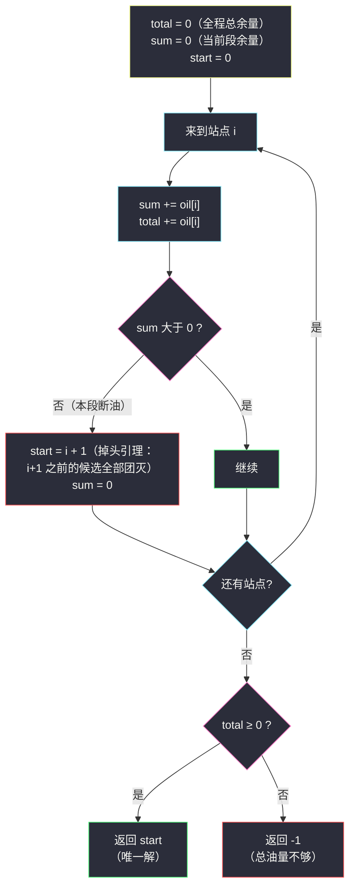
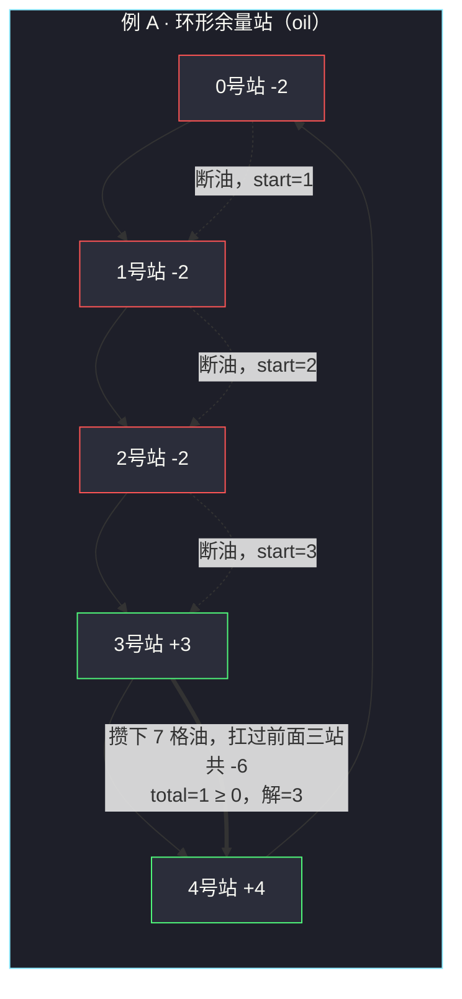

# 加油站（累加和判掉头，一次扫描）

## 一、问题描述

在一条**环形**道路上有 `n` 个加油站，第 `i` 个加油站有汽油 `gas[i]` 升。油箱容量无限的汽车从第 `i` 个加油站开往第 `i+1` 个加油站需要消耗 `cost[i]` 升（其中第 `n-1` 个加油站的"下一站"是第 0 个，首尾相接成环）。

你从**某一个**加油站出发，出发时油箱为空。如果可以**按顺序绕环路行驶一周**，返回出发时加油站的编号；否则返回 `-1`。题目保证若有解则解**唯一**。

> 🔗 LeetCode 134：https://leetcode.cn/problems/gas-station/

**示例 1**

```
输入：gas = [1,2,3,4,5], cost = [3,4,5,1,2]
输出：3
解释：从 3 号站出发：
  3→4：油 4-1=3；4→0：3+5-2=6；0→1：6+1-3=4；
  1→2：4+2-4=2；2→3：2+3-5=0 —— 恰好兜一圈，油量从未为负。
```

**示例 2**

```
输入：gas = [2,3,4], cost = [3,4,3]
输出：-1
解释：总油量 9 < 总耗油 10，无论从哪出发都半路断油。
```

**直观理解**

把每个站点的**余量**记为 `oil[i] = gas[i] - cost[i]`：在站 `i` 加满、再开往下一站后，油箱的净变化。  
问题变成：在环形的 `oil` 序列上找一个起点，从它开始累加，**途中累加和一次都不能为负**，且能加完一整圈（最后一步结束时 ≥ 0）。答案是找「起点」的判定题。

---

## 二、暴力解法（入门）

### 直观思路

枚举每个起点 `s`，模拟绕圈一圈：油量从 0 开始，每到一站先加 `gas[i]` 再扣 `cost[i]`，途中一旦为负就宣告失败，换下一个起点。

```java
public int canCompleteCircuit(int[] gas, int[] cost) {
    int n = gas.length;
    for (int s = 0; s < n; s++) {
        int fuel = 0;
        boolean ok = true;
        for (int step = 0; step < n; step++) {
            int i = (s + step) % n;   // 环形取下标
            fuel += gas[i] - cost[i];
            if (fuel < 0) { ok = false; break; }
        }
        if (ok) return s;
    }
    return -1;
}
```

### 复杂度

- **时间**：`O(n²)`——每个起点最坏模拟一整圈
- **空间**：`O(1)`

### 🔴 瓶颈在哪里

起点 `s` 失败在位置 `j`（`s..j` 累加和首次为负）之后，暴力会去试 `s+1`、`s+2`……**又从零模拟一遍**。  
但仔细想：`s..j` 这一段的总余量已经是负的，从 `s+1..j` 中任何一个位置出发，只会**少拿** `[s]` 这一站的贡献（若 `oil[s]` 为正则更差，为负也只是不更差但同样到不了 `j+1`）——**中间这些起点全可以直接跳过**。失败信息没有被利用，是暴力的原罪。

---

## 三、优化探索（核心章节）

### 3.1 观察特征

| 特征 | 说明 |
|------|------|
| 环形结构 | 但"总油量是否够"与起点无关，是全局判断 |
| 余量可正可负 | 正站"充电"、负站"放电"，天然是一段段的累加和游戏 |
| 解唯一 | 题面保证，暗示存在强排除结构 |
| 一次失败淘汰一批起点 | 暴力瓶颈反过来就是优化钥匙 |

### 3.2 两个结论：把 `O(n²)` 压成 `O(n)`

**结论一（有解的必要条件）**：若 `sum(oil) < 0`，即总油量小于总耗油，任何起点都不可能绕一圈 → 直接 `-1`。反之 `sum(oil) ≥ 0` 时解一定存在（下面结论二保证了唯一起点能被找到）。

**结论二（掉头引理）**：从 `s` 出发，最远顺利开到 `j`（`s..j` 这段的累加和 ≥ 0），但在 `j+1` 处累加和**首次变负**。那么 `s+1, s+2, ..., j+1` 中的任何位置都不可能是合法起点，**下一个候选起点直接设为 `j+2`**。

> 为什么？从 `s+1` 出发到 `j+1`，相当于原来 `s..j+1` 的累加和**去掉了 `oil[s]` 这一项**。而 `s..j` 段一路 ≥ 0，说明 `oil[s]` 前面的部分没拖后腿——去掉它后累加和只可能更小，必然在 `j+1` 之前或恰好 `j+1` 处变负。对 `s+2..j+1` 同理。所以这一整段起点"团灭"。

于是扫描一遍：`start` 从 0 出发，`sum` 累计**本段**余量；一旦 `sum < 0`，`start` 跳到 `i+1`，`sum` 清零重开。最后用**总余量** `total` 是否 ≥ 0 收口。



### 3.3 关键推导问题

| 问题 | 答案 |
|------|------|
| 为什么 `total ≥ 0` 就敢返回 `start`，不再验证一圈？ | `total` = 所有负段亏损之和的相反数补给 + 正段盈余；`start` 前面的每一段断油段都是负贡献，它们的和的绝对值 ≤ 剩余正盈余（因为 total ≥ 0）。绕到这些"旧路段"时，`start` 段攒下的正盈余足以扛过 |
| 段清零（`sum = 0`）为什么合法？ | 旧段已经证明"从这段里的任何点出发都失败"，新段从零计余量恰好刻画"从 start 出发的油量" |
| 掉头会不会跳过真正的解？ | 不会。被跳过的起点都被结论二**证明**失败，不是猜测 |
| `oil[i]` 全为 0 会怎样？ | 每步 `sum = 0` 都不小于 0，start 停在 0，`total = 0 ≥ 0`，返回 0 ✓ |
| 环形不需要 `% n` 取模吗？ | 主解只需要"线性顺序"找起点（绕圈的合法性由 total 保证），天然免取模——这是该写法最优雅之处 |

### 3.4 一句话核心

> **一路累加，断油就掉头：起点跳到断油点的下一站、段和清零；扫完总账不亏（total ≥ 0），留下的起点就是唯一解。**

---

## 四、代码实现详解

### Java（主解：累加和判掉头，O(1) 空间）

```java
// 加油站：环形路线的合法出发站点
// 测试链接 : https://leetcode.cn/problems/gas-station/
public class Solution {

    public static int canCompleteCircuit(int[] gas, int[] cost) {
        int start = 0;  // 候选起点
        int sum = 0;    // 当前段（从 start 出发）的余量累加
        int total = 0;  // 全程总余量：判定有解 / 无解
        for (int i = 0; i < gas.length; i++) {
            int oil = gas[i] - cost[i]; // 站点余量
            sum += oil;
            total += oil;
            if (sum < 0) {
                // 本段断油：start..i 里任何点出发都不行
                start = i + 1; // 掉头，下一个候选
                sum = 0;       // 段和重开
            }
        }
        return total >= 0 ? start : -1;
    }
}
```

### Java（附：课上源码版——滑动窗口判环绕）

> 出处：`/Users/zy/ai_learn/algorithm-journey/src/class049/Code04_GasStation.java`（课上把它放在滑动窗口章讲）。把余量序列虚拟扩展成两倍长，维护窗口 `[l, r)`：窗口和 ≥ 0 就不断右扩 `r`；一旦扩不动（`r` 处进不去），`l` 直接跳到 `r+1`——**跳的幅度正是掉头引理**。窗口长度达到 `n` 即找到解。

```java
public static int canCompleteCircuit2(int[] gas, int[] cost) {
    int n = gas.length;
    // 下标虚拟扩展到 0..2n-1，i 位置的余量在 (i % n) 处
    // 窗口 [l, r)，左闭右开，r 是到不了的位置
    for (int l = 0, r = 0, sum; l < n; l = r + 1, r = l) {
        sum = 0;
        while (sum + gas[r % n] - cost[r % n] >= 0) {
            if (r - l + 1 == n) { // 已经顺利转了一整圈
                return l;
            }
            sum += gas[r % n] - cost[r % n]; // r 进入窗口
            r++;                             // 窗口右扩
        }
        // 从 l 出发到不了 r：l..r 内所有起点团灭，l 跳到 r+1
    }
    return -1;
}
```

### Python

```python
# 加油站（累加和判掉头）
# 测试链接 : https://leetcode.cn/problems/gas-station/
class Solution:
    def canCompleteCircuit(self, gas: list[int], cost: list[int]) -> int:
        start, seg, total = 0, 0, 0
        for i in range(len(gas)):
            oil = gas[i] - cost[i]
            seg += oil
            total += oil
            if seg < 0:       # 本段断油：start..i 全部团灭
                start = i + 1 # 掉头
                seg = 0
        return start if total >= 0 else -1
```

---

## 五、例子演示

### 例 A：`gas = [1,2,3,4,5]`, `cost = [3,4,5,1,2]`（答案 3）

余量 `oil = [-2, -2, -2, 3, 4]`。主解逐站跟踪（`sum` 为当前段，`total` 一直累计）：

| i | oil[i] | sum（段内） | 判断 | start | total | 说明 |
|---|--------|------------|------|-------|-------|------|
| 0 | -2 | **-2** | sum < 0 → 掉头 | **1** | -2 | 从 0 出发第 0→1 路段就断油 |
| 1 | -2 | **-2** | sum < 0 → 掉头 | **2** | -4 | 从 1 出发同样断油 |
| 2 | -2 | **-2** | sum < 0 → 掉头 | **3** | -6 | 从 2 出发断油；候选跳到 3 |
| 3 | +3 | **3** | ≥ 0 继续 | 3 | -3 | 段内油量转正 |
| 4 | +4 | **7** | ≥ 0 继续 | 3 | **1** | 扫描结束 |

收口：`total = 1 ≥ 0` → **返回 start = 3**。  
直观验证：从 3 出发，油量轨迹 `3 → 6 → 4 → 2 → 0`，全程非负，恰好一圈 ✓。

### 例 B：`gas = [2,3,4]`, `cost = [3,4,3]`（答案 -1）

余量 `oil = [-1, -1, 1]`：

| i | oil[i] | sum | 判断 | start | total |
|---|--------|-----|------|-------|-------|
| 0 | -1 | -1 | 掉头 | 1 | -1 |
| 1 | -1 | -1 | 掉头 | 2 | -2 |
| 2 | +1 | 1 | 继续 | 2 | **-1** |

`total = -1 < 0` → **返回 -1**：总油量 9 < 总耗油 10，物理上就不可能。



### 附：课上窗口版对同一例 A 的走向

`l=0`：`r` 扩到 0 就进不去（`sum + oil[0] = -2 < 0`），`l` 跳到 `r+1 = 1`；同理 `l=1` 跳到 2，`l=2` 跳到 3。`l=3` 起步：窗口依次扩进站 3(+3)、站 4(+4)、站 0(-2)、站 1(-2)，`sum` 走过 3→7→5→3 一路 ≥ 0；当 `r - l + 1 == 5 == n`（准备扩进最后一格站 2 之前）时，判定已顺利转满一圈，返回 `l = 3`。**两版殊途同归**：掉头位置完全一致，因为依据的是同一条掉头引理。

---

## 六、复杂度分析

| 项目 | 复杂度 | 说明 |
|------|--------|------|
| 主解时间 | `O(n)` | 单次扫描，每站 O(1)；掉头只会让 start 单调右移 |
| 主解空间 | `O(1)` | start / sum / total 三个变量 |
| 课上窗口版时间 | `O(n)` | l、r 各自单调右移，总计至多 2n 步 |
| 课上窗口版空间 | `O(1)` | 无需真正展开两倍数组，用 `% n` 取余量 |
| 暴力时间 | `O(n²)` | 每个起点模拟一圈 |

---

## 七、对比总结

### 易错点

1. **断油判负时机**：先加 `gas[i]` 再扣 `cost[i]` 合成 `oil[i]` 后**立即**判断；若扣完再走一步才判断，掉头位置会偏移一站。
2. **掉头后 `sum` 忘清零**：旧段的负余量会污染新段，导致后续误掉头。
3. **掉头只 +1**：`start = i + 1` 一次跳到位是结论二的成果；若逐个候选试就退化回 `O(n²)`。
4. **扫完不查 `total`**：start 只是"最像解的候选"，总账 `total < 0` 时必须返回 `-1`。
5. **课上窗口版边界**：判断"转满一圈"要在**扩进 r 之前**用 `r - l + 1 == n`（此时 r 是尚未进入的下一格）；放进循环尾会多扩一步。

### 两版对比

| | 累加和判掉头（主解） | 课上窗口版（class049） |
|--|----------------------|------------------------|
| 时间 / 空间 | `O(n)` / `O(1)` | `O(n)` / `O(1)` |
| 视角 | 线性扫描 + 总账收口 | 显式模拟"能开多远"，环绕看得见 |
| 取模 | 完全不需要 | 需要 `% n` |
| 推荐场景 | 面试默写、讲解 | 想强调"掉头引理 = 窗口跳跃"时 |

### 模板口诀

> **余量一路加，断油就掉头；段清零、总不清，总账不亏便有解。**

---

## 八、举一反三

| 题目 | 链接 | 迁移点 |
|------|------|--------|
| 871. 最低加油次数 | https://leetcode.cn/problems/minimum-refueling-stations/ | "能不能到终点"的加油站变体：断油前用**优先队列**反悔式补最大油量，贪心 + 反悔 |
| 918. 环形子数组的最大和 | https://leetcode.cn/problems/maximum-sum-circular-subarray/ | 同款"环形拉直"思想：断点处用前缀和/后缀最值拼接（课源码 class070/Code03_MaximumSumCircularSubarray.java） |
| 528. 按权重随机选择 | https://leetcode.cn/problems/random-pick-with-weight/ | 余量式"前缀和 + 二分找落点"家族，与本题的累加扫描互补 |
| 45. 跳跃游戏 II | https://leetcode.cn/problems/jump-game-ii/ | 同属"失败信息批量淘汰候选"的贪心：断油掉头 ↔ 圈层跳板，站内题解 [jump-game-ii](/solutions/base/jump-game-ii.md) |

**迁移一句**：环形 + 累加和的问题，先问"**总账够不够**"（不够直接 -1），再问"**断点在哪掉头**"（一次失败淘汰一段候选）——这两个问题答完，环就自动"拉直"成线性扫描。
