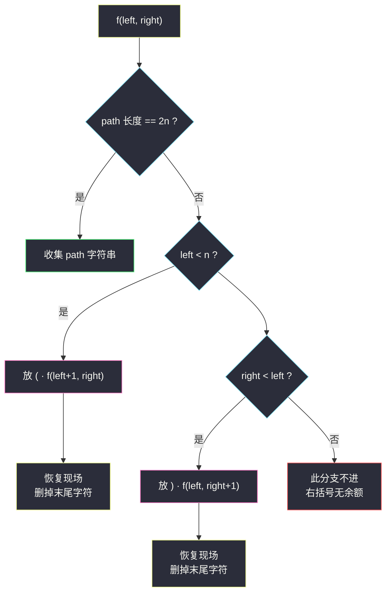
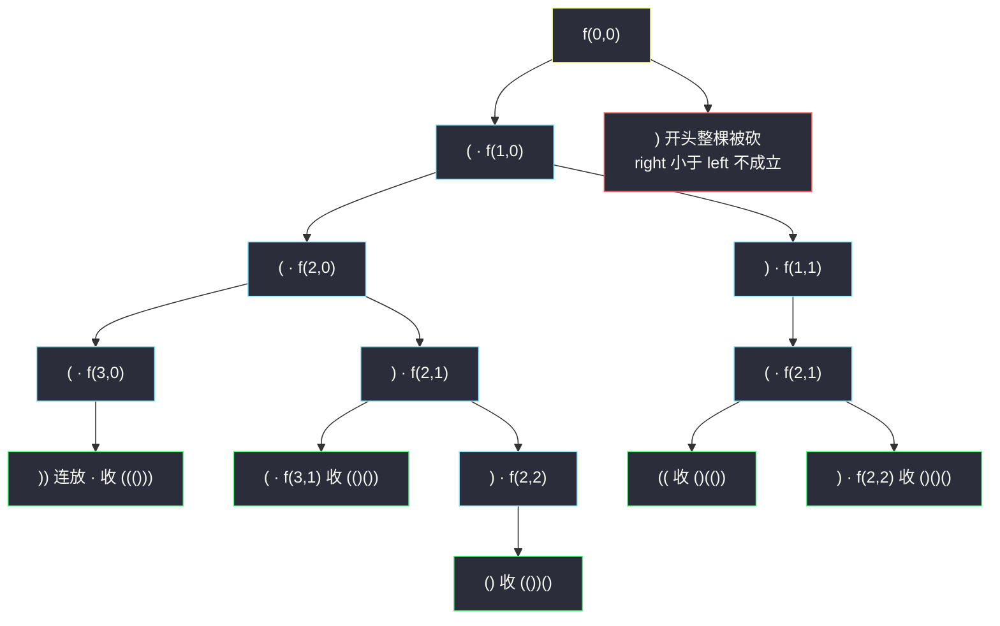

# 括号生成（回溯：左右计数剪枝）

## 一、问题描述

数字 `n` 代表生成括号的对数，请你设计一个函数，用于能够生成所有**可能的并且有效的**括号组合。

> 🔗 LeetCode 22：https://leetcode.cn/problems/generate-parentheses/

**示例 1**

```
输入：n = 3
输出：["((()))","(()())","(())()","()(())","()()()"]
```

**示例 2（最小规模）**

```
输入：n = 1
输出：["()"]
```

**直观理解**

一个合法序列长 `2n` 个字符，每个位置面前只有两个选择：放 `(` 或放 `)`。  
放谁不是随便放的——**合法性由两条铁律保证**：

1. 左括号最多放 `n` 个（用完就没了）；
2. 任意时刻右括号数 **不能超过** 已放的左括号数（否则出现 `)(`、`())` 这类「右括号无家可归」的前缀）。

把这两条铁律变成递归里的两个计数器（`left` 已放左括号数、`right` 已放右括号数），**不合法的分支在生成的瞬间就被拦下**——这就是本题「剪枝」的全部：不需要生成完再检查，而是**只走合法路径**。

---

## 二、暴力解法（入门）

### 直观思路

对长度 `2n` 的每个字符位置做「放 `(` 或放 `)`」的二叉决策，枚举全部 `2^(2n)` 个串，再用计数法逐个检查合法性：扫一遍，遇 `(` 计数 +1、遇 `)` 计数 -1，中途变负或结尾不为 0 即非法。

```java
public List<String> generateParenthesisBrute(int n) {
    List<String> ans = new ArrayList<>();
    dfs(new char[2 * n], 0, ans);
    return ans;
}

private void dfs(char[] path, int i, List<String> ans) {
    if (i == path.length) {
        if (valid(path)) {                  // 生成完再检查
            ans.add(new String(path));
        }
        return;
    }
    path[i] = '(';                          // 分支一：放左
    dfs(path, i + 1, ans);
    path[i] = ')';                          // 分支二：放右
    dfs(path, i + 1, ans);
}

private boolean valid(char[] s) {
    int balance = 0;
    for (char c : s) {
        balance += c == '(' ? 1 : -1;
        if (balance < 0) return false;      // 右括号多过左括号
    }
    return balance == 0;                    // 最终左右相等
}
```

### 复杂度

- **时间**：`O(2^(2n) · n)`——`2^(2n)` 个串，每个 O(n) 检查；n=4 时 65536 个串里只有 14 个合法
- **空间**：`O(n)` 递归栈 + path

### 🔴 瓶颈在哪里

合法性明明**前缀里就能判**：`)()` 这种串走到第二个字符时已经注定非法，暴力却会把剩下 `2n-2` 个位置的全部 `2^(2n-2)` 种填法走完。  
浪费的根源是「**检查推迟到了终点**」——把检查前移到每一步放字符的瞬间，非法分支整棵消失。

---

## 三、优化探索（核心章节）

### 3.1 观察特征

| 特征 | 说明 |
|------|------|
| 合法性是前缀性质 | 任意前缀满足 `右 ≤ 左`，且总数 `左 = 右 = n`——递归中随时可查 |
| 两个计数器定生死 | `left < n` 才能放 `(`；`right < left` 才能放 `)`，条件 O(1) |
| 答案数是卡特兰数 | 第 n 个卡特兰数 `C(n) = C(2n, n) / (n+1)`，远小于 `2^(2n)` |

### 3.2 左右计数剪枝（只走合法路径）

递归 `f(left, right, path)`：已放 `left` 个左括号、`right` 个右括号。

- **收**：`path` 长 `2n`（等价于 `left == right == n`）→ 收集字符串；
- **分支一**：`left < n` → 放 `(`，递归 `f(left+1, right, ...)`，回来后**恢复现场**（StringBuilder 删尾 / 长度回退）；
- **分支二**：`right < left` → 放 `)`，递归 `f(left, right+1, ...)`，恢复现场。

两个条件就是两条铁律的代码化：放左看配额（铁律 1），放右看余额（铁律 2）。



### 3.3 关键推导问题

| 问题 | 答案 |
|------|------|
| 为什么 `right < left` 是放 `)` 的条件？ | 每个右括号都要有更早的左括号配对；右括号数一旦追平左括号数，再放必产生 `)(` 型非法前缀 |
| 为什么不会重复不会漏？ | 每个串的每个字符只有两个来源（放左/放右），条件互斥且完备——每个合法串恰好对应一条路径 |
| 剪枝把复杂度降到了多少？ | 树上节点全是「合法前缀」，个数即卡特兰数级别——从 `4^n`（= 2^(2n)）降到 `4^n / √n` 的答案量级 |
| path 用 char[] 还是 StringBuilder？ | 都行：char[] 定长配一个 size 游标最快；StringBuilder 则 add/delete 成对恢复 |
| 与组合题的 start 参数去哪了？ | 本题没有「候选数组」，候选只有 `( )` 两个固定动作——start 换成了两个计数器 |

### 3.4 一句话核心

> **不合法的括号串，前缀就已判死刑——把终点检查前移成每步的计数条件，只走合法路径。**

---

## 四、代码实现详解

### Java（主解：左右计数回溯，对齐 class038 决策树骨架）

> 课源码说明：本题无直接课源码；主解按左程云 `class038` 回溯骨架（f + 定长 path + 恢复现场）对齐，与站内 [#77 组合](./combinations.md) 同构——只是「候选集」从数字数组换成了两个括号动作。

```java
// 括号生成：左右计数剪枝，只走合法路径
// 测试链接 : https://leetcode.cn/problems/generate-parentheses/
class Solution {

    public static List<String> generateParenthesis(int n) {
        List<String> ans = new ArrayList<>();
        char[] path = new char[2 * n];          // 定长工作数组
        f(0, 0, n, path, ans);
        return ans;
    }

    // 已放 left 个左括号、right 个右括号
    public static void f(int left, int right, int n,
                         char[] path, List<String> ans) {
        if (left + right == 2 * n) {            // 放满：一定是合法串
            ans.add(new String(path));          // 收集时拷贝成 String
            return;
        }
        if (left < n) {                         // 铁律一：左括号还有配额
            path[left + right] = '(';
            f(left + 1, right, n, path, ans);
            // 恢复现场：path[left+right] 会被下一个动作覆盖，无需显式清除
        }
        if (right < left) {                     // 铁律二：右括号有余额可配对
            path[left + right] = ')';
            f(left, right + 1, n, path, ans);
            // 同上，覆盖即恢复
        }
    }
}
```

### Python

```python
# 括号生成：左右计数剪枝，只走合法路径
# 测试链接 : https://leetcode.cn/problems/generate-parentheses/
class Solution:
    def generateParenthesis(self, n: int) -> list[str]:
        ans: list[str] = []
        path: list[str] = []
        self.f(0, 0, n, path, ans)
        return ans

    def f(self, left: int, right: int, n: int,
          path: list[str], ans: list[str]) -> None:
        if len(path) == 2 * n:
            ans.append("".join(path))           # 拷贝收集
            return
        if left < n:                            # 左括号还有配额
            path.append("(")
            self.f(left + 1, right, n, path, ans)
            path.pop()                          # 恢复现场
        if right < left:                        # 右括号有余额
            path.append(")")
            self.f(left, right + 1, n, path, ans)
            path.pop()                          # 恢复现场
```

---

## 五、例子演示

以 `n = 3` 为例，端到端跟踪决策树。记号 `f(L, R)` 表示已放 L 个左、R 个右。

**根 f(0,0)，先走「放左」分支——`(`（L=1, R=0）**

| 步骤 | 动作 | path | 计数 | 结果 |
|------|------|------|------|------|
| 1 | 放 `(` | `(` | (1,0) | 继续 |
| 2 | 放 `(` | `((` | (2,0) | 继续 |
| 3 | 放 `(` | `(((` | (3,0) | 左配额用完，只能放右 |
| 4 | 放 `)` | `((()` | (3,1) | R<L 成立 |
| 5 | 放 `)` | `((())` | (3,2) | 继续 |
| 6 | 放 `)` | `((()))` | (3,3) | **长 6，收集 ① ((()))** |
| 7 | 逐层回退到 (2,0)，放 `)` | `(()` | (2,1) | 恢复现场后另一分支 |

**`(()` 分支（L=2, R=1）**

| 步骤 | 动作 | path | 结果 |
|------|------|------|------|
| 8 | 放 `(` | `(()(` | (3,1) |
| 9 | 放 `)` | `(()()` | (3,2) |
| 10 | 放 `)` | `(()())` | **收集 ② (()())** |
| 11 | 回退 (2,1)，放 `)` | `(())` | (2,2) |
| 12 | 放 `(`（L<3 仍成立） | `(())(` | (3,2) |
| 13 | 放 `)` | `(())()` | **收集 ③ (())()** |

**回到根的右分支：f(1,0) 时 R<L 不成立？**——成立（0 < 1），放 `)` 得 `()`（L=1,R=1）：

| 步骤 | 动作 | path | 结果 |
|------|------|------|------|
| 14 | 放 `(` | `()(` | (2,1) |
| 15 | 放 `(` | `()((` | (3,1) |
| 16 | 连放两个 `)` | `()(())` | **收集 ④ ()(())** |
| 17 | 回退 (2,1)，放 `)` | `()()` | (2,2) |
| 18 | 放 `(`、`)` | `()()()` | **收集 ⑤ ()()()** |

**剪枝现身处**：
- (3,0) 时 `left < n` 不成立 → 步骤 3 后「放左」分支整棵不存在（配额剪枝）；
- 根的 f(0,0) 处 `right < left` 即 `0 < 0` 不成立 → 以 `)` 开头的串（如 `)(...`）**整棵不存在**（余额剪枝）——暴力里这类占了一半的分支，这里一行条件就砍光。



---

## 六、复杂度分析

| 项目 | 复杂度 | 说明 |
|------|--------|------|
| 时间 | `O(4^n / √n)` | 每个合法串恰一条路径；卡特兰数 `C(n)` 个答案 × 每个长 2n，节点数与答案同阶 |
| 空间 | `O(n)` | 递归栈深 2n + path（不计输出） |

对比暴力 `O(2^(2n) · n) = O(4^n · n)`：剪枝版既少了 √n 因子又砍掉了 O(n) 的逐串检查——n=8 时暴力约 65536·2^8 次操作量级，剪枝版只需生成 1430 个合法串。

---

## 七、对比总结

### 易错点

1. **放右条件写成 `right < n`** → `)(` 开头的非法串大量混入；条件必须是 `right < left`（有余额可配）。
2. **收集时不转 String** → `ans.add(Arrays.toString(path))` 或直接存 char[] 引用，格式全错；必须 `new String(path)` 或 `"".join()`。
3. **忘恢复现场（StringBuilder 版）** → append 与 delete 必须成对；char[] + 游标版则靠覆盖天然恢复。
4. **先判 `right < left` 再判 `left < n`** → 顺序无碍（两分支独立），但**两个 if 都要走**，写成 if-else 会漏分支。

### 本题回溯 vs 组合题回溯

| | 组合类（#77/#39/#40） | 括号生成（本题） |
|--|------------------------|------------------|
| 候选集 | 数组的一段 `[start..]` | 固定两个动作 `(` `)` |
| 关键参数 | start（不许回头） | left / right 计数器 |
| 剪枝来源 | 排序、上界、同层跳过 | 计数条件（配额 + 余额） |
| 收集时机 | size==k / rest==0 | path 长 2n |

### 模板口诀

> **左看配额右看余额，只走合法不回头；放满两 n 即收集，回退一步删末尾。**

---

## 八、举一反三

| 题目 | 链接 | 迁移点 |
|------|------|--------|
| 77. 组合 | https://leetcode.cn/problems/combinations/ | for-starti 骨架原题（站内已有题解） |
| 17. 电话号码的字母组合 | https://leetcode.cn/problems/letter-combinations-of-a-phone-number/ | 「每层固定候选集」的多叉决策树（站内已有题解） |
| 301. 删除无效的括号 | https://leetcode.cn/problems/remove-invalid-parentheses/ | 合法性判定同源，改为「删哪些字符」的回溯 + 去重 |
| 32. 最长有效括号 | https://leetcode.cn/problems/longest-valid-parentheses/ | 合法性同源，只要最长一段：栈 / DP / 计数三解 |
| 241. 为运算表达式设计优先级 | https://leetcode.cn/problems/different-ways-to-add-parentheses/ | 「加括号」的分治枚举，与本题回溯互补 |

**迁移一句**：**凡是「生成 + 合法性」的枚举题，先问一句——合法性能不能在每一步 O(1) 判定？** 能，就把检查前移成剪枝条件（本题）；不能，才考虑生成完再验或换 DP。
