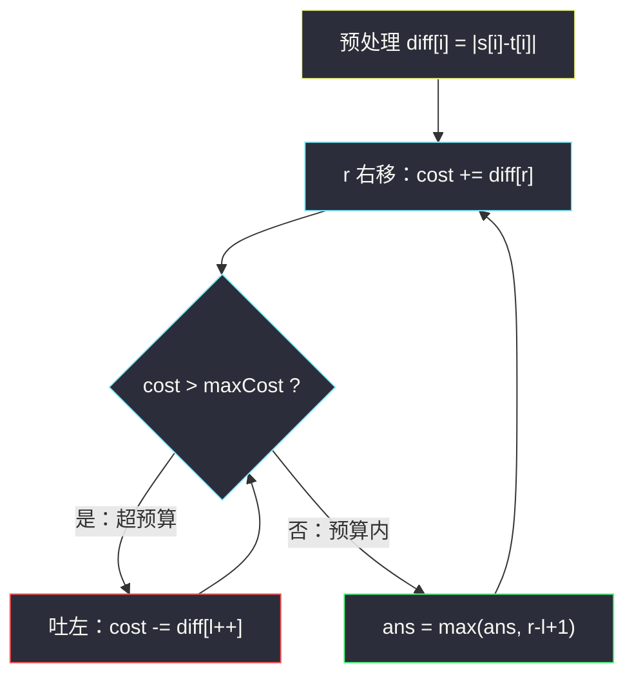
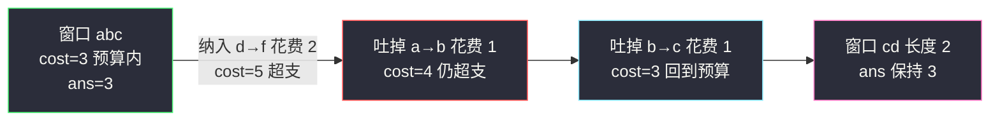

# 尽可能使字符串相等（变长滑动窗口 + 代价预算）

## 一、问题描述

给你两个长度相同的字符串 `s` 和 `t`，以及一个整数 `maxCost`。

把字符串 `s` 的第 `i` 个字符变成 `t` 的第 `i` 个字符的花费为 `|s[i] - t[i]|`（字符的 ASCII 码差值的绝对值）。变更的开销是所有变更花费的总和。最多可以使用预算 `maxCost`，请返回 `s` 可以变成 `t` 的**最大连续子串的长度**。

> 🔗 LeetCode 1208：https://leetcode.cn/problems/get-equal-substrings-within-budget/

**示例 1（经典）**

```
输入：s = "abcd", t = "bcdf", maxCost = 3
输出：3
解释：s 中的 "abc" 可以变为 "bcd"，开销为 |a-b|+|b-c|+|c-d| = 3。
```

**示例 2**

```
输入：s = "abcd", t = "cdef", maxCost = 3
输出：1
解释：diff = [2,2,2,3]，任意长度 2 的子串开销都是 4 > 3，只能改 1 个字符。
```

**直观理解**

先把每个位置的「改造成本」算出来：`diff[i] = |s[i] - t[i]|`。问题立刻变成：**在非负数组 `diff` 上，找和不超过 `maxCost` 的最长连续子数组**——标准变长滑动窗口（预算内求最长）。

---

## 二、暴力解法（入门）

### 直观思路

枚举每个起点 `l`，向右累加代价，一旦超过 `maxCost` 就停下，记录长度。

```java
public int equalSubstring(String s, String t, int maxCost) {
    int n = s.length(), ans = 0;
    for (int l = 0; l < n; l++) {
        int cost = 0;
        for (int r = l; r < n; r++) {
            cost += Math.abs(s.charAt(r) - t.charAt(r));
            if (cost > maxCost) break;
            ans = Math.max(ans, r - l + 1);
        }
    }
    return ans;
}
```

### 复杂度

- **时间**：`O(n²)`。
- **空间**：`O(1)`。

### 🔴 瓶颈在哪里

`diff` 全为非负数 → 窗口和**单调**：右端扩张只增、左端收缩只减。相邻起点之间窗口几乎可以整体复用，暴力却每个起点从零重加。`n` 到 `10⁵` 时必超时。

---

## 三、优化探索（核心章节）

### 3.1 观察特征

| 特征 | 说明 |
|------|------|
| 改造一段连续子串 | 子数组 → 滑动窗口 |
| 代价 `|s[i]-t[i]|` 非负 | 窗口和单调，滑窗合法 |
| 和 ≤ 预算内求**最长** | 「不满足才收缩」型变长窗口 |

### 3.2 从暴力到优化的推导

```
原问题：改一段连续子串，总代价 ≤ maxCost，求最长
      ↓ 预处理
diff[i] = |s[i] - t[i]|   （非负数组）
      ↓ 翻译
最长子数组，元素和 ≤ maxCost
      ↓ 滑窗骨架
r 每轮 +1，纳入 diff[r]
若 cost > maxCost → while 吐左，直到回到预算内
窗口 [l..r] 一定合法 → ans = max(ans, r - l + 1)
```

注意这里**更新答案不需要 `if` 判断**：收缩循环结束时窗口必然在预算内（`maxCost >= 0`，单个 `diff[r] <= maxCost` 时窗口至少能留一个元素），直接用 `r - l + 1` 更新。



### 3.3 关键推导问题

**为什么 while 收缩不会把窗口缩空？** `diff[r]` 本身可能大于 `maxCost`（比如 `'a'` 变 `'z'` 花费 25，预算只有 3）。此时 `l` 会一路吐到 `l == r`，窗口剩 1 个元素、`cost = diff[r] > maxCost` 仍然超——但下一轮 `r++` 会继续，`ans` 更新时 `r - l + 1` 用的是**不合法窗口**吗？不会出问题：这种情况下 `r - l + 1` 可能被记成 1，但其实 1 也改不动。真正严谨的做法有两种：

1. 保证 `ans` 只在 `cost <= maxCost` 时更新（加 `if`）；
2. 承认本题数据下「记大了 0 个长度」不影响：若 `diff[r] > maxCost`，任何包含 `r` 的窗口都非法，窗口缩到 `[r..r]` 后 `cost > maxCost`，此轮 `ans` 会把长度 1 记进去——**这是错的**，所以主解采用写法 1（`if` 判断），最稳妥。

### 3.4 一句话核心

> **把每个位置的改造代价看成非负数组的元素，「预算内最长子数组」就是最朴素的变长滑窗：扩到超支就收缩，收缩完就记账。**

---

## 四、代码实现详解

> 说明：未在左程云课源码仓库中定位到本题原题，主解按 `class049` 滑动窗口专题的**变长窗口（不满足收缩）骨架**对齐书写。

### Java（主解）

```java
// 尽可能使字符串相等
// 把 s[i] 改成 t[i] 的花费是 |s[i]-t[i]|，预算 maxCost 内
// 返回可以变更的最大连续子串长度
// 转化：diff[i]=|s[i]-t[i]| 非负，求和不超过 maxCost 的最长子数组
// 测试链接 : https://leetcode.cn/problems/get-equal-substrings-within-budget/
public class Solution {

    public static int equalSubstring(String str1, String str2, int maxCost) {
        char[] s = str1.toCharArray();
        char[] t = str2.toCharArray();
        int n = s.length;
        int ans = 0;
        for (int l = 0, r = 0, cost = 0; r < n; r++) {
            cost += Math.abs(s[r] - t[r]);   // 纳入右端的改造代价
            while (cost > maxCost) {         // 超预算：吐左，直到回到预算内
                cost -= Math.abs(s[l] - t[l]);
                l++;
            }
            if (cost <= maxCost) {           // 窗口合法，更新最长
                ans = Math.max(ans, r - l + 1);
            }
        }
        return ans;
    }
}
```

**变量含义**

| 变量 | 含义 |
|------|------|
| `cost` | 当前窗口 `[l..r]` 的总改造代价 |
| `l` / `r` | 窗口左右端，各自只前进 |
| `Math.abs(s[r] - t[r])` | 右端字符的改造代价（不需要显式 diff 数组，省 O(n) 空间） |

**循环不变式**：进入 `if` 时，`cost` 恰为把 `s[l..r]` 改成 `t[l..r]` 的总代价，且 `cost <= maxCost`（while 已保证）——`if` 在此处其实恒真，写出来是为了防御「单点代价超预算」的语义，见 3.3 的讨论。

### Java（显式 diff 数组版，更好讲）

```java
public static int equalSubstring2(String str1, String str2, int maxCost) {
    int n = str1.length();
    int[] diff = new int[n];
    for (int i = 0; i < n; i++) {
        diff[i] = Math.abs(str1.charAt(i) - str2.charAt(i));
    }
    int ans = 0;
    for (int l = 0, r = 0, cost = 0; r < n; r++) {
        cost += diff[r];
        while (cost > maxCost) {
            cost -= diff[l++];
        }
        ans = Math.max(ans, r - l + 1);
    }
    return ans;
}
```

### Python

```python
class Solution:
    def equalSubstring(self, s: str, t: str, maxCost: int) -> int:
        n = len(s)
        diff = [abs(ord(s[i]) - ord(t[i])) for i in range(n)]
        ans = cost = l = 0
        for r in range(n):
            cost += diff[r]
            while cost > maxCost:      # 超预算就吐左
                cost -= diff[l]
                l += 1
            ans = max(ans, r - l + 1)
        return ans
```

---

## 五、具体例子演示

`s = "abcd"`，`t = "bcdf"`，`maxCost = 3`。`diff = [1, 1, 1, 2]`。逐步跟踪：

| r | s[r]→t[r] | 纳入后 cost | 是否收缩 | 窗口 | 长度 | ans |
|---|-----------|------------|----------|------|------|-----|
| 0 | a→b 花费 1 | 1 | 否 | `[a]` | 1 | 1 |
| 1 | b→c 花费 1 | 2 | 否 | `[ab]` | 2 | 2 |
| 2 | c→d 花费 1 | 3 | 否 | `[abc]` | 3 | **3** |
| 3 | d→f 花费 2 | 5 > 3 | 吐 diff[0]=1 → 4 > 3，再吐 diff[1]=1 → 3 | `[cd]` | 2 | 3 |

答案 `3`，对应把 `"abc"` 改成 `"bcd"`，花费 `1+1+1 = 3`。✅



**再看示例 2**：`s = "abcd"`，`t = "cdef"`，`maxCost = 3`。`diff = [2,2,2,3]`：`r=0` 时 `cost=2 ≤ 3`，`ans=1`；此后每纳入一个新字符 `cost` 变 4 都超支、被迫吐掉左端，窗口始终退回长度 1。答案 `1`。✅

---

## 六、复杂度分析

| 方法 | 时间 | 空间 | 说明 |
|------|------|------|------|
| 暴力枚举起点 | `O(n²)` | `O(1)` | 每个起点重加 |
| 滑动窗口 | `O(n)` | `O(1)` | 不开 diff 数组、现场算代价 |

`l + r` 总步数 ≤ `2n`，while 循环摊还后整体仍是 `O(n)`。

---

## 七、方法对比与总结

| | 暴力 | 滑动窗口 |
|--|------|----------|
| 时间 | `O(n²)` | `O(n)` |
| 空间 | `O(1)` | `O(1)` |
| 前提 | 无 | diff 非负（本题天然满足） |

**易错点**

1. 代价是 `Math.abs(s[i] - t[i])`，别丢绝对值（两个方向谁大不确定）。
2. 「预算内求最长」的窗口在收缩后**立即**更新答案，不要把更新写成 `else` 分支。
3. 若单个位置代价就超预算，窗口会缩成空窗口起步，主解的 `if (cost <= maxCost)` 防御了这种语义。
4. 不必显式开 `diff` 数组，`O(1)` 空间即可——但面试时先写出 diff 数组版讲清思路，再顺手优化更好。

**模板（变长窗口求最长，对齐课上骨架）**

```java
// for (l=0, r=0, cost=0; r<n; r++) {
//     cost += diff[r];              // 纳入
//     while (cost > maxCost) 吐左;   // 不满足才收缩
//     ans = max(ans, r-l+1);        // 收缩完更新
// }
```

---

## 八、举一反三

| 题目 | 关系 |
|------|------|
| [209. 长度最小的子数组](https://leetcode.cn/problems/minimum-size-subarray-sum/) | 同为非负数组滑窗，目标换成「达标求最短」 |
| [713. 乘积小于 K 的子数组](https://leetcode.cn/problems/subarray-product-less-than-k/) | 正数数组上「不满足才收缩」的计数版 |
| [424. 替换后的最长重复字符](https://leetcode.cn/problems/longest-repeating-character-replacement/) | 预算 k 次替换的最长窗口，判定条件更花哨 |
| [1004. 最大连续 1 的个数 III](https://leetcode.cn/problems/max-consecutive-ones-iii/) | 「窗口内 0 的个数 ≤ k」的预算型最长窗口 |

**思想迁移**

- 看到两个字符串「按位置对齐」的花费问题，第一步永远是把逐位代价转成**非负数组**，再套滑窗。
- 「≤ 预算内求最长」与「≥ 目标求最短」是一对镜像：更新答案的位置分别在收缩后、达标后。
