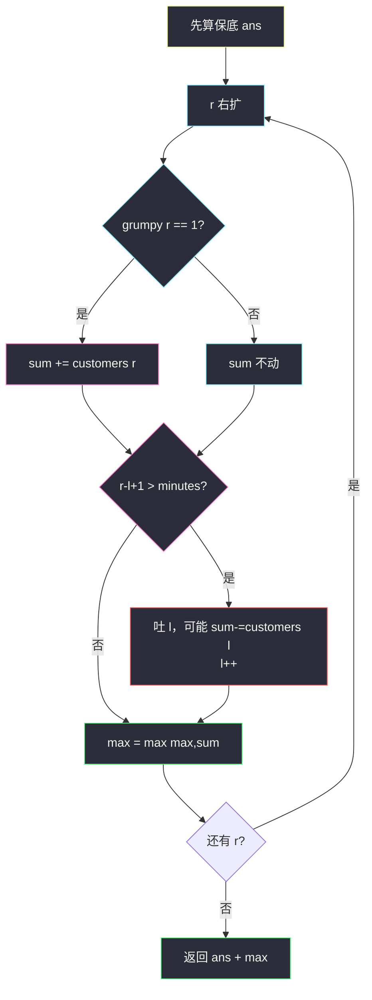

# 爱生气的书店老板（定长窗口 · 先保底再捞最大挽回）

## 一、问题描述

有一个书店老板，他的商店忙的时候会生气，不忙的时候不会生气。

- `customers[i]`：第 `i` 分钟进入商店的顾客数  
- `grumpy[i]`：第 `i` 分钟老板是否生气，`1` 生气，`0` 不生气  
- 老板生气时，那一分钟的顾客会不满意；不生气时，顾客都满意  
- 老板可以**连续 `minutes` 分钟**强制不生气（技巧只使用一次）

返回这一天满意顾客的最大数目。

> 🔗 LeetCode 1052：https://leetcode.cn/problems/grumpy-bookstore-owner/

**示例 1**

```
输入：customers = [1,0,1,2,1,1,7,5], grumpy = [0,1,0,1,0,1,0,1], minutes = 3
输出：16
解释：技巧盖住下标 [5,6,7]，额外挽回 1+5=6；
     本来就不生气的 1+1+1+7=10；合计 16。
```

```
下标:        0  1  2  3  4  5  6  7
customers:   1  0  1  2  1  1  7  5
grumpy:      0  1  0  1  0  1  0  1
技巧窗口:                    [1,7,5]
可挽回(仅生气):               1 + 0 + 5 = 6
```

**示例 2**

```
输入：customers = [1], grumpy = [0], minutes = 1
输出：1
```

**直观理解（拆成两笔账）**

```
答案 = 保底 + 最大挽回

保底：grumpy[i]==0 的 customers[i] 一定满意（技巧用不用都有）
挽回：技巧盖住的连续 minutes 分钟里，grumpy[i]==1 的 customers[i] 之和
      → 在所有定长窗口上取 max
```

与 class049「定长窗口」同一骨架：`r` 右扩，`r-l+1 > minutes` 时强制 `l` 左吐。

---

## 二、暴力解法（入门）

### 直观思路

枚举技巧窗口左端点 `l`，对每个窗口把「窗口内强制不生气」后的整天满意数算一遍，取 max。

```java
// 爱生气的书店老板
// 测试链接 : https://leetcode.cn/problems/grumpy-bookstore-owner/
public static int maxSatisfied1(int[] customers, int[] grumpy, int minutes) {
    int n = customers.length;
    int ans = 0;
    for (int l = 0; l < n; l++) {
        int r = Math.min(n - 1, l + minutes - 1);
        // 技巧窗口 [l..r]，不足 minutes 时也只盖到结尾
        int sum = 0;
        for (int i = 0; i < n; i++) {
            if (grumpy[i] == 0 || (i >= l && i <= r)) {
                sum += customers[i];
            }
        }
        ans = Math.max(ans, sum);
        if (r == n - 1) {
            break;
        }
    }
    return ans;
}
```

### 复杂度

- **时间**：`O(n²)`。每个起点都扫全天。
- **空间**：`O(1)`。

### 🔴 瓶颈在哪里

保底部分（`grumpy==0`）每个窗口都重复加；相邻窗口只差一头一尾。  
应按 class049 定长模板：先拿保底，再用 `l/r` 窗口只维护「可挽回」增量。

---

## 三、优化探索（核心章节）

### 3.1 观察特征

| 特征 | 说明 |
|------|------|
| 技巧长度固定为 `minutes` | **定长窗口**（与 567 排列同型：超长强制吐左） |
| 保底与窗口无关 | `grumpy[i]==0` 先一次性加进 `ans` |
| 窗口只统计生气顾客 | `sum` = 窗口内 `grumpy==1` 的 `customers` 之和 |
| 目标 | `ans + max(sum)` |

### 3.2 暴力 → 优化：定长 `l/r` 窗口

与 class049 定长模板一致：

```
1) 先扫一遍：grumpy[i]==0 → ans += customers[i]   // 保底

2) 定长窗口找最大挽回：
   for (l=0, r=0, sum=0; r < n; r++) {
       纳入 r：若生气，sum += customers[r]
       若 r-l+1 > minutes：吐出 l（若生气则 sum 减），l++
       max = Math.max(max, sum)
   }

3) return ans + max
```



### 3.3 关键推导问题（定长窗口）

| 问题 | 答案 |
|------|------|
| 窗口维护什么？ | `sum` = `[l..r]` 内**因生气可挽回**的顾客数 |
| 何时右扩？ | `r` 每步 +1；仅 `grumpy[r]==1` 时 `sum` 增加 |
| 何时左缩？ | **`r - l + 1 > minutes`** 时强制吐 `l`（定长，不是 while 条件型） |
| 为何窗口不加不生气的？ | 已在保底里；再加会重复 |
| 与 643 定长差在哪？ | 643 窗口加所有元素；本题窗口**只加生气位** |

### 3.4 循环不变式

> **不变式 A**：`ans` = 所有 `grumpy[i]==0` 的 `customers[i]` 之和（与窗口无关）。  
> **不变式 B**：`sum` = 当前窗口 `[l..r]` 内 `grumpy[i]==1` 的 `customers[i]` 之和。  
> **不变式 C**：每次强制吐左后，`r - l + 1 ≤ minutes`；`r` 足够大后窗口长度恰为 `minutes`。

### 3.5 一句话核心

> **保底先加完；再用 `l/r` 定长窗口（超长吐左）扫「生气顾客」的最大窗口和，两者相加。**

---

## 四、代码实现详解

### Java（与 class049 同风格）

```java
// 爱生气的书店老板
// 有一个书店老板，他的商店忙的时候会生气，不忙的时候不会生气
// customers[i] 是第 i 分钟进入商店的顾客数
// grumpy[i] 是第 i 分钟老板是否生气，1 生气，0 不生气
// 老板生气时那一分钟的顾客会不满意，不生气时顾客都满意
// 老板可以让自己连续 minutes 分钟不生气（只使用一次）
// 返回这一天满意顾客的最大数目
// 测试链接 : https://leetcode.cn/problems/grumpy-bookstore-owner/
public class Solution {

    public static int maxSatisfied(int[] customers, int[] grumpy, int minutes) {
        int n = customers.length;
        // 保底：本来就不生气的顾客
        int ans = 0;
        for (int i = 0; i < n; i++) {
            if (grumpy[i] == 0) {
                ans += customers[i];
            }
        }
        // 定长窗口：连续 minutes 分钟里，因生气可挽回的最大值
        int max = 0;
        for (int l = 0, r = 0, sum = 0; r < n; r++) {
            // ① 右扩：只有生气分钟才计入挽回
            if (grumpy[r] == 1) {
                sum += customers[r];
            }
            // ② 超长强制吐左（定长模板）
            if (r - l + 1 > minutes) {
                if (grumpy[l] == 1) {
                    sum -= customers[l];
                }
                l++;
            }
            // ③ 更新最大挽回
            max = Math.max(max, sum);
        }
        return ans + max;
    }
}
```

| 变量 | 含义 |
|------|------|
| `ans` | 保底满意顾客 |
| `l, r` | 技巧窗口左右端（闭区间），与 class049 一致 |
| `sum` | 窗口内可挽回人数 |
| `max` | 历史最大挽回 |
| `r - l + 1 > minutes` | 定长：长度超了必须 `l++` |

**和「先算第一个窗口再从 `minutes` 滑」写法等价**，但 `l/r` 一趟扫与课上模板统一，更好默写。

### Python（同结构）

```python
class Solution:
    def maxSatisfied(self, customers: list[int], grumpy: list[int], minutes: int) -> int:
        n = len(customers)
        ans = 0
        for i in range(n):
            if grumpy[i] == 0:
                ans += customers[i]
        max_gain = 0
        l = 0
        sum_ = 0
        for r in range(n):
            if grumpy[r] == 1:
                sum_ += customers[r]
            if r - l + 1 > minutes:
                if grumpy[l] == 1:
                    sum_ -= customers[l]
                l += 1
            max_gain = max(max_gain, sum_)
        return ans + max_gain
```

---

## 五、具体例子演示

`customers = [1,0,1,2,1,1,7,5]`，`grumpy = [0,1,0,1,0,1,0,1]`，`minutes = 3`

**保底**：下标 0,2,4,6 → `1+1+1+7 = 10`

| r | 纳入 | sum | 超长吐左？ | l | 窗口 | max |
|---|------|-----|-----------|---|------|-----|
| 0 | 不生气 | 0 | 否 | 0 | [0] | 0 |
| 1 | 生气 +0 | 0 | 否 | 0 | [0,1] | 0 |
| 2 | 不生气 | 0 | 否 len=3 | 0 | [0..2] | 0 |
| 3 | 生气 +2 | 2 | 是：吐0(不生气)，l=1 | 1 | [1..3] | 2 |
| 4 | 不生气 | 2 | 吐1(+0)，l=2 | 2 | [2..4] | 2 |
| 5 | 生气 +1 | 3 | 吐2，l=3 | 3 | [3..5] | 3 |
| 6 | 不生气 | 3 | 吐3(-2)，l=4，sum=1 | 4 | [4..6] | 3 |
| 7 | 生气 +5 | 6 | 吐4，l=5 | 5 | [5..7] | **6** |

答案：`10 + 6 = 16`。


**ASCII（最优窗口）**

```
索引:  0  1  2  3  4  5  6  7
cust:  1  0  1  2  1  1  7  5
grum:  0  1  0  1  0  1  0  1
                      l→    r→
窗口 [5,6,7]：生气位顾客 1+5=6（7 不生气，不进 sum）
```

---

## 六、复杂度分析

| 方法 | 时间 | 空间 | 说明 |
|------|------|------|------|
| 枚举窗口扫全天 | `O(n²)` | `O(1)` | 保底重复算 |
| **保底 + 定长 l/r** | **`O(n)`** | `O(1)` | `l、r` 各最多走 n 步 |

---

## 七、方法对比与总结

### 7.1 与 class049 定长模板对照

| 题目 | 窗口长度 | 窗口维护 | 超长动作 |
|------|----------|----------|----------|
| 567 字符串排列 | `\|s1\|` | `cnts + debt` | `r-l+1 > m` 吐左 |
| 643 最大平均数 | `k` | 窗口和 | 右进左出 |
| **1052 本题** | `minutes` | 生气顾客和 | `r-l+1 > minutes` 吐左 |

### 7.2 易错点

1. 窗口里把不生气顾客再加进 `sum` → 与保底重复。  
2. 写成变长 `while` 缩窗 —— 本题是**定长强制吐**。  
3. 忘记先算保底，只返回 `max`。  
4. 默写时丢掉 `public static` / `测试链接` 头注释（课上规范）。

### 7.3 模板（课上定长）

```java
// 先处理与窗口无关的部分（本题：保底）
for (int l = 0, r = 0, sum = 0; r < n; r++) {
    // 纳入 r，更新 sum
    if (r - l + 1 > X) {
        // 吐出 l，更新 sum
        l++;
    }
    // 用当前 sum 更新答案
}
```

---

## 八、举一反三

| 题目 | 关系 |
|------|------|
| [643. 子数组最大平均数 I](https://leetcode.cn/problems/maximum-average-subarray-i/) | 同款定长，窗口加全部元素 |
| [567. 字符串的排列](https://leetcode.cn/problems/permutation-in-string/) | class049：定长 + 超长吐左 |
| [1456. 定长子串中元音的最大数目](https://leetcode.cn/problems/maximum-number-of-vowels-in-a-substring-of-given-length/) | 定长 + 窗口内条件计数 |
| [1004. 最大连续1的个数 III](https://leetcode.cn/problems/max-consecutive-ones-iii/) | 变长：额度用完才缩 |

**思想迁移**

```
「有一段固定长度的特权」
  ↓
答案 = 无特权保底 + 特权窗口最大增量
  ↓
class049 定长：r 扩；r-l+1 > X 则吐 l
```

**记忆口诀**：不生气先加保底；生气才进窗口和；超长吐左取 max；`ans + max` 即答案。
