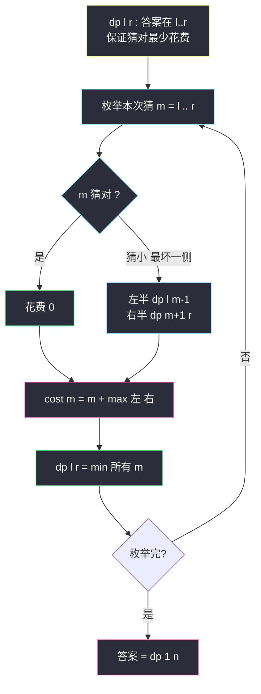
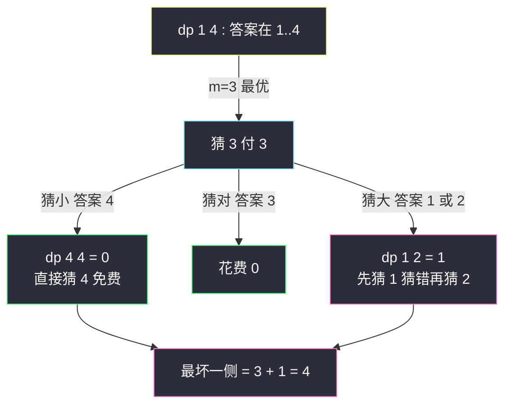

# 猜数字大小 II（区间 DP：最坏情况下的最少钱）

## 一、问题描述

我们在玩猜数字游戏，规则如下：

- 我从 `1..n` 中选一个数字，你来猜。
- 每次你猜 `x`：猜错要付 `x` 元；猜对免费。猜小了/猜大了我会告诉你。

现在要求：**保证无论我选哪个数字，你都能猜对**的前提下，你口袋里**至少**要准备多少钱。

> 🔗 LeetCode 375：https://leetcode.cn/problems/guess-number-higher-or-lower-ii/

**示例 1**

```
输入：n = 10
输出：16
解释：一种最优策略首个猜 7，无论反馈如何，16 元足够
```

**示例 2**

```
输入：n = 1
输出：0
解释：唯一数字 1，直接猜对，不花钱
```

**直观理解**

这题是**对抗性**（minimax）问题：你要选策略让「最坏情况的花费」最小。关键两个洞察：

1. 二分策略在这里**不一定最优**——二分最小化的是「次数」，本题要最小化的是「付的钱」，猜错一个中间大数的代价很高。
2. 猜错 `x` 后，答案范围收缩到 `x` 的左侧或右侧——**子问题是更小的连续区间**。这正是区间 DP 的形态（本题课上没有原题，按 class076 区间 DP「枚举分割点」骨架对齐：`dp[l][r] = 枚举 m，左右子区间最优 + 本次决策代价`）。

---

## 二、暴力解法

### 直观思路

递归定义 `f(l, r)`：答案在 `l..r` 中，**保证猜对的最少花费**。枚举本次猜 `m`：

- 若猜对（`m` 恰是答案）：花费 0
- 若猜小（答案在 `m+1..r`）：花费 `m + f(m+1, r)`
- 若猜大（答案在 `l..m-1`）：花费 `m + f(l, m-1)`

**对手会选最坏的反馈**，所以猜 `m` 的真实代价是：

```
cost(m) = m + max( f(l, m-1), f(m+1, r) )
```

我们再对所有 `m` 取最小：

```java
// 暴力递归：答案在 l..r，保证猜对的最少花费
public static int getMoneyAmount1(int n) {
    return f(1, n);
}

public static int f(int l, int r) {
    if (l >= r) {
        return 0;   // 区间空或单点：不用花钱（唯一候选直接猜对）
    }
    int ans = Integer.MAX_VALUE;
    for (int m = l; m <= r; m++) {
        // 猜 m：对最坏反馈取 max，再对所有 m 取 min
        int cost = m + Math.max(f(l, m - 1), f(m + 1, r));
        ans = Math.min(ans, cost);
    }
    return ans;
}
```

### 复杂度

- **时间**：`O(n!)` 级别，递归树按区间划分指数展开
- **空间**：`O(n)` 递归栈

### 🔴 瓶颈在哪里

同样的子区间 `(l, r)` 会在不同猜序下反复出现。状态只有 `O(n²)` 个——区间型重叠子问题，加缓存即区间 DP。

---

## 三、优化探索（核心章节）

### 3.1 可变参数分析

可变参数：当前候选区间的端点 `l`、`r` → 二维表。

| dp 定义 | 含义 |
|---------|------|
| `dp[l][r]` | 答案在 `l..r` 时，保证猜对的最少花费 |

边界：`l >= r` 时为 0（空区间无意义；单点区间唯一候选 `l`，直接猜 `l` 必对，免费）。

### 3.2 转移方程推导（minimax 双层取值）

```
dp[l][r] = min over m ∈ [l, r] of:
           m + max( dp[l][m-1], dp[m+1][r] )
```

- 内层 `max`：对手的视角——你猜 `m` 后，对手会把答案放在让你**更贵**的那一侧
- 外层 `min`：你的视角——选一个让最坏情况最便宜的猜测

与 #1039 三角剖分同属「枚举分割点」骨架：`m` 一刀把区间切成 `(l, m-1)` 和 `(m+1, r)` 两半，代价 `m` 加在本次决策头上。

### 3.3 遍历顺序

`dp[l][r]` 依赖 `dp[l][m-1]`（右端 < r）与 `dp[m+1][r]`（左端 > l）——都是**更短的区间**。所以 `l` 从大到小、`r` 从小到大填表（与 #516/#1039 完全一致的填法）。



### 3.4 关键问题

| 问题 | 答案 |
|------|------|
| 为什么二分不是最优？ | 例：n=10 首猜 5，猜小时要付 5 并进 6..10，总花费远超首猜 7 的方案；代价是「钱的加权」，不是次数 |
| 单点区间为什么免费？ | 只剩一个候选时直接猜它，猜对不付钱——这是 `l >= r → 0` 边界的依据 |
| 内层 max 会不会高估？ | 不会：对手知道你的策略（策略是公开的确定性最优），必然把答案放在更贵一侧；max 恰是「保证」的语义 |
| 会不会漏掉「猜对」分支？ | 猜对花费 0，被 max 天然吸收（0 ≤ 任何一侧花费），不影响正确性 |
| m 从 l 还是 l+1 开始枚举？ | 都可；`m = l` 时左半是空区间 `dp[l][l-1] = 0`。本文按 `m ∈ [l, r]` 写，与多数资料一致 |
| 记忆化与填表差在哪？ | 无本质差别；填表版可顺手把 `m` 的枚举起点抬到 `l+1`（`m=l` 时 `dp[l][r] = l + dp[l+1][r]` 已覆盖，另见易错点 3） |

### 3.5 一句话核心

> **你选 min、对手送 max：dp[l][r] = min over m of ( m + max(dp[l][m-1], dp[m+1][r]) )，区间从短填到长。**

---

## 四、代码实现

### Java（主解：严格位置依赖区间 DP）

```java
// 猜数字大小 II
// 猜错支付所猜数字，猜对免费；保证猜对的前提下最少准备多少钱
// 测试链接 : https://leetcode.cn/problems/guess-number-higher-or-lower-ii/
// 说明 : 课上无原题，按 class076 区间 DP「枚举分割点」骨架对齐
//        (同体系 : #1039 三角剖分 dp[l][m] + dp[m][r] + 本次代价)
public class Solution {

    // 时间复杂度 O(n^3)，空间复杂度 O(n^2)
    public static int getMoneyAmount(int n) {
        // dp[l][r] : 答案在 l..r 时，保证猜对的最少花费
        // 下标 0 弃用，区间端点 1..n；l >= r 的格子保持 0（边界）
        int[][] dp = new int[n + 2][n + 2];
        // 依赖方向 : 更短区间先算 → l 从大到小、r 从小到大
        for (int l = n; l >= 1; l--) {
            // r 从 l+1 开始（r = l 的格子恒 0，不用填）
            for (int r = l + 1; r <= n; r++) {
                dp[l][r] = Integer.MAX_VALUE;
                for (int m = l; m <= r; m++) {
                    // 猜 m 的最坏代价 : m + max(更小的左区间, 更小的右区间)
                    int cost = m + Math.max(
                            m - 1 >= l ? dp[l][m - 1] : 0,
                            m + 1 <= r ? dp[m + 1][r] : 0);
                    dp[l][r] = Math.min(dp[l][r], cost);
                }
            }
        }
        return dp[1][n];
    }
}
```

### Java（对照版：记忆化搜索）

```java
// 记忆化 : 递归 + 缓存，思路与填表版完全一致
public class Solution {

    public static int getMoneyAmount(int n) {
        int[][] dp = new int[n + 2][n + 2];
        for (int[] row : dp) {
            Arrays.fill(row, -1);
        }
        return f(1, n, dp);
    }

    public static int f(int l, int r, int[][] dp) {
        if (l >= r) {
            return 0;
        }
        if (dp[l][r] != -1) {
            return dp[l][r];
        }
        int ans = Integer.MAX_VALUE;
        for (int m = l; m <= r; m++) {
            ans = Math.min(ans, m + Math.max(f(l, m - 1, dp), f(m + 1, r, dp)));
        }
        dp[l][r] = ans;
        return ans;
    }
}
```

### Python（主解同思路）

```python
class Solution:
    def getMoneyAmount(self, n: int) -> int:
        # dp[l][r] : 答案在 l..r，保证猜对的最少花费
        dp = [[0] * (n + 2) for _ in range(n + 2)]
        for l in range(n, 0, -1):
            for r in range(l + 1, n + 1):
                dp[l][r] = min(
                    m + max(dp[l][m - 1], dp[m + 1][r])
                    for m in range(l, r + 1)
                )
        return dp[1][n]
```

---

## 五、具体例子演示

以 `n = 4`（区间 1..4）为例，手工填完整张表。

### 逐格跟踪

先看长度 2 的区间（`l+1 = r`，只有两个候选）：

| 格 | m 枚举 | 计算 | 结果 |
|----|--------|------|------|
| dp[1][2] | m=1 | 1 + max(0, dp[2][2]=0) = 1；m=2 | 2 + max(dp[1][1]=0, 0) = 2 | **1** |
| dp[2][3] | m=2 / m=3 | 2 / 3 | **2** |
| dp[3][4] | m=3 / m=4 | 3 / 4 | **3** |

策略解读（dp[1][2] = 1）：先猜小的 `1`，猜错（答案必是 2）再猜 2 也才共花 1。

长度 3 的区间：

| 格 | m 枚举 | 计算 | 结果 |
|----|--------|------|------|
| dp[1][3] | m=1 | 1 + max(0, dp[2][3]=2) = 3 | |
|  | m=2 | 2 + max(dp[1][1]=0, dp[3][3]=0) = **2** | |
|  | m=3 | 3 + max(dp[1][2]=1, 0) = 4 | **2** |
| dp[2][4] | m=2 | 2 + max(0, dp[3][4]=3) = 5 | |
|  | m=3 | 3 + max(0, 0) = **3** | |
|  | m=4 | 4 + max(dp[2][3]=2, 0) = 6 | **3** |

长度 4 的最终区间：

| 格 | m 枚举 | 计算 | 结果 |
|----|--------|------|------|
| dp[1][4] | m=1 | 1 + max(0, dp[2][4]=3) = 4 | |
|  | m=2 | 2 + max(0, dp[3][4]=3) = 5 | |
|  | m=3 | 3 + max(dp[1][2]=1, dp[4][4]=0) = **4** | |
|  | m=4 | 4 + max(dp[1][3]=2, 0) = 6 | **4** |

答案 `dp[1][4] = 4`，最优首猜 `3`。



**验证对抗过程**：猜 3 花 3，对手最坏说「猜大了」→ 进 `1..2`；再猜 1，若猜小（答案是 2）花 1，总 4。对手选任何一侧都不能让总花费超过 4。

---

## 六、复杂度分析

| 版本 | 时间 | 空间 | 说明 |
|------|------|------|------|
| 暴力递归 | `O(n!)` 级 | `O(n)` | 区间划分指数展开 |
| 记忆化搜索 | `O(n³)` | `O(n²)` | 每状态枚举 `O(n)` 个 m |
| 严格位置依赖（主解） | `O(n³)` | `O(n²)` | 状态 `O(n²)` × 转移 `O(n)` |

---

## 七、方法对比与总结

### minimax 三层对比

| 层 | 决策者 | 取 | 含义 |
|----|--------|-----|------|
| 最外层 | 你 | min | 选最便宜的猜测 |
| 中层 | 对手（最坏情况） | max | 把答案放到更贵一侧 |
| 最内 | 递归 | — | 收缩区间重复博弈 |

这与 #464 我能赢吗、#486 预测赢家同属博弈 DP，只是后两者在「集合」上博弈，本题在「区间」上博弈——区间性让状态数降到 `O(n²)`。

### 区间 DP 家族对照

| 题 | 决策 | 代价 | 骨架 |
|----|------|------|------|
| #1039 三角剖分 | 选第三顶点 | 三值乘积 | `dp[l][m] + dp[m][r] + w` |
| **#375 猜数字（本题）** | 选猜测 m | m + 最坏一侧 | `m + max(左, 右)` |
| #312 戳气球 | 选最后爆的 | 邻居乘积 | `dp[l][k-1] + dp[k+1][r] + w` |

### 易错点

1. **写成普通 min DP 忘了内层 max**：对手会钻空子，答案偏小。
2. **边界 `l >= r` 忘记返回 0**：单点区间免费，是整棵递归的叶子。
3. **想当然用二分**：本题最小化「钱」不是「次数」，`n=10` 首猜 5 要准备 50 元级别，首猜 7 只要 16。
4. **枚举 m 含 l 和 r**：m 取端点时一侧为空区间（花费 0），都要纳入比较。

### 模板口诀

> **猜 m 付 m 钱，对手挑贵边；min 套 max 是保证，区间填表短到长。**

---

## 八、举一反三

| 题目 | 链接 | 迁移点 |
|------|------|--------|
| 312. 戳气球 | https://leetcode.cn/problems/burst-balloons/ | 区间 DP 封神题，同样「枚举决策点 + 两半独立」 |
| 1039. 多边形三角剖分 | https://leetcode.cn/problems/minimum-score-triangulation-of-polygon/ | 同骨架最直白的形态（class076 Code03） |
| 486. 预测赢家 | https://leetcode.cn/problems/predict-the-winner/ | minimax 博弈，从两端取数（非区间划分型） |
| 877. 石子游戏 | https://leetcode.cn/problems/stone-game/ | 同 #486 的区间博弈变体 |
| 464. 我能赢吗 | https://leetcode.cn/problems/can-i-win/ | 状态压缩博弈，对照「区间」与「子集」两种状态空间 |

**迁移一句**：博弈/保证类问题先找「谁决策、取 min 还是 max」，再看子问题是不是连续区间——是，就套本题骨架；不是（比如从两端取、从集合取），换成对应的状态形态。
