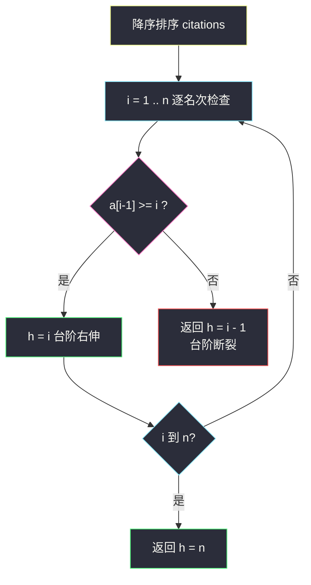
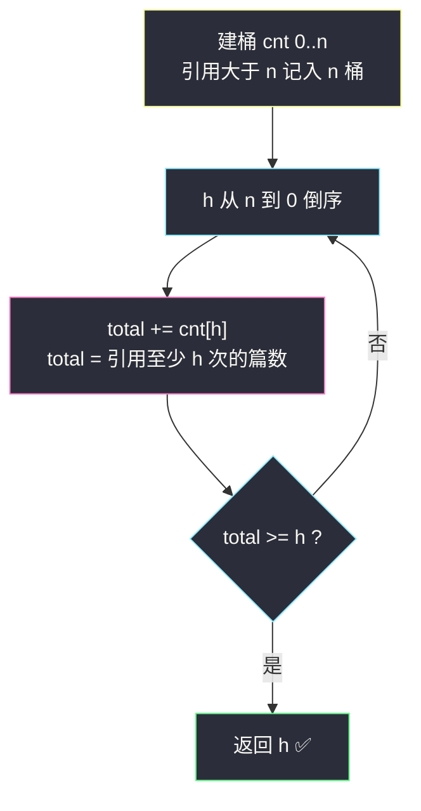

# H 指数（排序 + 计数两种视角）

## 一、问题描述

给你一个整数数组 `citations`，其中 `citations[i]` 是研究者的第 `i` 篇论文的引用次数。请你计算并返回该研究者的 **h 指数**。

h 指数的定义：一名科研人员的 h 指数是指他至少有 `h` 篇论文**分别**被引用了**至少** `h` 次，且其余的 `n - h` 篇论文每篇引用次数**不超过** `h` 次。（换言之，h 是满足条件的最大值。）

> 🔗 LeetCode 274：https://leetcode.cn/problems/h-index/

**示例 1**

```
输入：citations = [3,0,6,1,5]
输出：3
解释：给定数组表示研究者 5 篇论文，引用次数 3,0,6,1,5。
     由于研究者有 3 篇论文每篇 至少 被引用 3 次，且其余两篇论文每篇被引用
     不多于 3 次，所以她的 h 指数是 3。
```

**示例 2**

```
输入：citations = [1,3,1]
输出：1
```

**直观理解**

h 指数刻画的是「高产出 × 高质量」的复合指标：**有 h 篇硬通货论文，每篇引用 ≥ h**。把引用次数从高到低排成一列（像台阶一样递减），从第一篇开始数：只要第 `i` 篇（从 1 数起）的引用数 ≥ `i`，说明前 `i` 篇都能撑起「至少 i 篇各被引用至少 i 次」——台阶还能往右延伸；一旦某篇引用数 < 它的名次，台阶到头，h 就是上一个名次。本质是一道**「排序后找位置与值的平衡点」**题，而由于「论文数 n」也是个小整数，还有一条**计数字当桶号**的 O(n) 路线。

---

## 二、暴力解法（入门）

### 直观思路

h 的可能取值只有 `0..n`，直接**从大到小逐个验证**：对候选值 h，扫一遍数组数「引用 ≥ h」的论文篇数是否 ≥ h。第一个满足的大 h 即答案。

```java
public int hIndex(int[] citations) {
    int n = citations.length;
    for (int h = n; h >= 1; h--) {          // 从大到小试
        int cnt = 0;
        for (int c : citations) {
            if (c >= h) {
                cnt++;
            }
        }
        if (cnt >= h) {
            return h;                       // 最大的可行 h
        }
    }
    return 0;
}
```

### 复杂度

- **时间**：`O(n²)`——n 个候选值各扫一遍数组；`n = 5000` 时约 2.5×10⁷，勉强能过但不优雅
- **空间**：`O(1)`

### 🔴 瓶颈在哪里

**「数有多少篇 ≥ h」这件事被重复算了 n 遍**，而不同 h 的计数结果彼此高度相关——排序一次（或计数一次），所有 h 的答案就全部免费可得。缺少的只是**有序性**：引用次数一旦有序，「前 k 大都 ≥ k」就变成一眼可查的位置关系。

---

## 三、优化探索（核心章节）

### 3.1 观察特征

| 特征 | 结论 |
|------|------|
| h 的判定只关心「有多少篇引用 ≥ 某阈值」 | 阈值与篇数都是小整数（≤ n）——排序或计数都吃得下 |
| 排序（降序）后，第 i 名的引用 `a[i-1]` 与名次 i 的关系决定 h | 找最大的 i 使 `a[i-1] >= i`，h = i |
| 引用次数可以大于 n，但「至少 h 次」在 h ≤ n 时封顶有效 | 计数版把所有 > n 的引用统一记到「n 桶」，不影响判定 |

### 3.2 排序视角（降序找台阶）

将 `citations` **降序**排序得 `a[0] ≥ a[1] ≥ ... ≥ a[n-1]`。从 i=1（名次）开始检查：

- 若 `a[i-1] ≥ i`：前 i 名每篇引用 ≥ i → h 可以取到 i，继续右伸；
- 第一次遇到 `a[i-1] < i`：台阶断裂，答案 = i - 1（上一个名次）。

`[3,0,6,1,5]` 降序 → `[6,5,3,1,0]`：名次 1: 6≥1 ✅，名次 2: 5≥2 ✅，名次 3: 3≥3 ✅，名次 4: 1<4 ✗ → h=3。



**为什么这个名次就是最大 h（不重不漏）？** 排序后 `a[i-1] ≥ i` 蕴含前 i-1 名（都 ≥ a[i-1] ≥ i）每篇引用也 ≥ i，即「i 篇各 ≥ i 次」成立；而断裂处 `a[i] < i+1`（0 起下标）说明第 i+1 名起引用不足，更大的 h' > i 都凑不出——判据与定义严格等价。

### 3.3 计数视角（O(n) 的桶）

开桶 `cnt[0..n]`：`citations[i] > n` 的记 `cnt[n]++`（引用超过 n 篇的论文，对任何 h ≤ n 的判定都算「达标」，封顶到 n 不损失信息），否则 `cnt[citations[i]]++`。

然后**从 n 往 0 累加**：`total += cnt[h]`，`total` = 引用 ≥ h 的篇数。第一个满足 `total >= h` 的 h 即答案——与降序台阶法完全等价，只是「排序」被「倒序前缀和」取代。



### 3.4 关键推导问题

| 问题 | 答案 |
|------|------|
| 为什么要从 n 往小检查而不是从小往大？ | h 要**最大**值；`total >= h` 关于 h 单调不增 vs 递增，从小到大第一个满足的不保证最大，倒序第一个满足即最大 |
| 引用 > n 为什么能封顶到 n？ | 判定 h ≤ n 时「引用 ≥ h」与「引用 ≥ n 且 n ≥ h」等价；超过 n 的精度毫无价值 |
| 全部论文引用都是 0 时？ | 倒序累加到 h=0 任何 total ≥ 0 恒成立（0≥0），返回 0 正确 |
| 排序版与计数版何时选谁？ | 面试先写排序版（3 行、讲得清定义）；数据量大/要求线性时上计数版；#275（已排序输入）则用二分 |
| `total >= h` 与「其余 n-h 篇不超过 h」矛盾吗？ | 不矛盾：h 最大性自动保证——若其余某篇引用 > h，则它会被计入更大的 total，更大的 h 就该成立，矛盾 |

### 3.5 一句话核心

> **降序排成台阶，名次 i 与引用 a[i-1] 的平衡点就是 h；桶版用「倒序前缀和」把排序整个省掉。**

---

## 四、代码实现详解

> 说明：课源码仓库未收录 #274 原题。主解按排序基础与「计数值当下标」计数骨架书写（与课上计数/桶排序思想同源），简洁易懂优先。

### Java（主解 1：降序排序 + 名次判据）

```java
// H 指数
// 测试链接 : https://leetcode.cn/problems/h-index/
class Solution {

    public int hIndex(int[] citations) {
        Arrays.sort(citations);            // 升序
        int n = citations.length;
        int h = 0;
        // 从最后一名（引用最大）往前数名次：名次 i 对应 citations[n - i]
        for (int i = 1; i <= n; i++) {
            if (citations[n - i] >= i) {   // 第 i 名(1 起)引用 >= i
                h = i;
            } else {
                break;                     // 台阶断裂
            }
        }
        return h;
    }
}
```

（升序排序从尾部倒着数名次，与「降序数组从前往后」完全等价，少写一个比较器。）

### Java（主解 2：计数桶 O(n) 版）

```java
class Solution {

    public int hIndex(int[] citations) {
        int n = citations.length;
        int[] cnt = new int[n + 1];
        for (int c : citations) {
            cnt[Math.min(c, n)]++;         // 引用大于 n 封顶记入 n 桶
        }
        int total = 0;
        for (int h = n; h >= 0; h--) {     // 倒序找最大 h
            total += cnt[h];
            if (total >= h) {
                return h;
            }
        }
        return 0;                          // 不会到达（h=0 恒满足）
    }
}
```

### Python

```python
# H 指数（排序版）
# 测试链接 : https://leetcode.cn/problems/h-index/
class Solution:
    def hIndex(self, citations: list[int]) -> int:
        citations.sort()
        n, h = len(citations), 0
        for i in range(1, n + 1):
            if citations[n - i] >= i:
                h = i
            else:
                break
        return h
```

```python
# H 指数（计数桶 O(n) 版）
class Solution:
    def hIndex(self, citations: list[int]) -> int:
        n = len(citations)
        cnt = [0] * (n + 1)
        for c in citations:
            cnt[min(c, n)] += 1
        total = 0
        for h in range(n, -1, -1):
            total += cnt[h]
            if total >= h:
                return h
        return 0
```

---

## 五、具体例子演示

**例 A：`citations = [3,0,6,1,5]`（n=5）**

排序版：升序排序 → `[0,1,3,5,6]`。从尾部倒着数名次：

| 名次 i | 对应元素 citations[n-i] | 判定 `citations[n-i] >= i` | h |
|--------|--------------------------|------------------------------|---|
| 1 | citations[4] = 6 | 6 ≥ 1 ✅ | 1 |
| 2 | citations[3] = 5 | 5 ≥ 2 ✅ | 2 |
| 3 | citations[2] = 3 | 3 ≥ 3 ✅ | 3 |
| 4 | citations[1] = 1 | 1 < 4 ✗ 断裂 | — |

返回 h = 3 ✅（与示例一致）。

计数版跟踪：建桶 `cnt[0..5]`——`[0,6,1,3,5]`：0→cnt[0]，6>5 封顶→cnt[5]，1→cnt[1]，3→cnt[3]，5→cnt[5]。桶内容：

| h | cnt[h] | total（累计） | total ≥ h ? |
|---|--------|----------------|--------------|
| 5 | 2 | 2 | 2 < 5 ✗ |
| 4 | 0 | 2 | 2 < 4 ✗ |
| 3 | 1 | 3 | 3 ≥ 3 ✅ → **返回 3** |

注意引用 6 那篇被封顶记入 5 桶：对 h=5 的判定它算「达标」（6 ≥ 5 没错），但 total=2 < 5 所以 h=5 不成立——封顶不改变任何判定结果。

**例 B：`citations = [1,3,1]`（n=3）**

升序 → `[1,1,3]`。名次 1：citations[2]=3 ≥ 1 ✅ h=1；名次 2：citations[1]=1 < 2 ✗ 断裂。返回 1 ✅。

**例 C（边界）：`citations = [0,0,0]`**

升序 `[0,0,0]`。名次 1：citations[2]=0 < 1 ✗ → h=0。返回 0 ✅（一篇达标的都没有）。

---

## 六、复杂度分析

| 项目 | 排序版（主解 1） | 计数桶版（主解 2） | 暴力逐 h 验证 |
|------|------------------|---------------------|----------------|
| 时间 | `O(n log n)` 排序主导 | `O(n)` 建桶 + 倒序累加 ✅ | `O(n²)` |
| 空间 | `O(log n)` 排序递归栈 | `O(n)` 桶数组 | `O(1)` |

---

## 七、方法对比与总结

### 易错点

1. **名次从 1 数还是从 0 数**：判据 `citations[n-i] >= i` 里 i 是名次（1 起），写成 0 起全部错位。
2. **升序数组忘了从尾部数**：升序数组的第一名在**尾部** `citations[n-1]`，不是头部。
3. **计数版忘了 `min(c, n)` 封顶** → 数组越界（引用可能远大于 n）。
4. **倒序累加的初值与含义**：`total` 是「引用 ≥ 当前 h 的篇数」，每减一个 h 只累加 `cnt[h]`，别把前缀和方向写反。
5. 以为要「其余 n-h 篇不超过 h」单独验证——不需要，h 取最大值时该条件自动成立（见 3.4 表格末行）。

### 方法对比

| | 排序版 | 计数桶版 | 二分版（#275 专用） |
|--|--------|----------|----------------------|
| 时间 | `O(n log n)` | `O(n)` | `O(log n)`（输入已排序） |
| 代码量 | 最少，好讲 | 中 | 需要二分判据 |
| 前提 | 无 | 引用值为整数 | citations 有序 |

### 模板口诀

> **降序台阶名次比，名次引用谁先小；桶版倒序数篇数，篇数压过 h 即答案。**

---

## 八、举一反三

| 题目 | 链接 | 迁移点 |
|------|------|--------|
| 275. H 指数 II | https://leetcode.cn/problems/h-index-ii/ | 输入已升序：直接二分「找最大的 i 使 citations[n-i] ≥ i」，`O(log n)` |
| 451. 按字符频率排序 | https://leetcode.cn/problems/sort-characters-by-frequency/ | 同款「计数值当桶号」的线性排序思想（[站内题解](/solutions/base/sort-characters-by-frequency.md)） |
| 164. 最大间距 | https://leetcode.cn/problems/maximum-gap/ | 桶思想 + 鸽笼原理的进阶应用，线性时间要求下的桶排变奏 |
| 628. 三个数的最大乘积 | https://leetcode.cn/problems/maximum-product-of-three-numbers/ | 同属排序基础家族：排序后两端信息即答案（[站内题解](/solutions/base/maximum-product-of-three-numbers.md)） |

**迁移一句**：H 指数的骨架是「**排序后位置与值互相校验**」——排名 i 与值 a[i] 的平衡点类问题（明星数、百分位数、台阶类判定）都可以用同一套「从大到小走名次、判据断裂即停」的模板；数据范围小时，再把排序换成计数桶，`log` 因子照例可以省掉。
