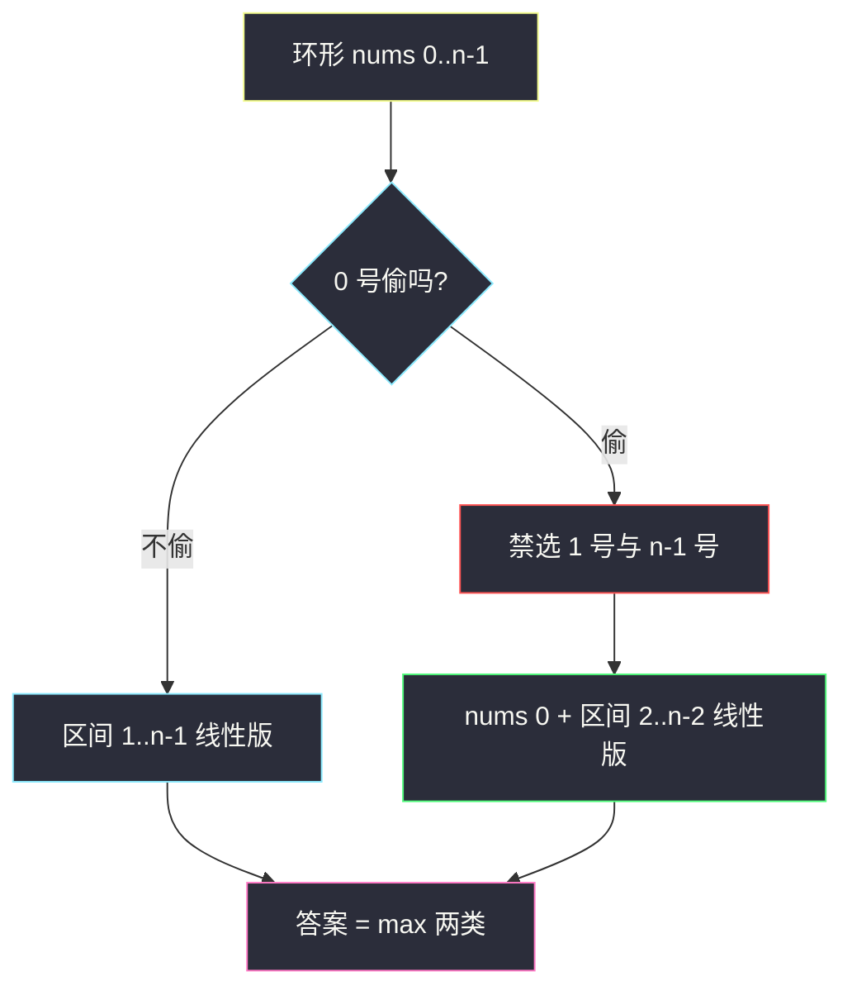
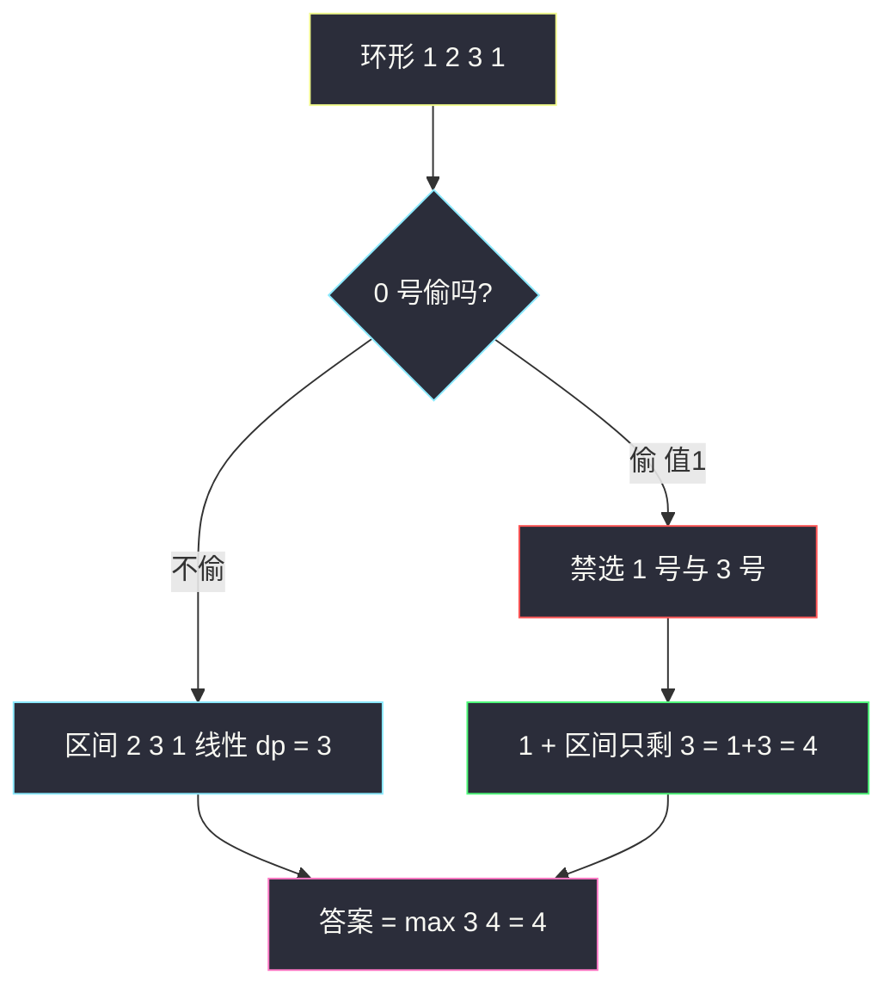

# 打家劫舍 II（环形数组：拆成两个线性子问题）

## 一、问题描述

你是一个专业的小偷，计划偷窃沿街的房屋，每间房内都藏有一定的现金。这个地方**所有的房屋都围成一圈**，这意味着**第一间房屋和最后一间房屋是紧挨着的**。同时，相邻的房屋装有相互连通的防盗系统，**如果两间相邻的房屋同一晚上被小偷闯入，系统会自动报警**。给定一个代表每个房屋存放金额的非负整数数组 `nums`，计算在不触动警报装置的情况下，今晚能够偷窃到的最高金额。

> 🔗 LeetCode 213：https://leetcode.cn/problems/house-robber-ii/

**示例 1**

```
输入：nums = [2,3,2]
输出：3
解释：不能先偷 0 号（2）再偷 2 号（2），因为首尾相连（2+2 会触发警报）
     只能偷 1 号（3），最高金额 3
```

**示例 2**

```
输入：nums = [1,2,3,1]
输出：4
解释：偷 0 号（1）+ 2 号（3）= 4（2 号与 0 号不相邻）
```

**直观理解**

与 [#198 打家劫舍](./house-robber.md) 的唯一区别：**首尾也成了邻居**，线性递推 `dp[i] = max(dp[i-1], dp[i-2] + nums[i])` 不再直接适用——它管不到「首尾同时被选」这种环形相邻。

破环的经典手法：**按下标 0 是否被偷分类**，把环拆成两段**线性**区间，各自跑一遍 #198：

```
情况一：0 号不偷 → 1..n-1 号随便（线性打家劫舍）
情况二：0 号偷   → 1 号、n-1 号都不能偷 → 2..n-2 号随便
答案 = max(情况一, 0 号金额 + 情况二)
```

> 📚 课源码定位：**`class070/Code04_HouseRobberII.java`，本题原题**（题面写作「环形数组中不能选相邻元素的最大累加和」）。课上核心两行：`Math.max(best(nums, 1, n - 1), nums[0] + best(nums, 2, n - 2))`，`best` 就是区间上的线性版（含 `nums[i] + Math.max(0, prepre)` 的负数通用写法）。同 class 的 `class070/Code03_MaximumSumCircularSubarray.java`（环形子数组的最大和）是环形拆解思想的姊妹题。

---

## 二、暴力解法（入门）

### 直观思路

环形约束没法直接套 #198 的线性递推（它管不到首尾同选）。最直接的处理是：**在入口处先决策「0 号偷不偷」，把环拆成两段纯线性的区间**，每段用朴素的「选 / 不选」递归：

```java
// 打家劫舍 II：朴素递归（拆环 + 每段指数递归）
public static int rob1(int[] nums) {
    int n = nums.length;
    if (n == 1) {
        return nums[0];
    }
    // 情况一：0号不偷 → 区间[1, n-1]线性递归
    // 情况二：0号偷 → 1号与n-1号连带禁选 → nums[0] + 区间[2, n-2]线性递归
    return Math.max(g(nums, 1, n - 1), nums[0] + g(nums, 2, n - 2));
}

// nums[l..r]范围上（纯线性，不管环），不能选相邻数的最大累加和
public static int g(int[] nums, int l, int r) {
    if (l > r) {
        return 0; // 空区间（n很小的情况二会出现）
    }
    if (l == r) {
        return nums[l];
    }
    // 对末尾元素 r 做分类：不选 g(l, r-1) vs 选 nums[r] + g(l, r-2)
    return Math.max(g(nums, l, r - 1), nums[r] + g(nums, l, r - 2));
}
```

拆环这一步是本能（首尾相邻，只能先钉死一头）；剩下的 `g` 就是 #198 暴力版的区间形态。

### 复杂度

- **时间**：`O(2^n)`（每段递归树指数展开，两个分支）
- **空间**：`O(n)`，递归栈深度

### 🔴 瓶颈在哪里

结构已经对了，但 `g(l, r-1)` 和 `g(l, r-2)` 的子树大量重叠：同一个子区间被反复求解，`n = 100` 必超时——与 #198 暴力版同一个病。拆环解决的是**建模**问题，剩下的重复计算要交给 DP。

---

## 三、优化探索（核心章节）

### 3.1 破环：按下标 0 分类讨论

拆环的关键是**在入口处一次性决策**「0 号偷不偷」，之后每段内部都是纯线性的：

| 分类 | 0 号 | 连带禁选 | 剩余自由区间 | 该区间上跑什么 |
|------|------|----------|--------------|----------------|
| 情况一 | 不偷 | 无 | `[1, n-1]` | 线性打家劫舍 |
| 情况二 | 偷 | 1 号、n-1 号 | `[2, n-2]`（可能为空） | 线性打家劫舍 |

两类**不重不漏**覆盖所有合法方案（0 号只有偷/不偷两种），于是：

```
答案 = max( best(nums, 1, n-1),  nums[0] + best(nums, 2, n-2) )
```

`best(l, r)` 就是 #198 的区间版（课上 `best` 函数）。**环的问题被消灭在分类处**，dp 本身零改动——这是「化环为链」最标准的一课。



### 3.2 情况二会不会漏「都不偷」？

不会。`nums[i] ≥ 0` 时最优解至少选一间（除非全 0）；「全不选」被情况一包含（`best` 的转移 `max(pre, ...)` 允许一路不选，非负数组上不劣于任何方案）。课上 `best` 里 `nums[i] + Math.max(0, prepre)` 同样是**允许负数场景**的通用写法——LeetCode 非负数据下等价于 `prepre + nums[i]`。

### 3.3 边界：区间可能为空或只有一两个数

`n = 1` 时 0 号既是首也是尾（自己和自己不算相邻），单独返回 `nums[0]`。情况二中区间 `[2, n-2]` 在 `n = 2, 3` 时为空或负长，`best` 里 `l > r → 0` 兜底。这正是课上 `best` 开头三个 if 的作用。

### 3.4 关键推导问题

| 问题 | 答案 |
|------|------|
| 为什么拆两类就够？ | 任何合法方案在「0 号偷否」上必然二选一；两类各自内部是纯线性问题 |
| 为什么选 0 号作切点，不选别的？ | 任一点都行；选 0 号只是约定，课版即如此 |
| 情况一区间为什么是 `[1, n-1]`？ | 0 号不偷，则 1 号与 n-1 号都只受各自的线性邻居约束 |
| n=1 为什么特判？ | 拆段后 `[1,0]`、`[2,-1]` 语义混乱；单独返回 `nums[0]` 最稳 |
| 复杂度为什么还是 O(n)？ | 两次线性扫描各 O(n)，取 max |

### 3.5 一句话核心

> **环上按下标 0 分类：不偷 0 → best(1, n-1)；偷 0 → nums[0] + best(2, n-2)；两段各自就是 #198。**

---

## 四、代码实现详解

### Java（主解：对齐 class070/Code04 原版）

```java
// 打家劫舍 II
// 所有的房屋都围成一圈，第一间房屋和最后一间房屋是紧挨着的
// 相邻房屋不能同一晚上被闯入，返回能偷窃到的最高金额
// 测试链接 : https://leetcode.cn/problems/house-robber-ii/
// 对齐 class070/Code04_HouseRobberII（原版结构）
public class Solution {

    // 时间复杂度 O(n)，空间复杂度 O(1)
    public static int rob(int[] nums) {
        int n = nums.length;
        if (n == 1) {
            return nums[0];
        }
        // 环拆两类：0号不偷(best 1..n-1) vs 0号偷(nums[0] + best 2..n-2)
        return Math.max(best(nums, 1, n - 1), nums[0] + best(nums, 2, n - 2));
    }

    // nums[l....r]范围上，没有环形的概念（纯线性，#198 区间版）
    // 返回 : 随意选择数字、但不能选相邻数字的最大累加和
    public static int best(int[] nums, int l, int r) {
        if (l > r) {
            return 0;             // 空区间（n 很小时出现）
        }
        if (l == r) {
            return nums[l];       // 只有一个数
        }
        if (l + 1 == r) {
            return Math.max(nums[l], nums[r]); // 两个相邻数
        }
        // 区间内的 dp[i] : nums[l..i] 不能选相邻数的最大累加和
        // 转移 : cur = max(pre, nums[i] + max(0, prepre))
        // max(0, prepre) 为课版通用写法（允许负数）；本题非负等价于 prepre
        int prepre = nums[l];
        int pre = Math.max(nums[l], nums[l + 1]);
        for (int i = l + 2, cur; i <= r; i++) {
            cur = Math.max(pre, nums[i] + Math.max(0, prepre));
            prepre = pre;
            pre = cur;
        }
        return pre;
    }
}
```

### Java（对照版：二维 dp 显式表，帮助理解）

```java
public class Solution {

    // 每段区间开一张 dp 表，逻辑与 #198 完全一致
    // 时间 O(n)，空间 O(n)
    public static int rob2(int[] nums) {
        int n = nums.length;
        if (n == 1) {
            return nums[0];
        }
        if (n == 2) {
            return Math.max(nums[0], nums[1]);
        }
        return Math.max(best2(nums, 1, n - 1), nums[0] + best2(nums, 2, n - 2));
    }

    public static int best2(int[] nums, int l, int r) {
        if (l > r) {
            return 0;
        }
        // dp[i] : nums[l..i] 不能选相邻数的最大累加和（下标平移到 0 起）
        int[] dp = new int[r - l + 1];
        dp[0] = nums[l];
        if (r - l >= 1) {
            dp[1] = Math.max(nums[l], nums[l + 1]);
        }
        for (int i = 2; i <= r - l; i++) {
            dp[i] = Math.max(dp[i - 1], nums[l + i] + dp[i - 2]);
        }
        return dp[r - l];
    }
}
```

### Python（同思路）

```python
# 打家劫舍 II：拆环为两段线性，O(n) / O(1)
class Solution:
    def rob(self, nums: List[int]) -> int:
        if len(nums) == 1:
            return nums[0]
        return max(self._best(nums, 1, len(nums) - 1),
                   nums[0] + self._best(nums, 2, len(nums) - 2))

    def _best(self, nums: List[int], l: int, r: int) -> int:
        """nums[l..r] 纯线性打家劫舍（#198 区间版，滚动变量）"""
        if l > r:
            return 0
        if l == r:
            return nums[l]
        if l + 1 == r:
            return max(nums[l], nums[r])
        prepre, pre = nums[l], max(nums[l], nums[l + 1])
        for i in range(l + 2, r + 1):
            prepre, pre = pre, max(pre, prepre + nums[i])
        return pre
```

---

## 五、具体例子演示

### 例子 A：`nums = [2, 3, 2]`（首尾冲突的典型）

**情况一**：0 号（值 2）不偷 → 区间 `[1, 2]` 即 `[3, 2]`：

| 步骤 | 计算 | 值 |
|------|------|-----|
| 两个相邻数 | max(3, 2) | **3** |

**情况二**：0 号偷 → `nums[0] + best([2, 1])`（区间 2..n-2 = 2..1 为空）：

| 步骤 | 计算 | 值 |
|------|------|-----|
| 空区间 | l > r → 0 | 0 |
| 情况二合计 | 2 + 0 | **2** |

**答案** = max(3, 2) = **3**。直观：想偷 `2+2`，但 0 号与 2 号在环上相邻，被迫二选一再补 1 号，最优 3。

### 例子 B：`nums = [1, 2, 3, 1]`（拆段后各自线性）

**情况一**：0 号（值 1）不偷 → 区间 `[1, 3]` 即 `[2, 3, 1]`：

| i | 值 | 选 i（prepre + nums[i]） | 不选 i（pre） | dp 值 |
|---|----|--------------------------|---------------|-------|
| 1 | 2 | — | — | 2（初值） |
| 2 | 3 | — | — | max(2,3) = 3（初值） |
| 3 | 1 | 2 + 1 = 3 | **3** | **3** |

情况一 = **3**（选下标 2 的 3，或 2 与 1 中的 3……即下标 1 与 2 中取一，再补下标 3 无益）。

**情况二**：0 号偷 → `1 + best([2, 2])`：

| 步骤 | 计算 | 值 |
|------|------|-----|
| 区间 [2,2] 单格 | nums[2] = 3 | 3 |
| 情况二合计 | 1 + 3 | **4** |

**答案** = max(3, 4) = **4**（偷下标 0 与 2，环上 2 号与 0 号不相邻），与示例一致。



红框标出拆环的关键：**偷 0 号的代价是两头各禁一间**——这正是环形约束被「前置决策」吸收的瞬间。

---

## 六、复杂度分析

| 版本 | 时间 | 空间 | 说明 |
|------|------|------|------|
| 带标记的暴力递归 | `O(2^n)` | `O(n)` | 状态纠缠，还容易写错 |
| 朴素（0/1 分类 + 各自记忆化） | `O(n)` | `O(n)` | 两段各一张 dp 表 |
| 拆环 + 滚动变量（主解） | `O(n)` | `O(1)` | 两段各扫一遍，对齐课版 |

---

## 七、方法对比与总结

### 化环为链：通用三板斧

```
1. 入口分类 : 按切点（通常是下标 0）「选 / 不选」把环拆成两段链
2. 连带禁选 : 选切点 → 它的环形邻居一并禁选，区间端点内缩
3. 段内复用 : 每段就是线性原题（#198），dp / 滚动变量零改动
```

课上 `class070` 同场还有 **环形子数组的最大和**（`Code03_MaximumSumCircularSubarray`）——它用「分类 + 前缀和反演」处理环，思路同源：**别让环形约束渗进转移，在分类处一次性消化**。

### 易错点

1. **忘了 n=1 特判**：只有一间房时自己和自己不相邻，应返回 `nums[0]`，拆段公式对 n=1 会输出错误结果。
2. **情况二区间端点写错**：偷 0 号后自由区间是 `[2, n-2]`（不是 `[2, n-1]`！n-1 号与 0 号相邻，必须禁）。
3. **空区间没兜底**：n=2、3 时 `[2, n-2]` 为空或倒挂，`best` 要有 `l > r → 0`。
4. **以为要新建数组拷贝两段**：直接传 `l, r` 下标即可，O(1) 空间。

### 模板口诀

> **环变链，切 0 号：不偷走 [1,n-1]，偷则 0 + [2,n-2]；两段各跑 #198，取 max。**

---

## 八、举一反三

| 题目 | 链接 | 迁移点 |
|------|------|--------|
| 198. 打家劫舍 | https://leetcode.cn/problems/house-robber/ | 线性原题，本题的分解目标（本站姊妹篇） |
| 337. 打家劫舍 III | https://leetcode.cn/problems/house-robber-iii/ | 结构换成**树**，「偷/不偷」变成节点双返回值，课上 `class037/Code07` |
| 918. 环形子数组的最大和 | https://leetcode.cn/problems/maximum-sum-circular-subarray/ | 同款化环为链，课上 `class070/Code03` |
| 2560. 打家劫舍 IV | https://leetcode.cn/problems/house-robber-iv/ | 约束改「最多偷 k 间且最大值最小」，课上 `class070/Code05` |
| 740. 删除并获得点数 | https://leetcode.cn/problems/delete-and-earn/ | 值域分桶后是 #198 线性版 |

**迁移一句**：环形结构上的约束优化题，先问一句「**切点选不选**」——把环拆成至多两段链，每段复用线性模板；股票家族的「冷却期」（#309）处理环形日期问题时也是同一种「前置分类吸收特殊约束」的思想。
