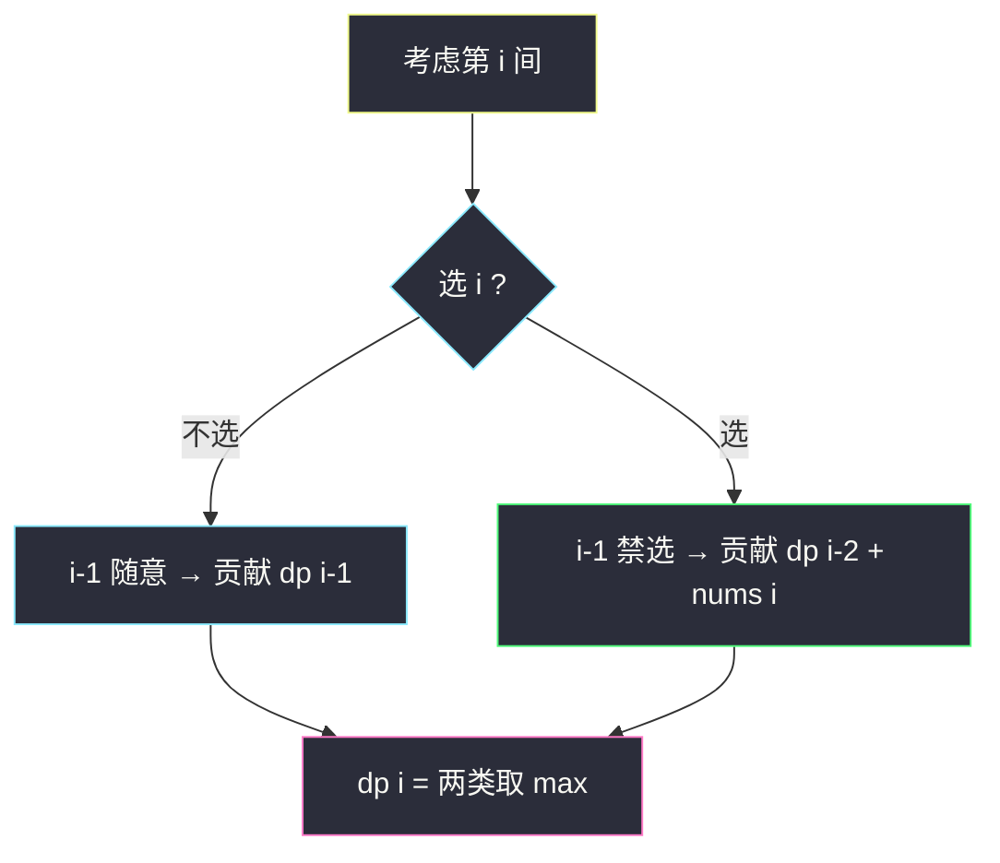
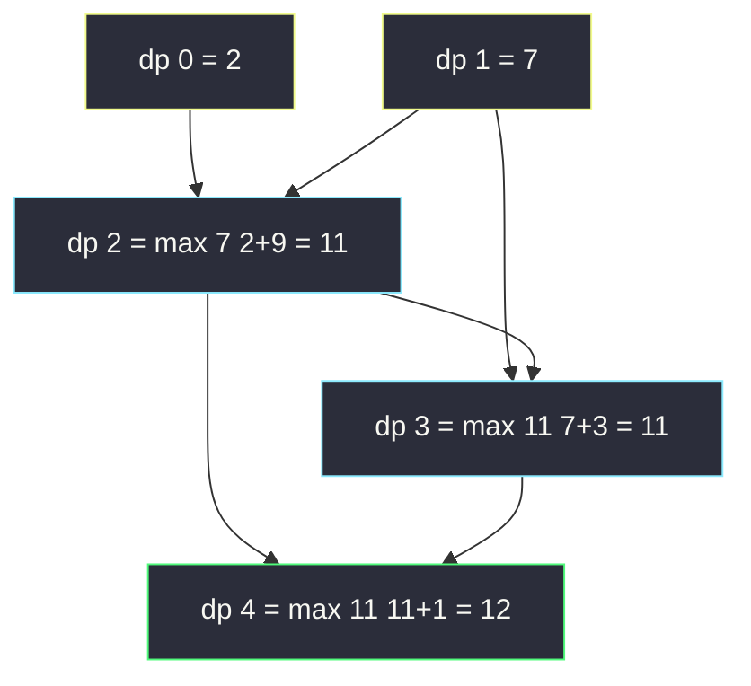

# 打家劫舍（相邻不能取：线性 DP 的「选 / 不选」）

## 一、问题描述

你是一个专业的小偷，计划偷窃沿街的房屋。每间房内藏有一定的现金，影响你偷窃的唯一制约因素是**相邻的房屋装有相互连通的防盗系统**：如果两间相邻的房屋同一晚上被闯入，系统会自动报警。给定一个代表每个房屋存放金额的**非负整数数组** `nums`，计算**不触动警报装置**的情况下，一夜之内能够偷窃到的最高金额。

> 🔗 LeetCode 198：https://leetcode.cn/problems/house-robber/

**示例 1**

```
输入：nums = [1,2,3,1]
输出：4
解释：偷窃 1 号房屋（1）+ 3 号房屋（3）= 4，偷窃最高金额
```

**示例 2**

```
输入：nums = [2,7,9,3,1]
输出：12
解释：偷窃 2 + 9 + 1 = 12（下标 0, 2, 4）
```

**直观理解**

每间房只有两个状态：**偷** 或 **不偷**。偷了 `i` 号房，`i-1` 号就必须放过；不偷 `i` 号，则 `i-1` 号偷不偷都行，取历史最优即可。这就是最经典的「**选 / 不选**」线性 DP：

```
dp[i] = max( dp[i-1] ,           不偷 i：沿用前缀最优
             dp[i-2] + nums[i] ) 偷 i：i-1 必跳过，最优来自 dp[i-2]
```

> 📚 课源码定位：**`class070/Code02_HouseRobber.java`，本题原题**（题面写作「数组中不能选相邻元素的最大累加和」）。课上给了 `rob1`（dp 表）与 `rob2`（空间压缩）两版，dp 定义原话：`dp[i] : nums[0...i]范围上可以随意选择数字，但是不能选相邻数，能得到的最大累加和`。本篇逐一对齐。

---

## 二、暴力解法（入门）

### 直观思路

「每间房选或不选」天然对应**从右往左的递归**：`f(i)` = 在 `nums[0..i]` 上不能选相邻数的最大累加和。对第 `i` 间做分类：

```java
// 打家劫舍：直接递归
// f(i) : nums[0...i]范围上，不能选相邻数，能得到的最大累加和
public static int rob1(int[] nums) {
    return f1(nums, nums.length - 1);
}

public static int f1(int[] nums, int i) {
    if (i == 0) {
        return nums[0]; // 只剩 0 号，选它
    }
    if (i == 1) {
        return Math.max(nums[0], nums[1]); // 两间相邻，只能选一间
    }
    // 不选 i：答案来自 f(i-1)；选 i：i-1 不能选，答案 = f(i-2) + nums[i]
    return Math.max(f1(nums, i - 1), f1(nums, i - 2) + nums[i]);
}
```

### 复杂度

- **时间**：`O(2^n)`（每个位置两个分支，指数展开）
- **空间**：`O(n)`，递归栈深度

### 🔴 瓶颈在哪里

递归树里 `f(i-2)` 同时是 `f(i)` 与 `f(i-1)` 的子问题，整棵树指数级重复。`n = 100` 必超时——老三样：**重复子问题 → 加缓存 → 填表**。

---

## 三、优化探索（核心章节）

### 3.1 可变参数法：一个可变参数 → 一维表

递归 `f(i)` 只有**一个可变参数** `i ∈ [0, n-1]` → dp 是一维数组，含义照抄课版：

> `dp[i]`：`nums[0..i]` 范围上随意选择、但不能选相邻数，能得到的最大累加和

```
dp[0] = nums[0]
dp[1] = max(nums[0], nums[1])
dp[i] = max(dp[i-1], max(nums[i], dp[i-2] + nums[i]))    i ≥ 2
```

课版转移里的 `max(nums[i], dp[i-2] + nums[i])` 值得一提：课上场景**允许负数**（`dp[i-2]` 可能为负，此时只选 `nums[i]` 更大）；LeetCode 本题 `nums[i] ≥ 0`，`dp[i-2] + nums[i] ≥ nums[i]` 恒成立，可简化为 `dp[i] = max(dp[i-1], dp[i-2] + nums[i])`。**简化成立的理由要能说清**，面试常被追问。

### 3.2 「选 / 不选」框架（线性 DP 的通用心智模型）



这个二叉分类是大量线性 DP 的母版：股票「持有/不持有」、#740 删除并获得点数、甚至背包「放/不放」都是它的变体。

### 3.3 空间压缩观察

`dp[i]` 只依赖 `dp[i-1]`、`dp[i-2]` 两个位置 → 两个滚动变量即可（课上 `rob2` 用 `prepre` / `pre` 命名），空间 `O(1)`。

### 3.4 关键推导问题

| 问题 | 答案 |
|------|------|
| 为什么不选 `i` 时是 `dp[i-1]` 而不是 `dp[i-1] + 0`？ | 一样的；关键是 `i-1` 选不选**都被 `dp[i-1]` 涵盖**，不需要再分情况 |
| 「选 i 跳过 i-1」会不会跳太多？ | `dp[i-2]` 是 `[0..i-2]` 的最优，`i-2` 选不选由它内部决定；跳 `i-1` 是必要代价，不额外跳 |
| 为什么分类不重不漏？ | 任何合法方案在第 `i` 间上只有选/不选两种，两类互斥且覆盖全部 |
| 隔一空偷（0,2,4...）是不是最优策略固定模式？ | 不是；最优方案可能跳多间（如 `[2,1,1,9]` 选 0 和 3），dp 自动处理 |
| 需要回溯方案本身吗？ | 本题只要值；要方案则从 `dp[n-1]` 倒推：若 `dp[i] != dp[i-1]` 则 `i` 被选中 |

### 3.5 一句话核心

> **选 / 不选二分类：dp[i] = max(dp[i-1], dp[i-2] + nums[i])，两个变量滚到底。**

---

## 四、代码实现详解

### Java（主解：对齐 class070/Code02 的 rob1）

```java
// 打家劫舍
// 给定一个代表每个房屋存放金额的非负整数数组
// 计算不触动警报装置的情况下，一夜之内能够偷窃到的最高金额
// 测试链接 : https://leetcode.cn/problems/house-robber/
// 对齐 class070/Code02_HouseRobber 的 rob1（dp 表版）
public class Solution {

    // 时间复杂度 O(n)，空间复杂度 O(n)
    public static int rob(int[] nums) {
        int n = nums.length;
        if (n == 1) {
            return nums[0];
        }
        // dp[i] : nums[0...i]范围上，不能选相邻数，能得到的最大累加和
        // 转移 : dp[i] = max(dp[i-1], max(nums[i], dp[i-2]+nums[i]))
        // 依赖方向 : 左边两位 → i 从小到大填
        int[] dp = new int[n];
        dp[0] = nums[0];
        dp[1] = Math.max(nums[0], nums[1]);
        for (int i = 2; i < n; i++) {
            dp[i] = Math.max(dp[i - 1],
                    Math.max(nums[i], dp[i - 2] + nums[i]));
        }
        return dp[n - 1];
    }
}
```

### Java（空间压缩：对齐课版 rob2）

```java
public class Solution {

    // 两个变量滚动，只依赖左边两位
    // 时间 O(n)，空间 O(1)
    public static int rob2(int[] nums) {
        int n = nums.length;
        if (n == 1) {
            return nums[0];
        }
        if (n == 2) {
            return Math.max(nums[0], nums[1]);
        }
        int prepre = nums[0];                        // dp[0]
        int pre = Math.max(nums[0], nums[1]);        // dp[1]
        for (int i = 2, cur; i < n; i++) {
            cur = Math.max(pre, Math.max(nums[i], prepre + nums[i]));
            prepre = pre;
            pre = cur;
        }
        return pre;
    }
}
```

### Python（同思路）

```python
# 打家劫舍：一维 dp 表，O(n) / O(n)
class Solution:
    def rob(self, nums: List[int]) -> int:
        n = len(nums)
        if n == 1:
            return nums[0]
        # dp[i]：nums[0..i] 不能选相邻数的最大累加和
        dp = [0] * n
        dp[0], dp[1] = nums[0], max(nums[0], nums[1])
        for i in range(2, n):
            dp[i] = max(dp[i - 1], dp[i - 2] + nums[i])  # 本题非负可简化
        return dp[n - 1]
```

```python
# 空间压缩：两个变量滚动，O(n) / O(1)
class Solution:
    def rob(self, nums: List[int]) -> int:
        prepre, pre = 0, 0
        for x in nums:
            prepre, pre = pre, max(pre, prepre + x)
        return pre
```

（Python 版用 `prepre=0, pre=0` 起步、循环内同步赋值，等价于课版且省掉边界特判：第一轮后 `pre = max(0, 0 + nums[0]) = nums[0]`，与 `dp[0]` 一致。）

---

## 五、具体例子演示

以示例 2 `nums = [2, 7, 9, 3, 1]` 为例，端到端跟踪 dp 表。

### 第 1 步：初始化

| i | 0 | 1 |
|---|---|---|
| nums | 2 | 7 |
| dp | 2 | max(2,7) = **7** |

### 第 2 步：逐格填充

| i | 决策对比 | 选 i（dp[i-2]+nums[i]） | 不选 i（dp[i-1]） | dp[i] | 谁赢 |
|---|----------|--------------------------|-------------------|-------|------|
| 2 | dp[0]+9 vs dp[1] | 2+9 = **11** | 7 | **11** | 选（偷 0、2） |
| 3 | dp[1]+3 vs dp[2] | 7+3 = 10 | **11** | **11** | 不选（3 号不偷） |
| 4 | dp[2]+1 vs dp[3] | 11+1 = **12** | 11 | **12** | 选（补偷 4 号） |

| dp 全表 | 2 | 7 | 11 | 11 | **12** |
|---------|---|---|----|----|--------|

### 第 3 步：读答案并回溯方案

`dp[4] = 12`。倒推：`dp[4]=12 ≠ dp[3]=11` → 4 号被偷；回 `dp[2]=11 ≠ dp[1]=7` → 2 号被偷；`dp[0]=2 ≠ 0` → 0 号被偷。方案 `{0, 2, 4}`，金额 `2+9+1 = 12`，与示例一致。



注意 `dp[3]`：7+3=10 < 11，**不偷 3 号反而更优**（3 号太便宜，偷它要放弃 2 号的 9）——这正是 dp 全局枚举优于贪心的体现。

---

## 六、复杂度分析

| 版本 | 时间 | 空间 | 说明 |
|------|------|------|------|
| 暴力递归 | `O(2^n)` | `O(n)` | 重复子问题指数爆炸 |
| 记忆化搜索 | `O(n)` | `O(n)` | 每个 f(i) 只算一次 |
| 一维 dp 表（主解） | `O(n)` | `O(n)` | 对齐课版 rob1 |
| 滚动变量（rob2） | `O(n)` | `O(1)` | 只留 prepre / pre |

---

## 七、方法对比与总结

### 「选 / 不选」线性 DP 模板

```
1. 定义 : dp[i] = 前 i 个位置范围内的最优值（约束满足下）
2. 转移 : dp[i] = max( 不选 i 的最优 dp[i-1],
                       选 i 的最优 dp[i-约束跨度] + nums[i] )
3. 相邻约束 → 跨度 2；「同余约束」→ #740 的计数桶版
4. 依赖左边固定几位 → 空间压到常数
```

### 易错点

1. **`dp[1]` 初始化写成 `nums[1]`**：`dp[1] = max(nums[0], nums[1])`，两间相邻只能选一间。
2. **滚动版赋值顺序反**：必须先算 `cur`，再 `prepre = pre; pre = cur`；直接覆盖会丢旧值。
3. **误以为「隔一间偷」是固定最优**：示例 2 中 3 号被跳、4 号被偷，最优解相邻间距不固定。
4. **照抄 `max(nums[i], dp[i-2]+nums[i])` 却说不清为什么**：那是课上允许负数的通用写法，本题非负可简化，但要能讲出简化依据。

### 模板口诀

> **选或不选分两类：不选沿用 dp[i-1]，选则跳到 dp[i-2] + nums[i]；取 max 滚两个变量。**

---

## 八、举一反三

| 题目 | 链接 | 迁移点 |
|------|------|--------|
| 213. 打家劫舍 II | https://leetcode.cn/problems/house-robber-ii/ | **首尾成环**：拆成两个线性子问题取 max（本站姊妹篇） |
| 337. 打家劫舍 III | https://leetcode.cn/problems/house-robber-iii/ | 房屋排成**二叉树**：树形 DP「偷/不偷」双返回值，课上 `class037/Code07` 原题 |
| 740. 删除并获得点数 | https://leetcode.cn/problems/delete-and-earn/ | 按值分桶后**就是本题**：桶 i 选 i-1、i+1 全消 |
| 2560. 打家劫舍 IV | https://leetcode.cn/problems/house-robber-iv/ | 最小化「被偷房屋最大值」→ 二分答案 + 贪心检查，课上 `class070/Code05` |
| 2320. 统计放置房子的方式数 | https://leetcode.cn/problems/count-number-of-ways-to-place-houses/ | 同款约束改**计数**，求和代替取 max |

**迁移一句**：一切「**相邻互斥**」约束的线性序列题——数组、环形（#213）、树（#337）、值域桶（#740）——都套「选 / 不选」二分类：不选看前一位，选则回退一个约束跨度。
