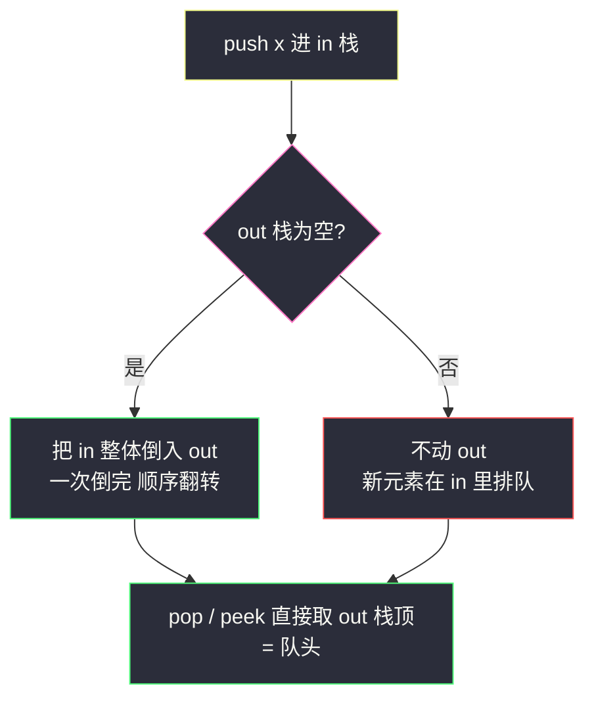
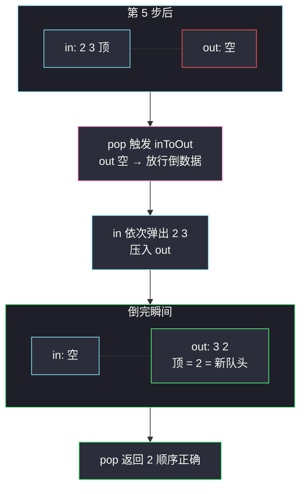

# 用栈实现队列（双栈 in/out：out 空才倒，一倒就倒完）

## 一、问题描述

请你仅使用两个栈实现**先入先出（FIFO）**的队列，并支持队列的全部操作（`push`、`pop`、`peek`、`empty`）。

实现 `MyQueue` 类：

- `void push(int x)`：将元素 x 推到队列的末尾
- `int pop()`：从队列的开头移除并返回元素
- `int peek()`：返回队列开头的元素
- `boolean empty()`：如果队列为空，返回 true；否则返回 false

> 🔗 LeetCode 232：https://leetcode.cn/problems/implement-queue-using-stacks/
>
> 你只能使用标准的栈操作——也就是只有 `push to top`、`peek/pop from top`、`size`、`is empty` 是合法的。

**示例**

```
输入：
["MyQueue", "push", "push", "peek", "pop", "empty"]
[[], [1], [2], [], [], []]
输出：
[null, null, null, 1, 1, false]

解释：
MyQueue myQueue = new MyQueue();
myQueue.push(1);      // 队列：[1]
myQueue.push(2);      // 队列：[1, 2]（最左边是队列开头）
myQueue.peek();       // 返回 1
myQueue.pop();        // 返回 1，队列变成 [2]
myQueue.empty();      // 返回 false
```

**直观理解**

栈是**先进后出**（LIFO），队列要**先进先出**（FIFO），方向恰好相反。一个栈办不到的事，两个栈就够了：数据从 `in` 栈进、从 `out` 栈出——**倒一次手，顺序翻转**。就像把一摞盘子从左手整摞扣到右手，原来最底下的盘子现在到了顶上。诀窍全在「什么时候倒、怎么倒」：倒得太勤白费力气，倒得不是时候顺序就乱。课源码 class014 `ConvertQueueAndStack.MyQueue` 就是标准答案，两条倒数据原则一背终身受用。

---

## 二、暴力解法（每次 pop 前临时倒腾）

### 直观思路

只用一个栈 `stack` 存数据。`pop` / `peek` 时需要拿栈底元素（那是队列的开头），于是借一个临时栈把上面 `n-1` 个全倒出去，取出最底下那个，**再把 `n-1` 个倒回来**：

```java
class MyQueue {
    private Deque<Integer> stack = new ArrayDeque<>();

    public void push(int x) {
        stack.push(x);
    }

    public int pop() {
        Deque<Integer> temp = new ArrayDeque<>();
        while (stack.size() > 1) {       // 倒出 n-1 个
            temp.push(stack.pop());
        }
        int front = stack.pop();         // 栈底 = 队头
        while (!temp.isEmpty()) {        // 再倒回去
            stack.push(temp.pop());
        }
        return front;
    }

    public int peek() {
        int front = pop();               // 偷懒复用 pop
        push(front);                     // 拿出来再放回去（会到栈顶=队尾，位置错了！）
        return front;
    }

    public boolean empty() {
        return stack.isEmpty();
    }
}
```

### 复杂度

- **时间**：`push` `O(1)`；`pop` / `peek` 都是 `O(n)`——每次都把几乎整个栈倒两遍
- **空间**：`O(n)` 主栈 + `O(n)` 临时栈

### 🔴 瓶颈在哪里

1. **重复劳动**：同一批元素被倒了又倒、倒了又倒回，`k` 次连读队头就是 `O(n·k)`；
2. `peek` 复用 `pop` 的偷懒写法还有 bug——放回去的位置变成了栈顶（队尾），顺序悄悄变了，说明「临时栈」思路边界很难守；
3. 核心浪费在于：**倒出来的顺序明明已经是队列顺序了，却非要倒回去**。那就让它待在那儿——第二个栈从「临时」转正，就是优化方向。

---

## 三、优化探索（核心章节）

### 3.1 观察特征

| 特征 | 说明 |
|------|------|
| 一次翻转 = 恰好反转 | 元素从 in 整体倒入 out 后，in 的**栈底**变成 out 的**栈顶**——LIFO 变 FIFO |
| 翻转结果可以复用 | out 栈顶就是队头，连续 pop/peek 直接从 out 拿，不用重倒 |
| in 只管进、out 只管出 | 两个栈各司其职，任何时刻元素都只在「in 里等倒」或「out 里等着出」 |
| 顺序安全的前提 | 只有 **out 为空**时才能倒，否则新倒过来的会压在旧元素上面、盖住真正的队头 |

### 3.2 暴力 → 优化：in/out 分工 + 两条倒数据原则

数据结构：

- `in` 栈：只负责 `push` 进来的新元素；
- `out` 栈：只负责出队，栈顶永远是当前队头。

倒数据**两条铁律**（课源码 class014 的注释原话）：

1. **out 空了，才能倒数据**；
2. **如果倒，in 必须一次倒完**。

```
inToOut():                       ← 倒数据（内聚成一个函数，三个操作共用）
    若 out 为空：
        把 in 里的元素全部 pop → push 进 out（顺序自然翻转）

push(x):  in.push(x); inToOut()          ← 课上版：顺手倒一下
pop():    inToOut(); return out.pop()    ← 出队前确保 out 有货
peek():   inToOut(); return out.peek()
empty():  in 空 且 out 空
```

`inToOut` 内部有 `out.isEmpty()` 守卫，所以「多倒一嘴」也绝对安全——倒数据动作想调就调，正确性由守卫兜底。



### 3.3 关键推导问题

| 问题 | 答案 |
|------|------|
| 为什么 out 非空时绝不能倒？ | 例：in=[1,2]（2 在顶）先入的 1 是队头。把 1、2 倒进 out 后 out=[2,1]（1 在顶）。此时又 push(3)，若立刻把 3 倒过去，out=[2,1] 顶上再压 3 变 [3,2,1]——下一次 pop 吐出 3，而队头明明是 1，**顺序彻底乱套**。out 没出完就不倒，是在保护 out 里已经排好的顺序 |
| 为什么倒就要一次倒完？ | 半倒等于把一个序列切成两半分别翻转，拼回去不是完整逆序；「整批」翻转才是 LIFO→FIFO 的等价转换 |
| 为什么 push 里也调 inToOut？ | 课上版把倒数据内聚后顺手调一次；真正的守卫在 inToOut 内部，push 调不调都不影响正确性，只影响「倒的时机」分布 |
| 均摊复杂度为什么是 O(1)？ | 一个元素一生最多经历 4 次栈操作：入 in、in→out、（至多一次跨栈）、出 out。n 个元素总代价 ≤ 4n，摊到 n 次操作就是常数 |
| pop 时两个栈都空怎么办？ | LC 本题保证合法调用（空队列不会 pop/peek）；若要健壮可先判 `empty()` 抛异常 |
| 能反过来只用一个栈吗？ | 不行——单栈无法同时保持「新元素在后、旧元素在前」两端高效访问；单队列实现单栈（#225）倒是可以，方向不对称很有趣 |

### 3.4 一句话核心

> **in 进 out 出，倒一次手顺序翻；out 不空不倒，一倒就倒干净。**

---

## 四、代码实现详解

### Java（主解：双栈分工，对齐 class014 课上版）

```java
// 用两个栈实现队列
// 测试链接 : https://leetcode.cn/problems/implement-queue-using-stacks/
// 对齐 class014 ConvertQueueAndStack.MyQueue
class MyQueue {
    private Deque<Integer> in = new ArrayDeque<>();   // 只进
    private Deque<Integer> out = new ArrayDeque<>();  // 只出，栈顶 = 队头

    // 倒数据：out 空才倒；要倒，in 一次倒完
    private void inToOut() {
        if (out.isEmpty()) {
            while (!in.isEmpty()) {
                out.push(in.pop());
            }
        }
    }

    public void push(int x) {
        in.push(x);
        inToOut();                 // 顺手倒一下（守卫保证安全）
    }

    public int pop() {
        inToOut();                 // 出队前确保 out 有货
        return out.pop();
    }

    public int peek() {
        inToOut();
        return out.peek();
    }

    public boolean empty() {
        return in.isEmpty() && out.isEmpty();
    }
}
```

**为什么把 `inToOut` 单独封装**：`push` / `pop` / `peek` 三处都要「确保 out 就绪」，守卫逻辑只写一遍——课上这么组织代码，站点版照搬，这本身就是设计课。

### Python（同思路）

```python
class MyQueue:
    def __init__(self):
        self.in_stack: list[int] = []    # 只进
        self.out_stack: list[int] = []   # 只出，栈顶（末尾）= 队头

    def _in_to_out(self) -> None:
        # out 空才倒；要倒，一次倒完
        if not self.out_stack:
            while self.in_stack:
                self.out_stack.append(self.in_stack.pop())

    def push(self, x: int) -> None:
        self.in_stack.append(x)
        self._in_to_out()

    def pop(self) -> int:
        self._in_to_out()
        return self.out_stack.pop()

    def peek(self) -> int:
        self._in_to_out()
        return self.out_stack[-1]

    def empty(self) -> bool:
        return not self.in_stack and not self.out_stack
```

---

## 五、具体例子演示

用一串操作逐步跟踪两栈状态。**记法**：栈右侧是栈顶；`in=[1,2]` 表示 1 在底、2 在顶。

| 步 | 操作 | in 栈（底→顶） | out 栈（底→顶） | 返回 | 说明 |
|----|------|----------------|-----------------|------|------|
| 1 | `push(1)` | [] | [1] | — | in 压 1；out 空触发倒数据：1 → out |
| 2 | `push(2)` | [2] | [1] | — | in 压 2；out 非空**不倒**，2 在 in 里等 |
| 3 | `peek()` | [2] | [1] | **1** | out 栈顶 1 即队头 |
| 4 | `push(3)` | [2,3] | [1] | — | 3 继续在 in 里排队 |
| 5 | `pop()` | [2,3] | [] | **1** | out 弹出 1，队列出掉最老的 |
| 6 | `pop()` | [] | [3,2] | **2** | out 空了！倒数据：in 的 2、3 依次入 out → out=[3,2]（2 在顶），弹出 2 |
| 7 | `push(4)` | [4] | [3] | — | out 非空不倒 |
| 8 | `pop()` | [4] | [] | **3** | out 弹 3 |
| 9 | `pop()` | [] | [4] | **4** | out 空 → 倒：4 → out，弹出 4 |
| 10 | `empty()` | [] | [] | **true** | 两栈皆空 = 队列空 ✅ |

出队序列 `1,2,3,4` 与入队顺序一致——FIFO 达成。

**第 6 步是全剧精华**：out 里的 1 出完，守卫放行，in 里积压的 2、3 **整体**翻转倒进 out——2 本来比 3 先进 in（更接近 in 栈底），倒过去后反而到了 out 栈顶，恰好是更早的队头。



**反例演示**（如果不守「out 空才倒」）：在第 3 步的状态（in=[2], out=[1]）强行把 2 倒进 out，out 变 [2,1]（2 在顶）；下一步 `pop()` 吐出 **2**，而正确队头是 1——顺序瞬间崩坏。两条铁律一条都不能松。

---

## 六、复杂度分析

| 项目 | 暴力（单栈临时倒腾） | 双栈 in/out（主解） |
|------|----------------------|---------------------|
| 时间（总体） | n 次 pop 最坏 `O(n²)` | n 次混合操作均摊 `O(n)` |
| push | `O(1)` | `O(1)` 均摊（单次可能触发整栈倒手，但摊还后是常数） |
| pop / peek | `O(n)` 每次 | **`O(1)` 均摊** |
| empty | `O(1)` | `O(1)` |
| 空间 | `O(n)` | `O(n)`（两栈合计恰好存 n 个元素，每个元素只在一处） |

**均摊 O(1) 的证明（聚合分析）**：任取一个元素的一生——① 被 push 进 in（1 次）；② 某次倒数据中从 in 弹出压进 out（2 次）；③ 从 out 弹出（1 次）。全部操作至多 4 次栈操作，且**每个元素从 in 到 out 至多倒一次**（倒过去的条件是 out 空，倒完后它只会往外走）。因此 n 次 push + n 次 pop 的总代价 ≤ 4n，均摊每次 `O(1)`。

---

## 七、方法对比与总结

### 写法对比

| | 单栈临时倒腾 | 双栈 in/out（主解） | 课源码差异说明 |
|--|--------------|---------------------|----------------|
| pop 复杂度 | `O(n)` 每次 | `O(1)` 均摊 | — |
| 核心心法 | 「要用再倒，用完倒回」 | 「out 空才倒，一倒倒完」 | 与 class014 注释原文一致 |
| 倒数据次数 | 每次操作都倒 | 每个元素一生至多 1 次跨栈 | — |
| 实现细节 | peek 易写错 | `inToOut` 封装，三处复用 | 课上把倒数据做成私有函数 |

### 易错点

1. **out 非空时倒数据**：顺序错乱的头号原因，见第五章反例。
2. **倒一半**：`inToOut` 必须用 `while` 把 in 掏空，倒一半等于没倒。
3. **`empty` 只看一个栈**：队列空 = in 与 out **同时**空，看 out 一个会把「in 有货等着倒」误判成空。
4. **Java 用 `Deque` 而非古老的 `Stack`**：`ArrayDeque` 更快且接口清晰（课源码用 `Stack` 也可通过，行为一致）。
5. **`pop` 与 `peek` 忘调 `inToOut`**：连续 push 后 out 恰好空、新货全在 in 里时，直接操作 out 会空栈异常。
6. **把 push 里的 `inToOut` 当成必需**：它是「顺手」性质，守卫才是正确性来源；删掉它（只在 pop/peek 前倒）同样正确，是常见变体。

### 模板口诀

> **进走 in，出走 out；out 不空不倒手，要倒一次倒个透。**

---

## 八、举一反三

| 题目 | 链接 | 迁移点 |
|------|------|--------|
| 225. 用队列实现栈 | https://leetcode.cn/problems/implement-stack-using-queues/ | 镜像题（本站已有题解，class014 同文件）：单队列旋转法，方向不对称的对照 |
| 155. 最小栈 | https://leetcode.cn/problems/min-stack/ | 同为「双容器协作」设计题：主栈 + 辅助栈同步维护最小值 |
| 622. 设计循环队列 | https://leetcode.cn/problems/design-circular-queue/ | 数组 + 头尾指针实现真队列，理解队列的本征结构 |
| 933. 最近的请求次数 | https://leetcode.cn/problems/number-of-recent-calls/ | 队列 FIFO 性质的直接应用 |
| 946. 验证栈序列 | https://leetcode.cn/problems/validate-stack-sequences/ | 「倒一次手顺序翻转」的逆向运用：给定栈序能否得到队序 |

**迁移一句**：两个 LIFO 叠一次手就是 FIFO，两个 FIFO 叠不出 LIFO（#225 只能靠旋转）——**结构能不能用叠加换向，取决于方向的对合性**。理解这条不对称性，比背两道题的代码都值钱。
