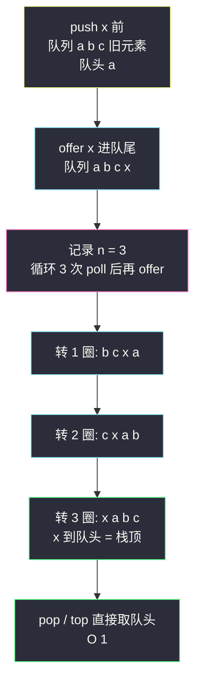
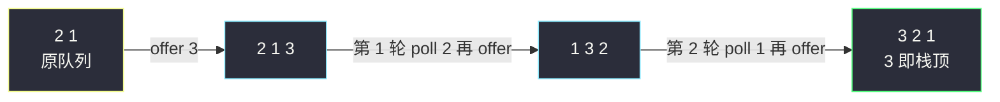

# 用队列实现栈（单队列旋转：push 后把 n-1 个转过去）

## 一、问题描述

请你仅使用**一个队列**（或两个队列）实现**后入先出（LIFO）**的栈，并支持栈的全部操作（`push`、`top`、`pop`、`empty`）。

实现 `MyStack` 类：

- `void push(int x)`：把元素 x 压入栈
- `int pop()`：移除并返回栈顶元素
- `int top()`：返回栈顶元素
- `boolean empty()`：如果栈是空的，返回 true；否则返回 false

> 🔗 LeetCode 225：https://leetcode.cn/problems/implement-stack-using-queues/
>
> 你只能使用队列的基本操作——`push to back`、`peek/pop from front`、`size`、`is empty`。

**示例**

```
输入：
["MyStack", "push", "push", "top", "pop", "empty"]
[[], [1], [2], [], [], []]
输出：
[null, null, null, 2, 2, false]

解释：
MyStack myStack = new MyStack();
myStack.push(1);     // 栈：[1]
myStack.push(2);     // 栈：[1, 2]（2 是栈顶）
myStack.top();       // 返回 2
myStack.pop();       // 返回 2，栈变成 [1]
myStack.empty();     // 返回 false
```

**直观理解**

队列只在**队尾进、队头出**，两端各司其职；栈却要「最新进的先出」。新元素天然落在队尾，而栈顶恰好应该是它——那就让**队列里的其他元素全部绕到它后面去**：push 之后把「排在它前面的 n-1 个」依次出队再入队，队头就换成了刚来的新元素。像排队买奶茶：新客人插到最前面，其余人整体往后挪一圈。课源码 class014 `ConvertQueueAndStack.MyStack` 的单队列旋转法就是这题标准答案——push 时 `O(n)` 转 n-1 个，换 pop/top/empty 全部 `O(1)`。

---

## 二、暴力解法（双队列倒腾）

### 直观思路

两个队列 `q1`（主）、`q2`（备）。元素全存 `q1`。`pop` 时把 `q1` 前 `n-1` 个搬到 `q2`，`q1` 里剩下的最后一个就是「最晚进来的」（栈顶），弹出后交换 `q1`、`q2` 的引用：

```java
class MyStack {
    private Queue<Integer> q1 = new ArrayDeque<>();
    private Queue<Integer> q2 = new ArrayDeque<>();

    public void push(int x) {
        q1.offer(x);
    }

    public int pop() {
        while (q1.size() > 1) {       // n-1 个搬去 q2
            q2.offer(q1.poll());
        }
        int top = q1.poll();          // 最后一个 = 栈顶
        Queue<Integer> t = q1;        // 交换引用，q2 转正
        q1 = q2;
        q2 = t;
        return top;
    }

    public int top() {
        int top = pop();              // 复用 pop 后再塞回去
        push(top);
        return top;
    }

    public boolean empty() {
        return q1.isEmpty();
    }
}
```

### 复杂度

- **时间**：`push` `O(1)`；`pop` / `top` `O(n)`——每次全队搬家
- **空间**：`O(n)`（两个队列合计存 n 个元素）

### 🔴 瓶颈在哪里

1. **每次 pop 都全队搬家**：元素在两个队列间来回倒，连续 k 次 pop 就是 `O(n·k)`；
2. `top` 复用 `pop` 还得「弹出来再 push 回去」，push 回去的位置在**队尾**（成了最旧），语义别扭、易错；
3. 两个队列、引用交换、辅助变量……心智负担大。核心洞察是：**搬家的目的只是让新元素排到队头**——与其每次 pop 前搬家，不如 **push 时就旋转到位**，一个队列就够。

---

## 三、优化探索（核心章节）

### 3.1 观察特征

| 特征 | 说明 |
|------|------|
| 栈顶 = 最新的元素 | push 的目标只有一个：让新元素出现在**队头** |
| 队列的队头是固定出口 | pop/top 从队头取，`O(1)`；想让谁当栈顶，就得让谁站队头 |
| 旋转不破坏其余顺序 | 把前 n-1 个依次「出队→入队」，它们**相对顺序不变**地绕到队尾，整体像环一样转 |
| 代价可以预付 | 把 `O(n)` 的搬运放到 push（写入）时做完，pop/top（读取）就全程 `O(1)` |

### 3.2 暴力 → 优化：单队列「push 即旋转」

数据结构：一个队列 `queue`，**约定队头永远是栈顶**。

```
push(x):
    n = queue.size()          ← 记住在 x 之前有几个人
    queue.offer(x)            ← x 进队尾
    循环 n 次：queue.offer(queue.poll())   ← 前 n 个（旧的 n-1 个 + x）整体转一圈
                               转完 x 恰好到队头，旧元素按原顺序排在后面

pop():   return queue.poll()      ← 队头 = 栈顶
top():   return queue.peek()
empty(): queue.isEmpty()
```

**旋转的正确性**：offer x 后队列是 `[旧1, 旧2, …, 旧n-1, x]`。执行 n 次poll→offer（第一次把「旧1」转走、……、第 n 次把「x」转到队头），队列变为 `[x, 旧1, 旧2, …, 旧n-1]`——x 站上队头，其余相对顺序原封不动，下次旋转依然成立。这就是课源码 class014 `MyStack.push` 的原样逻辑。



### 3.3 关键推导问题

| 问题 | 答案 |
|------|------|
| 为什么要转 n 次而不是 n-1 次？ | offer x 后它排在第 n+1 位（下标 n），要让它挪到第 1 位，前 n 个（含它自己）都要各出队一次——转 n 次恰好把 x 顶到队头 |
| 转圈会打乱旧元素顺序吗？ | 不会。poll→offer 是把队头搬到队尾，n 次「整体平移」后旧元素仍是原来的先后次序，只是集体后退一位——所以栈内下方元素的 LIFO 序不被破坏 |
| push 慢 pop 快，能不能反过来？ | 能：push 只 offer 不旋转（`O(1)`），pop/top 时旋转 n-1 个把栈顶请到队头（`O(n)`）。两种取舍等价，面试常追问「能否让某个指定操作 O(1)」 |
| 为什么队列叠不出栈、栈却能叠出队列？ | 两个栈倒一次手 = 完整逆序，逆序一次 LIFO 就变 FIFO（见 #232）；而队列操作只做「循环移位」，有限次叠加仍是移位，永远翻不出反序——结构表达能力的不对称 |
| 用两个队列能做出 O(1) push 且 O(1) pop 吗？ | 不能。任意时刻总有一个队列为空、另一个保存全部元素，取「最旧」或「最新」之一必然需要 `O(n)` 搬运，两者不可能同时 `O(1)`（可用均摊下界论证） |
| ArrayDeque 还是 LinkedList？ | 都能过。`ArrayDeque` 在 Java 里既可当队列也可当栈（`offer/poll` 与 `push/pop`），缓存友好、更快，默认首选 |

### 3.4 一句话核心

> **push 完转一圈，新人插队头；从此 pop 与 top，队头即栈顶。**

---

## 四、代码实现详解

### Java（主解：单队列旋转，对齐 class014 课上版）

```java
// 用队列实现栈
// 测试链接 : https://leetcode.cn/problems/implement-stack-using-queues/
// 对齐 class014 ConvertQueueAndStack.MyStack
class MyStack {
    private Queue<Integer> queue = new ArrayDeque<>();   // 队头 = 栈顶

    // O(n)：插入后把前面的旧元素依次转到 x 后面
    public void push(int x) {
        int n = queue.size();      // 记住在 x 之前有 n 个旧元素
        queue.offer(x);
        for (int i = 0; i < n; i++) {
            queue.offer(queue.poll());   // 队头出、队尾进 = 整体旋转
        }
    }

    // O(1)
    public int pop() {
        return queue.poll();
    }

    // O(1)
    public int top() {
        return queue.peek();
    }

    // O(1)
    public boolean empty() {
        return queue.isEmpty();
    }
}
```

**顺序不能反**：必须**先记 `n` 再 offer**。若先 offer 再取 `size()`，`n` 会把 x 自己也算进去，多转一圈倒也无妨（x 绕回队头），但「多转一圈」纯属浪费——课源码就是先记 `n` 的写法，别学歪。

### Python（同思路）

```python
class MyStack:
    def __init__(self):
        self.queue: deque[int] = deque()   # 队头 = 栈顶

    def push(self, x: int) -> None:
        n = len(self.queue)                # 先记旧元素个数
        self.queue.append(x)
        for _ in range(n):
            self.queue.append(self.queue.popleft())   # 整体旋转

    def pop(self) -> int:
        return self.queue.popleft()

    def top(self) -> int:
        return self.queue[0]

    def empty(self) -> bool:
        return not self.queue
```

`collections.deque` 的 `popleft` 是 `O(1)`，与 Java `ArrayDeque` 对应。

---

## 五、具体例子演示

### 例 1：`push(1) → push(2) → push(3) → top() → pop()`，队头记在左侧

| 步 | 操作 | offer 后 | 旋转 | 最终队列（队头→队尾） | 返回 | 说明 |
|----|------|----------|------|------------------------|------|------|
| 1 | push(1) | [1] | n=0，转 0 圈 | [1] | — | 队头即栈顶 1 |
| 2 | push(2) | [1,2] | n=1，转 1 圈 | [2,1] | — | 1 绕到 2 后面，2 当栈顶 |
| 3 | push(3) | [2,1,3] | n=2，转 2 圈：[1,3,2]→[3,2,1] | [3,2,1] | — | 1、2 依次绕后，3 到队头 |
| 4 | top() | — | — | [3,2,1] | **3** | peek 队头 = 栈顶 |
| 5 | pop() | — | — | [2,1] | **3** | 先进后出 ✓ |

### 例 2：接着例 1 的队列 `[2,1]`，`push(4) → pop×3 → empty()`

| 步 | 操作 | offer 后 | 旋转 | 最终队列 | 返回 |
|----|------|----------|------|----------|------|
| 6 | push(4) | [2,1,4] | n=2，转 2 圈：[1,4,2]→[4,2,1] | [4,2,1] | — |
| 7 | pop() | — | — | [2,1] | **4** |
| 8 | pop() | — | — | [1] | **2** |
| 9 | pop() | — | — | [] | **1** |
| 10 | empty() | — | — | [] | **true** ✅ |

出栈序列 `3,4,2,1` 与入栈序 `1,2,3,4` 的逆序一致——LIFO 达成。

### 例 3：旋转过程的微观观察（对应例 1 第 3 步）

队列 `[2,1]` 执行 `push(3)`：



注意每转一轮，旧元素 `2、1` 的**相对顺序保持不变**（2 始终排在 1 前面），变的只是它们集体后移、把队头让给新来的 3——这正是「下方元素 LIFO 序不被破坏」的含义。

---

## 六、复杂度分析

| 项目 | 双队列倒腾（暴力） | 单队列旋转·push 付账（主解） | 单队列旋转·pop 付账（变体） |
|------|----------------------|------------------------------|------------------------------|
| 时间（总体） | n 次 pop 全队搬家 `O(n²)` | n 次 push 总旋转 `O(n²)`，但 pop/top 免费 | n 次 pop 各转一圈 `O(n²)` |
| push | `O(1)` | **`O(n)`** | `O(1)` |
| pop / top | `O(n)` 每次 | **`O(1)`** | `O(n)` |
| empty | `O(1)` | `O(1)` | `O(1)` |
| 空间 | `O(n)` 两个队列 | `O(n)` 一个队列 | `O(n)` 一个队列 |

没有让 push 和 pop 同时 `O(1)` 的队列实现（见 3.3 的说明）——「哪边付 `O(n)`」是设计取舍：读多写少选主解，写多读少选变体。

---

## 七、方法对比与总结

### 写法对比

| | 双队列倒腾 | 单队列 push 旋转（主解） | 单队列 pop 旋转 |
|--|------------|---------------------------|------------------|
| 代码量 | 中（引用交换易错） | **最短（一个 for）** | 短 |
| push | `O(1)` | `O(n)` | `O(1)` |
| pop / top | `O(n)` | `O(1)` | `O(n)` |
| 风格 | 「备胎」思路 | ✅ 课上原版，好记好讲 | 追问时的备选答案 |

### 易错点

1. **先 offer 再取 size**：`n` 多算一个，多转整整一圈（结果碰巧也对，但白白多 `O(n)`，面试会被看穿）。
2. **旋转写成「poll 出来丢进新队列」**：单队列法的精髓是 `queue.offer(queue.poll())` 原地转圈，引入第二个队列就回到暴力思路了。
3. **忘记维护「队头=栈顶」的约定**：任何一次 push 不旋转（或转错圈数），后续所有 pop/top 全错——这题错一处、步步错。
4. **top 复用 pop 再 push 回去**：双队列暴力里这种写法会把元素塞到队尾（变成最旧），顺序悄悄乱掉；单队列法里 top 直接 peek，根本不需要绕。
5. **Java 混用 `add/remove` 与 `offer/poll`**：本题用队列语义（offer/poll/peek）最清晰；`addFirst` 之类的 Deque 双端操作属于「作弊」，别用。

### 模板口诀

> **新人入队转一圈，n 个旧人往后站；队头从此是栈顶，出栈取头一瞬间。**

---

## 八、举一反三

| 题目 | 链接 | 迁移点 |
|------|------|--------|
| 232. 用栈实现队列 | https://leetcode.cn/problems/implement-queue-using-stacks/ | 镜像题（本站已有题解，class014 同文件）：双栈倒数据，均摊 O(1)，与本题的「旋转法」对照着记 |
| 155. 最小栈 | https://leetcode.cn/problems/min-stack/ | 辅助结构协作的经典：主栈 + 同步最小值栈 |
| 622. 设计循环队列 | https://leetcode.cn/problems/design-circular-queue/ | 本题旋转法 = 循环队列思想的借壳：poll 后 offer 本质就是指针在环上走 |
| 705. 设计哈希集合 | https://leetcode.cn/problems/design-hashset/ | 数据结构设计系列入门，练「只准用 X 实现 Y」的题感 |
| 895. 最大频率栈 | https://leetcode.cn/problems/maximum-frequency-stack/ | 栈设计进阶：频率分组 + 多栈协作 |

**迁移一句**：**「用 A 实现 B」**类设计题的心法是——想清楚 B 的哪个口位必须常开（本题：栈顶必须随时可取），然后用 A 的原生操作把这个口位**维护**出来；代价总得有人付（这里付在 push），把它付在最不频繁或最不敏感的操作上。
