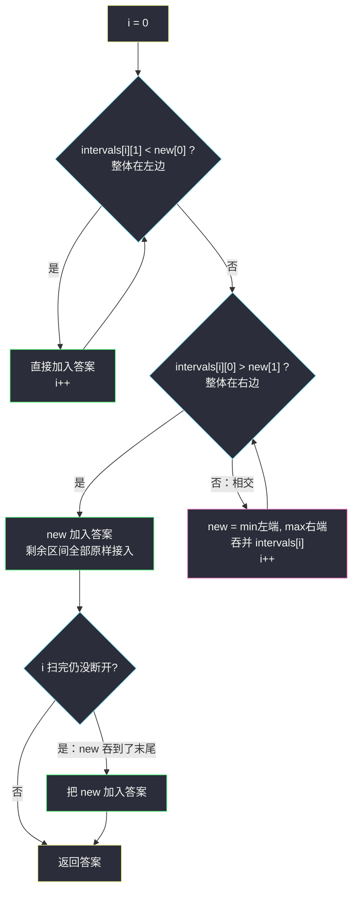
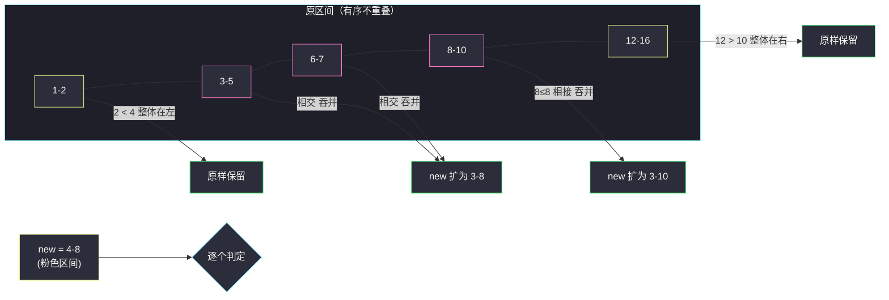

# 插入区间（三段式：左无交 / 中间合并 / 右无交）

## 一、问题描述

给你一个**无重叠**的、按区间左端点升序排列的区间列表 `intervals`，其中 `intervals[i] = [start_i, end_i]` 表示第 `i` 个区间（**闭区间**）。再给你一个区间 `newInterval = [start, end]` 表示另一个区间。请插入 `newInterval` 到 `intervals` 中，使得 `intervals` 依然按左端点升序且**任意两个区间不重叠**（必要时合并重叠区间），返回插入之后的列表。

> 🔗 LeetCode 57：https://leetcode.cn/problems/insert-interval/

**示例 1**

```
输入：intervals = [[1,3],[6,9]], newInterval = [2,5]
输出：[[1,5],[6,9]]
解释：[2,5] 与 [1,3] 重叠，合并为 [1,5]；[6,9] 在右侧无交，保留。
```

**示例 2（横跨多个区间）**

```
输入：intervals = [[1,2],[3,5],[6,7],[8,10],[12,16]], newInterval = [4,8]
输出：[[1,2],[3,10],[12,16]]
解释：[4,8] 与 [3,5]、[6,7]、[8,10] 全部重叠，合并为 [3,10]
（左端取三者最小的 3，右端取最大的 10）。
```

**直观理解**

输入天然**有序且互不重叠**——这正是 #56 排序之后的形态。插入新区间不需要重新排序，只需把它「穿」过列表：左边整体在新区间左边的、右边整体在新区间右边的，都原样保留；中间与新区间有接触的所有区间，被新区间「吞」成一个大段。一次线性扫描即可，比「append 后重新做 #56」更省。

---

## 二、暴力解法（入门）

### 直观思路

最不动脑的做法：先把 `newInterval` 追加进 `intervals`，然后原封不动跑一遍 #56 的「排序 + 线性合并」。

```java
public int[][] insert(int[][] intervals, int[] newInterval) {
    List<int[]> all = new ArrayList<>();
    for (int[] in : intervals) all.add(in);
    all.add(newInterval);                       // 直接追加
    all.sort((a, b) -> a[0] - b[0]);            // 重新排序
    List<int[]> ans = new ArrayList<>();
    for (int[] cur : all) {
        if (!ans.isEmpty() && cur[0] <= ans.get(ans.size() - 1)[1]) {
            int[] last = ans.get(ans.size() - 1);
            last[1] = Math.max(last[1], cur[1]);
        } else {
            ans.add(cur);
        }
    }
    return ans.toArray(new int[0][]);
}
```

### 复杂度

- **时间**：`O(n log n)`（排序主导）。
- **空间**：`O(n)`。

### 🔴 瓶颈在哪里

浪费在两点：

1. **重新排序**——输入本来就有序，追加后只是「有序数组中插入一个元素」，排序是杀鸡用牛刀；
2. **全量扫描合并**——新区间只会影响「与它有接触的一小段」，左右两翼的大多数区间根本不可能与它重叠。

有序性是免费的，应该**一次线性扫描**把列表切成三段处理。

---

## 三、优化探索（核心章节）

### 3.1 观察特征

| 特征 | 结论 |
|------|------|
| `intervals` 已按左端点升序且互不重叠 | 无需排序，天然可线性扫描 |
| 区间 `a` 与 `new` 相交 ⟺ `a[0] ≤ new[1] && new[0] ≤ a[1]` | 不相交可以简化为两种「整体在一侧」 |
| 不相交的区间只能**整体在左边**或**整体在右边** | 左：`a[1] < new[0]`；右：`a[0] > new[1]`；其余全是有交的中间段 |

### 3.2 三段式扫描

对每个区间 `a = intervals[i]` 三选一：

1. **`a[1] < new[0]`（a 整体在左边）**：与 `new` 无交，直接加入答案，`i++`；
2. **`a[0] > new[1]（a 整体在右边）`**：与 `new` 无交且之后都无交（左端点有序），**停止吸收**，把当前合并结果 `new` 先入答案，再把剩余区间全部原样接入；
3. **否则（相交）**：被 `new` 吞并——`new[0] = min(new[0], a[0])`，`new[1] = max(new[1], a[1])`，`i++`，继续看下一个是否也相交。



### 3.3 关键推导问题

| 问题 | 答案 |
|------|------|
| 「相交」的判定为什么不用完整判定式？ | 互不重叠的有序区间中，排除「整体在左」与「整体在右」后剩下的必然相交，两种简化判定更快 |
| 吞并时左右端点为什么各取 min / max？ | new 可能只交尾部（如 `[4,8]` 吞 `[3,5]`，左端取 min→3）也可能只交头部（吞 `[6,7]`，右端取 max→8） |
| 吞并完 `[3,5]` 后，`[2,4]` 会不会被漏掉？ | 不会——输入互不重叠且左端点有序，`[2,4]` 若存在必排在 `[3,5]` 前面，早被「整体在左」或「相交」分支处理过了 |
| 为什么右边断开后可以直接全部接入？ | 断开点 `intervals[i][0] > new[1]`，其后区间左端点更大，与 new 及 new 吞出的大段都无交 |
| new 落在空隙里（谁也不挨着）怎么办？ | 循环里既不满足左也不满足右的条件会直接走「相交」？不会——空隙情形是「右边的第一个区间整体在右」，此时 new 原样入答案即可，覆盖在断开分支里 |

### 3.4 一句话核心

> **把列表切成三段：整体在左的直接抄、相交的都吞进 new、整体在右的先断开再整段抄——一次扫描完成插入 + 合并。**

---

## 四、代码实现详解

> 说明：课源码仓库未单独收录 #57；主解基于 #56「排序 + 合并」骨架在**输入已有序**这一前提下的线性化版本（站内 [merge-intervals.md](/solutions/base/merge-intervals.md)），即区间家族标准三段式写法。

### Java（主解：三段式线性扫描）

```java
// 插入区间
// 测试链接 : https://leetcode.cn/problems/insert-interval/
class Solution {

    public int[][] insert(int[][] intervals, int[] newInterval) {
        List<int[]> ans = new ArrayList<>();
        int i = 0, n = intervals.length;
        // 第一段：整体在 new 左边的，原样保留
        while (i < n && intervals[i][1] < newInterval[0]) {
            ans.add(intervals[i]);
            i++;
        }
        // 第二段：与 new 相交的，全部吞并进 new
        while (i < n && intervals[i][0] <= newInterval[1]) {
            newInterval[0] = Math.min(newInterval[0], intervals[i][0]);
            newInterval[1] = Math.max(newInterval[1], intervals[i][1]);
            i++;
        }
        // 吞并完成的 new 成为一段
        ans.add(newInterval);
        // 第三段：整体在 new 右边的，原样保留
        while (i < n) {
            ans.add(intervals[i]);
            i++;
        }
        return ans.toArray(new int[0][]);
    }
}
```

注意第二个 `while` 的条件 `intervals[i][0] <= newInterval[1]`：**端点相接算相交**（对应闭区间的重叠），与 #56 中 `cur[0] <= last[1]` 的 ≤ 完全一致；同时随着吞并 `newInterval[1]` 只会变大，窗口越吞越宽，天然正确。

### Python（同思路）

```python
class Solution:
    def insert(self, intervals: list[list[int]], newInterval: list[int]) -> list[list[int]]:
        ans = []
        i, n = 0, len(intervals)
        # 第一段：整体在左边
        while i < n and intervals[i][1] < newInterval[0]:
            ans.append(intervals[i])
            i += 1
        # 第二段：相交的都吞进 new
        while i < n and intervals[i][0] <= newInterval[1]:
            newInterval[0] = min(newInterval[0], intervals[i][0])
            newInterval[1] = max(newInterval[1], intervals[i][1])
            i += 1
        ans.append(newInterval)
        # 第三段：整体在右边
        while i < n:
            ans.append(intervals[i])
            i += 1
        return ans
```

---

## 五、具体例子演示

`intervals = [[1,2],[3,5],[6,7],[8,10],[12,16]]`，`newInterval = [4,8]`。

**逐步跟踪**：

| 步骤 | i | intervals[i] | 判定 | newInterval | ans |
|------|---|--------------|------|-------------|-----|
| 1 | 0 | `[1,2]` | `1 < 4`？`2 < 4` ✔ 整体在左 | `[4,8]` | `[[1,2]]` |
| 2 | 1 | `[3,5]` | `3 ≤ 8` ✔ 相交，吞并 | `[min(4,3), max(8,5)] = [3,8]` | `[[1,2]]` |
| 3 | 2 | `[6,7]` | `6 ≤ 8` ✔ 相交，吞并 | `[min(3,6), max(8,7)] = [3,8]` | `[[1,2]]` |
| 4 | 3 | `[8,10]` | `8 ≤ 8` ✔ 端点相接也算相交，吞并 | `[3, max(8,10)] = [3,10]` | `[[1,2]]` |
| 5 | 4 | `[12,16]` | `12 ≤ 10` ✘ 断开 | `[3,10]` 入答案 | `[[1,2],[3,10]]` |
| 6 | 4 | `[12,16]` | 第三段整段抄入 | — | `[[1,2],[3,10],[12,16]]` |

最终输出 `[[1,2],[3,10],[12,16]]`，与官方示例一致。



**再看首尾两个边界**：

- `intervals = [[2,4],[6,8]]`, `new = [0,1]`：第一个循环 `2 < 0`? 否（`4 < 0` 为假）→ 直接进第二段：`2 ≤ 1`? 否 → `[0,1]` 入答案排最前，第三段抄入 `[2,4],[6,8]` → `[[0,1],[2,4],[6,8]]` ✓（new 整体在左）。
- `intervals = []`, `new = [5,7]`：三个循环全不执行，答案 `[[5,7]]` ✓。

---

## 六、复杂度分析

| 项目 | 三段式扫描（主解） | 追加后重做 #56 |
|------|--------------------|-----------------|
| 时间 | `O(n)`：每个区间恰好被访问一次 | `O(n log n)`（重排序） |
| 空间 | `O(log n)` 以内（不计输出），全程 `O(1)` 额外 | `O(n)` 拷贝 + 排序栈 |

---

## 七、方法对比与总结

| | 暴力 append + 排序合并 | 三段式线性扫描 |
|--|--------------------------|------------------|
| 利用已有有序性 | 否，推倒重来 | 是，一次扫描 |
| 相交判定 | 每次走通用判定 | 左 / 中 / 右三分支各走各的 |
| 复杂度 | `O(n log n)` | `O(n)` |

**易错点**

1. 第一段判定写成 `intervals[i][0] < new[0]`：左端点小**不代表**整体在左（可能右端点跨过 new），必须用右端点 `intervals[i][1] < new[0]` 判定；
2. 第二段吞并忘了 `min/max`：`[4,8]` 吞 `[3,5]` 时左端应取 3；
3. 端点相接（`8 ≤ 8`）漏判为不相交：闭区间下相接即重叠；
4. 第二个 while 结束后**忘记把 new 加进答案**（包括一路吞到末尾的情形），或右边断开后重复加入。

**模板口诀**

> **左抄一段、右抄一段、中间全吞；吞完落座，端点取小取大。**

---

## 八、举一反三

| 题目 | 链接 | 迁移点 |
|------|------|--------|
| 56. 合并区间 | https://leetcode.cn/problems/merge-intervals/ | 本题去掉「输入已有序」前提的一般版（[站内题解](/solutions/base/merge-intervals.md)） |
| 452. 用最少数量的箭引爆气球 | https://leetcode.cn/problems/minimum-number-of-arrows-to-burst-balloons/ | 有序区间上「求最少不相交段」的计数对偶（[站内题解](/solutions/base/minimum-number-of-arrows-to-burst-balloons.md)） |
| 435. 无重叠区间 | https://leetcode.cn/problems/non-overlapping-intervals/ | 右端点排序 + 贪心保留，最少删除 = n − 最大不相交数 |
| 986. 区间列表的交集 | https://leetcode.cn/problems/interval-list-intersections/ | 双指针扫两组有序区间，相交段判定 `max(l1,l2) ≤ min(r1,r2)` |

**迁移一句**：区间题凡是**已经有序**，就别急着排序——把新区间（或新事件）沿有序列表「穿针引线」，左右无交整段抄、有交吞并延伸，是插入类题的万能骨架。
