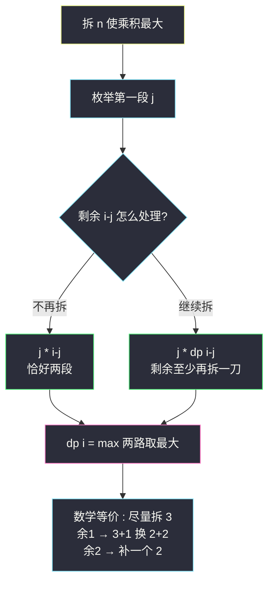
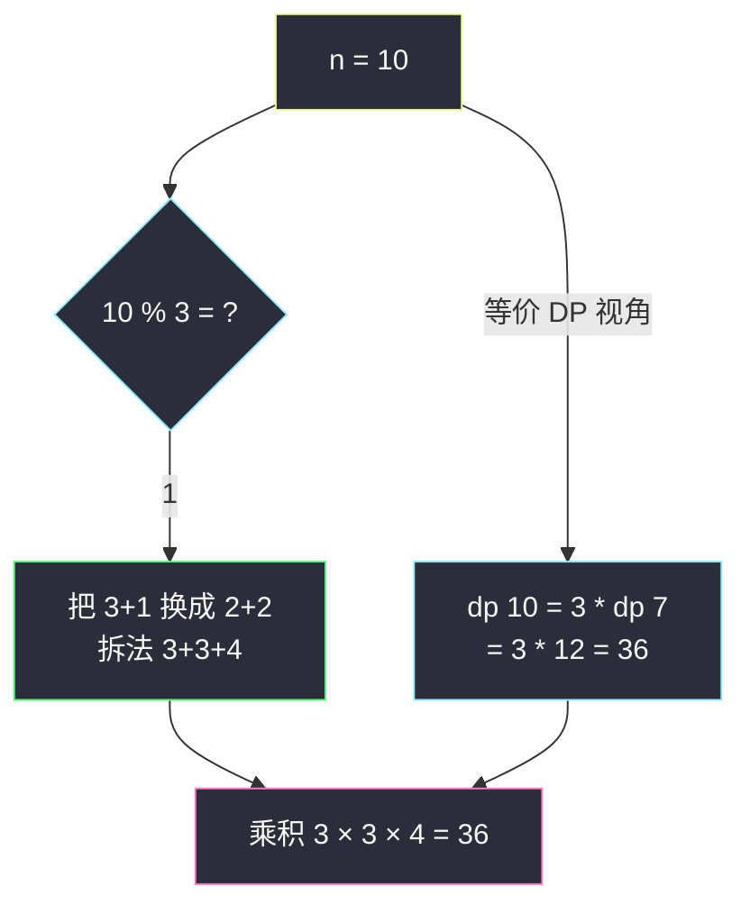

# 整数拆分（拆分最大化：每段越接近 e 越好）

## 一、问题描述

给定正整数 `n`，将其拆分成 **k 个正整数之和**（`k ≥ 2`），使这些整数的**乘积最大化**，返回最大乘积。

> 🔗 LeetCode 343：https://leetcode.cn/problems/integer-break/

**示例 1**

```
输入：n = 10
输出：36
解释：10 = 3 + 3 + 4，乘积 3 × 3 × 4 = 36
```

**示例 2**

```
输入：n = 2
输出：1
解释：2 = 1 + 1，乘积 1 × 1 = 1（必须拆，至少两段）
```

**直观理解**

一根长 `n` 的竹子剪成若干段，每段长度是正整数，问段长乘积最大是多少——就是课上「砍竹子」题（class090 Code01，LC 剑指 Offer 系列的取模版本），本题是不取模的原版。两条路：**DP**（第一段剪在哪，枚举转移）稳扎稳打；**数学结论**（尽量剪成 3，余 1 就把 3+1 换成 2+2）一步到位，课上 Code01 给的正是数学版 + 快速幂。

---

## 二、暴力解法

### 直观思路

定义尝试 `f(i)`：把 `i` 拆成**若干段（可一段不拆）**的最大乘积。枚举**第一段的长度 j**：剩余 `i - j` 可以不再剪（直接乘上去），也可以继续剪（用 `f(i-j)`）：

```java
// 暴力递归 : i 拆成若干段的最大乘积（允许一段不拆）
public static int f(int i) {
    if (i == 1) {
        return 1;
    }
    int ans = i; // 方案之一 : 整段不剪
    for (int j = 1; j < i; j++) {
        ans = Math.max(ans, j * f(i - j)); // 第一段 j，剩下继续剪
    }
    return ans;
}

// 主函数入口 : 必须至少剪一刀，枚举第一刀
public static int integerBreak1(int n) {
    int ans = 0;
    for (int j = 1; j < n; j++) {
        ans = Math.max(ans, j * f(n - j));
    }
    return ans;
}
```

**入口为什么单独处理**：题面要求 `k ≥ 2`（至少两段），而递归内部允许「一段不拆」，否则 `n` 本身会打败一切拆分。

### 复杂度

- **时间**：`O(2^n)` 级别，指数爆炸
- **空间**：`O(n)` 递归栈

### 🔴 瓶颈在哪里

单个可变参数 `i`，状态只有 `n` 个，递归重复求解 → 一维填表。

---

## 三、优化探索

### 3.1 可变参数分析

一个可变参数 → 一维表：

| dp 定义 | 含义 |
|---------|------|
| `dp[i]` | 把 `i` 拆成**至少两个正整数**之和的最大乘积 |

**定义里带「至少两段」**，入口和转移就都不用特判了——这是本题 dp 定义的关键小设计。

### 3.2 转移方程推导（两个来源：剩一段不再拆 / 剩下继续拆）

枚举拆出的**第一个数 j**（`1 ≤ j < i`），剩下 `i - j`：

- **不再拆**：直接 `j * (i - j)`（此时恰好两段）
- **继续拆**：`j * dp[i - j]`（剩下那坨至少再拆一刀，乘积用 dp 表）

```
dp[i] = max over 1 ≤ j < i of  max( j * (i - j),    // 两段收工
                                    j * dp[i - j] )  // 剩余继续拆
```

**为什么要 max 两种**：`dp[i-j]` 强制剩余部分至少拆成两段；但有时「剩余整段不再拆」更优（如 `i=4`：`2*2=4` 优于 `2*dp[2]=2*1=2`）。

### 3.3 初始化与依赖方向

- `dp[1] = 1`（1 只能拆成…… 实际 1 拆不了，但作为乘法单位置 1 不碍事；真正从 `dp[2]=1` 开始有意义）
- `dp[i]` 依赖更小的 `dp[i-j]` → `i` 从小到大

### 3.4 数学视角（课上 Code01 的路：为什么是 3）

把 `n` 分成 `k` 段尽量相等的实数，每段 `x = n/k`，乘积 `x^k = x^(n/x)`。最大化 ⟺ 最大化 `ln(x)/x`，求导得 `x = e ≈ 2.718`。整数解就近取 **3**（3 比 2 更接近 e：`3^(1/3) > 2^(1/2)`）。余数讨论：

| n % 3 | 处理 | 例 |
|-------|------|-----|
| 0 | 全拆 3 | 6 → 3×3 = 9 |
| 1 | 一个 3+1 换成 2+2（1×3 < 2×2） | 4 → 2×2 = 4；7 → 3+2+2 |
| 2 | 拆出 1 个 2，其余 3 | 5 → 3+2 = 6；8 → 3+3+2 |

这就是 class090 Code01 里那串注释 `n=7 → 3*2*2`、`n=8 → 3*3*2`、`n=10 → 3*3*4` 的由来（4 = 2+2 用整数表示）。

### 3.5 关键问题

| 问题 | 答案 |
|------|------|
| 为什么不拆出 1？ | 1 不增值还占额度：`1+x < 1+x+...` 里把 1 并给任何一段都更优 |
| 什么时候 2 比 3 好？ | 余 1 时：`3×1 = 3 < 2×2 = 4`，把「一个 3 + 余数 1」改成「两个 2」 |
| dp 定义若允许「一段不拆」会怎样？ | `dp[n] = n` 永远最大，必须用 max(两段版, 继续拆版) 区分开，或定义里写死至少两段 |
| 上溢吗？ | #343 约束 `2 ≤ n ≤ 58`，最大 `58 → 3^18×2^2 ≈ 1.5×10^10`？不，58 = 3×18+4 → 3^18×4 ≈ 1.5×10^10 > int！注意 `3^18 = 387420489`，×4 ≈ 1.55×10^9 恰在 int 边缘（实际 58 的答案是 1549681956 < 2^31），DP 中间量用 long 更稳 |
| 砍竹子 II（大 n 取模）怎么写？ | class090 Code01：结论同样成立，用快速幂算 `3^p % mod` |

### 3.6 一句话核心

> **dp[i] = max(j×(i−j), j×dp[i−j])；数学版：凑 3，余 1 换 2+2，余 2 补 2。**



---

## 四、代码实现

### Java（主解：一维 DP）

```java
// 整数拆分
// 把 n 拆成 k ≥ 2 个正整数之和，返回最大乘积
// 测试链接 : https://leetcode.cn/problems/integer-break/
// 对齐 class090 Code01_CuttingBamboo（砍竹子，取模版），
// 本题不取模，先给通用 DP 版
public class Solution {

    // 时间复杂度 O(n²)，空间复杂度 O(n)
    public int integerBreak(int n) {
        // dp[i] : 把 i 拆成至少两个正整数的最大乘积
        // 依赖方向 : 只依赖更小的 dp[i-j] → i 从小到大
        long[] dp = new long[n + 1];
        dp[1] = 1;
        for (int i = 2; i <= n; i++) {
            for (int j = 1; j < i; j++) {
                // 两路 : 剩余不拆 / 剩余继续拆
                dp[i] = Math.max(dp[i],
                        Math.max((long) j * (i - j), (long) j * dp[i - j]));
            }
        }
        return (int) dp[n];
    }
}
```

### Java（进阶：数学结论 O(1)，对齐 class090 Code01）

```java
// 数学结论 : 尽量拆 3；n%3==1 时把 3+1 换成 2+2；n%3==2 时补一个 2
// 时间复杂度 O(log n)（快速幂）或 O(1)（本题不取模直接 pow）
public class Solution {

    public int integerBreak(int n) {
        if (n == 2) {
            return 1; // 1*1
        }
        if (n == 3) {
            return 2; // 1*2（注意必须拆，与"不拆"的 3 不同）
        }
        // n ≥ 4 :
        // n%3==0 → 3^p；n%3==1 → 3^(p-1)*4；n%3==2 → 3^p*2
        long ans = 1;
        while (n > 4) { // 剩 4(→2*2)、3、2 时停，直接乘尾巴
            ans *= 3;
            n -= 3;
        }
        return (int) (ans * n);
    }
}
```

```java
// 取模大 n 版（对应 class090 Code01 砍竹子 II，n 到 10^9+ 需快速幂）
public class Solution {

    public static long power(long x, int p, int mod) {
        long ans = 1;
        while (p > 0) {
            if ((p & 1) == 1) {
                ans = ans * x % mod;
            }
            x = x * x % mod;
            p >>= 1;
        }
        return ans;
    }

    public int cuttingBamboo(int n) {
        if (n == 2) return 1;
        if (n == 3) return 2;
        int mod = 1000000007;
        // tail : 收尾因子（n%3==0 → 1 不乘；==1 → 4；==2 → 2）
        int tail = n % 3 == 0 ? 1 : (n % 3 == 1 ? 4 : 2);
        int p = (tail == 1 ? n : n - tail) / 3; // 3 的个数
        return (int) (power(3, p, mod) * tail % mod);
    }
}
```

### Python

```python
# 主解：一维 DP
class Solution:
    def integerBreak(self, n: int) -> int:
        # dp[i] : 把 i 拆成至少两个正整数的最大乘积
        dp = [0] * (n + 1)
        dp[1] = 1
        for i in range(2, n + 1):
            for j in range(1, i):
                dp[i] = max(dp[i], j * (i - j), j * dp[i - j])
        return dp[n]
```

```python
# 数学版：O(1)
class Solution:
    def integerBreak(self, n: int) -> int:
        if n == 2:
            return 1
        if n == 3:
            return 2
        ans = 1
        while n > 4:
            ans *= 3
            n -= 3
        return ans * n
```

---

## 五、具体例子演示

以 `n = 10` 为例，DP 表从小到大填。

### dp 表逐格填充

| i | 最优拆法 | 计算过程（只列关键 j） | dp[i] |
|---|---------|----------------------|-------|
| 2 | 1+1 | j=1: max(1×1, 1×dp[1]) = 1 | **1** |
| 3 | 1+2 | j=1: max(1×2, 1×dp[2]=1) = 2 | **2** |
| 4 | 2+2 | j=2: max(2×2, 2×dp[2]=2) = **4** | **4** |
| 5 | 2+3 | j=2: max(2×3, 2×dp[3]=4) = 6 | **6** |
| 6 | 3+3 | j=3: max(3×3, 3×dp[3]=6) = **9** | **9** |
| 7 | 3+2+2 | j=3: max(3×4, 3×dp[4]=**12**) = **12** | **12** |
| 8 | 3+3+2 | j=3: max(3×5, 3×dp[5]=**18**) = 18 | **18** |
| 9 | 3+3+3 | j=3: max(3×6, 3×dp[6]=**27**) = **27** | **27** |
| 10 | 3+3+4 | j=3: max(3×7, 3×dp[7]=**36**) = **36** | **36** |

返回 `dp[10] = 36` ✓（3+3+4，其中 4 又是 2+2）。

**观察「继续拆」从何时开始赢**：i ≤ 4 时 `j×(i−j)`（两段收工）占优；i ≥ 7 起最优解全部走 `j×dp[i−j]`（剩 3 或 4 的尾巴时两段收工）——这正是数学结论「尾巴只留 2/3/4」的 DP 映射。

### 数学版逐步验证 n = 10



若按贪心「拿 3 拿到不能拿」硬拆：10 = 3+3+3+1，乘积 27 < 36——余 1 的那一步必须把 3+1 改写成 2+2，这是本题最容易翻车的细节。

---

## 六、复杂度分析

| 版本 | 时间 | 空间 | 说明 |
|------|------|------|------|
| 暴力递归 | `O(2^n)` | `O(n)` | 指数展开 |
| 一维 DP（主解） | `O(n²)` | `O(n)` | 每个状态枚举 j |
| 数学版 | `O(1)`~`O(log n)` | `O(1)` | 直接按余数拼答案；大 n 取模配快速幂 |

`n ≤ 58`，DP 版约 1700 次运算绰绰有余；数学版适合面试口述加分。

---

## 七、方法对比与总结

### 拆分类 DP 的两个易混定义

| 定义 | 转移 | 适配 |
|------|------|------|
| dp[i] = 拆 i（**至少两段**）的最大乘积 | `max(j×(i−j), j×dp[i−j])` 两路都要 | 本题题面（k ≥ 2） |
| f(i) = 剪 i（**允许不剪**）的最大值 | `max(i, j×f(i−j))` | 递归内部更顺手，入口再强制剪一刀 |

两个定义都能做对，但**混用必错**：定义决定「两段收工」这一路要不要保留。

### 易错点

1. **忘了两段收工路线**：只写 `dp[i] = j*dp[i-j]`，`dp[4]` 会得 2×dp[2]=2 而不是 2×2=4。
2. **入口不强制 k ≥ 2**：n=3 若允许不拆得 3，答案错（应 2）。
3. **数学版余 1 不换**：10 拆成 3+3+3+1 只得 27。
4. **int 溢出**：n=58 的答案约 1.55×10^9，贴着 int 上限，中间乘法建议 long。
5. **取模版没配快速幂**：n 大到 10^9 时 while 循环减 3 会超时（class090 Code01 用 power 函数的原因）。

### 模板口诀

> **第一段枚举 j，两段收工或继续拆取大；数学版凑 3 余一换二二。**

---

## 八、举一反三

| 题目 | 链接 | 迁移点 |
|------|------|--------|
| 剑指 Offer 14- I / II 剪绳子 / 砍竹子 II | https://leetcode.cn/problems/jian-sheng-zi-ii-lcof/ | 同题取模大 n 版，class090 Code01 原题 |
| 1808. 好因子的最大数目 | https://leetcode.cn/problems/maximize-number-of-nice-divisors/ | 同一「凑 3」结论的因数计数版 |
| 剑指 Offer 14- I 剪绳子 | https://leetcode.cn/problems/jian-shengzi-lcof/ | 与 #343 完全同题 |
| 91. 解码方法 | https://leetcode.cn/problems/decode-ways/ | 对比「拆分」语义的另一个维度：拆成编码段计数 |

**迁移一句**：**「把一个整数拆成若干正整数之和，求乘积/计数/方案」**是一个家族——求最值时想「凑 3 换 2+2」，求方案时想「第一段剪在哪」的枚举 DP；遇到取模大 n 就上快速幂。
