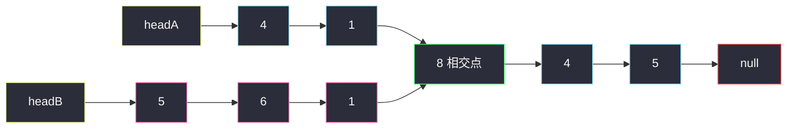
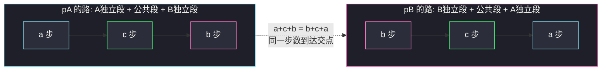

# 相交链表（双指针浪漫相遇法）

## 一、问题描述

给你两个单链表的头节点 `headA` 和 `headB`，请你找出并返回它们**相交的起始节点**；如果两个链表不相交，返回 `null`。

「相交」的含义：从某个节点开始，两条链表**共享同一段后缀**——是同一个对象，不只是值相等。整体呈 Y 字形。

> 🔗 LeetCode 160：https://leetcode.cn/problems/intersection-of-two-linked-lists/

**示例 1**

```
A:          4 → 1 ──┐
                     ↘
                      8 → 4 → 5 → null
                     ↗
B:     5 → 6 → 1 ──┘

输入：intersectVal = 8, listA = [4,1,8,4,5], listB = [5,6,1,8,4,5], skipA = 2, skipB = 3
输出：Intersected at '8'
```

**示例 2**

```
A: 2 → 6 → 4 → null
B: 1 → 5 → null
输出：null（两条链表不相交）
```

**直观理解**

单链表的 `next` 是唯一的：两条链表一旦在某个节点汇合，之后就**永远走同一条路**，不可能再分开。所以「相交」只有 Y 形一种形态——前面各自独立（长度分别为 a、b），后面完全重合（长度 c）。

反过来，比较的是**节点地址**而不是 `val`：值相等的两个节点可以是两条毫不相干的节点。

---

## 二、暴力解法（哈希集合）

### 思路

把 A 链表的**所有节点地址**存进 `HashSet`，再沿 B 走，第一个出现在集合里的节点就是交点。

（更暴力的做法是对 A 的每个节点都从头扫一遍 B，时间 `O(m·n)`，这里直接给哈希版。）

```java
class Solution {
    public ListNode getIntersectionNode(ListNode headA, ListNode headB) {
        Set<ListNode> seen = new HashSet<>();
        for (ListNode cur = headA; cur != null; cur = cur.next) {
            seen.add(cur);
        }
        for (ListNode cur = headB; cur != null; cur = cur.next) {
            if (seen.contains(cur)) {
                return cur;
            }
        }
        return null;
    }
}
```

### 复杂度

- **时间**：`O(m + n)`
- **空间**：`O(m)`

### 🔴 瓶颈在哪里

1. 额外开了 `O(m)` 空间。
2. 完全没有利用 Y 形结构的特征——**尾部是对齐的**，这个信息白白浪费了。

---

## 三、优化探索（核心章节）

### 3.1 观察特征

| 特征 | 说明 |
|------|------|
| Y 形结构 | 相交后完全重合，两链表**尾节点是同一个** |
| 尾对齐 | 交点之后的部分长度相同，差异全在前面的独立段（a 对 b） |
| 距尾等远则同步相遇 | 两个指针若离链尾一样远，同步前进必然**同时**到达交点（或同时到达 null） |

推论：**比较尾节点是否相同，就能判断相交与否**；想让两个指针同步相遇，只要先把长的链表「多余的 a − b 步」走掉。

### 3.2 推导一：长度差对齐（课源码方法）

左程云 class034 `Code01_IntersectionOfTwoLinkedLists` 的做法：

1. 两条链表各自走到尾，用变量 `diff` 顺路累计长度差（A 加、B 减）；
2. 尾节点不是同一个 → 直接返回 `null`；
3. 让**长的**链表先走 `|diff|` 步，把剩余长度拉齐；
4. 两条同步前进，第一个相同的节点就是交点。

`O(1)` 空间，但「算差、取绝对值、先走几步」几段循环写起来琐碎，考场上容易手滑。

### 3.3 推导二：双指针浪漫法（把对齐自动化）

与其先算长度差，不如让两个指针**各自把两条链表都完整走一遍**：

- `pA`：从 A 头出发，走到 `null` 后**换到 B 头**继续走；
- `pB`：从 B 头出发，走到 `null` 后**换到 A 头**继续走。

到达交点时：

- `pA` 总路程 = `a + c + b`（先走完 A，再从 B 头走 b 步到交点）
- `pB` 总路程 = `b + c + a`（先走完 B，再从 A 头走 a 步到交点）

**两者相等**，所以它们恰好在同一时刻、同一步数上相遇在交点！

若不相交：两条路总长都是 `a + b`（A 独立段 + B 独立段），两个指针**同时到达 null**，循环条件 `pA != pB` 自然退出，返回 `null`——不相交的情况被天然处理，零特判。



把两条「跑道」拉直看更清楚——**拼接后等长**：



### 3.4 关键推导问题

| 问题 | 答案 |
|------|------|
| 为什么比较地址而不是 `val`？ | 相交 = 同一个对象；值相等不代表相交 |
| `null` 这一步怎么算？ | `pA = (pA == null) ? headB : pA.next`——落到 null 的那一步「消耗」在换头上，两条路的总步数仍然相等 |
| 不相交会不会死循环？ | 不会：两指针走过相同总长 `a + b` 后**同时停在 null**，`pA != pB` 退出，返回 null |
| 两条链表一长一短会不会错过？ | 不会：等长的总路程保证了「同一步数」到达，不存在错位错过 |

### 3.5 一句话核心

> 你走完你的路，就来走我的路；我也走完我的路，来走你的路。两条路一样长，我们必在相遇点碰头——若无缘，就在 null 一同落空。

---

## 四、代码实现详解

### Java（双指针 · 主解）

```java
class Solution {
    public ListNode getIntersectionNode(ListNode headA, ListNode headB) {
        if (headA == null || headB == null) {
            return null;
        }
        ListNode pA = headA, pB = headB;
        while (pA != pB) {
            // 走到 null 就换到另一条链表的头，null 这一步也计入路程
            pA = (pA == null) ? headB : pA.next;
            pB = (pB == null) ? headA : pB.next;
        }
        return pA; // 相遇点，或同时为 null
    }
}
```

### Java（长度差对齐 · 第二思路，对齐课源码 class034/Code01 思路）

```java
class Solution {
    public ListNode getIntersectionNode(ListNode headA, ListNode headB) {
        // 1. 各走到尾，顺便累计长度差
        ListNode a = headA, b = headB;
        int diff = 0;
        while (a.next != null) { a = a.next; diff++; }
        while (b.next != null) { b = b.next; diff--; }
        // 2. 尾节点不同 => 一定不相交
        if (a != b) {
            return null;
        }
        // 3. 长的先走 |diff| 步：diff >= 0 说明 A 更长
        ListNode longList  = diff >= 0 ? headA : headB;
        ListNode shortList = diff >= 0 ? headB : headA;
        diff = Math.abs(diff);
        while (diff-- > 0) {
            longList = longList.next;
        }
        // 4. 同步前进，第一个相同节点即交点
        while (longList != shortList) {
            longList = longList.next;
            shortList = shortList.next;
        }
        return longList;
    }
}
```

### Python（两版同思路）

```python
class Solution:
    def getIntersectionNode(self, headA: ListNode, headB: ListNode) -> ListNode | None:
        pA, pB = headA, headB
        while pA is not pB:
            pA = headB if pA is None else pA.next
            pB = headA if pB is None else pB.next
        return pA
```

```python
class Solution:
    def getIntersectionNode(self, headA: ListNode, headB: ListNode) -> ListNode | None:
        a, b, diff = headA, headB, 0
        while a.next:
            a, diff = a.next, diff + 1
        while b.next:
            b, diff = b.next, diff - 1
        if a is not b:
            return None
        long_l = headA if diff >= 0 else headB
        short_l = headB if diff >= 0 else headA
        for _ in range(abs(diff)):
            long_l = long_l.next
        while long_l is not short_l:
            long_l, short_l = long_l.next, short_l.next
        return long_l
```

---

## 五、具体例子演示

以示例 1 跟踪双指针版：`A = 4→1→8→4→5`（a = 2），`B = 5→6→1→8→4→5`（b = 3），公共段 `8→4→5`（c = 3）。

### 初始

```
pA = 4 (A头)    pB = 5 (B头)    4 != 5，进入循环
```

### 逐步跟踪（每轮两指针各前进一步）

| 轮次 | pA 位置 | pB 位置 | 说明 |
|------|---------|---------|------|
| 1 | 1 | 6 | 各自走独立段 |
| 2 | 8 | 1 | pA 率先进入公共段 |
| 3 | 4 | 8 | pB 随后进入公共段，两者错位 |
| 4 | 5 | 4 | 继续错位 |
| 5 | null → **换到 B 头 5** | 5 | pA 走完 A（共 5 步）换道；两个「5」是不同节点，继续 |
| 6 | 6 | null → **换到 A 头 4** | pB 走完 B（共 6 步）换道 |
| 7 | 1 | 1 | 两个「1」仍是不同节点，继续 |
| 8 | **8** | **8** | ✅ 同一节点！返回相交点 8 |

核对路程：pA 走了 `a + c + b = 2 + 3 + 3 = 8` 步，pB 走了 `b + c + a = 3 + 3 + 2 = 8` 步——**恰好同一步数到达交点**。

```
第 8 轮结束时的现场：

A:   4 → 1 ──┐
              ↘
               8 → 4 → 5 → null
              ↗ ↑
B: 5 → 6 → 1 ┘  pA、pB 都停在这里
```

**不相交场景**（示例 2）：`A = 2→6→4`，`B = 1→5`。pA 走完 A（3 步）换 B 头再走 2 步到 null；pB 走完 B（2 步）换 A 头再走 3 步到 null——**第 5 步同时落在 null**，`pA != pB` 不成立，退出返回 `null`。

**极简边界**：任一链表为 `null` 直接返回 `null`（主解开头的判空，也避免 `null` 换头后死等）。

---

## 六、复杂度分析

| 方法 | 时间 | 额外空间 | 说明 |
|------|------|----------|------|
| 双重循环 | `O(m·n)` | `O(1)` | 对每个 A 节点扫一遍 B |
| 哈希集合 | `O(m + n)` | `O(m)` | 换来空间代价 |
| 长度差对齐 | `O(m + n)` | `O(1)` | 课源码方法，两三段循环 |
| **双指针换道** | **`O(m + n)`** | **`O(1)`** | 主解：一段循环写完，零特判 |

双指针版每个指针最多走 `a + c + b` 步，是标准的线性一遍扫。

---

## 七、方法对比与总结

### 易错点

1. **比较 `val` 而不是节点地址** → 值相等 ≠ 相交，必须用 `==` 比引用。
2. **换头时写成 `pA = pA.next`（null 时崩溃）** → 正确写法是三元：`pA == null ? headB : pA.next`。
3. **担心死循环** → 不相交时两指针总路程都是 `a + b`，同时停在 null，循环必然退出。
4. **长度差版忘了先判尾节点** → 尾不同直接返回 null，可以省掉后面全部工作（不判也不会错，但多走路）。
5. **把 null 当「不在链表里」跳过不算步数** → null 那一步必须计入，等长性才成立。

### 双指针 vs 长度差 vs 哈希

| | 双指针换道 | 长度差对齐 | 哈希集合 |
|--|-----------|-----------|---------|
| 时间 | `O(m+n)` | `O(m+n)` | `O(m+n)` |
| 空间 | `O(1)` | `O(1)` | `O(m)` |
| 代码量 | 一个循环 | 三四段循环 | 两段循环 |
| 面试默写 | ✅ 首选 | 讲清原理 | 保底方案 |

### 模板口诀

> **你走完来走我的，我走完来走你的；总程一样长，交点必相逢——无缘同落 null。**

---

## 八、举一反三

| 题目 | 链接 | 迁移点 |
|------|------|--------|
| 141. 环形链表 | https://leetcode.cn/problems/linked-list-cycle/ | 快慢指针判断结构特征（是否成环） |
| 142. 环形链表 II | https://leetcode.cn/problems/linked-list-cycle-ii/ | 相遇后再用双指针同速走，与本题「等距同步」思想同源 |
| 876. 链表的中间结点 | https://leetcode.cn/problems/middle-of-the-linked-list/ | 快慢指针另一种用法：等距追踪 |
| 234. 回文链表 | https://leetcode.cn/problems/palindrome-linked-list/ | 找中点 + 反转后半，链表基本功组合 |
| 287. 寻找重复数 | https://leetcode.cn/problems/find-the-duplicate-number/ | 把数组当链表，用 142 的找环入口 |

**迁移一句**：链表题里出现「两条链表、公共部分、找相遇点」，先想**把两条路拼成等长跑道再同步走**。
