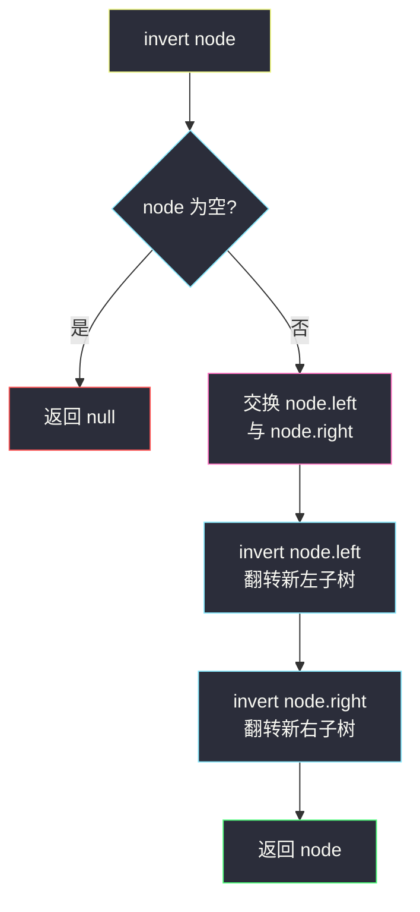
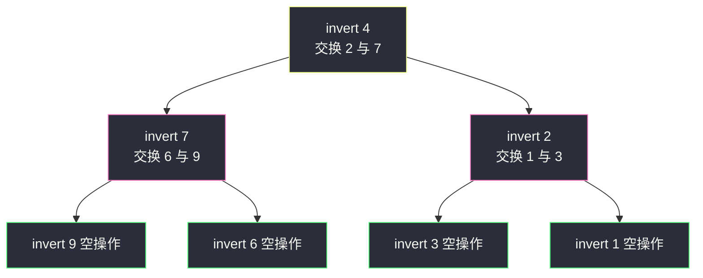

# 翻转二叉树（前序交换左右子树）

## 一、问题描述

给你一棵二叉树的根节点 `root`，翻转这棵二叉树，并返回其根节点。

「翻转」即**整棵树左右镜像**：每个非空节点的左右孩子互换，效果等同于把整棵树沿中轴线翻折。

> 🔗 LeetCode 226：https://leetcode.cn/problems/invert-binary-tree/

**示例 1**

```
输入：root = [4,2,7,1,3,6,9]
输出：[4,7,2,9,6,3,1]

         4                    4
        / \                  / \
       2   7      翻转 →    7   2
      / \ / \              / \ / \
     1  3 6  9            9  6 3  1
```

**示例 2**

```
输入：root = [2,1,3]
输出：[2,3,1]
```

**示例 3**

```
输入：root = []
输出：[]
```

**直观理解**

翻转整棵树 = **交换根的左右孩子，再分别翻转两棵子树**。每个节点只做一件小事：「把我的两个孩子换个位置」；至于子树内部怎么翻，交给递归。这是典型的「自顶向下」处理——先处理自己（交换），再交给子问题，所以天然是**前序**的框架（交换放在递归前后皆可，本题恰好不敏感，见第七章讨论）。

---

## 二、暴力解法（入门）

### 直观思路

不动原树，按镜像规则**重建**一棵新树：新根同值，新左孩子 = 原右子树的镜像拷贝，新右孩子 = 原左子树的镜像拷贝。

```java
class Solution {
    public TreeNode invertTree(TreeNode root) {
        return build(root);
    }

    // 返回 node 的镜像拷贝（原树不变）
    private TreeNode build(TreeNode node) {
        if (node == null) {
            return null;
        }
        TreeNode copy = new TreeNode(node.val);
        copy.left = build(node.right);   // 新左 = 原右的镜像
        copy.right = build(node.left);   // 新右 = 原左的镜像
        return copy;
    }
}
```

### 复杂度

- **时间**：`O(n)`，每个原节点恰好复制一次。
- **空间**：`O(n)` 新树节点 + `O(h)` 递归栈。

### 🔴 瓶颈在哪里

逻辑正确，但**平白多建了一整棵树**：本题允许就地修改，每个节点只需要三次指针操作（tmp、两次赋值）。`O(n)` 的额外空间可以完全省掉，而且「就地把孩子一换」正是这道题想教的手感——**指针操作**是二叉树题的基本功。

---

## 三、优化探索（核心章节）

### 3.1 观察特征

| 特征 | 结论 |
|------|------|
| 翻转可分解 | 整树镜像 = 交换根的孩子 + 两棵子树各自镜像 |
| 子问题与原问题同构 | 每个节点的处理方式完全一样 → 递归分治 |
| 就地可做 | 只改指针指向，不动节点值、不建新节点 → O(1) 额外空间（不计栈） |
| 无信息回传需求 | 不需要子树返回统计量，返回引用只为方便链式接驳 → 前/中/后序位置都行 |

### 3.2 暴力 → 优化：就地交换

递归函数 `invert(node)` 约定「把以 node 为根的子树就地翻转，并返回 node（翻转后的子树根仍是它自己）」：

```
invert(node):
    node 为空 → 返回 null
    交换 node.left 与 node.right      // 先处理自己（前序位置）
    invert(node.left)                 // 子树内部继续翻
    invert(node.right)
    返回 node
```

对照暴力版：`build` 是「造一棵镜像新树」，`invert` 是「在原树上换指针」——结构完全同构，只是把 `new TreeNode(...)` 换成 `swap`，把 `copy.left = build(node.right)` 换成「交换后递归原指针」。



### 3.3 关键推导问题

| 问题 | 答案 |
|------|------|
| 交换放在递归前还是递归后？ | 都对。前序（先换再下钻）与后序（先翻子树再回来换）得到的最终树相同——因为「换孩子」和「翻子树」作用在不同层级，先后不影响叠加结果。习惯上写前序更好讲 |
| 为什么返回值有用？ | 方便测试与链式调用（`root = invertTree(root)` 语义自洽）；对根而言返回的就是它自己 |
| 翻转两次会怎样？ | 回到原树——镜像的镜像是恒等。这解释了 [101. 对称二叉树](https://leetcode.cn/problems/symmetric-tree/) 与本题的联动：对称 ⇔ 翻转左子树后与右子树「相同」 |
| 递归会不会丢指针？ | 交换用临时变量 `tmp` 三步走，或者用异或/数组技巧；Java 里最稳的是经典 tmp 三行 |
| 迭代能写吗？ | 能。任何递归都能展开成栈迭代（甚至队列层序）：每弹出一个节点就交换其孩子、把两个孩子入队，直到队空 |

### 3.4 一句话核心

> **每个节点只做一件事——交换左右孩子；子树内部交给递归。空树返回 null，一路换到底就是整棵镜像。**

---

## 四、代码实现详解

### Java（主解：前序递归，就地交换）

```java
class Solution {
    public TreeNode invertTree(TreeNode root) {
        if (root == null) {
            return null;
        }
        // 前序位置：先交换自己的左右孩子
        TreeNode tmp = root.left;
        root.left = root.right;
        root.right = tmp;
        // 再分别翻转两棵子树
        invertTree(root.left);
        invertTree(root.right);
        return root;
    }
}
```

三行核心（面试可缩写）：

```java
TreeNode t = root.left;
root.left = invertTree(root.right);
root.right = invertTree(t);
return root;
```

这版把交换与递归揉在一起：`root.left` 接住「翻转后的原右子树」。两种写法等价，分开版（先交换、再递归）逻辑更好讲。

### Java（可选视角一：后序版）

```java
class Solution {
    public TreeNode invertTree(TreeNode root) {
        if (root == null) {
            return null;
        }
        TreeNode left = invertTree(root.left);    // 先翻子树
        TreeNode right = invertTree(root.right);
        root.left = right;                        // 再交换（用返回值直接接驳）
        root.right = left;
        return root;
    }
}
```

### Java（可选视角二：队列层序迭代版）

```java
class Solution {
    public TreeNode invertTree(TreeNode root) {
        if (root == null) {
            return null;
        }
        Queue<TreeNode> queue = new ArrayDeque<>();
        queue.offer(root);
        while (!queue.isEmpty()) {
            TreeNode cur = queue.poll();
            // 弹出即交换，再把两个孩子入队
            TreeNode tmp = cur.left;
            cur.left = cur.right;
            cur.right = tmp;
            if (cur.left != null) {
                queue.offer(cur.left);
            }
            if (cur.right != null) {
                queue.offer(cur.right);
            }
        }
        return root;
    }
}
```

### Python（同思路）

```python
class Solution:
    def invertTree(self, root: Optional[TreeNode]) -> Optional[TreeNode]:
        if root is None:
            return None
        root.left, root.right = (
            self.invertTree(root.right),
            self.invertTree(root.left),
        )
        return root
```

```python
# 层序迭代版
from collections import deque

class Solution:
    def invertTree(self, root: Optional[TreeNode]) -> Optional[TreeNode]:
        if root is None:
            return None
        queue = deque([root])
        while queue:
            cur = queue.popleft()
            cur.left, cur.right = cur.right, cur.left   # 交换
            if cur.left:
                queue.append(cur.left)
            if cur.right:
                queue.append(cur.right)
        return root
```

---

## 五、具体例子演示

### 例 1：`root = [4,2,7,1,3,6,9]`

```
         4
        / \
       2   7
      / \ / \
     1  3 6  9
```

递归调用按「先交换、再递归」的时间线展开：

| 步骤 | 调用 | 动作 | 此刻树的状态（只看已交换部分） |
|------|------|------|--------------------------------|
| 1 | invert(4) | 交换 4 的孩子：左 2 ↔ 右 7 | 4 的左=7、右=2 |
| 2 | invert(7)（新左子树） | 交换 7 的孩子：6 ↔ 9 | 7 的左=9、右=6 |
| 3 | invert(9) | 两个孩子均 null，交换无效果，返回 | — |
| 4 | invert(6) | 同上 | — |
| 5 | invert(2)（新右子树） | 交换 2 的孩子：1 ↔ 3 | 2 的左=3、右=1 |
| 6 | invert(3) | null 孩子，无效果 | — |
| 7 | invert(1) | 同上 | — |
| 8 | 汇合 | 返回根 4 | 见下图 |

```
         4
        / \
       7   2
      / \ / \
     9  6 3  1      = [4,7,2,9,6,3,1] ✔
```



注意递归树的前序展开顺序：4 →（换完孩子后）新左子树 7 → 9、6 → 新右子树 2 → 3、1。叶子节点（9、6、3、1）空孩子交换是**无操作**，正是 base case 的意义。

### 例 2：`root = [2,1,3]`

invert(2)：交换 1 与 3 → 左=3、右=1；invert(3)、invert(1) 均为空操作。输出 `[2,3,1]` ✔。

### 例 3：空树与单节点

`root = []`：命中 base case 返回 null；`root = [1]`：交换两个 null 孩子（无操作），两个孩子递归也直接返回——单节点树翻转后不变。✔

---

## 六、复杂度分析

| 写法 | 时间 | 空间 |
|------|------|------|
| 重建新树（暴力） | `O(n)` | `O(n)` 新树 + `O(h)` 栈 |
| 就地递归（主解） | `O(n)`：每个节点恰好交换一次 | `O(h)` 递归栈（平衡 `O(log n)`，链状 `O(n)`） |
| 层序迭代 | `O(n)` | `O(w)` 队列，`w` 为最宽层 |

---

## 七、方法对比与总结

| | 重建新树 | 前序递归（主解） | 后序递归 | 层序迭代 |
|--|----------|------------------|----------|----------|
| 是否改原树 | 否（另建一棵） | 就地 | 就地 | 就地 |
| 额外空间 | `O(n)` | `O(h)` | `O(h)` | `O(w)` |
| 交换时机 | 构造时换向 | 下钻前换 | 回来时换 | 出队即换 |
| 推荐度 | 理解用 | ✅ 默认解 | 等价变体 | 面试加分 |

**易错点**

1. **交换三步别写成两步**：`root.left = root.right; root.right = root.left;` 之后左右指向同一个孩子，另一棵子树永久丢失——必须先用 `tmp`（或一行 Python 元组交换）。
2. 忘记处理 `root == null`：空树调用直接空指针异常。
3. 与「判断对称」混淆：**翻转是动作（改树），对称是判断（不改树）**。判断对称用双游标交叉比较，别真把树翻一遍再去比较。
4. 以为必须返回「新根」：根节点始终是同一个，返回它只是为了方便；别误把 `root.left` 之类当新根返回。
5. 前序/后序都行，但**中序位置**（先翻左、再交换、再翻右）要小心：翻完左子树后交换，随后递归的是「原来的左子树（现在是右孩子）」——写错顺序容易漏翻某棵子树。

**模板（前序处理型递归）**

```java
// TreeNode process(TreeNode node) {
//     if (node == null) return null;
//     处理自己（交换 / 记录 / 更新……）；
//     process(node.left);
//     process(node.right);
//     return node;
// }
```

---

## 八、举一反三

| 题目 | 链接 | 迁移点 |
|------|------|--------|
| 101. 对称二叉树 | https://leetcode.cn/problems/symmetric-tree/ | 对称 ⇔ 翻转左子树后与右子树相同（[站内题解](/solutions/base/symmetric-tree.md)） |
| 951. 翻转等价二叉树 | https://leetcode.cn/problems/flip-equivalent-binary-trees/ | 每个节点可选翻或不翻，比较两树是否等价 |
| 2265. 统计值等于子树元素平均值的节点数 | https://leetcode.cn/problems/count-nodes-equal-to-average-of-subtree/ | 后序返回（和, 个数）的信息流动训练 |
| 114. 二叉树展开为链表 | https://leetcode.cn/problems/flatten-binary-tree-to-linked-list/ | 同为「就地改指针」的前/后序操作题 |

**思想迁移**：本题是「**每个节点做同一件局部操作**」的最小样本——交换孩子。掌握这个心法后，树上「统一改形」类题（拉直成链、交换深度、整体移位）都是同一副骨架：定好局部操作 → 选前序或后序的位置放进去 → base case 返回。Homebrew 作者 Max Howell 当年栽在这道题上，说明它考验的从来不是难度，而是**指针操作的基本功和递归分解的直觉**。
