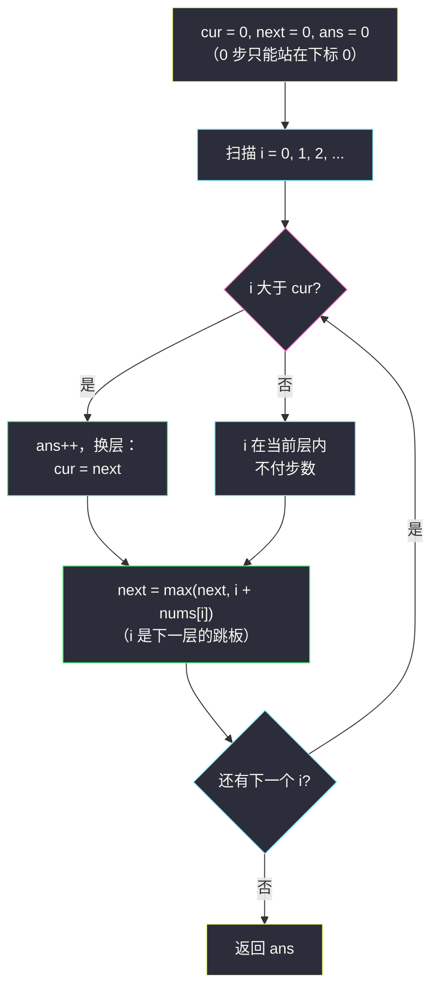
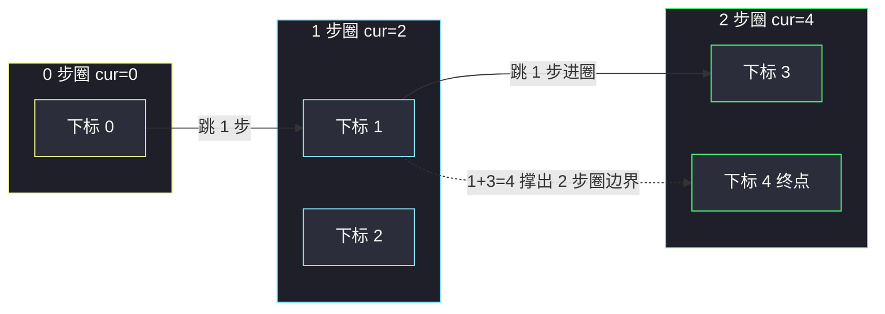

# 跳跃游戏 II（贪心分层：cur / next 圈层步数）

## 一、问题描述

给定一个长度为 `n` 的非负整数数组 `nums`，你最初位于第一个下标。`nums[i]` 表示从下标 `i` 可以向右跳跃的**最大长度**（即可以跳到 `i+1 .. i+nums[i]` 中任意一处）。

返回到达**最后一个下标** `n-1` 的**最少跳跃次数**。题目用例保证**一定可以到达** `n-1`。

> 🔗 LeetCode 45：https://leetcode.cn/problems/jump-game-ii/

**示例 1**

```
输入：nums = [2,3,1,1,4]
输出：2
解释：先从下标 0 跳 1 步到下标 1（消耗 1 次），
     再从下标 1 跳 3 步到下标 4（消耗 1 次），共 2 次。
```

**示例 2**

```
输入：nums = [2,3,0,1,4]
输出：2
解释：0 → 1（1 步）→ 4（3 步），共 2 次。
```

**直观理解**

#55 问「能不能到」，这题问「最少几跳到」。  
把最少步数想成 **BFS 的层数**：走 0 步能到的位置集合是第 0 层，从第 0 层再走一步能到的位置是第 1 层……由于可达位置**连续成片**（能跳 k 步就能跳 k-1 步），每一层恰好是一个区间 `[L, R]`——于是 BFS 不用队列，两个变量 `cur`（当前层右端）和 `next`（下一层右端）就够。

---

## 二、暴力解法（入门）

### 直观思路

**DP**：`dp[i]` = 到达下标 `i` 的最少步数。枚举所有能一步到 `i` 的前置位置 `j`（`j < i` 且 `j + nums[j] >= i`），取 `dp[j] + 1` 的最小值。

```java
public int jump(int[] nums) {
    int n = nums.length;
    int[] dp = new int[n];
    Arrays.fill(dp, Integer.MAX_VALUE);
    dp[0] = 0;
    for (int i = 1; i < n; i++) {
        for (int j = 0; j < i; j++) {
            if (j + nums[j] >= i) {          // j 能一步到 i
                dp[i] = Math.min(dp[i], dp[j] + 1);
            }
        }
    }
    return dp[n - 1];
}
```

### 复杂度

- **时间**：`O(n²)`——每个 `i` 都回头扫一遍 `0..i-1`
- **空间**：`O(n)`

### 🔴 瓶颈在哪里

`dp[i]` 逐点求值，但**步数相同的点构成一整段区间**，同一段区间里的点答案相同，逐点算重复了。  
更进一步：算出「跳 `k` 步最远到哪」就够了——若 `n-1` 落在「k 步区间」里，答案就是 `k`。区间整体推进，正是一次不带队列的 BFS。

---

## 三、优化探索（核心章节）

### 3.1 观察特征

| 特征 | 说明 |
|------|------|
| 保证能到达 | 无需判 false，专注求最小步数 |
| 最少步数 = BFS 层数 | 每条边步长为 1，最少跳数就是起点到终点的最短路 |
| 可达区间连续 | 同层是一个区间，不必逐点入队 |
| 只需每层的"最右端" | 层内靠左的位置永远不会比靠右的更有用（步长非负） |

### 3.2 三个变量：cur / next / ans（课上写法）

对齐课源码 `class093/Code01_JumpGameII.java`：

- `cur`：**当前步数以内**，最右能到哪（当前 BFS 层的右端）
- `next`：**如果再跳一步**（`cur` 层基础上 +1 步），最右能到哪（下一层的右端）
- `ans`：已经付出的步数

从左往右扫 `i`（`i` 是"正在考察的位置"）：

1. **`i > cur`**：`i` 已经出了当前层——说明此前扫描必须多付一步才能覆盖到 `i`。于是 `ans++`，同时把 `cur` 升级为 `next`（新的一层生效）。
2. **`i ≤ cur`**：`i` 在当前层内，到达它不需要额外步数。
3. 每到一个 `i`，都刷新 `next = max(next, i + nums[i])`——「站在 i 起跳」是**下一层**候选能力。

为什么循环扫到 `i = n-1` 也不多算步数？当 `i = n-1` 时若 `cur < n-1`，`ans++` 后 `cur = next ≥ n-1`（保证可达），这一步正是跳到终点的那步，不多不少。



### 3.3 关键推导问题

| 问题 | 答案 |
|------|------|
| 为什么 `i ≤ cur` 不加步数？ | `cur` 是「ans 步以内」能到的最远点，`i` 在界内说明用 `ans` 步已经能站上 `i` |
| 为什么 `ans++` 时直接 `cur = next`？ | 只可能**恰好差一步**：上一层扫完时 `next` 已把「再一步」的最远界攒满，不会出现差两步的情况 |
| `next` 何时更新？ | 每个扫到的 `i` 都更新——不管 `i` 在哪层，`i + nums[i]` 都是「从 i 起跳」的能力，永远属于"再一步"的世界 |
| 这和 BFS 什么关系？ | `cur`/`next` 就是 BFS 按层扩张的「本层右端 / 下层右端」；数组连续性让我们免去队列与逐点访问 |
| 贪心为什么对？ | 每一步都把"下一层右端"推到最远，任何最优解的第 k 层右端不可能超过它（交换论证） |

### 3.4 一句话核心

> **cur 是当前步数的圈，next 是再一步的圈；i 越出 cur 就 ans++ 换圈，每个 i 都顺手把 next 撑到最远。**

---

## 四、代码实现详解

### Java（主解：cur / next，逐行对齐课源码）

> 出处：`/Users/zy/ai_learn/algorithm-journey/src/class093/Code01_JumpGameII.java`（课上贪心章节原题，注释原样保留思路）。

```java
// 跳跃游戏 II：到达终点的最少跳跃次数
// 测试链接 : https://leetcode.cn/problems/jump-game-ii/
public class Solution {

    public static int jump(int[] arr) {
        int n = arr.length;
        // 当前步以内，最右到哪
        int cur = 0;
        // 如果再一步，(当前步+1)以内，最右到哪
        int next = 0;
        // 一共需要跳几步
        int ans = 0;
        for (int i = 0; i < n; i++) {
            // cur 包括了 i 所在的位置，不用付出额外步数
            // cur 没有包括 i 所在的位置，需要付出额外步数
            if (cur < i) {
                ans++;
                cur = next;
            }
            next = Math.max(next, i + arr[i]);
        }
        return ans;
    }
}
```

### Python

```python
# 跳跃游戏 II（cur / next 分层贪心）
# 测试链接 : https://leetcode.cn/problems/jump-game-ii/
class Solution:
    def jump(self, nums: list[int]) -> int:
        n = len(nums)
        cur = 0    # 当前步以内最右到哪
        next_ = 0  # 再一步（cur+1 步）以内最右到哪
        ans = 0
        for i in range(n):
            if cur < i:      # i 越出当前层：付一步，换层
                ans += 1
                cur = next_
            next_ = max(next_, i + nums[i])  # i 是下一层跳板
        return ans
```

---

## 五、例子演示

### 例 A：`nums = [2,3,1,1,4]`（答案 2）

逐步跟踪（**粗体**为发生变化的位置）：

| i | arr[i] | 进入时 cur | 判断 cur < i ? | 动作 | next 更新后 | ans |
|---|--------|-----------|----------------|------|-------------|-----|
| 0 | 2 | 0 | 否（0 = 0） | 不付步数 | **2**（0+2） | 0 |
| 1 | 3 | 0 | 否（0 < 1 → **是！**） | ans++，cur = next = **2** | **4**（1+3 > 2） | **1** |
| 2 | 1 | 2 | 否（2 = 2） | 不付步数 | 4（2+1=3 不及 4） | 1 |
| 3 | 1 | 2 | 是（2 < 3） | ans++，cur = next = **4** | 4 | **2** |
| 4 | 4 | 4 | 否（4 = 4） | 不付步数 | 8 | 2 |

循环结束，**ans = 2**。圈层视角：0 步圈 `{0}` → 1 步圈 `{1,2}` → 2 步圈 `{3,4}`，终点在下标 4，答案 2。

### 例 B：`nums = [2,3,0,1,4]`（答案 2）

| i | arr[i] | 进入时 cur | 换层? | cur 更新后 | next 更新后 | ans |
|---|--------|-----------|-------|------------|-------------|-----|
| 0 | 2 | 0 | 否 | 0 | **2** | 0 |
| 1 | 3 | 0 | 是（0<1） | **2** | **4**（1+3） | **1** |
| 2 | 0 | 2 | 否 | 2 | 4 | 1 |
| 3 | 1 | 2 | 是（2<3） | **4** | 4 | **2** |
| 4 | 4 | 4 | 否 | 4 | 8 | 2 |

**ans = 2**。注意下标 2 的 `0` 完全不影响：圈层扩张由更强的跳板（下标 1）主导，这正是「取 max」的意义。



---

## 六、复杂度分析

| 项目 | 复杂度 | 说明 |
|------|--------|------|
| 主解时间 | `O(n)` | 单次扫描，每步 O(1) |
| 主解空间 | `O(1)` | cur / next / ans 三个变量 |
| DP 暴力时间 | `O(n²)` | 双重循环 |
| DP 暴力空间 | `O(n)` | dp 数组 |

线性时间、常数空间，是本题的理论最优解。

---

## 七、对比总结

### 易错点

1. **`next` 更新放在 `if` 外面**：每个 `i`（包括换层瞬间的 `i`）都要刷新 `next`；若只对「不换层的 i」刷新，会漏掉换层位置的跳跃能力。
2. **换层时忘了 `cur = next`**：ans 加了步数但圈没换，后续判断全乱。
3. **想用 #55 的 maxReach 直接套**：单变量只答「能不能」，两个变量才有「层数」信息——本质差别是引入了 next。
4. **提前 `return` 剪枝**：可以加 `if (cur >= n-1) return ans;`，但要放在换层之后判断，位置错了会少算一步。
5. **模拟「这一步具体跳哪」**：不需要！圈层右端才是唯一重要信息，具体落点由后继贪心自然决定。

### 跳跃家族对比

| | #55 跳跃游戏 | #45 跳跃游戏 II |
|--|--------------|------------------|
| 问什么 | 能否到达 | 最少几步 |
| 核心变量 | maxReach 一个 | cur + next 两个 |
| 失败可能 | 有（返回 false） | 无（保证可达） |
| 本质 | 可达区间滚动 | 无队列的按层 BFS |

### 模板口诀

> **cur 管本层，next 攒下层；i 越界就付步，层右端顶到头。**

---

## 八、举一反三

| 题目 | 链接 | 迁移点 |
|------|------|--------|
| 55. 跳跃游戏 | https://leetcode.cn/problems/jump-game/ | 判定版：只剩一个 maxReach，站内题解 [jump-game](/solutions/base/jump-game.md) |
| 1024. 视频拼接 | https://leetcode.cn/problems/video-stitching/ | 每个片段是区间 `[start, end]`，「最少片段覆盖 [0,T]」= 区间版跳步（next 换成区间右端） |
| 1326. 灌溉花园 | https://leetcode.cn/problems/minimum-number-of-taps/ | 同款"最少区间覆盖全范围"，课上 class093/Code02_MinimumTaps.java 与本题同章 |
| 871. 最低加油次数 | https://leetcode.cn/problems/minimum-refueling-stops/ | "最少加油次数到终点"，同样按可达距离分层，只是"跳板"变成优先队列里的油量 |

**迁移一句**：**「最少几步/几个覆盖全程」** 类问题，先想 BFS 按层扩张；当每层是连续区间时，队列退化成 `cur/next` 两个端点——跳跃游戏 II 是这套思想的模板题。
