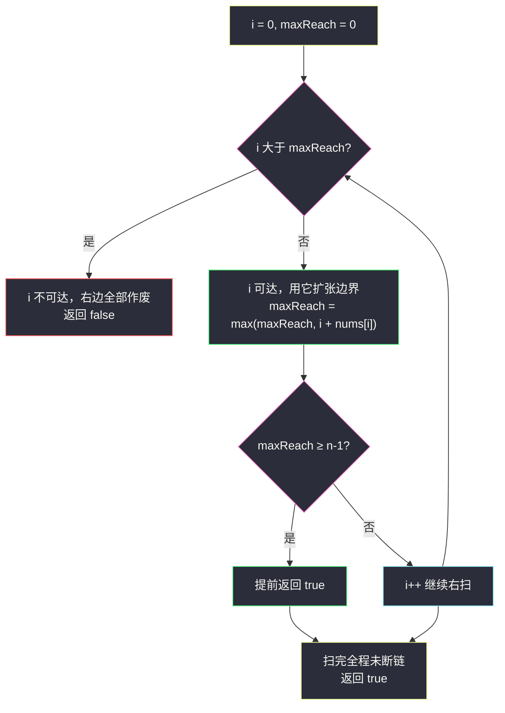
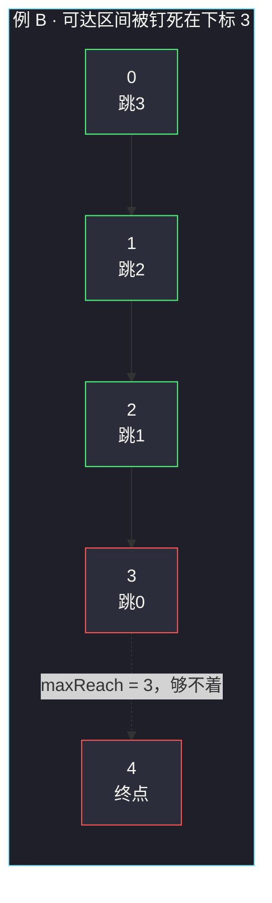

# 跳跃游戏（最大可达边界）

## 一、问题描述

给定一个非负整数数组 `nums`，你最初位于**第一个下标**（下标 0）。数组中的每个元素代表你在该位置可以跳跃的**最大长度**。

判断你是否能够到达**最后一个下标**。能到达返回 `true`，否则返回 `false`。

> 🔗 LeetCode 55：https://leetcode.cn/problems/jump-game/

**示例 1（能到达）**

```
输入：nums = [2,3,1,1,4]
输出：true
解释：先跳 1 步，从下标 0 到达下标 1（ nums[1]=3 ），
     然后再跳 3 步到达最后一个下标 4。
```

**示例 2（不能到达）**

```
输入：nums = [3,2,1,0,4]
输出：false
解释：无论怎么跳，最远只能到下标 3；而 nums[3] = 0，
     卡死在下标 3，永远到不了下标 4。
```

**直观理解**

把每个下标 `i` 想成一扇门：站在 `i` 上，能一步走进 `[i+1, i+nums[i]]` 里的任何一扇门。  
问题不是「怎么走最优」，而是「**最远能摸到哪**」——只要最远能摸到的位置一路覆盖到 `n-1`，就一定能到达；只要中途出现某个下标连「被摸到」都做不到，它右边的所有位置全部作废。

---

## 二、暴力解法（入门）

### 直观思路

从下标 0 出发做 DFS/BFS：站在 `i`，枚举下一步跳 `1..nums[i]` 步的所有落点，把落点入队，直到碰到 `n-1`（成功）或队列空（失败）。

```java
public boolean canJump(int[] nums) {
    int n = nums.length;
    boolean[] visit = new boolean[n];
    ArrayDeque<Integer> queue = new ArrayDeque<>();
    queue.add(0);
    visit[0] = true;
    while (!queue.isEmpty()) {
        int i = queue.poll();
        if (i == n - 1) {
            return true;
        }
        // 站在 i，能跳 1..nums[i] 步
        for (int j = i + 1; j <= Math.min(i + nums[i], n - 1); j++) {
            if (!visit[j]) {
                visit[j] = true;
                queue.add(j);
            }
        }
    }
    return false;
}
```

### 复杂度

- **时间**：`O(n²)`——每个位置最多把后面 `nums[i]` 个位置都标一遍，最坏（全是大数）每个点被扫 `n` 次
- **空间**：`O(n)`——visit 数组 + 队列

### 🔴 瓶颈在哪里

一个位置能到达与否，我们只关心「**有没有人能到它**」，不关心是谁、怎么到的。  
BFS 却把「每条路径」都展开了，做了大量重复标记。注意到一个关键事实：**如果 0..i 都可达，那么这批位置能一步摸到的范围是一段连续区间 `[0, maxReach]`**——可达性是「整段整段」扩张的，不需要逐个位置试。

---

## 三、优化探索（核心章节）

### 3.1 观察特征

| 特征 | 说明 |
|------|------|
| 只问能否到达 | 判定型问题，不需要路径、不需要步数 |
| 步长可任选 1..nums[i] | 能跳 3 步就能跳 2 步、1 步 → **可达位置必然连成一片** |
| 每个位置只有 `nums[i]` 一个信息 | 它对「最远摸到」的贡献就是 `i + nums[i]` |
| 越过的位置无需真正"走一遍" | 只要 `maxReach ≥ n-1` 就赢了 |

### 3.2 可达区间的连续性 → 一个变量扫平

维护**最大可达边界** `maxReach`：含义是「从起点出发，当前已确认可达的最远下标」。

从左往右扫 `i`：

1. **先检查**：如果 `i > maxReach`，说明下标 `i` 已经在可达区间的外面——它自己都到不了，更别说从它出发了，直接返回 `false`。
2. **再扩张**：位置 `i` 可达，它能一步摸到 `i + nums[i]`，于是 `maxReach = max(maxReach, i + nums[i])`。
3. 若中途 `maxReach >= n - 1`，可以提前返回 `true`。

**不变式**：处理完下标 `i` 后，`[0, maxReach]` 内所有下标都可达，且 `maxReach` 之外的下标均不可达（经 0..i 中转）。这正是课上「最大可达边界」写法的全部内容。



### 3.3 关键推导问题

| 问题 | 答案 |
|------|------|
| 为什么不用关心「跳几步、落在哪」？ | 可达位置连续成片 `[0, maxReach]`；只要 `n-1` 在片内，路径一定存在（每步都能向右挪一格） |
| 检查 `i > maxReach` 放循环开头还是结尾？ | 开头。先把 `i` 当「候选可达点」验证，再让它贡献边界；顺序反了会把不可达的 `i` 也拿去扩张 |
| `nums[i] = 0` 怎么办？ | 什么都不做（扩张取 max 自然忽略它）；它右边的位置靠**更左边**的大步长覆盖 |
| 例 2 里死在哪？ | `maxReach` 停在 3，扫到 `i = 4` 时 `4 > 3`，返回 `false` |
| `n = 1` 呢？ | 起点就是终点，`maxReach = 0 ≥ n-1 = 0`，直接 `true` |

### 3.4 一句话核心

> **一个变量 maxReach 从左往右滚：先验 i 是否在界内，再用 i + nums[i] 撑大界；界一旦盖住 n-1 就是 true，i 一旦越过界就是 false。**

---

## 四、代码实现详解

### Java（主解：最大可达边界，课上写法）

> 说明：课源码仓库 `class093` 收录了本题进阶版 `Code01_JumpGameII.java`（跳跃游戏 II，cur/next 写法），#55 未单独收录文件；主解按课上同章「最大可达边界」骨架书写，与 II 的 `next = max(next, i + arr[i])` 完全同源。

```java
// 跳跃游戏：能否到达最后一个下标
// 测试链接 : https://leetcode.cn/problems/jump-game/
public class Solution {

    public static boolean canJump(int[] nums) {
        int n = nums.length;
        int maxReach = 0; // 已确认可达的最远下标
        for (int i = 0; i < n; i++) {
            if (i > maxReach) {
                return false; // i 都到不了，后面全断
            }
            maxReach = Math.max(maxReach, i + nums[i]);
        }
        return true;
    }
}
```

### Java（附：倒序版，目标往左缩）

从终点往左找「能一步跳到 target 的位置」，找到就把 target 缩到那里——最后 target == 0 即成功。两种视角等价。

```java
public static boolean canJump2(int[] nums) {
    int target = nums.length - 1;
    for (int i = nums.length - 2; i >= 0; i--) {
        if (i + nums[i] >= target) {
            target = i; // i 能到 target，问题缩小为"能否到 i"
        }
    }
    return target == 0;
}
```

### Python

```python
# 跳跃游戏（最大可达边界）
# 测试链接 : https://leetcode.cn/problems/jump-game/
class Solution:
    def canJump(self, nums: list[int]) -> bool:
        max_reach = 0  # 已确认可达的最远下标
        for i, step in enumerate(nums):
            if i > max_reach:
                return False  # i 都到不了，后面全断
            max_reach = max(max_reach, i + step)
        return True
```

---

## 五、例子演示

### 例 A：`nums = [2,3,1,1,4]`（答案 true）

初始 `maxReach = 0`：

| i | nums[i] | 先检查 i ≤ maxReach? | i + nums[i] | maxReach 更新后 | 说明 |
|---|---------|---------------------|-------------|-----------------|------|
| 0 | 2 | 0 ≤ 0 ✓ | 2 | **2** | 从起点一步最远摸到 2 |
| 1 | 3 | 1 ≤ 2 ✓ | 4 | **4** | 下标 1 可达，边界推到 4 = n-1 |
| 2 | 1 | 2 ≤ 4 ✓ | 3 | 4 | 不扩张（3 < 4） |
| 3 | 1 | 3 ≤ 4 ✓ | 4 | 4 | 不扩张 |
| 4 | 4 | 4 ≤ 4 ✓ | 8 | 4 | 已是终点 |

扫完（或 i=1 时提前发现 `maxReach >= n-1`）→ **返回 true**。  
注意 i=1 之后其实已经稳赢：`maxReach = 4` 把终点盖住了，后面纯属走过场。

### 例 B：`nums = [3,2,1,0,4]`（答案 false）

初始 `maxReach = 0`：

| i | nums[i] | 先检查 i ≤ maxReach? | i + nums[i] | maxReach 更新后 | 说明 |
|---|---------|---------------------|-------------|-----------------|------|
| 0 | 3 | 0 ≤ 0 ✓ | 3 | **3** | 只能摸到 3 |
| 1 | 2 | 1 ≤ 3 ✓ | 3 | 3 | 推不动 |
| 2 | 1 | 2 ≤ 3 ✓ | 3 | 3 | 推不动 |
| 3 | 0 | 3 ≤ 3 ✓ | 3 | 3 | 0 步长，卡死 |
| 4 | — | **4 > 3 ✗** | — | — | **返回 false** |

`maxReach` 被钉死在 3（前三格的步长最多到 3，而 3 号位是 0），下标 4 永远够不着。



---

## 六、复杂度分析

| 项目 | 复杂度 | 说明 |
|------|--------|------|
| 主解时间 | `O(n)` | 每个下标一次比较、一次 max，无嵌套 |
| 主解空间 | `O(1)` | 只用 maxReach 一个变量 |
| BFS 暴力时间 | `O(n²)` | 每个位置展开最多 `nums[i]` 条边 |
| BFS 暴力空间 | `O(n)` | visit + 队列 |

一次线性扫描、零额外空间，已是理论最优（至少要读完数组）。

---

## 七、对比总结

### 易错点

1. **先扩张后检查**：把 `maxReach` 更新放在 `i > maxReach` 判断之前，会让不可达的 `i` 也参与扩张，例 B 会误报 true。
2. **把 `nums[i]` 当"必须跳的步数"**：题意是「最多跳这么远」，跳更短完全可以，所以才有可达区间的连续性。
3. **提前 return true 忘了写也能过**：不写只是扫完数组再返回，写了能少扫几格；两者结果一致，别在面试里纠结。
4. **倒序版条件写成 `>`**：`i + nums[i] >= target` 是**大于等于**——恰好踩到 target 也算到达。
5. **`n = 1` 特判多余**：`maxReach = 0 ≥ n-1` 自然成立，无需特判。

### 正序 vs 倒序

| | 正序 maxReach | 倒序 target 缩 |
|--|---------------|----------------|
| 视角 | 我最远能摸到哪 | 谁能一步摸到目标 |
| 可扩展性 | 直接升级成 #45 求最少步数 | 只适合判定 |
| 推荐 | ✅ 主记这版 | 了解即可 |

### 模板口诀

> **先验界，再撑界；界断返回假，界满返回真。**

---

## 八、举一反三

| 题目 | 链接 | 迁移点 |
|------|------|--------|
| 45. 跳跃游戏 II | https://leetcode.cn/problems/jump-game-ii/ | 同一数组，从「能否到」升级为「最少几步」：maxReach 拆成 cur/next 两层，站内题解 [jump-game-ii](/solutions/base/jump-game-ii.md) |
| 1306. 跳跃游戏 III | https://leetcode.cn/problems/jump-game-iii/ | 跳跃方向可左可右 + 值为 0 处是终点，改用 BFS 判可达 |
| 1326. 灌溉花园 | https://leetcode.cn/problems/minimum-number-of-taps/ | 每个水龙头换成一段区间 `[i-range, i+range]`，"最少几个水龙头覆盖全园"是 #45 的区间版（课源码 class093/Code02_MinimumTaps.java） |
| 1871. 跳跃游戏 VII | https://leetcode.cn/problems/jumping-game-vii/ | 可达位置是区间 `[i+maxJump, i+minJump]`，区间扩张用差分/有序集合维护 |

**迁移一句**：看到「从起点出发、步长可控、问可达性」，第一反应就是**滚动一个最远边界变量**；边界断裂即无解——这是跳跃游戏家族（#55/#45/#1306/#1326）的共同底层。
