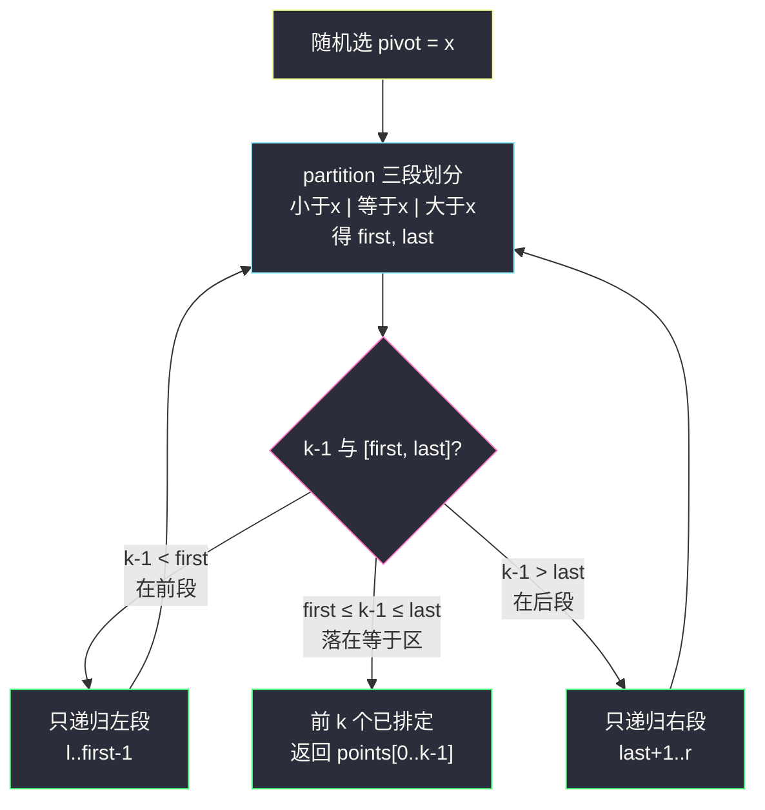

# 最接近原点的 K 个点（快速选择）

## 一、问题描述

给定一个数组 `points`，其中 `points[i] = [x_i, y_i]` 表示 X-Y 平面上的一个点，并且是一个整数。求**距离原点** `(0,0)` 最近的 `k` 个点（这里，平面上两点之间的距离是欧几里得距离）。你可以按**任何顺序**返回答案。除了保证坐标大小不超过 `10⁴` 外，题目没有其他限制。

> 🔗 LeetCode 973：https://leetcode.cn/problems/k-closest-points-to-origin/

**示例 1**

```
输入：points = [[1,3],[-2,2]], k = 1
输出：[[-2,2]]
解释：[1,3] 与原点距离平方 = 1+9 = 10；
     [-2,2] 与原点距离平方 = 4+4 = 8 < 10。
```

**示例 2**

```
输入：points = [[3,3],[5,-1],[-2,4]], k = 2
输出：[[3,3],[-2,4]]
解释：距离平方分别为 18、26、20，最小的两个是 18 和 20。
```

**直观理解**

「找最小的 k 个」不需要全部排序——快排的 partition 每次能**确定一个元素的最终排名**：随机选 pivot 做一趟划分后，比 pivot 小的全在左、大的全在右。如果第 k 名恰好落在 pivot 位置，左边（含 pivot）就是答案；否则只递归需要的那一侧。这就是**快速选择**：平均 `O(n)`，比全排序 `O(n log n)` 更快，也比堆 `O(n log k)` 更适合「一次性查询」。

---

## 二、暴力解法（入门）

### 直观思路

把每个点按距离平方排好序（比较距离无需开方，平方保序），取前 k 个。

```java
public int[][] kClosest(int[][] points, int k) {
    Arrays.sort(points, (a, b) ->
        (a[0]*a[0] + a[1]*a[1]) - (b[0]*b[0] + b[1]*b[1]));
    return Arrays.copyOfRange(points, 0, k);
}
```

### 复杂度

- **时间**：`O(n log n)`。
- **空间**：`O(log n)` 排序栈。

### 🔴 瓶颈在哪里

只需要**前 k 名**，却给所有 n 个点都排好了全序——`k` 之后的次序全是无用功。答案允许任意顺序，说明题目在暗示：**不必全排**。两个方向：

1. **快速选择**：只保证「左边 k 个是最小的 k 个」，内部乱序无妨，平均 `O(n)`；
2. **大小为 k 的堆**：维护当前最优 k 个，`O(n log k)`，适合流式数据。

---

## 三、优化探索（核心章节）

### 3.1 观察特征

| 特征 | 结论 |
|------|------|
| 只问「哪 k 个最近」，不问它们之间的次序 | 无需全排序，快速选择一步到位 |
| 答案允许任意顺序 | partition 后「左侧 k 个」直接就是答案 |
| 距离比较可用距离平方，避免浮点开方 | 整数运算保精确、更快 |

### 3.2 快速选择：随机 pivot + 三段划分

对课上标准写法（讲解146 摆动排序 II 内的 `randomizedSelect` / `partition`，随机快速选择 + 小于|等于|大于 三段划分）：

1. **随机选 pivot**，一趟 partition 把数组划成三段：`< x` 区、`== x` 区、`> x` 区，返回等于区的范围 `[first, last]`；
2. 若 `k` 落在等于区（`first ≤ k-1 ≤ last`）——前 k 个已就位，结束；
3. 若 `k-1 < first`——答案全在左段，只递归左段；否则只递归右段；
4. 每层只递归一侧（不同于快排的两侧），期望 `n + n/2 + n/4 + ... < 2n`，平均 `O(n)`。



### 3.3 关键推导问题

| 问题 | 答案 |
|------|------|
| 为什么用距离平方而不是距离？ | 距离非负时平方与开方保序；开方引入浮点误差且更慢 |
| 为什么随机选 pivot？ | 期望复杂度 `O(n)` 的来源；固定选头元素会被逆序输入卡成 `O(n²)` |
| 为什么三段划分（荷兰旗）而不是两段？ | 大量重复距离（如很多点同距）时，两段划分退化 `O(n²)`；三段一次跳过整个等于区 |
| 与快排的差别在哪？ | 快排两侧都要递归 `O(n log n)`；快速选择通过 k 判断只走一侧，期望 `O(n)` |
| 最坏情况？ | 随机化下期望 `O(n)`；最坏 `O(n²)` 但概率极小。要严格最坏 `O(n)` 需中位数的中位数（BFPRT），常数大一般不写 |

### 3.4 一句话核心

> **随机 partition 一刀切三段，k 落哪边只递归哪边——「确定一个元素的排名」只需 O(n)，第 k 名附近停下即得前 k 个。**

---

## 四、代码实现详解

> 说明：课源码未单独收录 #973；课上**随机快速选择 + 三段划分**的标准骨架见 `class146/Code06_WiggleSortII.java` 的 `randomizedSelect` / `partition`（讲解024 快速选择同源），主解与其同构，把比较对象换成「距离平方」。

### Java（主解：随机快速选择，三段划分）

```java
// 最接近原点的 K 个点
// 测试链接 : https://leetcode.cn/problems/k-closest-points-to-origin/
class Solution {

    public int[][] kClosest(int[][] points, int k) {
        randomizedSelect(points, points.length, k); // 之后 points[0..k-1] 就是最近的 k 个
        return Arrays.copyOfRange(points, 0, k);
    }

    // 随机选择：partition 后保证前 k 小的元素落在 points[0..k-1]
    public static void randomizedSelect(int[][] points, int n, int k) {
        for (int l = 0, r = n - 1; l <= r;) {
            int x = dist(points[l + (int) (Math.random() * (r - l + 1))]);
            partition(points, l, r, x);
            if (k - 1 < first) {          // 第 k 名在左段
                r = first - 1;
            } else if (k - 1 > last) {    // 第 k 名在右段
                l = last + 1;
            } else {                       // 第 k 名恰在等于区：前 k 个已就位
                return;
            }
        }
    }

    public static int first, last;

    // 三段划分（课上荷兰旗 partition）：小于x | 等于x | 大于x
    public static void partition(int[][] points, int l, int r, int x) {
        first = l;
        last = r;
        int i = l;
        while (i <= last) {
            if (dist(points[i]) < x) {
                swap(points, first++, i++);
            } else if (dist(points[i]) > x) {
                swap(points, i, last--);
            } else {
                i++;
            }
        }
    }

    public static int dist(int[] p) {
        return p[0] * p[0] + p[1] * p[1];   // 距离平方，免开方
    }

    public static void swap(int[][] points, int i, int j) {
        int[] tmp = points[i];
        points[i] = points[j];
        points[j] = tmp;
    }
}
```

### Python（同思路）

```python
import random

class Solution:
    def kClosest(self, points: list[list[int]], k: int) -> list[list[int]]:
        dist = lambda p: p[0] * p[0] + p[1] * p[1]

        # 三段划分：小于x | 等于x | 大于x，返回等于区 [first, last]
        def partition(l: int, r: int, x: int):
            first, last = l, r
            i = l
            while i <= last:
                d = dist(points[i])
                if d < x:
                    points[first], points[i] = points[i], points[first]
                    first += 1
                    i += 1
                elif d > x:
                    points[i], points[last] = points[last], points[i]
                    last -= 1
                else:
                    i += 1
            return first, last

        l, r = 0, len(points) - 1
        while l <= r:
            x = dist(points[l + random.randint(0, r - l)])  # 随机 pivot
            first, last = partition(l, r, x)
            if k - 1 < first:      # 第 k 名在左段
                r = first - 1
            elif k - 1 > last:     # 第 k 名在右段
                l = last + 1
            else:                  # 落在等于区：前 k 个已就位
                break
        return points[:k]
```

**堆解法（供对比，`O(n log k)`）**：

```java
// 大根堆维护当前最近的 k 个，堆顶是 k 个中最远的，来了更近的就弹堆顶
public int[][] kClosest(int[][] points, int k) {
    PriorityQueue<int[]> heap = new PriorityQueue<>(
        (a, b) -> (b[0]*b[0] + b[1]*b[1]) - (a[0]*a[0] + a[1]*a[1]));
    for (int[] p : points) {
        heap.offer(p);
        if (heap.size() > k) heap.poll();  // 弹掉最远的
    }
    return heap.toArray(new int[0][]);
}
```

---

## 五、具体例子演示

`points = [[3,3],[5,-1],[-2,4]]`，`k = 2`。距离平方依次为 `18, 26, 20`。

**第 1 趟 partition**（设随机选中下标 0 的点 `[3,3]`，pivot = 18，`l=0, r=2`）：

| i | 看 points[i] | dist | 与 18 比较 | 动作 | 数组状态 | 区间 |
|---|--------------|------|-----------|------|----------|------|
| 0 | `[3,3]` | 18 | 等于 | i=1 | `[3,3] [5,-1] [-2,4]` | first=0 |
| 1 | `[5,-1]` | 26 | 大于 | swap(1, 2)，last=2→1 | `[3,3] [-2,4] [5,-1]` | last=1 |
| 1 | `[-2,4]` | 20 | 大于 | swap(1, 1)，last=1→0 | `[3,3] [-2,4] [5,-1]` | last=0 |
| 1 | last=0 < i=1 结束 | | | | | |

等于区 `[first, last] = [0, 0]`（只有 18）。`k-1 = 1 > last = 0` → 答案含左段 + 等于区，还差一个在右段 → `l = last+1 = 1`，递归右侧 `[1..2]`。

**第 2 趟 partition**（`l=1, r=2`，剩余 `[[-2,4],[5,-1]]`，dist = 20, 26；设随机选中 `[5,-1]`，pivot = 26）：

- i=1：dist=20 < 26 → swap(1, first=1) 自换，first=2，i=2；
- i=2：dist=26 == 26 → i=3 结束。等于区 `[2, 2]`。
- `k-1 = 1 < first = 2` → 第 k 名在左段，`r = first-1 = 1`。

**第 3 趟 partition**（`l=1, r=1`，只剩 `[-2,4]`，pivot 必为 20）：

- i=1：dist=20 == 20 → i=2 结束。等于区 `[1, 1]`，`k-1 = 1 ∈ [1,1]` → **前 k 个已就位，结束**。

最终 `points[0..1] = [[3,3],[-2,4]]`，返回 `[[3,3],[-2,4]]` ✓。


---

## 六、复杂度分析

| 项目 | 快速选择（主解） | 全排序 | 大小为 k 的大根堆 |
|------|------------------|--------|---------------------|
| 时间 | 平均 `O(n)`，最坏 `O(n²)`（随机化下概率极小） | `O(n log n)` | `O(n log k)` |
| 空间 | `O(1)` 额外（原地 partition，递归迭代化） | `O(log n)` | `O(k)` 堆 |

---

## 七、方法对比与总结

| | 全排序 | 快速选择 | 堆 |
|--|--------|----------|-----|
| 求解目标 | 全序（过剩） | 只保证前 k 个集合正确 | 流式维护 top-k |
| 时间 | `O(n log n)` | 平均 `O(n)` | `O(n log k)` |
| 数据变化时 | 重排 | 重跑 | 增量插入 `O(log k)` |

**易错点**

1. **开方比较**：`Math.sqrt` 浮点比较引入精度风险与性能损耗，距离平方即可；
2. partition 后忘记 `k-1` 与等于区比较就盲目递归两侧（退化成快排）；
3. 随机 pivot 写成固定 `points[l]`：特殊构造的数据可卡 `O(n²)`（面试随机化是加分表述）；
4. 返回时把整个 `points` 返回了——注意截取前 k 个。

**模板口诀**

> **随机 pivot 三段切，k 落等区即收工；左侧不够去右找，平均一趟两倍 n。**

---

## 八、举一反三

| 题目 | 链接 | 迁移点 |
|------|------|--------|
| 215. 数组中的第 K 个最大元素 | https://leetcode.cn/problems/kth-largest-element-in-an-array/ | 同骨架求「第 k 名」而非「前 k 个」（[站内题解](/solutions/base/kth-largest-element-in-an-array.md)） |
| 347. 前 K 个高频元素 | https://leetcode.cn/problems/top-k-frequent-elements/ | 先哈希计数再 top-k：快速选择或堆皆可（[站内题解](/solutions/base/top-k-frequent-elements.md)） |
| 719. 找出第 K 小的数对距离 | https://leetcode.cn/problems/find-k-th-smallest-pair-distance/ | 二分答案 + 计数，与快速选择同为「第 k 名」套路 |
| 703. 数据流中的第 K 大元素 | https://leetcode.cn/problems/kth-largest-element-in-a-stream/ | 流式场景用小根堆，快速选择不适用 |

**迁移一句**：「**第 k 名 / 前 k 个**」类问题的三档武器——**全排序**（最稳但过剩）、**快速选择**（平均 O(n)，一次性查询最优）、**堆**（流式、k 远小于 n 时最省）。判断数据是否流式、是否要多次查询，就能选对武器。
