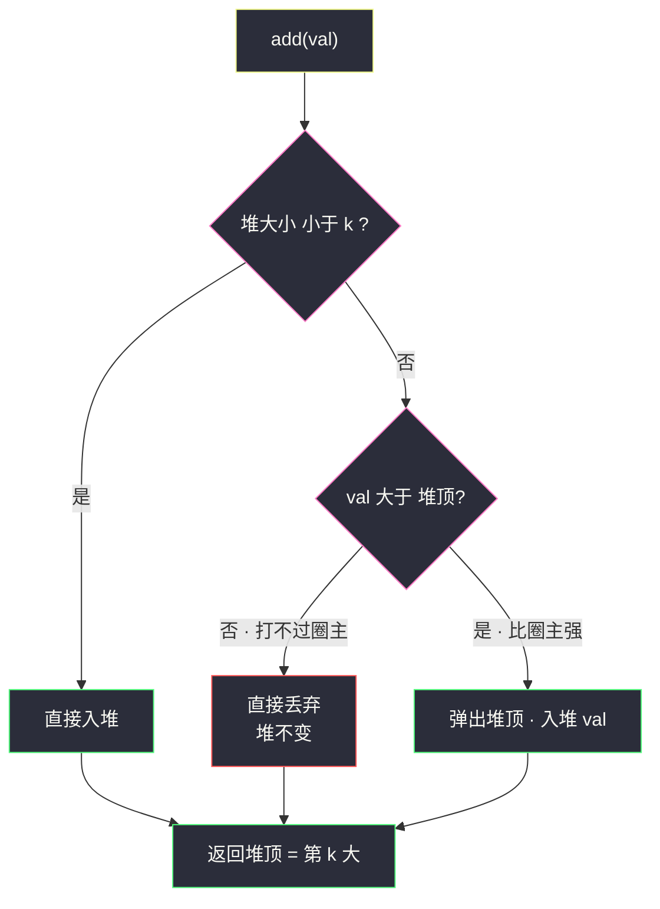
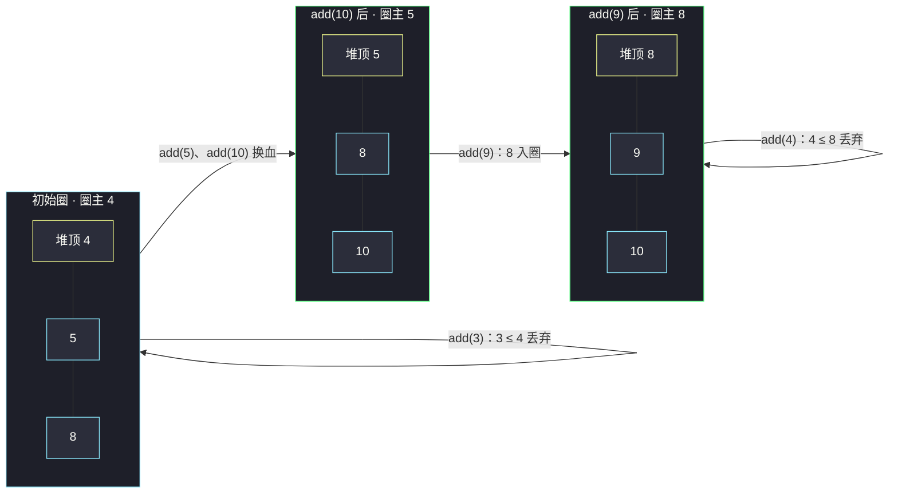

# 数据流中的第 K 大元素（小根堆只留 K 个：精英圈守门员）

## 一、问题描述

设计一个找到数据流中第 `k` 大元素的类（class），注意是排序后的第 `k` 大元素，不是第 `k` 个不同的元素。

实现 `KthLargest` 类：

- `KthLargest(int k, int[] nums)`：使用整数 `k` 和整数流 `nums` 初始化对象；
- `int add(int val)`：将 `val` 插入数据流后，返回当前数据流中第 `k` 大的元素。

> 🔗 LeetCode 703：https://leetcode.cn/problems/kth-largest-element-in-a-stream/
>
> 约束：`1 <= k <= 10⁴`，`0 <= nums.length <= 10⁴`，`-10⁹ <= nums[i], val <= 10⁹`，最多调用 `add` `10⁴` 次，保证调用 `add` 时数据流中**至少有 k 个元素**。

**示例**

```
输入：
["KthLargest", "add", "add", "add", "add", "add"]
[[3, [4, 5, 8, 2]], [3], [5], [10], [9], [4]]
输出：[null, 4, 5, 5, 8, 8]

解释：
KthLargest kthLargest = new KthLargest(3, [4, 5, 8, 2]);
kthLargest.add(3);   // 数据流 [4,5,8,2,3]，第 3 大 = 4
kthLargest.add(5);   // [4,5,8,2,3,5]，第 3 大 = 5
kthLargest.add(10);  // [4,5,8,2,3,5,10]，第 3 大 = 5
kthLargest.add(9);   // 第 3 大 = 8
kthLargest.add(4);   // 第 3 大 = 8
```

**直观理解**

静态数组的第 k 大（[#215](./kth-largest-element-in-an-array.md)）做一次就完事；本题是**数据流**——每来一个数都要重新回答「现在第 k 大是谁」。重排序太浪费：新数最多把第 k 名挤下去一个位置。维护一个**容量为 k 的小根堆**：堆里始终装着「目前为止最大的 k 个数」，堆顶（堆里最小的）就是**暂定的第 k 大**。新数来了只跟堆顶比：比堆顶强才配进圈，圈里最弱的被挤出去。一次比较 + 一次 `log k` 的堆调整，答案永动。

---

## 二、暴力解法（每次 add 全量排序）

### 直观思路

把收到的数全部存进列表，每次 `add` 后整个降序排序，取第 `k` 个。

```java
import java.util.*;

class KthLargest {
    private List<Integer> all = new ArrayList<>();
    private int k;

    public KthLargest(int k, int[] nums) {
        this.k = k;
        for (int x : nums) all.add(x);
    }

    public int add(int val) {
        all.add(val);
        all.sort(Collections.reverseOrder()); // 每次全量降序排序
        return all.get(k - 1);                // 第 k 大
    }
}
```

### 复杂度

设已流入 n 个数、共 m 次 `add`：

- **时间**：`O(m · n log n)`——每次 add 都为**全部**数字重排名
- **空间**：`O(n)`

### 🔴 瓶颈在哪里

1. **排名维护过度**：第 k 大只关心「前 k 名的边界」，第 k+1 名往后全是不相干的分母，排序却给他们挨个排座次；
2. **增量为 O(1) 信息却重做全局**：新来一个数，要么挤进前 k（顶掉原第 k 名），要么毫无影响——一个 `O(log k)` 的堆调整就能表达，全量排序是杀鸡用牛刀磨了 n 遍。

---

## 三、优化探索（核心章节）

### 3.1 观察特征

| 特征 | 说明 |
|------|------|
| 只要第 k 名 | 前 k 名之外的数**永远无关紧要**——比堆顶还小直接丢 |
| 第 k 大 = 前 k 名中的最小者 | 「一个集合的最小值 + 频繁进出」= **小根堆**的标准画像 |
| 数据流式到达 | 无法预知未来，必须维护「随时可答」的增量结构 |
| k 固定 | 堆容量恒为 k，调整代价 `O(log k)` 与总量无关 |

### 3.2 优化：容量 k 的小根堆（精英圈模型）

把堆想象成 **k 人精英圈**，圈规：圈里永远是见过的最大的 k 个数，**圈主（堆顶）= 圈里最弱 = 暂定的第 k 大**。

- **建圈**：初始化时把 `nums` 逐个塞进来，超过 k 个就不断把最弱的踢出去，留下前 k 强；
- **新数 val 来了**：
  - 圈没满（堆大小 < k）→ 直接入圈；
  - `val ≤ 堆顶` → 连圈主都打不过，直接淘汰，堆不动；
  - `val > 堆顶` → 顶掉圈主：堆顶弹出，val 入堆，新圈主自动浮出。



### 3.3 关键推导：为什么「比堆顶小就丢」不会丢掉答案

> **不变式：任意时刻，堆中元素 = 已见过的全部数中最大的 k 个。**

- 新数 `val ≤ 堆顶`：堆里已有 k 个数**每个都 ≥ val**，val 排不进前 k，它对「第 k 大」毫无影响——丢弃是无损的；
- 新数 `val > 堆顶`：val 至少强于原第 k 名（堆顶），必须进圈；同时原堆顶成为第 k+1 名，被踢合理；
- 由不变式，堆顶 = 前 k 名里最小 = **第 k 大**，`peek()` 即答案。

### 3.4 与 #215 静态版的分工

| | #215 数组第 K 大（静态） | #703 数据流第 K 大（动态） |
|--|--------------------------|------------------------------|
| 询问次数 | 一次 | 每次 add 一次，最多 10⁴ 次 |
| 首选武器 | 快速选择 `O(n)`（课源码 class024）或小根堆 `O(n log k)` | 小根堆增量维护 `O(log k)/次` |
| 快速选择合适吗 | 合适且最优 | 不合适：每次 add 都得重跑 |

两题共用同一个「容量 k 小根堆」的内核，#215 站点题解（[kth-largest-element-in-an-array.md](./kth-largest-element-in-an-array.md)）的堆解正是本文主解的单次调用版。

### 3.5 关键推导问题

| 问题 | 答案 |
|------|------|
| 为什么用小根堆而不是大根堆？ | 要在 k 个精英里**快速拿到最弱者**做守门员，小根堆堆顶即最弱；大根堆堆顶是最强者，查不出「圈内最小」 |
| 初始化 nums 长度超过 k 怎么办？ | 逐个入堆，超过 k 就弹出堆顶；或全部入堆后 `heapify` 再弹 `n-k` 次。LeetCode 保证 add 时至少 k 个元素，但初始可能多于 k，**必须处理** |
| 堆大小会不会不足 k？ | 题面保证调用 add 前流中至少 k 个元素（约束 `nums.length ≥ k-1` 且首次 add 前 k-1 个 + 至少 1 次 add 到达 k），按约定 `peek()` 安全 |
| 重复元素算名次吗？ | 算。第 k 大是排序后的第 k 个（含重复），堆不去重，天然正确 |
| add 返回时机？ | 先完成「入堆/淘汰」再 peek——返回的是**包含 val 之后**的第 k 大 |

### 3.6 一句话核心

> **堆里只留最大的 k 个，堆顶就是第 k 大；新数赢过堆顶才准入，输了一律礼貌送客。**

---

## 四、代码实现详解

### Java（主解：PriorityQueue 小根堆）

> 说明：课源码仓库未单独收录本题；流式维护堆的思想见 class035 `Code05_MedianFinder`（数据流中位数，双堆动态维护），本文按「容量 k 小根堆」骨架书写，与 #215 站点题解的堆解同内核。

```java
// 数据流中的第 K 大元素
// 测试链接 : https://leetcode.cn/problems/kth-largest-element-in-a-stream/
import java.util.PriorityQueue;

class KthLargest {
    private final PriorityQueue<Integer> heap = new PriorityQueue<>(); // 小根堆
    private final int k;

    public KthLargest(int k, int[] nums) {
        this.k = k;
        for (int x : nums) {
            heap.offer(x);
            if (heap.size() > k) {
                heap.poll();         // 超编，最弱者出圈
            }
        }
    }

    public int add(int val) {
        if (heap.size() < k) {
            heap.offer(val);         // 圈没满，直接进
        } else if (val > heap.peek()) {
            heap.poll();             // 顶掉圈主
            heap.offer(val);
        }
        return heap.peek();          // 圈主 = 第 k 大
    }
}
```

### Python（heapq 天然小根堆）

```python
# 数据流中的第 K 大元素
# 测试链接 : https://leetcode.cn/problems/kth-largest-element-in-a-stream/
import heapq

class KthLargest:
    def __init__(self, k: int, nums: list[int]):
        self.k = k
        self.heap = []
        for x in nums:               # 初始化逐个入堆
            self._push(x)

    def _push(self, val: int) -> None:
        heapq.heappush(self.heap, val)
        if len(self.heap) > self.k:  # 超编，弹出最小
            heapq.heappop(self.heap)

    def add(self, val: int) -> int:
        if len(self.heap) < self.k:
            heapq.heappush(self.heap, val)
        elif val > self.heap[0]:     # heap[0] 即堆顶（最小）
            heapq.heapreplace(self.heap, val)  # 弹顶+入堆一步到位
        return self.heap[0]
```

> Python 小贴士：`heap[0]` 是堆顶最小值；`heapreplace` 等价于 `heappop` + `heappush` 但更快，且在堆非空时才可用（这里 `size == k ≥ 1`，安全）。

---

## 五、具体例子演示

### 例 A：示例全程跟踪（k = 3, nums = [4, 5, 8, 2]）

**初始化**——逐个入堆，堆内容用「| 堆顶 | … |」表示（左为堆顶，即圈里最弱）：

| 入堆 | 堆（≤3 个） | 动作 |
|------|-------------|------|
| 4 | [4] | 入堆 |
| 5 | [4, 5] | 入堆 |
| 8 | [4, 5, 8] | 入堆，正好满编 k=3 |
| 2 | 入堆后 [2, 4, 5, 8] 超编 → 弹出 2 | [4, 5, 8] |

初始圈 = {4, 5, 8}，圈主（堆顶）= **4**。2 连入场券都没拿到——它排第 4，与「前 3 强」无关。

**五次 add 逐步跟踪**：

| add | 判断 | 堆变化 | 堆（处理后） | 返回 |
|-----|------|--------|--------------|------|
| 3 | 3 ≤ 堆顶 4 → 丢弃 | 不变 | [4, 5, 8] | **4** |
| 5 | 5 > 4 → 弹 4、入 5 | 4 出圈，5 入圈 | [5, 5, 8] | **5** |
| 10 | 10 > 5 → 弹 5、入 10 | 弱 5 出圈 | [5, 8, 10] | **5** |
| 9 | 9 > 5 → 弹 5、入 9 | | [8, 9, 10] | **8** |
| 4 | 4 ≤ 堆顶 8 → 丢弃 | 不变 | [8, 9, 10] | **8** |

与示例输出 `4, 5, 5, 8, 8` 完全一致。



**看点 1（add 3）**：3 比 4 大不了谁，连初始的 2 都不如，直接被拒——堆一动不动，返回照常。
**看点 2（add 10）**：10 进圈踢走堆顶 5（此时堆里有两个 5，踢的是弱者之一），圈主还是 5——**进了圈≠当了圈主**，第 k 大要看「圈内最小」。
**看点 3（add 4）**：数据流里已有 [2,3,4,4,5,5,8,9,10] 九个数，第 3 大仍是 8；4 连早期就出局，可见堆从未保存过 2、3 这些「分母」——空间永远只有 k。

---

## 六、复杂度分析

设初始化数组长 `n`（构造时已处理）、`add` 共调用 `m` 次、堆容量 `k`：

| 阶段 | 时间 | 空间 | 说明 |
|------|------|------|------|
| 初始化 | `O(n·log k)` | `O(k)` | 逐个入堆 + 满编弹顶；若先全入再 heapify 则 `O(n + (n-k)·log n)` |
| 单次 add | `O(log k)` | — | 至多一次弹顶 + 一次入堆 |
| 全程 add | `O(m·log k)` | `O(k)` | 与数据流总量无关，这是对暴力 `O(m·n·log n)` 的碾压 |
| 暴力对照 | `O(m·n·log n)` | `O(n)` | 每次 add 全量排序 |

---

## 七、方法对比与总结

### 易错点

1. **用大根堆**：能做（每次查第 k 大得弹 k-1 个再装回去，`O(k·log n)` 一次），又慢又费；「**求第 k 大 → 小根堆限容 k**」请焊死在肌肉里。
2. **初始化忘了弹出多余元素**：`nums.length` 可远大于 k，堆不裁剪则堆顶不再是第 k 大，全盘皆错。
3. **add 里直接 `offer` 再统一 `poll` 到 k 个**：也正确（等价写法），但每次 add 都可能多弹；「先判断再动堆」最省。
4. **`val == heap.peek()` 时入堆**：可以但没必要，白做一次 `O(log k)` 调整；用严格大于 `>` 提前挡掉。
5. **空堆就 `peek()`**：题面保证 add 前至少 k 个元素；若约束变化（构造后立刻 add 且 `nums.length < k-1`），需判空防 `NullPointerException`。

### 方法对比

| | 全量排序 | 大根堆 | 小根堆限容 k（本文） |
|--|----------|--------|------------------------|
| 单次 add | `O(n log n)` | `O(k log n)` | `O(log k)` |
| 空间 | `O(n)` | `O(n)` | `O(k)` |
| 实现难度 | 最低 | 中 | 低（PriorityQueue 一行建） |
| 适用场景 | 玩具规模 | 需要前 k 名全部细节时 | 数据流/海量数取 top-k 的标准答案 |

### 模板口诀

> **第 k 大找小根，容量 k 装精英；来了先比堆顶，赢者进圈败者行；圈主永远堆顶坐，peek 一眼答案明。**

---

## 八、举一反三

| 题目 | 链接 | 迁移点 |
|------|------|--------|
| 215. 数组中的第 K 个最大元素 | https://leetcode.cn/problems/kth-largest-element-in-an-array/ | 静态版兄弟题，快速选择 `O(n)` + 同款小根堆，站点已有题解互引 |
| 347. 前 K 个高频元素 | https://leetcode.cn/problems/top-k-frequent-elements/ | 哈希计数 + 「容量 k 小根堆按频率守门」，同一骨架换比较器 |
| 295. 数据流的中位数 | https://leetcode.cn/problems/find-median-from-data-stream/ | 课源码 class035 Code05 原题：双堆对峙（大根堆下半 + 小根堆上半），流式堆维护的进阶 |
| 1845. 座位预约管理系统 | https://leetcode.cn/problems/seat-reservation-manager/ | 同为「设计 + 堆动态维护最小可用」的设计题练手 |
| 239. 滑动窗口最大值 | https://leetcode.cn/problems/sliding-window-maximum/ | 镜像题：**第 k 小 → 大根堆**；窗口版最优解是单调队列，可对照体会 |

**迁移一句**：「流式 + 只关心前 k 名」的场景（Top-K 热榜、实时排名、限流统计），闭眼选**容量 k 的反向堆**——求大用小根守门，求小用大根守门；#703 就是这套模板最纯粹的入门形态。
