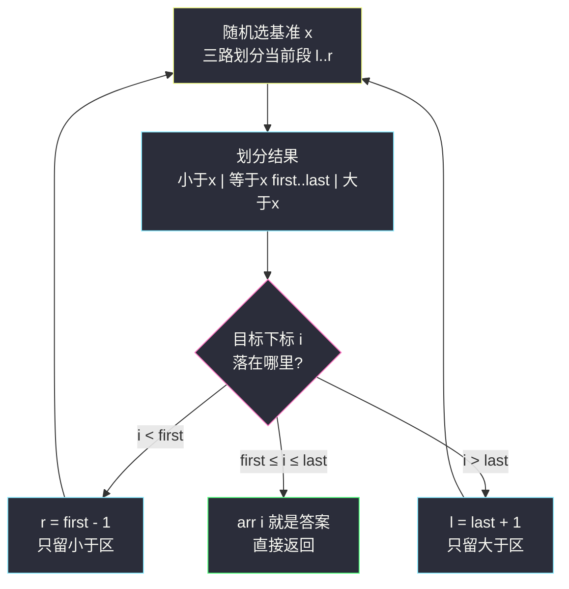

# 数组中的第K个最大元素（小根堆只留 K 个；快速选择只走一边）

## 一、问题描述

给定整数数组 `nums` 和整数 `k`，返回数组中第 `k` 个最大的元素（**排序后的第 k 个**，不是第 k 个互不相同的元素）。

> 🔗 LeetCode 215：https://leetcode.cn/problems/kth-largest-element-in-an-array/
>
> 约束：`1 <= k <= nums.length <= 10^5`；`-10^4 <= nums[i] <= 10^4`。
>
> 进阶：你能在 `O(n)` 时间复杂度内解决吗？

**示例 1**

```
输入：nums = [3,2,1,5,6,4]，k = 2
输出：5
解释：降序排序后 [6,5,4,3,2,1]，第 2 个最大的是 5
```

**示例 2**

```
输入：nums = [3,2,3,1,2,4,5,5,6]，k = 4
输出：4
解释：降序 [6,5,5,4,3,3,2,2,1]，注意第 4 个是 4（重复的 5 占两个名次）
```

**直观理解**

「第 k 大」就是「前 k 大圈子里最小的那个」。两条主流路子：**小根堆**——维护一个只有 k 个成员的「精英圈」，圈里最弱的站堆顶，新来的比堆顶强就换人，扫完数组堆顶就是答案，`O(n log k)`；**快速选择**——像快排一样随机挑基准把数组分成 `<x | ==x | >x` 三段，但答案只可能在其中一段，**只递归那一段**，期望复杂度 `O(n)`。后者正是课源码 class024 `RandomizedSelect` 的随机选择算法：荷兰国旗三路划分 + 随机基准 + 循环代替递归，一次只走一边。

---

## 二、暴力解法（整体排序后取第 k 个）

### 直观思路

降序排序，第 k 个即为答案；等价地升序排序取下标 `n - k`：

```java
class Solution {
    public int findKthLargest(int[] nums, int k) {
        Arrays.sort(nums);                    // 升序
        return nums[nums.length - k];         // 第 k 大 = 升序下标 n-k
    }
}
```

### 复杂度

- **时间**：`O(n log n)`——排序主导
- **空间**：`O(log n)`（排序递归栈，不计输出）

### 🔴 瓶颈在哪里

1. **排序了大量无关信息**：题目只要「第 k 个」，快排却把每个元素的名次都排得明明白白——n 可达 `10^5`，多花的功夫全在「顺便」上；
2. k 很小时（如 k=1 只要最大值），整体排序显然杀鸡用牛刀；
3. 突破口：不需要「全序」，只需要「前 k 名的边界」。两种砍法——空间上只维护 k 个（堆）、时间上只走一侧（快速选择）。

---

## 三、优化探索（核心章节）

### 3.1 观察特征

| 特征 | 说明 |
|------|------|
| 只要名次不要全序 | 知道「谁是第 k 大」就够，其余元素的相对顺序无关紧要 |
| 第 k 大 = 前 k 名中最小 | 前k大构成一个集合，答案是这个集合的**最小值**——「最小值 + 动态进出」正是小根堆的招牌 |
| 一次划分可砍掉一边 | 基准 x 的最终位置在划分后是确定的（等于区连成片）：目标下标落在哪段，另一段整体无关，直接扔 |
| 重复元素大量存在 | 示例 2 两个 5 占两个名次——**三路划分**（==x 单独成区）让重复值一次锁定一大片名次，优于朴素二路快排 |

### 3.2 优化一：小根堆只留 K 个（主解，好讲好默写）

维护一个**容量为 k 的小根堆**，语义：「目前见过的最大的 k 个数」，堆顶 = 这 k 个里最小的 = **暂定的第 k 大**。

```
遍历 num:
    堆没满 k 个 → 直接入堆
    否则 num > 堆顶 → 弹堆顶、入 num（换人）
    否则 → num 连前 k 名都进不了，无视
答案 = 堆顶
```

不变式：任意时刻，堆里元素恰好是「已扫过的所有数中最大的 k 个」。正确性一眼可见：比堆顶还小的数注定进不了前 k 名；比堆顶大的数必然挤掉当前第 k 名。

### 3.3 优化二：快速选择（对齐 class024 课上随机选择）

先把「第 k 大」翻译成升序下标：`i = n - k`（**排序后下标 i 处的数是什么**）。

```
randomizedSelect(arr, i):
    l = 0, r = n-1
    循环直到命中:
        x = arr[l + 随机数(r-l+1)]        ← 随机挑基准，期望收敛 O(n) 的关键
        partition(arr, l, r, x)            ← 荷兰国旗：<x | ==x | >x 三段
                                             等于区边界记为 first..last
        若 i < first:  r = first - 1       ← 目标在小于区，扔掉右边全部
        若 i > last:   l = last + 1        ← 目标在大于区，扔掉左边全部
        否则:          return arr[i]       ← i 落在等于区，答案就是 x
```

**每轮只走一边**：划分完立刻扔掉与目标无关的那段，期望每段规模缩为原来的固定比例，总代价 `O(n) + O(n/2) + O(n/4) + ... = O(2n) = O(n)`。



### 3.4 关键推导问题

| 问题 | 答案 |
|------|------|
| 小根堆为什么是「小」根而不是大根？ | 我们要的是「前 k 名中最小者」——堆顶必须暴露圈内最弱者供比较与淘汰。用大根堆维护 k 个数，堆顶是最大者，无法 `O(1)` 判断换谁 |
| `num > 堆顶` 里的等号呢？ | 等于堆顶时不换也正确（值相同，换不换结果一致）；写 `>=` 也过，习惯上写 `>` 表达「严格更强才换人」 |
| 快速选择为什么要随机选基准？ | 固定取 `arr[l]` 时，**有序/逆序输入每轮只缩一格**，退化 `O(n²)`；随机化后期望 `O(n)`，与输入分布无关——class024 注释原话：只有这一下随机，才能在概率上把时间收敛到 O(n) |
| 为什么用三路划分而不是二路？ | 重复值多时，二路划分里一堆等于 x 的值还在参与后续递归；三路让等于区一次锁定，重复越多砍得越狠（本题数据 `10^5` 量级、值域小，重复常见） |
| 快速选择会改原数组，有问题吗？ | partition 是原地交换，调用后 `nums` 顺序被打乱。LC 判题不管中间状态；工程上需要保留原序就先拷贝一份 |
| 两种解法面试怎么选？ | 数据流式/在线场景只能用堆（见 #703）；离线数组两者皆可——先讲堆（稳），再讲快速选择（进阶答到 `O(n)` 正中题目进阶要求） |

### 3.5 一句话核心

> **堆：只留 k 个精英，堆顶永远是「第 k 名」；快选：划分定去留，只走答案在的那一边。**

---

## 四、代码实现详解

### Java（主解一：小根堆 O(n log k)）

```java
// 数组中第 k 个最大元素：容量 k 的小根堆
// 测试链接 : https://leetcode.cn/problems/kth-largest-element-in-an-array/
class Solution {
    public int findKthLargest(int[] nums, int k) {
        PriorityQueue<Integer> heap = new PriorityQueue<>();   // 小根堆
        for (int num : nums) {
            if (heap.size() < k) {
                heap.offer(num);                // 圈子没满，直接进
            } else if (num > heap.peek()) {
                heap.poll();                    // 换掉圈内最弱
                heap.offer(num);
            }
        }
        return heap.peek();                     // 堆顶 = 前 k 名中最小 = 第 k 大
    }
}
```

### Java（主解二：随机选择，对齐 class024 课上版）

```java
// 随机选择算法，期望 O(n)
// 测试链接 : https://leetcode.cn/problems/kth-largest-element-in-an-array/
// 对齐 class024 RandomizedSelect（课上 first/last 为 public static 全局变量，站点版收敛为字段）
class Solution {
    private int first, last;    // partition 后等于 x 区域的左右边界

    public int findKthLargest(int[] nums, int k) {
        return randomizedSelect(nums, nums.length - k);     // 第 k 大 = 升序下标 n-k
    }

    // 若 arr 升序排序，排在下标 i 的数字是什么
    private int randomizedSelect(int[] arr, int i) {
        int ans = 0;
        for (int l = 0, r = arr.length - 1; l <= r;) {
            int x = arr[l + (int) (Math.random() * (r - l + 1))];   // 随机基准
            partition(arr, l, r, x);
            if (i < first) {
                r = first - 1;      // 答案在小于区，扔右边
            } else if (i > last) {
                l = last + 1;       // 答案在大于区，扔左边
            } else {
                ans = arr[i];       // i 落在等于区，命中
                break;
            }
        }
        return ans;
    }

    // 荷兰国旗三路划分：<x 左 | ==x 中(first..last) | >x 右
    private void partition(int[] arr, int l, int r, int x) {
        first = l;
        last = r;
        int i = l;
        while (i <= last) {
            if (arr[i] == x) {
                i++;                        // 等于区自动扩张
            } else if (arr[i] < x) {
                swap(arr, first++, i++);    // 甩到左侧小于区
            } else {
                swap(arr, i, last--);       // 甩到右侧大于区（换来的数没看过，i 不动）
            }
        }
    }

    private void swap(int[] arr, int i, int j) {
        int tmp = arr[i];
        arr[i] = arr[j];
        arr[j] = tmp;
    }
}
```

### Python（同思路：两版都给）

```python
import heapq
import random

class Solution:
    # 版本一：小根堆 O(n log k)
    def findKthLargest(self, nums: list[int], k: int) -> int:
        heap: list[int] = []                     # 小根堆
        for num in nums:
            if len(heap) < k:
                heapq.heappush(heap, num)
            elif num > heap[0]:
                heapq.heapreplace(heap, num)     # 弹顶+入堆一步完成
        return heap[0]

class Solution2:
    # 版本二：随机选择，期望 O(n)（对齐 class024）
    def findKthLargest(self, nums: list[int], k: int) -> int:
        return self._select(nums, len(nums) - k)

    def _select(self, arr: list[int], i: int) -> int:
        l, r = 0, len(arr) - 1
        while l <= r:
            x = arr[random.randint(l, r)]        # 随机基准
            first, last = self._partition(arr, l, r, x)
            if i < first:
                r = first - 1
            elif i > last:
                l = last + 1
            else:
                return arr[i]
        return 0

    def _partition(self, arr: list[int], l: int, r: int, x: int) -> tuple[int, int]:
        first, last, i = l, r, l
        while i <= last:
            if arr[i] == x:
                i += 1
            elif arr[i] < x:
                arr[first], arr[i] = arr[i], arr[first]
                first += 1
                i += 1
            else:
                arr[i], arr[last] = arr[last], arr[i]
                last -= 1
        return first, last
```

---

## 五、具体例子演示

### 例 1：堆版逐步跟踪 `nums = [3,2,1,5,6,4]`，`k = 2`

小根堆记法：左侧为堆顶（圈内最小者）。

| 步 | num | 堆内容（顶在左） | 动作 | 说明 |
|----|-----|------------------|------|------|
| 1 | 3 | [3] | 入堆 | 圈子未满（1 < 2） |
| 2 | 2 | [2, 3] | 入堆 | 圈子未满（2 = k 满），堆顶 2 |
| 3 | 1 | [2, 3] | 无视 | 1 ≤ 堆顶 2，进不了前两名 |
| 4 | 5 | [3, 5] | **弹 2 入 5** | 5 > 顶 2，2 让位 |
| 5 | 6 | [5, 6] | **弹 3 入 6** | 6 > 顶 3，3 让位 |
| 6 | 4 | [5, 6] | 无视 | 4 ≤ 堆顶 5，淘汰 |

结束堆为 `[5, 6]`，堆顶 **5** 即第 2 大 ✅。注意圈内始终维持「已见过的最大 2 个」：第 5 步后 5 是「老二」、6 是「老大」，正是最终名次。

### 例 2：快速选择同一输入 `nums = [3,2,1,5,6,4]`，`k = 2` → 目标 `i = 6 - 2 = 4`

实际代码随机选基准；下为演示设第一轮选中 x=3、第二轮选中 x=5（随机选两次的情形之一）。

**第一轮**：段 `[3,2,1,5,6,4]`（下标 0..5），x=3。partition 从左往右扫，first/last 夹住等于区：

| 扫到 | arr[i] 与 x 比 | 动作 | 数组状态 | 等于区 |
|------|----------------|------|----------|--------|
| i=0 | 3 == 3 | i++ | [3,2,1,5,6,4] | first=0, last=5 |
| i=1 | 2 < 3 | 换 first=0 与 i，双进 | [2,3,1,5,6,4] | first→1 |
| i=2 | 1 < 3 | 换 first=1 与 i，双进 | [2,1,3,5,6,4] | first→2 |
| i=3 | 5 > 3 | 换 i 与 last=5，i 不动 | [2,1,3,4,6,5] | last→4 |
| i=3 | 4 > 3 | 换 i 与 last=4，i 不动 | [2,1,3,6,4,5] | last→3 |
| i=3 | 6 > 3 | 与 last=3 自换，last→2；i=3 > last 扫完 | [2,1,3,6,4,5] | **2..2** |

第一轮结果：`[2,1,3,6,4,5]`，等于区 `2..2`（只有 3）。目标 `i=4 > last=2` → 答案在大于区，`l = 3`，扔掉左边 2、1、3（它们的名次已定：最多第 4~6 大，与第 2 大无关）。

**第二轮**：段 `[6,4,5]`（下标 3..5），x=5：

| 扫到 | 比较 | 动作 | 数组状态 | 等于区 |
|------|------|------|----------|--------|
| i=3 | 6 > 5 | 换 i 与 last=5，i 不动 | [2,1,3,5,4,6] | last→4 |
| i=3 | 5 == 5 | i++ | [2,1,3,5,4,6] | |
| i=4 | 4 < 5 | 换 first=3 与 i，双进 | [2,1,3,4,5,6] | first→4 |
| i=5 | — | 循环条件 i ≤ last=4 不满足，扫完 | [2,1,3,4,5,6] | **4..4** |

目标 `i=4` 落在等于区 → **答案 `arr[4] = 5`** ✅（与堆版一致；两轮即收敛，正是「只走一边」的效率来源——第一轮扔掉 3 个，第二轮直接命中）。

### 例 3：重复值场景 `nums = [3,2,3,1,2,4,5,5,6]`，`k = 4` → `i = 9 - 4 = 5`

堆版跟踪（k=4，堆内始终留 4 个）：

| num | 堆（顶在左） | 动作 |
|-----|--------------|------|
| 3 | [3] | 入 |
| 2 | [2,3] | 入 |
| 3 | [2,3,3] | 入 |
| 1 | [1,2,3,3] | 入（满员，堆顶 1） |
| 2 | [2,2,3,3] | 2 > 顶 1，换 |
| 4 | [2,3,3,4] | 4 > 顶 2，换 |
| 5 | [3,3,4,5] | 5 > 顶 2，换 |
| 5 | [3,4,5,5] | 5 > 顶 3，换 |
| 6 | [4,5,5,6] | 6 > 顶 3，换 |

堆顶 **4** ✅——两个 5 各占一个名次（第 2、3 大），4 是第 4 大。重复值在堆版天然正确；在快选版则靠等于区一次锁定（若基准选中 5，等于区覆盖下标含 3、4，直接砍掉大片）。

---

## 六、复杂度分析

| 项目 | 排序（暴力） | 小根堆（主解一） | 随机选择（主解二） |
|------|--------------|------------------|---------------------|
| 时间 | `O(n log n)` | **`O(n log k)`**：每个元素至多一次堆操作，代价 `O(log k)` | **期望 `O(n)`**；最坏 `O(n²)`（概率极低，随机化保证） |
| 空间 | `O(log n)` 排序栈 | `O(k)` 堆 | `O(1)` 原地（循环版无递归栈） |
| 稳定性 | — | 不改原数组 | 打乱原数组 |
| 适用 | 讲思路 | k 小、在线流式场景通吃 | 离线一次查询、追求线性 |

**期望 O(n) 的直观账**：随机基准下每轮期望扔掉约一半，总工作量 `n + n/2 + n/4 + ...` 收敛到 `2n` 量级——等比级数求和，不是玄学。

---

## 七、方法对比与总结

### 写法对比

| | 排序 | 小根堆 | 随机选择 |
|--|------|--------|----------|
| 时间 | `O(n log n)` | `O(n log k)` | 期望 `O(n)` |
| 空间 | `O(log n)` | `O(k)` | `O(1)` |
| 代码量 | 一行核心 | 十行 | 三十行（划分易错） |
| 在线支持 | ✗ | ✅（数据流版 #703） | ✗ |
| 面试定位 | 起手 | ✅ 主力默写 | 答出即加分，正中本题进阶要求 |

### 易错点

1. **堆用成大根堆**：想「找最大用大根」是惯性；本题要暴露「前 k 名中最小者」，必须小根。
2. **`num > heap.peek()` 漏判堆满**：未满先无条件入堆，满了才比较——两个条件顺序写反会对着空堆 `peek()` 抛异常。
3. **快选忘记随机基准**：固定取 `arr[l]`，遇上近乎有序的测试数据直接 `O(n²)` 超时。
4. **partition 的 `i++` 时机**：`==x` 与 `<x` 分支 i 前进，`>x` 分支换来的元素**没检查过**，i 原地不动重看——手滑全盘皆错。
5. **`n - k` 与 `k - 1` 混淆**：升序第 k 大是下标 `n - k`；用降序思路时是 `k - 1`，两种框架别串台。
6. **二路划分硬扛重复值**：全等数组（如 10^5 个 0）在二路快排下退化 `O(n²)`；三路等于区是本题值域小、重复多的保险。

### 模板口诀

> **堆解：圈子只装 k 个，强过堆顶才换人；快选：随机划三段，答案在哪走哪边。**

---

## 八、举一反三

| 题目 | 链接 | 迁移点 |
|------|------|--------|
| 703. 数据流中的第 K 大元素 | https://leetcode.cn/problems/kth-largest-element-in-a-stream/ | 本题堆解的在线版：KthLargest 类，addNum 即「入堆/换人」 |
| 295. 数据流的中位数 | https://leetcode.cn/problems/find-median-from-data-stream/ | 堆思想深水区（本站题解）：大小双堆对半分，中位数 O(1) |
| 347. 前 K 个高频元素 | https://leetcode.cn/problems/top-k-frequent-elements/ | 「小根堆只留 k 个」套上频次（本站已有题解） |
| 973. 最接近原点的 K 个点 | https://leetcode.cn/problems/k-closest-points-to-origin/ | 同一堆模板，比较器换成距离 |
| 912. 排序数组 | https://leetcode.cn/problems/sort-an-array/ | 快速选择的母体：随机快排三路划分全排序版 |

**迁移一句**：**Top-K 问题三板斧——排序、k 容量小根堆、快速选择**。数据流在线只能堆；离线追求线性就快选。这一题的堆解直接进化成 #295 的双堆中位数，一脉相承。
