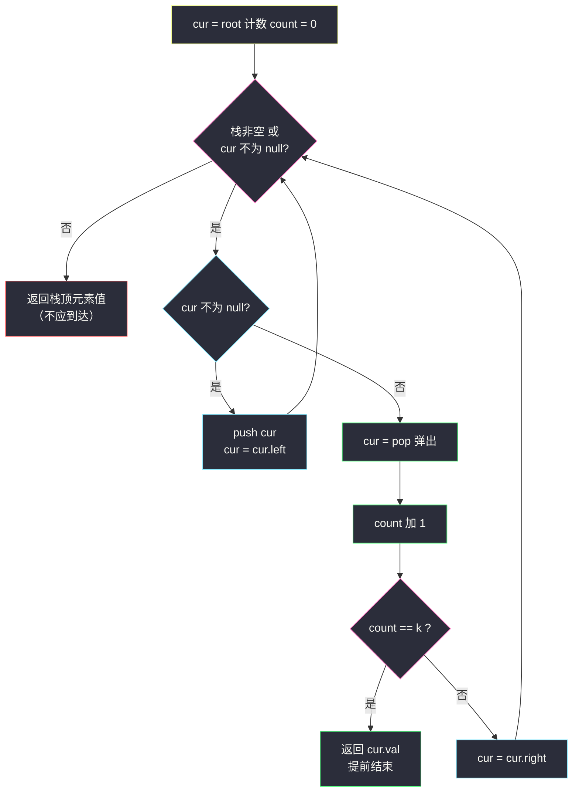
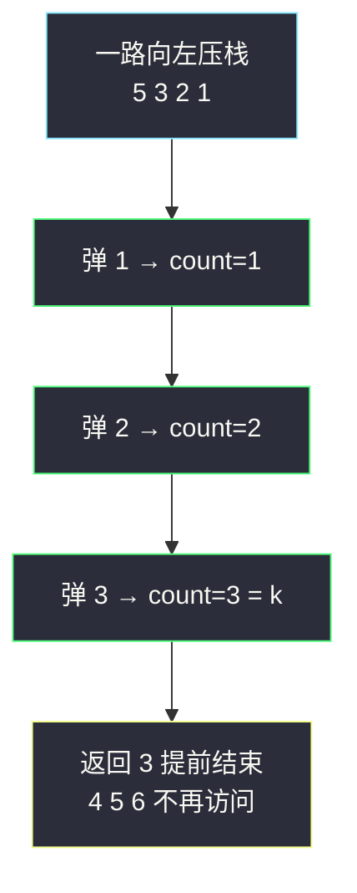

# 二叉搜索树中第 K 小的元素（中序第 k 个）

## 一、问题描述

给定一棵二叉搜索树（BST）的根节点 `root` 和一个整数 `k`，请你设计一个算法查找其中**第 k 小的元素**（1 ≤ k ≤ 树中节点数）。

> 🔗 LeetCode 230：https://leetcode.cn/problems/kth-smallest-element-in-a-bst/

**示例 1**

```
输入：root = [3,1,4,null,2], k = 1
输出：1
    3
   / \
  1   4
   \
    2
中序：1 → 2 → 3 → 4，第 1 小 = 1
```

**示例 2**

```
输入：root = [5,3,6,2,4,null,null,1], k = 3
输出：3
      5
     / \
    3   6
   / \
  2   4
 /
1
中序：1 → 2 → 3 → 4 → 5 → 6，第 3 小 = 3
```

**直观理解**

BST 的中序遍历是**升序序列**（左 < 根 < 右逐层成立）。所以「第 k 小」翻译成遍历语言就是：**中序遍历走到第 k 个节点，它的值就是答案**。难度全部集中在「怎么优雅地停在第 k 个」——递归版靠提前 return，迭代版靠计数器 + break。

---

## 二、暴力解法（入门）

### 直观思路

最直接：**完整中序遍历**收集到列表里，然后取 `list.get(k-1)`。

```java
class Solution {
    public int kthSmallest(TreeNode root, int k) {
        List<Integer> order = new ArrayList<>();
        inorder(root, order);
        return order.get(k - 1);
    }

    private void inorder(TreeNode node, List<Integer> order) {
        if (node == null) {
            return;
        }
        inorder(node.left, order);
        order.add(node.val);
        inorder(node.right, order);
    }
}
```

### 复杂度

- **时间**：`O(n)`——不管 k 多小，都把整棵树走完。
- **空间**：`O(n)` 列表 + `O(h)` 递归栈。

### 🔴 瓶颈在哪里

答案只在前 k 个中序节点里，**后面的节点全是无用功**。`k = 1` 时也要遍历 n 个节点、还额外存了整条序列，浪费显而易见。优化方向：边遍历边计数，数到第 k 个**立刻停**。

---

## 三、优化探索（核心章节）

### 3.1 观察特征

| 特征 | 说明 |
|------|------|
| 中序即升序 | 第 k 小 = 中序序列的第 k 个，问题被翻译成「遍历计数」 |
| 可提前终止 | 中序顺序严格单调，前 k−1 个节点一旦走完，第 k 个就是唯一答案 |
| 计数状态要跨递归层共享 | 递归版用成员变量 `count` / `ans`，判断「已找到」来层层短路 |
| k 固定是本题最友好的设定 | 若频繁改 k、增删节点（Follow up），就需要在节点上维护子树大小，见 3.3 |

### 3.2 递归版怎么「说停就停」

递归中序的访问时机在「左子树返回之后、右子树出发之前」。给递归加两个成员变量：

- `count`：还差几个到达第 k；
- `ans`：记录命中时的值。

访问节点时 `count--`；一旦 `count == 0`，记下答案，**此后所有递归调用入口都先查 `count` 直接返回**，整棵递归树迅速收缩。迭代版更干脆：显式栈弹出第 k 个节点直接 `break`。

**不变式**（迭代版）：任意时刻栈中自底向上是「已压未访」的左链前缀；弹出一个节点即完成一次中序访问，访问序严格升序。弹满 k 次时第 k 次弹出的就是答案。

> 注：课源码 `algorithm-journey` 未收录本题专门实现；本篇按课上显式栈中序骨架对齐——与 class018 `BinaryTreeTraversalIteration.inOrder`、class037 `Code05_ValidateBinarySearchTree.isValidBST1` 同一套「一路向左压栈 / 弹出即访问 / 转右」循环，仅多一个计数提前停。



### 3.3 关键推导问题

| 问题 | 答案 |
|------|------|
| 为什么不用「第 k 小 = 排序后取第 k 个」？ | 树不是数组，没有现成的「排序」；而 BST 的中序**就是**排序结果，免费复用 |
| 递归版为什么必须用成员变量？ | 计数要跨越整条递归链共享；参数是值传递，`count--` 只影响本层。Java 里也可返回「是否已找到」布尔来短路，但成员变量版最好讲 |
| 提前停能省多少？ | 最坏仍 `O(n)`（k = n 或答案在树最深处），但平均只走 `O(h + k)` 个节点——k 小时提升明显 |
| Follow up「频繁查询/增删」怎么办？ | 给每个节点维护**左子树大小** `size`：查询按 size 导航 `O(h)`；插入删除沿路径更新 size。这其实就是「平衡树（AVL/红黑/B 树）检索排名」的雏形 |
| 与「第 k 大」的转换？ | 第 k 大 = 反中序（右 → 根 → 左）的第 k 个，同一套代码把左右互换 |
| 能否用二分「根排名 vs k」？ | 能，但前提是知道子树大小，普通 TreeNode 没有——所以本体还是中序计数 |

### 3.4 一句话核心

> **BST 第 k 小 = 中序遍历的第 k 次访问；数到第 k 个立刻停。**

---

## 四、代码实现

### Java（主解：显式栈中序，计数提前停）

```java
import java.util.ArrayDeque;
import java.util.Deque;

class Solution {
    public int kthSmallest(TreeNode root, int k) {
        Deque<TreeNode> stack = new ArrayDeque<>();
        TreeNode cur = root;
        int count = 0;
        while (!stack.isEmpty() || cur != null) {
            if (cur != null) {              // 一路向左压栈
                stack.push(cur);
                cur = cur.left;
            } else {
                cur = stack.pop();          // 弹出 = 第 count+1 次中序访问
                if (++count == k) {
                    return cur.val;         // 提前结束，不再遍历
                }
                cur = cur.right;
            }
        }
        return -1;                          // 按题意 k 合法，不会走到这里
    }
}
```

### Java（可选：递归版，成员变量计数 + 短路）

```java
class Solution {
    private int count = 0;
    private int ans = 0;

    public int kthSmallest(TreeNode root, int k) {
        dfs(root, k);
        return ans;
    }

    private void dfs(TreeNode node, int k) {
        if (node == null || count == k) {   // 空树 或 已命中：全面短路
            return;
        }
        dfs(node.left, k);
        if (++count == k) {
            ans = node.val;
            return;
        }
        dfs(node.right, k);
    }
}
```

### Python（同思路两版）

```python
# 显式栈迭代版
class Solution:
    def kthSmallest(self, root: Optional[TreeNode], k: int) -> int:
        stack, cur, count = [], root, 0
        while stack or cur:
            if cur:                      # 一路向左
                stack.append(cur)
                cur = cur.left
            else:
                cur = stack.pop()        # 弹出即中序访问
                count += 1
                if count == k:
                    return cur.val       # 提前停
                cur = cur.right
        return -1
```

```python
# 递归版：nonlocal 计数 + 命中后全面短路
class Solution:
    def kthSmallest(self, root: Optional[TreeNode], k: int) -> int:
        count = 0
        ans = 0
        found = False

        def dfs(node: Optional[TreeNode]) -> None:
            nonlocal count, ans, found
            if node is None or found:      # 空树 或 已命中：短路
                return
            dfs(node.left)
            count += 1
            if count == k:
                ans = node.val
                found = True
                return
            dfs(node.right)

        dfs(root)
        return ans
```

> 整体上**迭代版是本题的最佳形态**：天然可提前结束、栈状态可视化，还顺手巩固中序迭代的肌肉记忆；递归版则演示「跨层共享状态 + 短路」的写法。

---

## 五、具体例子演示

### 例 1：`root = [5,3,6,2,4,null,null,1]`，`k = 3`

```
      5
     / \
    3   6
   / \
  2   4
 /
1
```

迭代版逐步跟踪（count 表示已弹出几个）：

| 轮 | cur 指向 | 动作 | 栈（底→顶） | count | 说明 |
|----|----------|------|-------------|-------|------|
| 1 | 5 | push 5，向左 | [5] | 0 | 根进栈 |
| 2 | 3 | push 3，向左 | [5,3] | 0 | |
| 3 | 2 | push 2，向左 | [5,3,2] | 0 | |
| 4 | 1 | push 1，向左 | [5,3,2,1] | 0 | 左链到头 |
| 5 | null | **弹 1**，count=1，右空 | [5,3,2] | 1 | 中序第 1 个 = 1 |
| 6 | null | **弹 2**，count=2，右空 | [5,3] | 2 | 中序第 2 个 = 2 |
| 7 | null | **弹 3**，count=3 == k → **return 3** | [5] | 3 | 命中！ |

注意第 7 步之后 `4、5、6` 三个节点**再也没被碰过**——这就是提前终止省下的部分（暴力版会继续走完全树）。



中序序列对照：`1, 2, 3, | 4, 5, 6`——竖线前已访问，答案取第 3 个 = **3** ✔

### 例 2：`root = [3,1,4,null,2]`，`k = 1`

- 左链压栈：3 → 1（1 的左孩子为 null，停止）。
- 弹 1：count=1 == k=1，立即返回 **1**。整棵树只碰了 2 个节点——k 越小省得越多。

### 例 3：`k = 6`（整树最后一个）

上面的树第 6 次弹出的是 6（最右节点），此时最坏遍历全树 `O(n)`——提前终止不改变最坏界，只改善「k 小」的常见情形。

---

## 六、复杂度分析

| 写法 | 时间 | 空间 |
|------|------|------|
| 中序收集再取（暴力） | `O(n)` 恒定 | `O(n)` 列表 + `O(h)` 栈 |
| 显式栈计数提前停（主解） | `O(h + k)`：压到最左 `h` 步 + 弹 k 次；最坏 `k = n` 退化为 `O(n)` | `O(h)` 显式栈 |
| 递归计数短路 | 同上 `O(h + k)` | `O(h)` 递归栈 |
| （Follow up）节点带 size | `O(h)` 查询，插入删除也是 `O(h)` | 每节点多一个 size 字段 |

---

## 七、方法对比与总结

| | 全量收集（暴力） | 迭代计数（主解） | 递归计数短路 | 平衡树 size 字段 |
|--|------------------|------------------|--------------|-------------------|
| 时间 | `O(n)` 恒定 | `O(h + k)` | `O(h + k)` | `O(h)` |
| 空间 | `O(n)` 列表 | `O(h)` | `O(h)` | `O(n)` 额外字段 |
| 可中断性 | 无 | ✅ 随时 break | 靠标志位层层退出 | 查询即导航 |
| 适用 | 理解阶段 | ✅ 面试默写 | 备选 | 频繁增删查的场景 |

**易错点**

1. 递归版 `count` 用参数传递且指望跨层生效——Java 值传递，计数根本传不回去。
2. 忘了「中序 = 升序」而去做前序/后序再排序，白白多一个 `O(n log n)`。
3. 迭代版 `count == k` 判断写在压栈分支而不是弹出分支——压栈不是访问时机。
4. 返回值写成「栈顶」而不是「本次弹出的 cur」：弹栈后栈顶是它的祖先，值不对。
5. Python 递归短路忘记在**每个**递归入口检查标志位，命中后继续白走右子树（结果仍对但浪费）。

**模板口诀**

> **中序即升序，弹一次数一次；数到第 k 个，当场收工。**

---

## 八、举一反三

| 题目 | 链接 | 迁移点 |
|------|------|--------|
| 98. 验证二叉搜索树 | https://leetcode.cn/problems/validate-binary-search-tree/ | 同一性质的反向使用：中序严格递增校验，本站已有题解 |
| 173. 二叉搜索树迭代器 | https://leetcode.cn/problems/binary-search-tree-iterator/ | 把本题的显式栈封装成 `next()/hasNext()`，第 k 次 next 即答案 |
| 530. 二叉搜索树的最小绝对差 | https://leetcode.cn/problems/minimum-absolute-difference-in-bst/ | 中序相邻两值之差取最小 |
| 剑指 Offer 54. 二叉搜索树的第 k 大节点 | https://leetcode.cn/problems/er-cha-sou-suo-shu-de-di-kda-jie-dian-lcof/ | 右 → 根 → 左反中序，第 k 个 |
| 94. 二叉树的中序遍历 | https://leetcode.cn/problems/binary-tree-inorder-traversal/ | 显式栈骨架的原始出处（本站已有题解） |

**迁移一句**：**BST 上一切「按排名/顺序」的问题，先翻译成中序语言**——第 k 小（正中序）、第 k 大（反中序）、最小差（相邻差）、是否合法（严格递增），全是同一根藤上的瓜。
