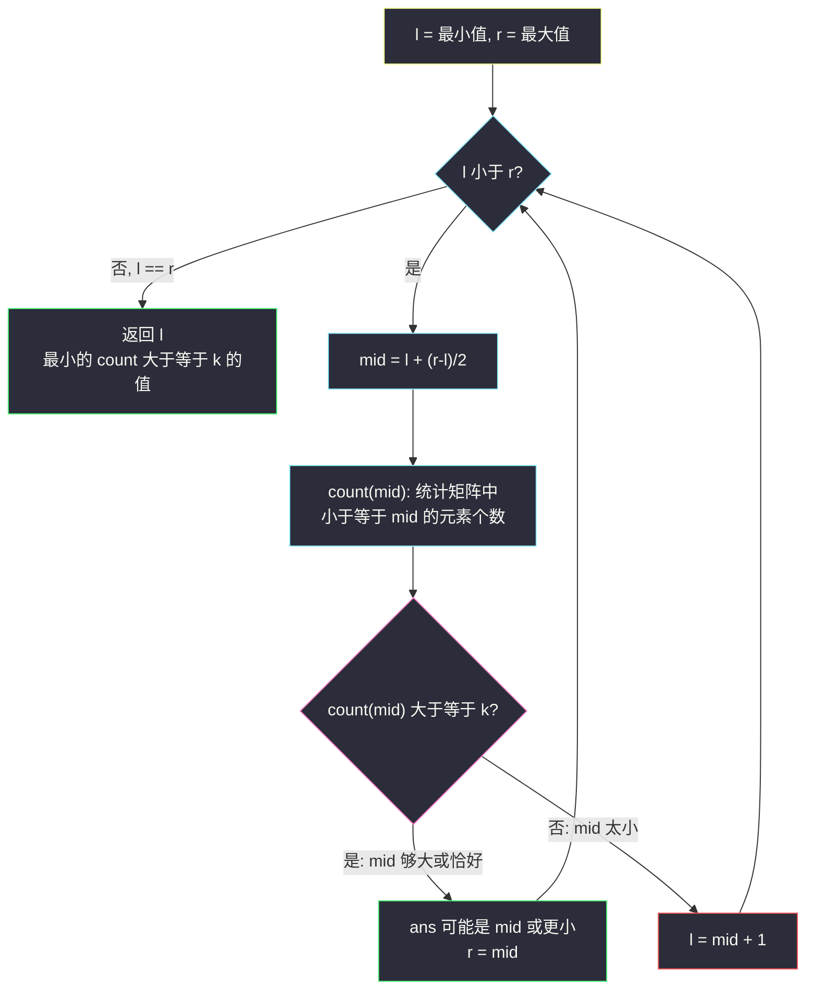
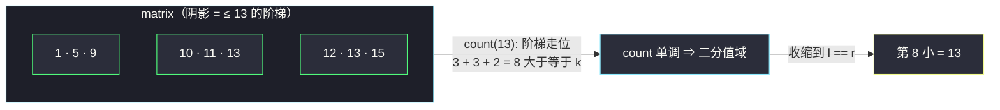

# 有序矩阵中第 K 小的元素（值域二分 + 堆双解法）

## 一、问题描述

给你一个 `n x n` 矩阵 `matrix`，其中**每行和每列元素均按升序排序**（不是下一行比上一行大，只是行内、列内各自有序）。请你找出并返回矩阵中的**第 `k` 小元素**。

请注意，排序后找第 `k` 小，**不是找第 `k` 个不同元素**。要求找出稳定解。

> 🔗 LeetCode 378：https://leetcode.cn/problems/kth-smallest-element-in-a-sorted-matrix/

**示例 1**

```
输入：matrix = [[1,5,9],[10,11,13],[12,13,15]], k = 8
输出：13
解释：矩阵中元素排序为 [1,5,9,10,11,12,13,13,15]，第 8 小元素是 13
```

**示例 2**

```
输入：matrix = [[-5]], k = 1
输出：-5
```

**直观理解**

矩阵只有「行有序 + 列有序」，整体不有序（`matrix[2][0]=12` 大于 `matrix[0][2]=9`）。两条主流路线：

1. **值域二分**：不数下标，改数「值」——猜一个数 x，利用矩阵有序性能极快地统计「≤ x 的元素个数」，对 x 二分逼近答案。
2. **小根堆**：把每行首元素进堆，弹 k-1 次，堆顶就是第 k 小。

---

## 二、暴力解法（入门）

### 直观思路

把 n² 个元素全部倒出来排序，取第 k 个：

```java
public int kthSmallest(int[][] matrix, int k) {
    int n = matrix.length;
    int[] all = new int[n * n];
    int idx = 0;
    for (int i = 0; i < n; i++) {
        for (int j = 0; j < n; j++) {
            all[idx++] = matrix[i][j];
        }
    }
    Arrays.sort(all);
    return all[k - 1];
}
```

### 复杂度

- **时间**：`O(n² log n)`，排序 n² 个元素
- **空间**：`O(n²)`

### 🔴 瓶颈在哪里

k 小于 n² 时大量元素被白白排序；而且完全没有利用「行内有序、列内有序」这两个黄金条件。

---

## 三、优化探索（核心章节）

### 3.1 关键单调性：「≤ x 的元素个数」随 x 单调不减

设 `count(x)` = 矩阵中值 `<= x` 的元素个数。x 越大，`count(x)` 越大（单调不减）。

于是第 k 小元素 `ans` 满足一个漂亮的边界性质：

- `count(ans - 1) < k`（比 ans 小的值不足 k 个）
- `count(ans) >= k`（到 ans 为止已凑够 k 个）

⇒ **ans 是最小的满足 `count(x) >= k` 的 x**——这正是 #34 里 findLeft 的变体，只不过二分的对象从「下标」换成了「值域」`[matrix[0][0], matrix[n-1][n-1]]`。



### 3.2 用阶梯走位 O(n) 数出 count(mid)

矩阵行、列双有序 ⇒ 「≤ mid 的格子」在每行里都是一段**靠左的前缀**，且前缀长度随行号递减（形成阶梯）。从**左下角** `(n-1, 0)` 出发：

- 当前值 `> mid` → 这一整行剩余部分都大，上移 `i--`；
- 当前值 `<= mid` → 当前行到 `j` 为止全部计数（`count += i + 1`，即第 0..i 行的前缀），右移 `j++`。

单向走位最多 `2n` 步，`count` 一趟 `O(n)`。整题 `O(n log V)`，`V` 是值域跨度。

### 3.3 为什么最终收敛值一定是矩阵里的元素

值域二分结束时 `l` 满足 `count(l) >= k` 且 `count(l-1) < k`。若 `l` 不在矩阵中，矩阵里所有元素要么 ≤ l-1（被 count(l-1) 统计），要么 > l；而 `count(l) = count(l-1)`（l 不在矩阵中，没有新增元素），与 `count(l) >= k > count(l-1)` 矛盾。⇒ **l 必是矩阵元素**，且按边界性质它恰是第 k 小。

### 3.4 另一条路：小根堆（归并 k 路思想）

把每行看成一个有序队列，堆里放每行队首 `(值, 行号, 列号)`：

- 弹出全局最小 `k-1` 次，弹出后把该行的下一个元素入堆；
- 第 `k` 次弹出/堆顶即第 k 小。

时间 `O(k log n)`——k 接近 n² 时反而不如值域二分，但思路通用（k 路归并是面试常客）。

### 3.5 关键问题

| 问题 | 答案 |
|------|------|
| 值域二分和下标二分的区别？ | 下标二分在「位置」上搜，值域二分在「答案取值范围」上搜；后者只要求 count 单调 |
| 为什么用 `while l < r` 而不是 `l <= r`？ | 找的是「最小满足值」边界，收敛到 l == r 汇合，与 #153 同模板 |
| `mid = (l+r)/2` 下取整会死循环吗？ | 不会：`l < r` 时 mid < r，`r = mid` 严格缩；`l = mid + 1` 也严格缩 |
| count 用右上角走位行不行？ | 行，对称地走；左下/右上皆可，习惯左下 |
| 堆解法为什么入堆行首而不是「前 k 行每行前 k 个」？ | 第 k 小元素必然出现在每行前 k 列，入堆行首 + 按需扩展即可，无需预装 |

### 3.6 一句话核心

> **第 k 小 = 最小的满足「count(x) ≥ k」的 x；count 用阶梯走位 O(n) 一趟数完，值域上二分逼近。**

---

## 四、代码实现详解

### Java（主解：值域二分）

> 说明：课源码未收录本题原题，主解按 class006 二分家族的边界模板（`while l < r` + 下取整中点 + 收缩汇合）对齐书写；count 走位是矩阵有序性的标准利用方式。

```java
// 有序矩阵中第 K 小的元素（值域二分）
// 测试链接 : https://leetcode.cn/problems/kth-smallest-element-in-a-sorted-matrix/
public class Solution {

    public static int kthSmallest(int[][] matrix, int k) {
        int n = matrix.length;
        int l = matrix[0][0], r = matrix[n - 1][n - 1], mid = 0;
        while (l < r) {
            mid = l + ((r - l) >> 1);
            if (countLessEqual(matrix, mid) >= k) {
                r = mid;   // mid 够大，答案可能是 mid 或更小
            } else {
                l = mid + 1; // mid 太小，排除
            }
        }
        return l;
    }

    // 统计矩阵中 <= x 的元素个数：从左下角出发的阶梯走位，O(n)
    public static int countLessEqual(int[][] matrix, int x) {
        int n = matrix.length;
        int i = n - 1, j = 0, count = 0;
        while (i >= 0 && j < n) {
            if (matrix[i][j] <= x) {
                count += i + 1; // 第 0..i 行的第 j 列都 <= x
                j++;
            } else {
                i--;            // 该行从这里往后全 > x，上移
            }
        }
        return count;
    }
}
```

### Java（附：小根堆解法）

```java
// 附：小根堆，弹 k-1 次后堆顶即答案
import java.util.PriorityQueue;

public static int kthSmallestHeap(int[][] matrix, int k) {
    int n = matrix.length;
    // int[]{值, 行号, 列号}
    PriorityQueue<int[]> heap = new PriorityQueue<>((a, b) -> a[0] - b[0]);
    for (int i = 0; i < Math.min(n, k); i++) { // 第 k 小只可能在前 k 行
        heap.offer(new int[]{matrix[i][0], i, 0});
    }
    for (int t = 0; t < k - 1; t++) {
        int[] cur = heap.poll();
        if (cur[2] + 1 < n) { // 该行还有后续元素
            heap.offer(new int[]{matrix[cur[1]][cur[2] + 1], cur[1], cur[2] + 1});
        }
    }
    return heap.peek()[0];
}
```

### Python

```python
# 有序矩阵中第 K 小的元素（值域二分）
# 测试链接 : https://leetcode.cn/problems/kth-smallest-element-in-a-sorted-matrix/
import heapq

class Solution:
    def kthSmallest(self, matrix: list[list[int]], k: int) -> int:
        def count_less_equal(x: int) -> int:
            # 阶梯走位：从左下角出发，O(n)
            n = len(matrix)
            i, j, cnt = n - 1, 0, 0
            while i >= 0 and j < n:
                if matrix[i][j] <= x:
                    cnt += i + 1  # 第 0..i 行的第 j 列都 <= x
                    j += 1
                else:
                    i -= 1
            return cnt

        l, r = matrix[0][0], matrix[-1][-1]
        while l < r:
            mid = l + ((r - l) >> 1)
            if count_less_equal(mid) >= k:
                r = mid
            else:
                l = mid + 1
        return l

    def kthSmallestHeap(self, matrix: list[list[int]], k: int) -> int:
        # 附：小根堆解法
        n = len(matrix)
        heap = [(matrix[i][0], i, 0) for i in range(min(n, k))]
        heapq.heapify(heap)
        for _ in range(k - 1):
            _, i, j = heapq.heappop(heap)
            if j + 1 < n:
                heapq.heappush(heap, (matrix[i][j + 1], i, j + 1))
        return heap[0][0]
```

---

## 五、例子演示

### 例 A：`matrix = [[1,5,9],[10,11,13],[12,13,15]]`，`k = 8`（值域二分全程）

值域 `l = 1`，`r = 15`，目标：最小的 `count(x) ≥ 8` 的 x。

| 轮次 | l | r | mid | count(mid) 阶梯走位过程 | count | 与 k=8 比较 | 动作 |
|------|---|---|-----|--------------------------|-------|-------------|------|
| 1 | 1 | 15 | 8 | (2,0)=12>8上移 (1,0)=10>8上移 (0,0)=1≤8 计1右移 (0,1)=5≤8 计1右移 (0,2)=9>8上移出界 | 2 | 2 < 8 | `l = 9` |
| 2 | 9 | 15 | 12 | (2,0)=12≤12 计3 (2,1)=13>12上移 (1,1)=11≤12 计2 (1,2)=13>12上移 (0,2)=9≤12 计1 出界 | 6 | 6 < 8 | `l = 13` |
| 3 | 13 | 15 | 14 | (2,0)=12≤14 计3 (2,1)=13≤14 计3 (2,2)=15>14上移 (1,2)=13≤14 计2 出界 | 8 | 8 ≥ 8 | `r = 14` |
| 4 | 13 | 14 | 13 | (2,0)=12≤13 计3 (2,1)=13≤13 计3 (2,2)=15>13上移 (1,2)=13≤13 计2 出界 | 8 | 8 ≥ 8 | `r = 13` |
| 5 | 13 | 13 | — | `l == r` 汇合 | — | — | **返回 13** ✅ |

解读：`count(12) = 6 < 8` 说明第 8 小一定比 12 大；`count(13) = 8 ≥ 8` 且 13 出现在矩阵里——第 k 小正是它。整个过程只数了 4 次数，没有排序任何数组。

### 例 B：同一数据的堆视角（弹 k-1 = 7 次）

初始堆（每行首元素）：`{1(0,0), 10(1,0), 12(2,0)}`：

| 弹出次序 | 弹出值 | 入堆 | 堆内（值） |
|----------|--------|------|------------|
| 1 | 1 | 5(0,1) | {5, 10, 12} |
| 2 | 5 | 9(0,2) | {9, 10, 12} |
| 3 | 9 | 行0耗尽 | {10, 12} |
| 4 | 10 | 11(1,1) | {11, 12} |
| 5 | 11 | 13(1,2) | {12, 13} |
| 6 | 12 | 13(2,1) | {13, 13} |
| 7 | 13 | 15(2,2) | {13, 15} |

弹完 7 次，堆顶是 13 → 第 8 小 = **13** ✅。与值域二分殊途同归。



---

## 六、复杂度分析

| 方法 | 时间 | 空间 | 说明 |
|------|------|------|------|
| 值域二分（主解） | `O(n log V)`，V 为值域跨度 | `O(1)` | 每轮 count 走位 O(n)，共 log V 轮 |
| 小根堆 | `O(k log n)` | `O(n)` | k 接近 n² 时退化为 `O(n² log n)` 级 |
| 全量排序 | `O(n² log n)` | `O(n²)` | 暴力基准 |

---

## 七、对比总结

### 易错点

1. **count 里走位起点写错**：必须左下或右上角出发；左上出发无法单趟统计（向右向下都变大）。
2. **count += i + 1 忘了是「竖着数一列」**：`matrix[i][j] <= x` 时，第 0..i 行的第 j 列都 ≤ x（列有序），一次加 `i + 1`，不是加 1。
3. **值域二分返回 `mid`**：循环里 mid 是临时值，答案在汇合点 `l`（`l == r` 时），返回 mid 在提前退出的写法里才对。
4. **堆解法弹 k 次取第 k 个**：弹 `k - 1` 次后**看堆顶**，不要弹第 k 次（虽然本题弹出也恰好是 13，但「弹完再看」在语义上最容易写错）。
5. **以为矩阵整体有序**：`matrix[i+1][0]` 可能大于 `matrix[i][n-1]`，不能直接当一维有序数组二分。

### 方法对比

| | 值域二分 | 小根堆 | 全量排序 |
|--|----------|--------|----------|
| 时间 | `O(n log V)` | `O(k log n)` | `O(n² log n)` |
| 空间 | `O(1)` | `O(n)` | `O(n²)` |
| 亮点 | 不数元素数计数 | k 很小时快 | 无 |
| 何时选 | 通用最优、值域不大时 | k 远小于 n² | 不推荐 |

### 模板口诀

> **第 k 小 = 最小的 count ≥ k 的值；左下走位数计数，值域二分往里缩。**

---

## 八、举一反三

| 题目 | 链接 | 迁移点 |
|------|------|--------|
| 668. 乘法表中第 K 小的数 | https://leetcode.cn/problems/kth-smallest-number-in-multiplication-table/ | 同款值域二分：count(x) 改为「每行 ⌊x / i⌋ 取上限 n」求和 |
| 719. 找出第 K 小的数对距离 | https://leetcode.cn/problems/find-k-th-smallest-pair-distance/ | 值域二分 + 滑动窗口计数，count 同样单调 |
| 373. 查找和最小的 K 对数字 | https://leetcode.cn/problems/find-k-pairs-with-smallest-sums/ | 本题堆解法的直系亲戚（k 路归并） |
| 34. 在排序数组中查找元素的第一个和最后一个位置 | https://leetcode.cn/problems/find-first-and-last-position-of-element-in-sorted-array/ | 「找最小的满足条件的位置」同一思想在下标域的版本 |

**迁移一句**：凡是「第 k 小/第 k 大」且**能 O(多项式) 验证一个候选值**的题，都可以把二分从下标域搬到值域——「答案空间单调」是值域二分的唯一入场券（#378、#668、#719 全是这一家族）。
