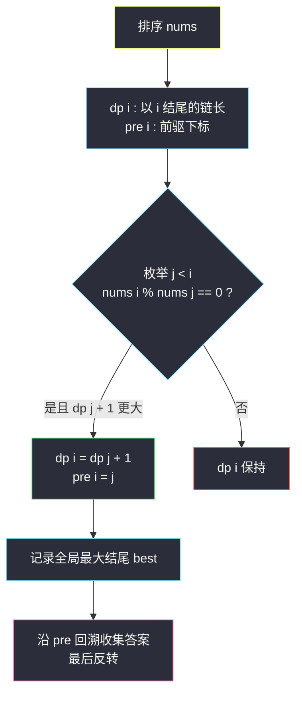
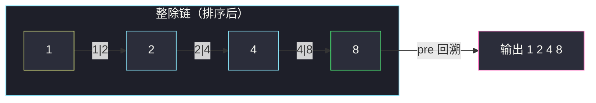

# 最大整除子集（LIS 变体 + 前驱回溯）

## 一、问题描述

给你一个由**无重复**正整数组成的集合 `nums`，请找出并返回其中最大的整除子集 `answer`：子集中每一对元素 `(answer[i], answer[j])` 都满足 `answer[i] % answer[j] == 0` 或 `answer[j] % answer[i] == 0`。题目保证在给定约束下唯一解存在。

> 🔗 LeetCode 368：https://leetcode.cn/problems/largest-divisible-subset/

**示例 1**

```
输入：nums = [1,2,3]
输出：[1,2]
解释：[1,3] 也是合法答案，题目保证唯一解（用例规模下）
```

**示例 2**

```
输入：nums = [1,2,4,8]
输出：[1,2,4,8]
```

**直观理解**

「两两可整除」看似要检查所有对，其实有一条隐藏的单链结构：**把子集排序后，只需相邻两项可整除**——因为 `a | b` 且 `b | c` 则 `a | c`（整除的传递性）。于是问题变成：排序后找一条最长「链」，链上每个数能整除下一个数。这正是 [300. 最长递增子序列](/solutions/base/longest-increasing-subsequence.md) 的换装：把「严格递增」的比较关系换成「整除」。

---

## 二、暴力解法

### 直观思路

枚举 `nums` 的所有子集，对每个子集检查「任意两元素可整除」，保留最大者。

```java
// 暴力：枚举子集 + 全对检查（仅示意，n 稍大即不可行）
public static List<Integer> largestDivisibleSubset1(int[] nums) {
    int n = nums.length;
    List<Integer> ans = new ArrayList<>();
    // mask 枚举每个子集
    for (int mask = 1; mask < (1 << n); mask++) {
        List<Integer> cur = new ArrayList<>();
        for (int i = 0; i < n; i++) {
            if ((mask & (1 << i)) != 0) {
                cur.add(nums[i]);
            }
        }
        boolean ok = true;
        outer:
        for (int a = 0; a < cur.size() && ok; a++) {
            for (int b = a + 1; b < cur.size(); b++) {
                int x = cur.get(a), y = cur.get(b);
                if (x % y != 0 && y % x != 0) {
                    ok = false;
                    break outer;
                }
            }
        }
        if (ok && cur.size() > ans.size()) {
            ans = cur;
        }
    }
    return ans;
}
```

### 复杂度

- **时间**：`O(2ⁿ × n²)`，`n = 1000` 完全不可行
- **空间**：`O(n)`

### 🔴 瓶颈在哪里

对「有序性」视而不见：整除关系传递，合法子集排序后必然是一条整除链。**只要按大小顺序考察，就根本不需要枚举子集**——这与 LIS 暴力枚举子集被 `dp[i]` 淘汰是同一个故事。

---

## 三、优化探索（核心章节）

### 3.1 观察特征

| 特征 | 说明 |
|------|------|
| 传递性 | `a | b` 且 `b | c` ⇒ `a | c`，排序后只需相邻整除 |
| 无重复元素 | 排序后 `nums[i] < nums[j]`（i < j）时整除方向唯一：`nums[i] % nums[j] == 0` 不可能，只需看 `nums[j] % nums[i] == 0` |
| 贪心有序 | 排序后「小数在前」，`dp[i]` 只依赖下标更小的 `dp[j]` |
| 要输出方案 | 不只是长度，需要 `pre[i]` 记录前驱，最后回溯 |

### 3.2 推导（骨架对齐 class072 LIS 的 O(n²) 版）

先排序。定义：

```
dp[i] : 以 nums[i] 结尾（作为链中最大元素）的最大整除子集大小
pre[i] : 这条链上 nums[i] 的前一个元素下标（-1 表示链头）
```

转移：枚举前驱 `j < i`，若 `nums[i] % nums[j] == 0` 且 `dp[j] + 1 > dp[i]`，则接上：

```
dp[i] = max(dp[j] + 1)  对所有 j < i 且 nums[i] % nums[j] == 0；无前驱则 dp[i] = 1
```

与 LIS 唯一的差别就是把条件 `nums[j] < nums[i]` 换成 `nums[i] % nums[j] == 0`。



### 3.3 关键推导问题

| 问题 | 答案 |
|------|------|
| 为什么排序后只需相邻整除？ | 整除传递：链 `a→b→c` 保证 `a | c`；反之全对可整除的集合排序后相邻必然可整除 |
| 为什么不用检查 `nums[j] % nums[i] == 0`？ | 排序后 `nums[j] < nums[i]`，小的不能被大的整除（除非相等，但元素无重复） |
| 为何不用像 LIS 那样追求 O(n log n)？ | 整除关系不是全序（如 6 与 35 互不整除），`ends` + 二分那套依赖「大于比较」，这里不适用；O(n²) 是标准解 |
| 多条最长链怎么办？ | 题目数据保证唯一解；一般实现取「第一个遇到的最大 dp 值」即可 |
| 能不能不排序？ | 不行。前驱必须数值更小，排序把「数值偏序」翻译成「下标偏序」，dp 依赖方向才有序 |

### 3.4 一句话核心

> **排序变链，dp[i] 记链长 pre[i] 记前驱，条件从「递增」换成「整除」。**

---

## 四、代码实现

### Java（主解：LIS 骨架 + 前驱回溯）

```java
// 最大整除子集
// 无重复正整数集合，返回最大的两两可整除子集
// 测试链接 : https://leetcode.cn/problems/largest-divisible-subset/
import java.util.*;

public class Solution {

    // dp[i]  : 排序后以 nums[i] 结尾的最大整除子集大小
    // pre[i] : 该链上 nums[i] 的前驱下标，-1 表示链头
    // 转移：dp[i] = max(dp[j] + 1)，j < i 且 nums[i] % nums[j] == 0
    // 依赖方向：i 从小到大，j 只往回看
    // 时间复杂度 O(n²)，空间复杂度 O(n)
    public static List<Integer> largestDivisibleSubset(int[] nums) {
        Arrays.sort(nums);
        int n = nums.length;
        int[] dp = new int[n];
        int[] pre = new int[n];
        int best = 0; // 最大子集的结尾下标
        for (int i = 0; i < n; i++) {
            dp[i] = 1;
            pre[i] = -1;
            for (int j = 0; j < i; j++) {
                if (nums[i] % nums[j] == 0 && dp[j] + 1 > dp[i]) {
                    dp[i] = dp[j] + 1;
                    pre[i] = j;
                }
            }
            if (dp[i] > dp[best]) {
                best = i;
            }
        }
        // 沿前驱回溯，从链尾收集到链头
        List<Integer> ans = new ArrayList<>();
        for (int i = best; i != -1; i = pre[i]) {
            ans.add(nums[i]);
        }
        Collections.reverse(ans); // 链头到链尾（从小到大）
        return ans;
    }
}
```

### Python（同思路）

```python
class Solution:
    def largestDivisibleSubset(self, nums: List[int]) -> List[int]:
        nums.sort()
        n = len(nums)
        dp = [1] * n        # 以 i 结尾的链长
        pre = [-1] * n      # 前驱下标
        best = 0
        for i in range(n):
            for j in range(i):
                if nums[i] % nums[j] == 0 and dp[j] + 1 > dp[i]:
                    dp[i] = dp[j] + 1
                    pre[i] = j
            if dp[i] > dp[best]:
                best = i
        ans = []
        i = best
        while i != -1:
            ans.append(nums[i])
            i = pre[i]
        return ans[::-1]
```

---

## 五、具体例子演示

### 示例 2：`nums = [1,2,4,8]`（已排序，下标 0..3）

逐格填 `dp` 与 `pre`：

| i | nums[i] | 检查的 j | 条件 nums[i]%nums[j]==0 | dp[i] | pre[i] | 说明 |
|---|------|------|------|------|------|------|
| 0 | 1 | 无 | — | 1 | -1 | 链头 `1` |
| 1 | 2 | j=0: 2%1=0 ✅ | dp[0]+1=2 > 1 | 2 | 0 | 链 `1→2` |
| 2 | 4 | j=0: 4%1=0 ✅ → dp=2, pre=0<br/>j=1: 4%2=0 ✅ 且 dp[1]+1=3 > 2 | 更新 | 3 | 1 | 链 `1→2→4` |
| 3 | 8 | j=0: 8%1=0 → dp=2<br/>j=1: 8%2=0 → dp=3, pre=1<br/>j=2: 8%4=0 ✅ 且 dp[2]+1=4 > 3 | 更新 | 4 | 2 | 链 `1→2→4→8` |

**全局最大**：`best = 3`（dp = 4）。**回溯**：`i=3 → nums[3]=8`，`i=pre[3]=2 → 4`，`i=1 → 2`，`i=0 → 1`，`i=-1` 停。收集 `[8,4,2,1]`，反转得 **`[1,2,4,8]`** ✓

### 示例 1：`nums = [1,2,3]`

| i | nums[i] | 转移 | dp[i] | pre[i] |
|---|------|------|------|------|
| 0 | 1 | 链头 | 1 | -1 |
| 1 | 2 | j=0: 2%1=0 ✅ | 2 | 0 |
| 2 | 3 | j=0: 3%1=0 → dp=2, pre=0；j=1: 3%2=1 ❌ | 2 | 0 |

注意 `i=2`：`3` 与 `2` 互不整除，链 `1→2` 与 `1→3` 并列最长。`best` 取**先出现**的 `i=1`，回溯得 `[1,2]` ✓（若允许 `[1,3]` 也是合法答案）。



---

## 六、复杂度分析

| 版本 | 时间 | 空间 | 说明 |
|------|------|------|------|
| 枚举子集（暴力） | `O(2ⁿ n²)` | `O(n)` | 仅理论示意 |
| 排序 + dp（主解） | `O(n²)` | `O(n)` | 排序 `O(n log n)` 被平方循环吸收 |

---

## 七、方法对比与总结

### 易错点

1. **忘排序**：不排序时 `nums[i] % nums[j]` 的方向不可靠，必须先 `Arrays.sort`。
2. **只回长度忘回溯**：本题要输出**方案**，`pre[i]` 前驱数组是标配；回溯后记得 `reverse`。
3. **前驱判重方向**：条件只能是 `nums[i] % nums[j] == 0`（大模小），写反条件恒假。
4. **误追 O(n log n)**：整除非全序，LIS 的 `ends` 二分不适用，别硬套。
5. **并列最长链**：数据保证唯一，但要知道实现上取的是第一个达到最大值的结尾。

### 模板口诀

> **先排序，dp 存链长，pre 存前驱；大模小能整除，回溯反转出答案。**

---

## 八、举一反三

| 题目 | 链接 | 迁移点 |
|------|------|--------|
| 300. 最长递增子序列 | https://leetcode.cn/problems/longest-increasing-subsequence/ | 本文骨架的一维原型 |
| 354. 俄罗斯套娃信封 | https://leetcode.cn/problems/russian-doll-envelopes/ | 二维偏序版 LIS，同样「比较关系」变装 |
| 646. 最长数对链 | https://leetcode.cn/problems/maximum-length-of-pair-chain/ | 「可连接」关系换成区间偏序，dp 同骨架 |
| 1691. 堆叠长方体的最大高度 | https://leetcode.cn/problems/maximum-height-by-stacking-cuboids/ | 「能叠上」是三维偏序，排序 + dp 依旧 |

**迁移一句**：凡是「集合中关系具有传递性、可排成链」的最长子序列题（递增 / 整除 / 套娃 / 叠箱子），统一套 `dp[i] + 前驱回溯` 模板，换的只是那个**关系判断函数**。
