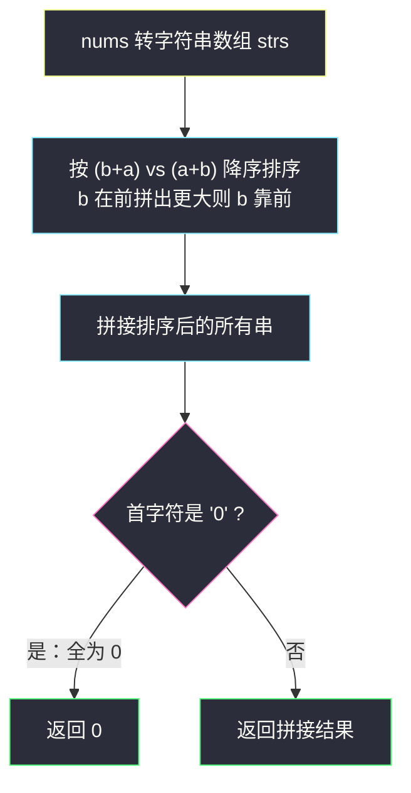
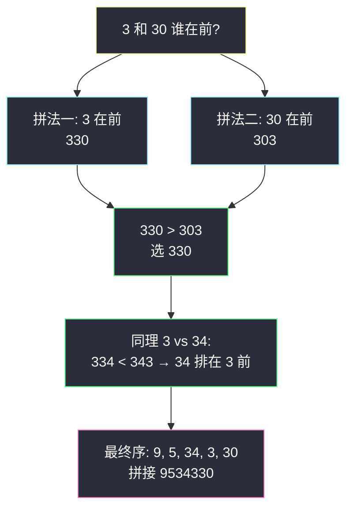

# 最大数（自定义比较器拼接序）

## 一、问题描述

给定一组**非负整数** `nums`，重新排列每个数的顺序（每个数不可拆分），使之组成一个最大的整数。

注意：输出结果可能非常大，所以你需要返回一个**字符串**而不是整数。

> 🔗 LeetCode 179：https://leetcode.cn/problems/largest-number/

**示例 1**

```
输入：nums = [10,2]
输出："210"
解释：两种拼接是 102 与 210，210 更大。
```

**示例 2**

```
输入：nums = [3,30,34,5,9]
输出："9534330"
解释：按 "9" > "5" > "34" > "3" > "30" 的顺序拼接。
```

**直观理解**

本质是**自定义排序**：给每个数一个「出场顺序」，但这个顺序**不是数值大小**，也不是字典序——`3` 要排在 `34` 前面，但 `3` 也要排在 `30` 前面（`"330" > "303"`）。比较两个数 a、b 谁先谁后的唯一可靠办法是：**把两种拼接结果直接比一下**——`(a+b)` 与 `(b+a)`，谁拼出来的大谁在前。这是一个「比较关系本身需要拼出来才知道」的排序题。

---

## 二、暴力解法（入门）

### 直观思路

生成所有数字的全排列（课上讲解038 的 swap 交换法原封不动），把每个排列拼成字符串，取字典序最大的那个。

```java
public String largestNumber(int[] nums) {
    String[] strs = new String[nums.length];
    for (int i = 0; i < nums.length; i++) strs[i] = String.valueOf(nums[i]);
    List<String> all = new ArrayList<>();
    f(strs, 0, all);                  // 全排列生成，收集所有拼接结果
    Collections.sort(all);            // 字典序升序
    return all.get(all.size() - 1);   // 取最大的拼接
}

private void f(String[] strs, int i, List<String> ans) {
    if (i == strs.length) {
        StringBuilder path = new StringBuilder();
        for (String s : strs) path.append(s);
        ans.add(path.toString());
    } else {
        for (int j = i; j < strs.length; j++) {
            swap(strs, i, j);
            f(strs, i + 1, ans);
            swap(strs, i, j);        // 恢复现场
        }
    }
}
```

### 复杂度

- **时间**：`O(n! · n)`——`n!` 个排列，每个拼字符串 O(n)。
- **空间**：`O(n! · n)` 存全部结果（或 O(n) 边生成边打擂台）。

### 🔴 瓶颈在哪里

1. 全排列爆炸，`n = 100` 直接天文数字；
2. 它验证了一件重要的事：**最优排列 = 按某种「两两可比」的关系排序**。既然任意两个数谁前谁后可以 O(字符串长) 判定，就应该直接用比较排序，把 `O(n!)` 压到 `O(n log n)`。

---

## 三、优化探索（核心章节）

### 3.1 观察特征

| 特征 | 结论 |
|------|------|
| 每个数不可拆分，整体出场 | 答案 = 某种全序下的顺序拼接 |
| a、b 谁先？唯一可靠判据是拼出来比 | 定义比较：`(a+b) > (b+a)` 则 a 在前 |
| 字符串拼接可预生成，比较就是 `compareTo` | 一次排序解决全部 |

### 3.2 自定义比较器与传递性

定义 `a ≻ b ⟺ (a+b) 字符串 > (b+a) 字符串`。

- **传递性**（排序正确的前提）：把每个字符串 s 看成一个大数 s·10^|s| 的思想太绕，经典证明思路是：定义「值」v(x) = 数值 x 在无限循环 x 重复下去时的比率（x / (10^|x| − 1)，例如 "3" → 3/9，"34" → 34/99），可以证明 `(a+b) ≥ (b+a) ⟺ v(a) ≥ v(b)`。v 是实数，实数上的 ≥ 天然全序可传——所以比较器合法，排序结果全局最优。
- **排序后直拼即最大**：若存在更大排列，则其中必有相邻两项 a、b 违反 `a ≻ b`，交换二者拼接严格变大，矛盾于「已按 ≻ 排好」。



### 3.3 关键推导问题

| 问题 | 答案 |
|------|------|
| 为什么不能按普通字典序排？ | `"3"` 与 `"34"` 字典序 `"3" < "34"`（前缀更小），但 `"334" < "343"`，`3` 应在 34 **前**——字典序与拼接序在「前缀关系」时反序 |
| 为什么不能按数值大小排？ | `30 < 3`？数值上 3 < 30，但 `"330" > "303"`，`3` 应在 30 前 |
| (a+b)/(b+a) 比较为什么可靠？ | 它直接模拟了「a、b 相邻出场」的最终效果；任何全局排列里相邻两项的相对顺序，都能被这个局部比较无损优化（交换论证） |
| 全 0 特判为什么必要？ | `[0,0]` 排序拼接得 `"00"`，数值就是 0，合法输出是 `"0"`；首字符为 '0' 说明所有串都是 '0'，直接返回 `"0"` |
| 负数出现怎么办？ | 题目保证非负；若有负数，拼接语义崩塌（负号跑到中间），本题不适用 |

### 3.4 一句话核心

> **两个数谁先出场，拼出来一比便知：`a+b` 大则 a 在前；这个「拼接序」是全序，直接排序一次成型。**

---

## 四、代码实现详解

> 课源码：`class089/Code01_LargestNumber.java`（讲法：先做「字符串拼接字典序最小」的泛化版 way2，再迁移到最大数）。主解与课上 `way2` 的比较器骨架同构，方向取反以适配「最大」。

### Java（主解：自定义比较器，对齐 class089）

```java
// 最大数
// 测试链接 : https://leetcode.cn/problems/largest-number/
class Solution {

    public String largestNumber(int[] nums) {
        String[] strs = new String[nums.length];
        for (int i = 0; i < nums.length; i++) {
            strs[i] = String.valueOf(nums[i]);
        }
        // 课上 way2 骨架：比较器比较两种拼接
        // 这里要"最大"，所以 (b+a) 更大时 b 排前面（降序）
        Arrays.sort(strs, (a, b) -> (b + a).compareTo(a + b));
        if (strs[0].equals("0")) {
            return "0";   // 排完最大的串是 "0"，说明全是 0
        }
        StringBuilder path = new StringBuilder();
        for (String s : strs) {
            path.append(s);
        }
        return path.toString();
    }
}
```

课上 `way2` 原版（拼接字典序**最小**，正是「把数组排成最小的数」——剑指 Offer 45 的原题骨架）：

```java
// 课源码 class089/Code01_LargestNumber.java · way2
public static String way2(String[] strs) {
    Arrays.sort(strs, (a, b) -> (a + b).compareTo(b + a));
    StringBuilder path = new StringBuilder();
    for (int i = 0; i < strs.length; i++) {
        path.append(strs[i]);
    }
    return path.toString();
}
```

### Python（同思路）

```python
class Solution:
    def largestNumber(self, nums: list[int]) -> str:
        strs = list(map(str, nums))
        # python3 的 cmp_to_key：a+b 小则 a 在前，整体升序 → 大数反着来
        from functools import cmp_to_key
        strs.sort(key=cmp_to_key(lambda a, b: (b + a > a + b) - (b + a < a + b)))
        if strs[0] == '0':
            return '0'
        return ''.join(strs)
```

---

## 五、具体例子演示

`nums = [3,30,34,5,9]` → `strs = ["3","30","34","5","9"]`。

**排序过程（快排思路，只看关键比较）**：

| 比较 | a+b | b+a | 结论（谁在前） |
|------|-----|-----|----------------|
| 9 vs 5 | 95 | 59 | "9"+"5"=95 > 59 → 9 前 |
| 5 vs 34 | 534 | 345 | 534 > 345 → 5 前 |
| 34 vs 3 | 343 | 334 | 343 > 334 → 34 前 |
| 34 vs 30 | 3430 | 3034 | 3430 > 3034 → 34 前 |
| 3 vs 30 | 330 | 303 | 330 > 303 → 3 前 |

排序稳定收敛为：`["9","5","34","3","30"]`。

**拼接**：`"9" + "5" + "34" + "3" + "30" = "9534330"`，首字符非 '0'，直接返回。

**为什么 "3" 排在 "30" 前是关键**：



**全零特判演示** `nums = [0,0,0,1]`：

- 排序后 `["1","0","0","0"]`，首字符 '1' ≠ '0'，正常拼接 `"1000"` ✓；
- 而 `nums = [0,0]` 排序后 `["0","0"]`，首字符 '0' → 返回 `"0"`（若不特判会输出 `"00"`）。

---

## 六、复杂度分析

| 项目 | 自定义比较器排序（主解） | 全排列暴力 |
|------|--------------------------|------------|
| 时间 | `O(n log n · L)`：L 为平均串长，比较一次 O(L)；总比较 O(n log n) 次 | `O(n! · n)` |
| 空间 | `O(n · L)` 字符串数组 + 拼接结果 | `O(n! · n)` |

（`L` 至多为 10 位数字，可视为常数。）

---

## 七、方法对比与总结

| | 全排列暴力 | 拼接比较器排序 |
|--|------------|------------------|
| 复杂度 | 阶乘 | `O(n log n · L)` |
| 正确性 | 枚举即正确 | 依赖比较器传递性（3.2 的 v(x) 证明） |
| 可迁移性 | 无 | 一切「拼接型排序」通用 |

**易错点**

1. **忘全零特判**：`[0,0]` 输出 `"00"` 而非 `"0"`，经典 WA；
2. 误用**数值排序**或**纯字典序排序**：`3` 与 `30`、`3` 与 `34` 两处都会排错；
3. 比较器写成 `(a + b).compareTo(b + a)` 且没意识到这是**升序**（最小数方向）：做最大数要取降序；
4. Python 直接 `sort(key=lambda x: x)` 是字典序，必须用 `cmp_to_key` 比较拼接。

**模板口诀**

> **两两谁先拼了算，a+b 与 b+a 比；降序直拼最大数，全零特判返回 0。**

---

## 八、举一反三

| 题目 | 链接 | 迁移点 |
|------|------|--------|
| 剑指 Offer 45. 把数组排成最小的数 | https://leetcode.cn/problems/ba-shu-zu-pai-cheng-zui-xiao-de-shu-lcof/ | 同一骨架反向：`(a+b)` 升序（课上 way2 原型） |
| 31. 下一个排列 | https://leetcode.cn/problems/next-permutation/ | 不拼接，找字典序意义下的下一个排列 |
| 386. 字典序排数 | https://leetcode.cn/problems/lexicographical-numbers/ | 数的字典序遍历（DFS 十叉树） |
| 670. 最大交换 | https://leetcode.cn/problems/maximum-swap/ | 贪心重排数字位，与本题同为「位序决定大小」思想 |

**迁移一句**：凡是「个体顺序影响整体拼接结果」的排序题（数字拼接、时间格式拼接、版本号比较），先问一句——**两个对象谁前谁后，能否 O(1)~O(L) 局部判定？** 能，就写自定义比较器交给排序；这个「拼接判序」的套路在课上 class089 是用「字典序最小拼接」泛化讲解的，最大最小一体两面。
