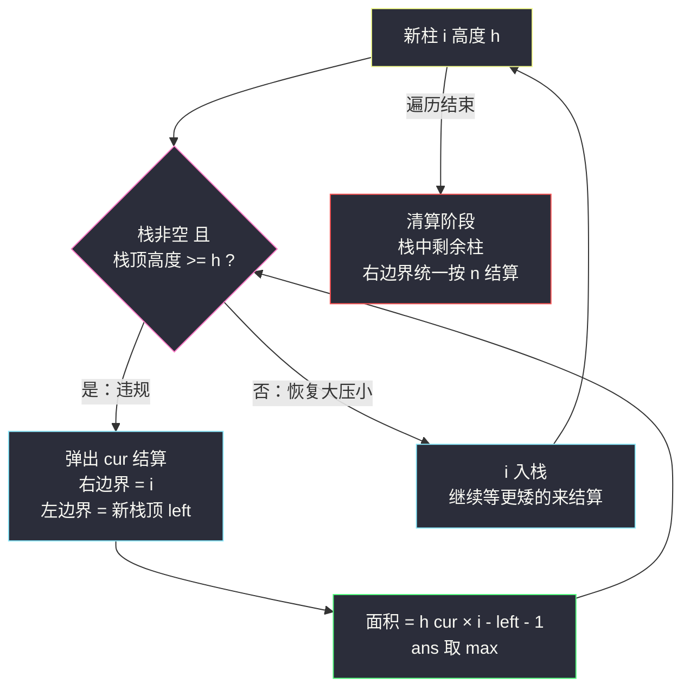
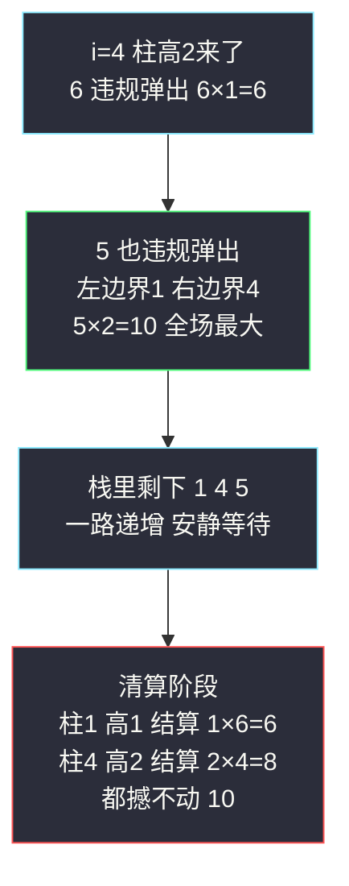

# 柱状图中最大的矩形（单调栈封神题 · 大压小，弹栈结算）

## 一、问题描述

给定 n 个非负整数表示柱状图中各柱子的高度（每根柱子宽度为 `1`、彼此相邻），求能勾勒出来的**最大矩形面积**。

> 🔗 LeetCode 84：https://leetcode.cn/problems/largest-rectangle-in-histogram/
>
> 约束：`1 <= heights.length <= 10^5`，`0 <= heights[i] <= 10^4`。数据量摆明 `O(n²)` 必超时，单调栈线性解是唯一出路。

**示例 1**

```
输入：heights = [2,1,5,6,2,3]
输出：10
解释：最大的矩形是柱 5 和柱 6 拼出的 2 × 5 = 10
```

**示例 2**

```
输入：heights = [2,4]
输出：4
解释：柱 4 单独成矩形 1 × 4 = 4
```

**直观理解**

矩形由「高 × 宽」决定：高取某根柱子，宽向两边扩展到**撞上比自己矮的柱子为止**。所以每根柱子 `i` 都有一个命运注定的最大矩形：`heights[i] × (右边第一个更矮的位置 - 左边第一个更矮的位置 - 1)`。把「每根柱子的两侧最近更矮位置」一次全求出来，答案就齐了——这正是单调栈的看家本领。课源码 class052 `Code04_LargestRectangleInHistogram` 原题：**大压小的栈，矮柱一来，高柱违规弹栈结算面积**。

```
heights = [2,1,5,6,2,3]

6 |          ██
5 |        ██ ██
4 |        ██ ██
3 |        ██ ██      ██
2 |  ██    ██ ██  ██  ██
1 |  ██ ██ ██ ██  ██  ██        ← 柱 5、6 下方矩形 2×5=10 最大
0 +-----------------------
     0  1  2  3   4   5
```

---

## 二、暴力解法（枚举每根柱子向两边扩）

### 直观思路

枚举「矩形的高由哪根柱子决定」：固定 `i` 后，从 `i` 向左走到第一根矮于 `heights[i]` 的柱子停、向右同样走到第一根矮柱停，中间的柱子数就是宽度：

```java
class Solution {
    public int largestRectangleArea(int[] heights) {
        int n = heights.length, ans = 0;
        for (int i = 0; i < n; i++) {
            int left = i, right = i;
            while (left >= 0 && heights[left] >= heights[i]) left--;   // 左扩到更矮
            while (right < n && heights[right] >= heights[i]) right++; // 右扩到更矮
            ans = Math.max(ans, heights[i] * (right - left - 1));
        }
        return ans;
    }
}
```

### 复杂度

- **时间**：`O(n²)`——最坏整体单调（如阶梯状）时每根柱子都扩到边界
- **空间**：`O(1)`

### 🔴 瓶颈在哪里

1. 每根柱子独立地向两边摸索，同一片区域被摸了 n 遍；
2. 没利用「向右扩到更矮」这件事**一根矮柱可以同时终结一摞高柱的扩张**——一摞柱子只要还在「从左到右递增」地排着，就都没到结算时刻；
3. `n = 10^5` 时 `10^10` 次比较，必然超时。

---

## 三、优化探索（核心章节）

### 3.1 观察特征

| 特征 | 说明 |
|------|------|
| 矩形一定「以某根柱子为顶梁柱」 | 最优矩形的高 = 覆盖区域内最矮柱的高；枚举那根最矮柱即可不重不漏 |
| 每根柱子的边界 = 两侧最近更矮 | 高柱的矩形左右都停在第一个更矮处——「左右两侧最近更小值」正是单调栈的定义域问题 |
| 高度递增时谁也结算不了 | 左到右一路走高，每根柱子的右边还没有更矮者，全部压栈等待 |
| 矮柱一来，一摞高柱同时到期 | 比栈顶矮的新柱 = 所有比它高的栈内柱子的「右侧第一个更矮」**同时确定**，可以批量结算 |

### 3.2 暴力 → 优化：大压小，违规即答案

栈维护**大压小**不变式：栈底到栈顶，柱子高度**递增**（存下标）。新柱 `i` 到来时：

- 若 `heights[i]` **低于等于**栈顶——栈顶「违规」（矮柱压住了高柱的扩张路），**弹栈结算**：弹出的柱 `cur` 就是顶梁柱，它的**右侧第一个更矮**是新来的 `i`，**左侧第一个更矮**是弹出后露出的新栈顶 `left`，宽度 `i - left - 1`，面积 `heights[cur] * (i - left - 1)`；
- 弹到栈顶不高于自己为止，`i` 入栈。

扫完后再来**清算阶段**：栈中剩余柱子的右侧没有更矮者，右边界统一按 `n` 结算。

```
largestRectangleArea:
    stack = 空栈（大压小：底到顶高度递增，存下标）
    // 遍历阶段
    for i in 0..n-1:
        while 栈非空 且 heights[栈顶] >= heights[i]:     ← 违规即答案
            cur = 弹出                                   ← 顶梁柱结算
            left = 栈空 ? -1 : 新栈顶                    ← 左侧最近更矮
            ans = max(ans, heights[cur] * (i - left - 1))
        stack.push(i)
    // 清算阶段
    while 栈非空:
        cur = 弹出
        left = 栈空 ? -1 : 新栈顶
        ans = max(ans, heights[cur] * (n - left - 1))    ← 右边界 = n
```



### 3.3 关键推导问题

| 问题 | 答案 |
|------|------|
| 为什么最优矩形一定以「弹出结算」的方式被考察到？ | 最优矩形的高 = 它覆盖柱子中的最矮柱 `cur`，矩形恰好延伸到 `cur` 两侧最近更矮处。而 `cur` 被弹出那一刻，「右侧最近更矮」（触发者 `i`）与「左侧最近更矮」（新栈顶）同时到位——结算的正是这个命运矩形，不会漏 |
| 为什么左边界是新栈顶而不是更左的？ | `cur` 之下压着的都是**比它高**的（大压小），它们挡不住 `cur` 的扩张；新栈顶是栈中第一个比 `cur` 矮的，而栈里保留的都是「还没被更矮者终结」的柱子，所以新栈顶就是 `cur` 左侧最近更矮 |
| 弹栈条件为什么用 `>=`（相等也弹）？ | 相等的柱子矩形边界互相「让位」不影响最大值：先弹的结算宽度可能偏小，但最后那根相等柱清算时会以完整宽度再结算一次，答案不漏。用 `>` 严格弹也能对，只是栈里会叠等高柱；课上取 `>=`，跟着走 |
| 栈空时 left 为什么取 -1？ | `cur` 弹出后栈空说明 `cur` 左侧没有任何更矮柱，矩形一直扩到最左边 0 号柱，宽度 = `i - (-1) - 1 = i`，`-1` 虚拟边界让公式统一 |
| 为什么需要清算阶段？ | 遍历结束时栈里的柱子右侧**没有**更矮者（有早就被弹了），它们的右边界是数组尽头 `n`，照抄结算公式把右边界换成 `n` 即可。也可以在数组末尾补一根高度 0 的哨兵柱强制全弹，两种写法等价 |
| 每根柱子结算一次就够吗？ | 够。每根柱子作为顶梁柱的最大矩形只有一个（两侧最近更矮是唯一的），弹出时机恰好凑齐它的两条边界；所有柱子的命运矩形取 max 就是全局答案 |
| 与 #42 接雨水有什么异同？ | 同样是单调栈，方向相反：接雨水要「大压小」（找两侧更高，矮柱蓄水）；本题「小压大」（找两侧更矮，高柱结算）。弹栈结算的对象一个算水量、一个算面积，骨架如出一辙 |

### 3.4 一句话核心

> **大压小排好队，矮柱一来高柱违规——弹一根、结一矩形：右边界是触发者，左边界是新栈顶，宽 `i - left - 1`。**

---

## 四、代码实现详解

### Java（主解：大压小 + 遍历/清算两阶段，对齐 class052 课源码）

```java
// 柱状图中最大的矩形
// 测试链接 : https://leetcode.cn/problems/largest-rectangle-in-histogram/
// 对齐课源码 class052 Code04_LargestRectangleInHistogram
class Solution {
    public int largestRectangleArea(int[] height) {
        int n = height.length, ans = 0;
        Deque<Integer> stack = new ArrayDeque<>();   // 大压小：底到顶高度递增，存下标
        // 遍历阶段
        for (int i = 0; i < n; i++) {
            // 违规即答案：新柱更矮，栈顶高柱弹出结算
            while (!stack.isEmpty() && height[stack.peek()] >= height[i]) {
                int cur = stack.pop();
                int left = stack.isEmpty() ? -1 : stack.peek();   // 左侧最近更矮
                ans = Math.max(ans, height[cur] * (i - left - 1));
            }
            stack.push(i);
        }
        // 清算阶段：右边界统一按 n
        while (!stack.isEmpty()) {
            int cur = stack.pop();
            int left = stack.isEmpty() ? -1 : stack.peek();
            ans = Math.max(ans, height[cur] * (n - left - 1));
        }
        return ans;
    }
}
```

课源码用 `int[] stack` + 指针 `r` 的静态数组模拟栈，结算行 `ans = Math.max(ans, height[cur] * (i - left - 1))` 与 `left = r == 0 ? -1 : stack[r - 1]` 和此处逐字对应；站点版换 `ArrayDeque` 只为好读。

**哨兵变体**（默写更短）：数组末尾逻辑补一根高度 `0` 的柱子，逼空整个栈，清算阶段就消失了——

```java
// 末尾哨兵写法：循环到 i == n 时按 height = 0 结算，栈被逼空
for (int i = 0; i <= n; i++) {
    int h = (i == n) ? 0 : height[i];   // 哨兵
    while (!stack.isEmpty() && height[stack.peek()] >= h) { ...同上结算，右边界 i... }
    stack.push(i);
}
```

### Python（主解同思路）

```python
class Solution:
    def largestRectangleArea(self, height: list[int]) -> int:
        n, ans = len(height), 0
        stack: list[int] = []                     # 大压小，存下标
        for i in range(n + 1):                    # i == n 是高度 0 的哨兵
            h = 0 if i == n else height[i]
            while stack and height[stack[-1]] >= h:
                cur = stack.pop()
                left = stack[-1] if stack else -1
                ans = max(ans, height[cur] * (i - left - 1))
            stack.append(i)
        return ans
```

Python 版直接用哨兵写法，一个循环收编遍历 + 清算两个阶段。

---

## 五、具体例子演示

### 例 1：`heights = [2,1,5,6,2,3]`，答案 `10`

栈记法：左侧为底，方括号内是柱子下标（高度）。

**遍历阶段**

| 步 | i（高度） | 栈顶比较 | 动作与结算 | 栈（底→顶） |
|----|-----------|----------|-----------|-------------|
| 1 | 0 (2) | 栈空 | 入栈 | [0(2)] |
| 2 | 1 (1) | 2 >= 1 违规 | 弹 0：left=-1，宽 1-(-1)-1=1，面积 `2×1=2`；入栈 | [1(1)] |
| 3 | 2 (5) | 1 < 5 | 入栈 | [1(1), 2(5)] |
| 4 | 3 (6) | 5 < 6 | 入栈 | [1(1), 2(5), 3(6)] |
| 5 | 4 (2) | 6 >= 2 违规 | 弹 3：left=2，宽 4-2-1=1，面积 `6×1=6`（ans=6）；5 >= 2 继续违规，弹 2：left=1，宽 4-1-1=2，面积 `5×2=10`（ans=10）；1 < 2 停；入栈 | [1(1), 4(2)] |
| 6 | 5 (3) | 2 < 3 | 入栈 | [1(1), 4(2), 5(3)] |

**清算阶段**（右边界统一按 n=6）

| 弹出 | left | 宽度 | 面积 | ans |
|------|------|------|------|-----|
| 5 (3) | 4 | 6-4-1=1 | 3 | 10 |
| 4 (2) | 1 | 6-1-1=4 | `2×4=8` | 10 |
| 1 (1) | -1 | 6-(-1)-1=6 | `1×6=6` | **10** |

输出 `10` ✅



**关键看点**：第 5 步柱高 `2` 一来**连弹两根**（6 和 5）——它就是这两根高柱右侧第一个更矮者；柱 5 的 `10` 正是那两根相邻高柱拼出的顶梁矩形。清算阶段柱 4 结算的 `2×4=8` 说明：矮柱虽然不高，但「吃」到了整片更宽的区域——高与宽的博弈全在弹栈瞬间见分晓。

### 例 2：单调递增 `[1,2,3,4,5]`，答案 `9`

遍历阶段零弹栈（一路走高从不违规），栈满员 `[0..4]`；清算阶段依次结算：柱 4（宽 1，面积 5）、柱 3（宽 2，面积 8）、柱 2（宽 3，面积 **9**）、柱 1（宽 4，面积 8）、柱 0（宽 5，面积 5）。最大 `9` = `3×3` ✅ 递增序列的答案全靠清算阶段产出。

### 例 3：单调递减 `[5,4,3,2,1]`，答案 `9`

每根新柱都违规：`i=1` 弹 5（`5×1=5`）、`i=2` 弹 4（`4×2=8`）、`i=3` 弹 3（`3×3=9`）、`i=4` 弹 2（`2×4=8`）；清算弹 1（`1×5=5`）。最大 `9` ✅ 递减序列的答案全在遍历阶段产出。与例 2 合看：**栈什么时候弹不重要，每根柱子都恰好结算一次命运矩形才重要**。

---

## 六、复杂度分析

| 项目 | 暴力两边扩 | 单调栈（主解） |
|------|------------|----------------|
| 时间 | `O(n²)` | **`O(n)`**：每根柱子入栈一次、出栈至多一次，总结算次数 ≤ n |
| 空间 | `O(1)` | `O(n)`：栈最坏满员（单调递增时） |

**摊还分析**：`while` 单步可能连弹一摞，但「弹出去的永不回来」，总弹栈次数被入栈总数 n 封顶；两阶段合计扫描 ≤ 2n 步，全程线性。

---

## 七、方法对比与总结

### 写法对比

| | 暴力两边扩 | 单调栈·两阶段（主解） | 单调栈·哨兵版 |
|--|------------|------------------------|----------------|
| 时间 | `O(n²)` | `O(n)` | `O(n)` |
| 结构 | 无栈 | 遍历阶段 + 清算阶段 | 末尾补 0 强制全弹 |
| 代码量 | 短但超时 | 结构清晰、对齐课源码 | ✅ 最短，默写友好 |
| 面试定位 | 讲思路起点 | ✅ 先讲这个再秀哨兵 | 收尾加分项 |

### 易错点

1. **结算公式里的 `-1` 丢了**：宽度是开区间 `(left, i)` 内的柱子数 `i - left - 1`，写成 `i - left` 会把边界矮柱也算进去。
2. **left 取错**：必须先 `pop` 再看**新**栈顶；拿弹出前的旧栈顶当左边界，宽永远差一截。
3. **忘清算阶段**（两阶段写法）：递增序列的答案全在清算里（例 2），漏了直接输出错。
4. **栈空时 left 忘置 -1**：Java 里 `stack.peek()` 空栈抛异常，还连带宽度算错。
5. **弹栈条件 `>=` 与 `>` 混着记还说不清**：两种都能 AC，但要能讲清相等时「先弹的结算偏小、清算补全」这层（见 3.3），面试追问的高频点。
6. **拿栈顶高度比较时用了 `heights[i]` 与 `i`**：栈里存下标，比较的是 `height[栈顶]`，笔误成比下标是低级但高发的事故。

### 模板口诀

> **递增栈大压小，矮柱一到高柱倒；右界触发者，左界新栈顶，高乘宽里挑最大，扫完清账别忘掉。**

---

## 八、举一反三

| 题目 | 链接 | 迁移点 |
|------|------|--------|
| 85. 最大矩形 | https://leetcode.cn/problems/maximal-rectangle/ | 本题的矩阵版：逐行压成直方图、逐行调用本题，Hard 套 Hard（站内本批已有题解 maximal-rectangle.md） |
| 42. 接雨水 | https://leetcode.cn/problems/trapping-rain-water/ | 镜像单调栈：找两侧**更高**，弹栈结算水量（站内已有题解 trapping-rain-water.md） |
| 496. 下一个更大元素 I | https://leetcode.cn/problems/next-greater-element-i/ | 单调栈入门：弹栈即答案的纯「查询」版，没有结算面积（站内已有题解 next-greater-element-i.md） |
| 739. 每日温度 | https://leetcode.cn/problems/daily-temperatures/ | 同骨架入门：弹栈结算的是**距离** `i - cur`（站内本批已有题解） |
| 1793. 好子数组的最大分数 | https://leetcode.cn/problems/maximum-score-of-a-good-subarray/ | 本题限定「子数组必须包含下标 k」的变体：单调栈结算时检查区间是否跨过 k |
| 907. 子数组的最小值之和 | https://leetcode.cn/problems/sum-of-subarray-minimums/ | 换汤不换药：每根柱子结算「它作为最小值管辖的子数组个数」，课源码 class052 Code03 原题 |

**迁移一句**：单调栈的精髓不在「栈」，在**弹栈时机 = 信息凑齐的时机**——#496/#739 弹栈拿「最近更大」，#42 拿「两侧更高」，#84 拿「两侧更矮 + 结算面积」；认出「谁违规、弹谁、弹出来时结算什么」，一类题就通了一整片。
