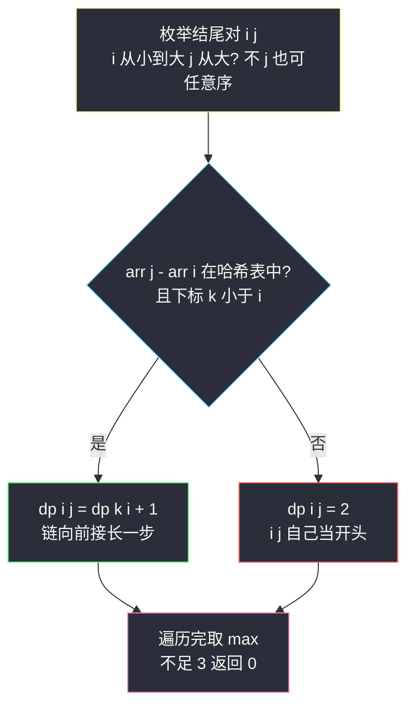
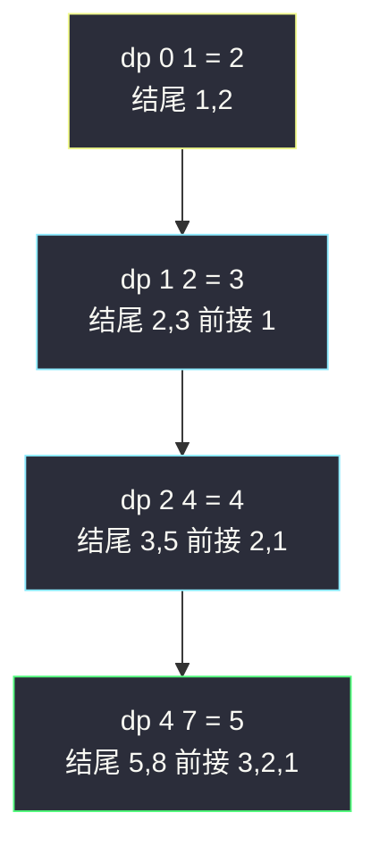

# 最长的斐波那契子序列的长度（序列 DP + 哈希定位）

## 一、问题描述

给定一个严格递增的正整数数组 `arr`，找出其中最长的**斐波那契式子序列**的长度；不存在（长度不足 3）则返回 `0`。若序列 `X1, X2, ..., Xn` 满足 `n ≥ 3` 且 `Xi + Xi+1 = Xi+2`（对一切 `i + 2 ≤ n`），则称其为斐波那契式。

> 🔗 LeetCode 873：https://leetcode.cn/problems/length-of-longest-fibonacci-subsequence/

**示例 1**

```
输入：arr = [1,2,3,4,5,6,7,8]
输出：5
解释：最长的斐波那契子序列是 [1,2,3,5,8]
```

**示例 2**

```
输入：arr = [1,3,7,11,12,14,18]
输出：3
解释：最长的斐波那契子序列包括 [1,11,12]、[3,11,14] 以及 [7,11,18]
```

**直观理解**

子序列要保持 `arr` 中的相对顺序，且后一项 = 前两项之和。它不像 [300. 最长递增子序列](/solutions/base/longest-increasing-subsequence.md) 那样只看「一个结尾」，因为**下一项由「最后两项」共同决定**——状态里必须同时记住两项，这就是 `dp[i][j]` 二维表的由来。

---

## 二、暴力解法

### 直观思路

枚举所有**前两项** `(arr[i], arr[j])`（`i < j`），然后用哈希表贪心往后接：设最后两项为 `(a, b)`，查 `a + b` 是否在 `arr` 中且下标大于 `b` 的下标，在就接上并继续。

```java
// 暴力：枚举前两项，哈希表贪心延伸
public static int lenLongestFibSubseq1(int[] arr) {
    int n = arr.length;
    // 值 -> 下标（arr 严格递增，值互不相同）
    HashMap<Integer, Integer> idx = new HashMap<>();
    for (int i = 0; i < n; i++) {
        idx.put(arr[i], i);
    }
    int ans = 0;
    for (int i = 0; i < n; i++) {
        for (int j = i + 1; j < n; j++) {
            int a = arr[i], b = arr[j];
            // a + b 一定大于 b；由于 arr 递增，找到即下标必然更大
            int len = 2;
            while (idx.containsKey(a + b)) {
                int t = a + b;
                a = b;
                b = t;
                len++;
            }
            ans = Math.max(ans, len);
        }
    }
    return ans >= 3 ? ans : 0;
}
```

### 复杂度

- **时间**：`O(n² log M)`——`n²` 对起点，每对最多延伸 `log(最大值)` 步（斐波那契式增长是指数级的，序列长度 ≤ 约 `log(2×10⁹) ≈ 45`）
- **空间**：`O(n)` 哈希表

### 🔴 瓶颈在哪里

同一个「长链尾段」被不同起点反复延伸：比如链 `1,2,3,5,8`，起点 `(1,2)` 延伸到底，起点 `(2,3)` 又延伸一遍。**尾部两两重复计算**——DP 让「以某两项结尾」的最长长度只算一次。

---

## 三、优化探索（核心章节）

### 3.1 观察特征

| 特征 | 说明 |
|------|------|
| 状态由两项决定 | 斐波那契式的下一项 = 前两项之和，只记「结尾一项」不够 |
| 数组严格递增 | 值互不相同且下标有序，「找值」可 `O(1)` 哈希、「下标大」自动满足 |
| 依赖方向清晰 | `dp[i][j]`（结尾为 `i,j`）依赖 `dp[k][i]`（结尾为 `k,i`），`k < i < j`，按 `j` 从小到大填表即可 |

### 3.2 推导：把「结尾两项」作为状态（对齐 class072 LIS 的 dp[i] 骨架）

回顾 [300. 最长递增子序列](/solutions/base/longest-increasing-subsequence.md)：`dp[i]` = 以 `arr[i]` 结尾的最长递增子序列长度，枚举前驱 `j < i` 转移。本题一模一样的骨架，只是**状态升一维**：

```
dp[i][j] : 以 arr[i]、arr[j] 作为最后两项的斐波那契式最长长度（i < j）
```

转移：想接在 `arr[i]` 前面的那项 `arr[k]` 必须满足 `arr[k] + arr[i] = arr[j]`，即 `arr[k] = arr[j] - arr[i]`。由于 `arr` 严格递增，用哈希表 `值 → 下标` 直接定位 `k`：

```
dp[i][j] = dp[k][i] + 1     若存在 k（arr[k] = arr[j] - arr[i] 且 k < i）
dp[i][j] = 2                否则（两项本身也是一个开头，长度记 2）
```

答案是 `max(dp[i][j])`，若 `< 3` 返回 `0`。



### 3.3 关键推导问题

| 问题 | 答案 |
|------|------|
| 为什么不用管「下标是否大于 j」？ | 转移是**向前**找第三项：`k < i < j` 天然成立；被查找的是 `arr[j] - arr[i] < arr[i]`，递增数组里若存在，其下标必 `< i` |
| 为何要预处理哈希而不是内层二分？ | 哈希 `O(1)` 查一次，总体 `O(n²)`；二分则 `O(n² log n)` |
| 不存在的前驱为什么记 2 不记 0？ | 记 2 让转移式统一为 `dp[i][j] = dp[k][i] + 1` 的累加形式；最后统一判 `< 3` 即可 |
| 暴力为何没有完全退化为 DP 的重复？ | 暴力按「起点对」延伸，尾部链被重复走；DP 按「结尾对」存值，每对只算一次 |
| 与 LIS 的 O(n log n) 贪心+二分解法能互通吗？ | 不能。本题转移依赖具体数值和（不是单调比较），`ends` 数组那套失配，`O(n²)` 已是主流最优 |

### 3.4 一句话核心

> **状态记「最后两项」，前驱用 `arr[j] - arr[i]` 哈希定位，`dp[i][j] = dp[k][i] + 1`。**

---

## 四、代码实现

### Java（主解：二维 DP + 哈希，骨架对齐 class072 LIS 的 O(n²) 版）

```java
// 最长的斐波那契子序列的长度
// 严格递增数组，求最长 Xi + Xi+1 = Xi+2 的子序列
// 测试链接 : https://leetcode.cn/problems/length-of-longest-fibonacci-subsequence/
import java.util.HashMap;

public class Solution {

    // dp[i][j] : 以 arr[i]、arr[j] 为最后两项的最长斐波那契式长度（i < j）
    // 转移：找 arr[k] = arr[j] - arr[i]（k < i，哈希 O(1) 定位）
    //       dp[i][j] = dp[k][i] + 1；不存在前驱则为 2
    // 依赖方向：dp[i][j] 依赖 dp[k][i]（k < i < j），外层 i 从小到大即可
    // 时间复杂度 O(n²)，空间复杂度 O(n²)
    public static int lenLongestFibSubseq(int[] arr) {
        int n = arr.length;
        // 值 -> 下标，arr 严格递增，值互不相同
        HashMap<Integer, Integer> idx = new HashMap<>();
        for (int i = 0; i < n; i++) {
            idx.put(arr[i], i);
        }
        int[][] dp = new int[n][n];
        int ans = 0;
        for (int j = 1; j < n; j++) {
            // 内层 i 从小到大枚举第一项；由于 arr[k] = arr[j] - arr[i]
            // 随 i 增大 arr[i] 增大、arr[k] 减小，本写法不依赖该单调性，任意序都对
            for (int i = 0; i < j; i++) {
                Integer k = idx.get(arr[j] - arr[i]);
                if (k != null && k < i) {
                    dp[i][j] = dp[k][i] + 1;
                    ans = Math.max(ans, dp[i][j]);
                } else {
                    dp[i][j] = 2;
                }
            }
        }
        return ans >= 3 ? ans : 0;
    }
}
```

### Python（同思路）

```python
class Solution:
    def lenLongestFibSubseq(self, arr: List[int]) -> int:
        n = len(arr)
        idx = {v: i for i, v in enumerate(arr)}
        dp = [[2] * n for _ in range(n)]   # dp[i][j]：以 i,j 结尾的最长长度
        ans = 0
        for j in range(1, n):
            for i in range(j):
                k = idx.get(arr[j] - arr[i])
                if k is not None and k < i:
                    dp[i][j] = dp[k][i] + 1
                    ans = max(ans, dp[i][j])
        return ans if ans >= 3 else 0
```

---

## 五、具体例子演示

以示例 1 `arr = [1,2,3,4,5,6,7,8]`（下标 0..7）为例，逐格演示 `dp` 表的填充。哈希表 `idx = {1:0, 2:1, 3:2, 4:3, 5:4, 6:5, 7:6, 8:7}`。

按 `j` 从小到大填，每格的转移来源 `k` 如下（只展示产生长度 ≥ 3 的格，其余默认 2）：

**j = 2（arr[j] = 3）**

| (i, j) | 需要的 arr[k] = arr[j]-arr[i] | k 存在? | dp[i][j] |
|------|------|------|------|
| (0,2)：1,3 | 3-1 = 2 → k=1 | 否（k=1 不小于 i=0）| 2 |
| (1,2)：2,3 | 3-2 = 1 → k=0 | ✅ | dp[0][1] + 1 = 2+1 = **3** |

链：`1,2,3`。

**j = 4（arr[j] = 5）**

先看一个易错格：

| (i, j) | 查找 | 结果 | dp[i][j] |
|------|------|------|------|
| (1,4)：2,5 | 5-2 = 3 → k=2 | ✗ 否决：k=2 不小于 i=1 | 2 |

虽然哈希表里查到了 3（下标 2），但 `k < i` 不成立——3 排在 2 后面，不能当前驱。**查到值还必须验证下标方向**。接下来是成功格子：

| (i, j) | 查找 | k < i? | dp[i][j] |
|------|------|------|------|
| (2,4)：3,5 | 5-3 = 2 → k=1 | ✅ 1 < 2 | dp[1][2] + 1 = 3+1 = **4** |
| (3,4)：4,5 | 5-4 = 1 → k=0 | ✅ 0 < 3 | dp[0][3] + 1 = 2+1 = 3 |

链：`1,2,3,5`（经 (2,4)）与 `1,4,5`。

**j = 7（arr[j] = 8）**——决定答案的一列：

| (i, j) | 查找 | k < i? | dp[i][j] |
|------|------|------|------|
| (1,7)：2,8 | 8-2 = 6 → k=5 | 否 | 2 |
| (3,7)：4,8 | 8-4 = 4 → k=3 | 否 | 2 |
| (4,7)：5,8 | 8-5 = 3 → k=2 | ✅ 2 < 4 | dp[2][4] + 1 = 4+1 = **5** ← 答案 |
| (5,7)：6,8 | 8-6 = 2 → k=1 | ✅ | dp[1][5] + 1 = 2+1 = 3 |
| (6,7)：7,8 | 8-7 = 1 → k=0 | ✅ | dp[0][6] + 1 = 3 |

最优链回溯：`(4,7)=5 ← (2,4)=4 ← (1,2)=3 ← (0,1)=2`，对应数值 **`1, 2, 3, 5, 8`**，长度 5 ✓。



---

## 六、复杂度分析

| 版本 | 时间 | 空间 | 说明 |
|------|------|------|------|
| 枚举前两项 + 延伸 | `O(n² log M)` | `O(n)` | 链长指数增长，每对起点延伸约 `log` 步 |
| 二维 DP + 哈希（主解） | `O(n²)` | `O(n²)` | 每格 `O(1)` 转移；`n ≤ 1000` 轻松通过 |

---

## 七、方法对比与总结

### 易错点

1. **忘了检查 `k < i`**：查到值还要验证下标方向，否则会「往后接」破坏子序列顺序（演示中 `(1,4)` 格正是反例）。
2. **`dp` 只定义在上三角**：`i < j` 才有意义，转移下标 `dp[k][i]` 也是 `k < i` 的上三角格。
3. **答案判 `< 3` 返回 0**：长度 2 的「开头」不是斐波那契式，最后要过滤。
4. **暴力解法重复走链**：尾部链被多个起点重复延伸，理解这一点才明白 DP 省在哪。

### 模板口诀

> **LIS 记一个结尾，斐波那契记两个；前驱用和差哈希定位，依赖方向 k、i、j 一路向前。**

---

## 八、举一反三

| 题目 | 链接 | 迁移点 |
|------|------|--------|
| 300. 最长递增子序列 | https://leetcode.cn/problems/longest-increasing-subsequence/ | 本文的一维原型：`dp[i]` 只记一个结尾 |
| 673. 最长递增子序列的个数 | https://leetcode.cn/problems/number-of-longest-increasing-subsequence/ | 同为序列 DP，状态加「计数」维度 |
| 1027. 最长等差数列 | https://leetcode.cn/problems/longest-arithmetic-subsequence/ | 「下一项由前两项决定」的姊妹题：公差版 `dp[i][j]` |
| 1218. 最长定差子序列 | https://leetcode.cn/problems/longest-arithmetic-subsequence-by-giving-common-difference/ | 哈希定位前驱的极简版：`dp[v] = dp[v-d] + 1` |

**迁移一句**：当「下一项由前几项共同决定」时，把状态从「一个结尾」扩到「结尾元组」——两个结尾升到二维，`k` 个结尾升到 `k` 维；前驱用值哈希定位，别死写内层循环。
