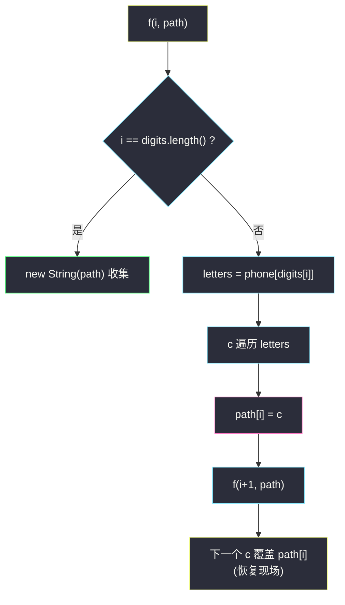
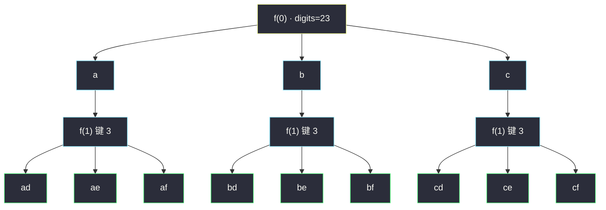

# 电话号码的字母组合（回溯：逐位定位的多叉决策树）

## 一、问题描述

给定一个仅包含数字 `2-9` 的字符串 `digits`，返回数字所能表示的**所有字母组合**。答案可以按**任意顺序**返回。

电话按键的字母映射（与手机九宫格键盘一致）：

```
2 → abc    3 → def
4 → ghi    5 → jkl    6 → mno
7 → pqrs   8 → tuv    9 → wxyz
```

> 🔗 LeetCode 17：https://leetcode.cn/problems/letter-combinations-of-a-phone-number/

**示例 1**

```
输入：digits = "23"
输出：["ad","ae","af","bd","be","bf","cd","ce","cf"]
```

**示例 2（空输入）**

```
输入：digits = ""
输出：[]
```

**直观理解**

这是**最纯粹的多叉决策树**：`digits` 的每一位是一层，第 `i` 层的候选恰好是按键 `digits[i]` 上的 3~4 个字母——**每一层的候选集由这一位的数字直接决定，跟之前选了什么完全无关**。

所以本题是所有回溯题里「树形」最干净的：没有去重、没有剪枝（候选之间互不冲突，条条路径都合法），唯一的任务就是**把每条从根到叶的路径老实收集**。它最适合用来体会「层（第几位）」与「候选（该位的字母表）」这两个概念。

---

## 二、暴力解法（入门）

### 直观思路

不做递归也行——像滚雪球一样**逐位扩展**：维护一个「当前所有前缀」列表，每处理一位数字，就把列表里每个前缀 × 该位每个字母，两两拼接出全部新前缀，替换旧列表。

```java
public List<String> letterCombinationsBrute(String digits) {
    if (digits.isEmpty()) return new ArrayList<>();
    String[] phone = {"", "", "abc", "def", "ghi", "jkl",
                      "mno", "pqrs", "tuv", "wxyz"};
    List<String> all = new ArrayList<>();
    all.add("");                                  // 空前缀起步
    for (char d : digits.toCharArray()) {         // 每来一位
        List<String> next = new ArrayList<>();
        for (String pre : all) {                  // 旧前缀 × 新字母
            for (char c : phone[d - '0'].toCharArray()) {
                next.add(pre + c);
            }
        }
        all = next;                               // 换代
    }
    return all;
}
```

### 复杂度

- **时间**：`O(4^n · n)`——第 i 位时列表长约 `3^i`，串拷贝每次 O(i)，总量即答案总量 × 串长
- **空间**：`O(4^n · n)`——必须**同时持有整代前缀**（外加换代时的新旧两代）

### 🔴 瓶颈在哪里

1. **必须整代共存**：滚动列表把所有「半成品前缀」同时攥在手里，字符串不可变，拼接又拷贝——空间和时间常数都大；
2. **没有任何提前终止的可能**：本题树是「全满树」，其实无枝可剪，但迭代法仍然丢了回溯最值钱的**单条路径复用**——一条 path 数组走遍全树，答案收集时才拷贝。

---

## 三、优化探索（核心章节）

### 3.1 观察特征

| 特征 | 说明 |
|------|------|
| 层与候选一一对应 | 第 `i` 层候选 = `phone[digits[i]]`，与其他任何状态无关 |
| 无冲突、无重复 | 不同位置选什么互不相干，每条路径必是一个新组合 |
| 收集时机唯一 | path 攒满 `digits.length()` 位 |

### 3.2 回溯视角：一条 path 走全树

递归 `f(i, path, ans)`：前 `i` 位已定好，本层枚举按键 `digits[i]` 的每个字母 `c`：

1. `path[i] = c`——字母上位；
2. 递归 `f(i + 1, ...)`——去定下一位；
3. 同层下一个字母会覆盖 `path[i]`（char[] 版无需显式恢复；StringBuilder 版删尾恢复现场）。

与组合题对照：**这里的「start」变成了「i」**——不是「不许回头」的约束，而是「第几位」的指针；候选集不再是一段数组，而是 `phone[digits[i]]` 这张小字母表。



### 3.3 关键推导问题

| 问题 | 答案 |
|------|------|
| 需要去重或剪枝吗？ | 不需要：各位候选互不相交、路径两两不同、全部合法——是「满树全收」 |
| 为什么空间能省到 O(n)？ | 回溯只维护**一条** path，走到叶子拷贝一次即扔；迭代版却要整代前缀共存 |
| digits 含 0/1 怎么办？ | 题目约定只有 2-9；工程上可在映射表里给 0/1 空串并约定行为 |
| 空输入为什么返回空列表而不是 `[""]`？ | 题面规定：`digits` 为空时没有组合，返回 `[]`（注意不是含空串的列表） |

### 3.4 一句话核心

> **把「第几位」当递归参数，把「该位的字母表」当循环候选——path 一条走全树，装满收拷贝。**

---

## 四、代码实现详解

### Java（主解：回溯 + 定长 path，对齐 class038 决策树骨架）

> 课源码说明：本题无直接课源码；主解按左程云 `class038` 回溯骨架（f + 索引参数 + path + 覆盖即恢复）对齐，与站内 [#22 括号生成](./generate-parentheses.md)、[#77 组合](./combinations.md) 同构。

```java
// 电话号码的字母组合：逐位定位的多叉决策树
// 测试链接 : https://leetcode.cn/problems/letter-combinations-of-a-phone-number/
class Solution {

    public static final String[] phone = {
        "", "", "abc", "def", "ghi", "jkl", "mno", "pqrs", "tuv", "wxyz"
    };

    public static List<String> letterCombinations(String digits) {
        List<String> ans = new ArrayList<>();
        if (digits.isEmpty()) {
            return ans;                       // 空输入返回空列表
        }
        char[] path = new char[digits.length()];
        f(digits.toCharArray(), 0, path, ans);
        return ans;
    }

    // 前 i 位已定好，本层决定第 i 位
    public static void f(char[] digits, int i, char[] path, List<String> ans) {
        if (i == digits.length) {
            ans.add(new String(path));        // 收集时拷贝成 String
            return;
        }
        for (char c : phone[digits[i] - '0'].toCharArray()) {
            path[i] = c;                      // 做选择
            f(digits, i + 1, path, ans);      // 去定下一位
            // 恢复现场：同层下一个 c 会覆盖 path[i]
        }
    }
}
```

### Python

```python
# 电话号码的字母组合：逐位定位的多叉决策树
# 测试链接 : https://leetcode.cn/problems/letter-combinations-of-a-phone-number/
class Solution:
    PHONE = ["", "", "abc", "def", "ghi", "jkl", "mno", "pqrs", "tuv", "wxyz"]

    def letterCombinations(self, digits: str) -> list[str]:
        if not digits:
            return []
        ans: list[str] = []
        path: list[str] = []
        self.f(digits, 0, path, ans)
        return ans

    def f(self, digits: str, i: int, path: list[str], ans: list[str]) -> None:
        if i == len(digits):
            ans.append("".join(path))         # 拷贝收集
            return
        for c in self.PHONE[ord(digits[i]) - ord('0')]:
            path.append(c)                    # 做选择
            self.f(digits, i + 1, path, ans)
            path.pop()                        # 恢复现场
```

---

## 五、例子演示

以 `digits = "23"` 为例（`2 → abc`、`3 → def`），端到端跟踪。path 长 2。

**根层 f(0)：枚举 2 号键的 a、b、c**

**子树一：path[0] = a → f(1)**

| 步骤 | 动作 | path | 说明 |
|------|------|------|------|
| 1 | c='a' | `[a, _]` | 进入 f(1) |
| 2 | c='d' | `[a, d]` | 进入 f(2) |
| 3 | i==2 | — | **收集 ① ad**，return |
| 4 | 回到 f(1)，c='e' 覆盖 | `[a, e]` | **收集 ② ae** |
| 5 | c='f' 覆盖 | `[a, f]` | **收集 ③ af**；f(1) 循环结束，退回 f(0) |

**子树二：path[0] = b → f(1)**（path[0] 被 b 覆盖——恢复现场的「覆盖」语义）

| 步骤 | 动作 | path | 结果 |
|------|------|------|------|
| 6 | c='d' | `[b, d]` | **收集 ④ bd** |
| 7 | c='e' | `[b, e]` | **收集 ⑤ be** |
| 8 | c='f' | `[b, f]` | **收集 ⑥ bf** |

**子树三：path[0] = c → f(1)**

| 步骤 | 动作 | path | 结果 |
|------|------|------|------|
| 9 | c='d' | `[c, d]` | **收集 ⑦ cd** |
| 10 | c='e' | `[c, e]` | **收集 ⑧ ce** |
| 11 | c='f' | `[c, f]` | **收集 ⑨ cf** |

最终 9 组：`["ad","ae","af","bd","be","bf","cd","ce","cf"]`，与示例 1 一致。全程 path 只有**一条**，靠覆盖复用——对比暴力章滚动列表里 9 个半成品字符串同时存在，回溯版任意时刻只攥着一条活路径。



---

## 六、复杂度分析

| 项目 | 复杂度 | 说明 |
|------|--------|------|
| 时间 | `O(4^n · n)` | 答案数上界 `4^n`（每位最多 4 个字母，即全是 7/9 时）；每组 O(n) 拼 String |
| 空间 | `O(n)` | 递归栈深 n + 一条 path（不计输出）；**对比迭代版 `O(4^n · n)` 的整代前缀** |

---

## 七、对比总结

### 易错点

1. **空输入返回 `[""]`** → 题面要求返回 `[]`；`digits` 为空要单独拦截。
2. **收集时存 path 引用** → char[]/List 后续被覆盖，答案全错；必须 `new String(path)` / `"".join()`。
3. **映射表下标错位** → phone[0]、phone[1] 必须占位空串，`'2'-'0'=2` 才能对上 `abc`。
4. **把 7/9 按 3 个字母处理** → `pqrs`、`wxyz` 是 4 个字母，硬编码长度会漏。

### 回溯 vs 迭代滚动列表

| | 回溯（主解） | 迭代滚动列表（暴力） |
|--|---------------|----------------------|
| 空间 | `O(n)` 一条 path | `O(4^n · n)` 整代共存 |
| 拷贝次数 | 每个答案一次（收集时） | 每代换代全量重拼 |
| 扩展性 | 加约束（剪枝/去重）随手就加 | 加约束要改双层循环结构 |
| 适用 | **所有回溯题通用骨架** | 只适合无约束满枚举 |

### 模板口诀

> **位当参数表当候选，做选递归再覆盖；装满收串莫存引用，空串返回空列表。**

---

## 八、举一反三

| 题目 | 链接 | 迁移点 |
|------|------|--------|
| 77. 组合 | https://leetcode.cn/problems/combinations/ | for-starti 骨架：候选是「start 往后的数字」（站内已有题解） |
| 22. 括号生成 | https://leetcode.cn/problems/generate-parentheses/ | 候选是「两个括号动作」+ 合法性剪枝（站内已有题解） |
| 93. 复原 IP 地址 | https://leetcode.cn/problems/restore-ip-addresses/ | 「段」当层的多叉树 + 分段合法性剪枝（站内已有题解） |
| 79. 单词搜索 | https://leetcode.cn/problems/word-search/ | 多叉树 + 网格上下左右候选 + used 标记 |
| 816. 模糊坐标 | https://leetcode.cn/problems/ambiguous-coordinates/ | 「分段 + 每段再枚举小数点」的双层回溯，本题直接升级版 |

**迁移一句**：回溯题先问「**每层的候选集是什么**」——组合题是数组后缀、括号题是两个动作、电话题是按键字母表、IP 题是「下一段的长度」；把候选集想清楚，`for` 循环怎么写自然就清楚了。
