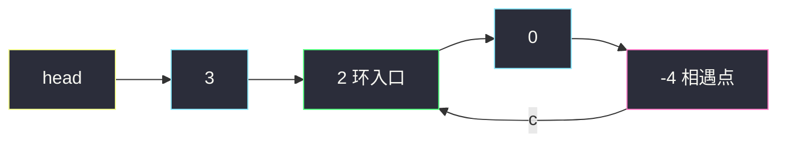
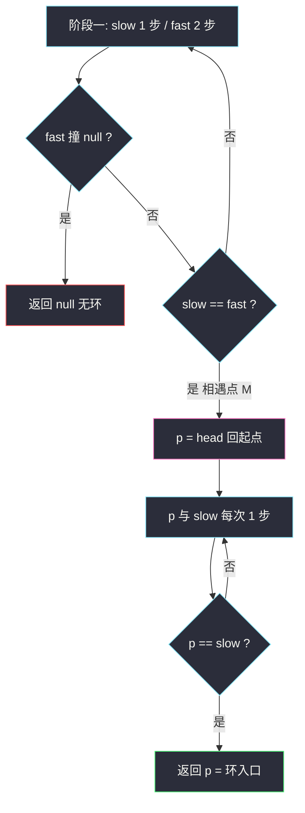

# 环形链表 II（快慢指针找环入口）

## 一、问题描述

给定一个链表的头节点 `head`，返回链表**开始入环的第一个节点**。如果链表无环，返回 `null`。

如果链表中有某个节点，可以通过连续跟踪 `next` 指针再次到达该节点，则链表中存在环。参数 `pos` 仅用来标识环的连接位置，不作为参数传递，你需要**在不修改链表**的前提下判断并返回入口。

> 🔗 LeetCode 142：https://leetcode.cn/problems/linked-list-cycle-ii/

**示例 1**

```
输入：head = [3,2,0,-4], pos = 1
输出：返回索引为 1 的链表节点（值为 2）
解释：链表中有一个环，其尾部连接到第二个节点。
```

**示例 2**

```
输入：head = [1], pos = -1
输出：null
解释：链表中没有环。
```

**直观理解**

操场跑圈：两个人同点出发，一个每秒 1 步、一个每秒 2 步——只要在跑圈（有环），快的**一定会追上**慢的（相对速度恒为 1，不会跳过）。相遇即证明有环（141 题）。

本题更进一步：**相遇点如何反推进操场的大门（环入口）**？这需要一点数学。

---

## 二、暴力解法（哈希表记录足迹）

### 思路

沿 `next` 走，把每个**到过的节点地址**存进 `HashSet`。第一个「第二次踩到」的节点就是环入口；一路走到 `null` 则无环。

```java
class Solution {
    public ListNode detectCycle(ListNode head) {
        Set<ListNode> seen = new HashSet<>();
        ListNode cur = head;
        while (cur != null) {
            if (!seen.add(cur)) { // add 返回 false 说明已存在
                return cur;       // 第一个重复出现的节点 = 入口
            }
            cur = cur.next;
        }
        return null; // 走到 null，无环
    }
}
```

### 复杂度

- **时间**：`O(n)`
- **空间**：`O(n)`

### 🔴 瓶颈在哪里

1. 额外 `O(n)` 空间，链表很长时非常浪费。
2. 面试官会追问：「能不能 `O(1)` 空间？」——这就要请出快慢指针 + 数学。

---

## 三、优化探索（核心章节）

### 3.1 第一步：快慢指针判环

`slow` 每轮走 1 步，`fast` 每轮走 2 步，都从头出发：

- **无环**：`fast` 会率先撞上 `null`，返回无环；
- **有环**：`fast` 进环后就永远在圈里绕，而它与 `slow` 的距离每轮**缩短 1**（相对速度 1，环上逐格逼近，不存在「跳过」），迟早减到 0——相遇。

这就是 141 题的全部内容。本题的关键在第二步。

### 3.2 第二步：数学推导相遇点与入口的关系

给三段路程命名：

- `a`：头节点 → 环入口（直线段）
- `b`：环入口 → 相遇点（沿前进方向）
- `c`：相遇点 → 绕回环入口（环的剩余部分）

环长 `L = b + c`，结构如下：



（绿色 = 环入口，粉色 = 相遇点，黄 = 起点。）

**相遇时刻的步数关系**：

- `slow` 走了 `a + b` 步（进环后走 `b` 到相遇点；可以证明 `slow` 相遇前在环内走不满一圈：`fast` 相对速度 1，最多 `L` 步追上）；
- `fast` 比 `slow` 多走的路程**全部消耗在环里**，即多了整数圈：多走 `n·(b + c)`（n ≥ 1）；
- 又 `fast` 速度是 `slow` 的两倍，`fast` 总路程 = 2 × `slow` 总路程：

```
2(a + b) = (a + b) + n(b + c)
      a + b = n(b + c)
          a = n(b + c) - b
          a = c + (n - 1)(b + c)     …… ★
```

**★ 式的含义**：从头节点出发走 `a` 步到入口 = 从**相遇点**出发走 `c` 步 + 绕 `(n-1)` 整圈回到入口。

### 3.3 结论：相遇后转为同速竞走

于是算法的第二阶段只有三行：

1. 让一个指针 `p` 回到 `head`，`slow` 留在相遇点；
2. 两者**每次都走 1 步**（同速）；
3. 它们必然在**环入口**相遇。

- `p` 走 `a` 步到达入口；
- 同时 `slow` 也走了 `a` 步，由 ★ 式 `a = c + (n-1)·L`，`slow` 从相遇点走 `c` 步回到入口、再绕 `(n-1)` 圈仍在入口——同一时刻、同一位置 ✅。

这个推导最妙的地方：我们**不需要知道** `a、b、c、n` 的具体数值，等式天然保证同步到达。

### 3.4 关键推导问题

| 问题 | 答案 |
|------|------|
| 为什么快指针走 2 步、不走 3 步？ | 相对速度 1 才能保证不跳过；走 3 步相对速度 2，环长为偶数时可能永远错开 |
| `slow` 相遇前会绕环好几圈吗？ | 不会。`fast` 进环后每轮追近 1 格，最多 `L` 轮追上，`slow` 在环内走不满一圈 |
| 为什么判空是 `fast != null && fast.next != null`？ | `fast` 一次跳 2 步，可能落在倒数第二个或最后一个节点，两个都要判 |
| 相遇时把 `slow` 换成 `fast` 行不行？ | 行，相遇点处 `slow == fast`，用哪个都一样 |
| 无环时第二阶段会误触发吗？ | 不会：无环在第一阶段就 `return null` 了 |
| 入口会不会在推导里「错过」？ | 不会：同速前进、步数相等，★ 式保证恰好同时踏上入口 |

### 3.5 一句话核心

> **快慢相遇证有环；相遇之后，一个回起点、一个留原地，同速走必然在入口会师——因为「头到入口」恰好等于「相遇点绕回入口」。**

---

## 四、代码实现详解

> 课源码对齐：`class034/Code05_LinkedListCycleII.java`。课上版本让 `slow = head.next、fast = head.next.next` 先各走一步再比较（竞赛风格省一轮判断）；站点版采用 `slow = fast = head` + 「先移动再判断」的写法，逻辑更好讲，本质完全相同。

### Java（快慢指针 + 数学 · 主解）

```java
class Solution {
    public ListNode detectCycle(ListNode head) {
        // 阶段一：快慢指针找相遇点
        ListNode slow = head, fast = head;
        while (fast != null && fast.next != null) {
            slow = slow.next;       // 慢指针 1 步
            fast = fast.next.next;  // 快指针 2 步
            if (slow == fast) {
                // 阶段二：一个回起点，同速竞走找入口
                ListNode p = head;
                while (p != slow) {
                    p = p.next;
                    slow = slow.next;
                }
                return p; // 相遇在环入口
            }
        }
        return null; // fast 撞 null，无环
    }
}
```

### Java（哈希表 · 第二思路）

见「二、暴力解法」中的代码，面试保底方案。

### Python（两版同思路）

```python
class Solution:
    def detectCycle(self, head: ListNode | None) -> ListNode | None:
        slow = fast = head
        while fast and fast.next:
            slow = slow.next
            fast = fast.next.next
            if slow is fast:
                p = head
                while p is not slow:
                    p = p.next
                    slow = slow.next
                return p
        return None
```

```python
class Solution:
    def detectCycle(self, head: ListNode | None) -> ListNode | None:
        seen = set()
        cur = head
        while cur:
            if cur in seen:
                return cur
            seen.add(cur)
            cur = cur.next
        return None
```

---

## 五、具体例子演示

以示例 1 跟踪：`3 → 2 → 0 → -4 → (回到 2)`，即 `a = 1`（3→2），环 `2 → 0 → -4 → 2`（`L = 3`）。

### 阶段一：找相遇点

初始：`slow = fast = 3`。

| 轮次 | slow（走 1 步后） | fast（走 2 步后） | 相等？ |
|------|------------------|------------------|--------|
| 1 | 2 | 0 | 否 |
| 2 | 0 | 2 | 否 |
| 3 | **-4** | **-4** | ✅ 相遇！ |

```
第 3 轮相遇现场：

3 → 2 → 0 → -4
    ↑入口       ↑slow = fast（相遇点）

对应三段：a = 1（3→2），b = 2（2→0→-4），c = 1（-4→2）
验证 ★ 式：a = 1，c + (n-1)(b+c) = 1 + 0 = 1 ✅（n = 1）
```

（细看 `slow` 的轨迹：3→2→0→-4，共走 3 步 = `a + b = 1 + 2`，进环后没绕满一圈，与推导一致。）

### 阶段二：同速竞走找入口

`p = head = 3`，`slow` 留在相遇点 `-4`。

| 轮次 | p | slow | 相等？ |
|------|---|------|--------|
| — | 3 | -4 | 否，开始走 |
| 1 | **2** | **2** | ✅ 相遇，返回节点 2 |

`p` 走了 `a = 1` 步到入口；`slow` 从 -4 走了 1 步（`c = 1`）也到入口 2——**同一步数、同一节点**，正是 ★ 式的现场演绎。



**无环场景**（示例 3）：`head = [1]`。第一轮循环 `fast.next = null` 条件失败，直接 `return null`，两个阶段都不会误触发。

**极简边界**：`head = null` 时循环条件 `fast != null` 失败，返回 `null`；两节点环 `[1,2] (pos=0)`：轮 1 后 `slow = 2, fast = 1`，轮 2 后 `slow = 1, fast = 1` 相遇，随后 `p = head = 1 = slow` 立即返回节点 1 ✅。

---

## 六、复杂度分析

| 方法 | 时间 | 额外空间 | 说明 |
|------|------|----------|------|
| 哈希表 | `O(n)` | `O(n)` | 一遍扫，空间换简单 |
| **快慢指针** | **`O(n)`** | **`O(1)`** | 主解：两阶段都是线性 |

快慢指针法：阶段一 `slow` 最多走 `a + L` 步（进环后不满一圈被追上），阶段二最多走 `a` 步，总计 `O(n)`；全程只有两个指针，`O(1)` 空间。

---

## 七、方法对比与总结

### 易错点

1. **判空条件顺序写反** → 必须 `fast != null && fast.next != null`，反过来会先访问 `fast.next` 空指针异常。
2. **把「相遇判断」放在移动之前** → `slow = fast = head` 时两者天然相等，第一轮就误判相遇；必须**先移动再比较**（课源码用「先各走一步再进 while」规避，本质相同）。
3. **阶段二让 `p` 和 `slow` 速度不同** → 必须同速各 1 步，★ 式才成立。
4. **快指针走 3 步** → 相对速度 2，环长为偶数时可能永远擦肩，死循环。
5. **忘了无环的出口** → `fast` 撞 `null` 时立即 `return null`，别让快慢指针空转。
6. **用 `val` 比较判断相遇** → 环的判定基于**节点地址**，值相等毫无意义。

### 哈希表 vs 快慢指针

| | 哈希表 | 快慢指针 |
|--|-------|---------|
| 时间 | `O(n)` | `O(n)` |
| 空间 | `O(n)` | `O(1)` |
| 编码难度 | 低（直白） | 中（需记推导） |
| 面试默认 | 保底先写 | ✅ 必会追问版 |

### 推导速记

> 设 `a`（头→入口）、`b`（入口→相遇）、`c`（相遇→入口）：
> 相遇时 `2(a+b) = (a+b) + n(b+c)`，化简得 **`a = c + (n-1)·环长`**。
> 所以「从相遇点走 `c` 步 + 整圈」恰好等于「从头走 `a` 步」——同速竞走必在入口会师。

---

## 八、举一反三

| 题目 | 链接 | 迁移点 |
|------|------|--------|
| 141. 环形链表 | https://leetcode.cn/problems/linked-list-cycle/ | 本题阶段一：快慢判环，先做它再啃 142 |
| 287. 寻找重复数 | https://leetcode.cn/problems/find-the-duplicate-number/ | 把 `nums[i]` 当 next 指针，数组变链表，重复数 = 环入口，本题原封照搬 |
| 202. 快乐数 | https://leetcode.cn/problems/happy-number/ | 快慢指针判「计算链」是否成环，防死循环 |
| 876. 链表的中间结点 | https://leetcode.cn/problems/middle-of-the-linked-list/ | 快慢指针 2:1 配速的另一种用法（找中点） |
| 160. 相交链表 | https://leetcode.cn/problems/intersection-of-two-linked-lists/ | 双指针「等长化」思想同源；进阶可组合出「两有环链表求交点」 |

**迁移一句**：凡「循环节 / 重复出现 / 回到起点」类问题，先想**快慢指针 2:1 配速**；找到相遇点后要定位入口，就上 **`a = c + (n-1)·环长`** 这把钥匙。
