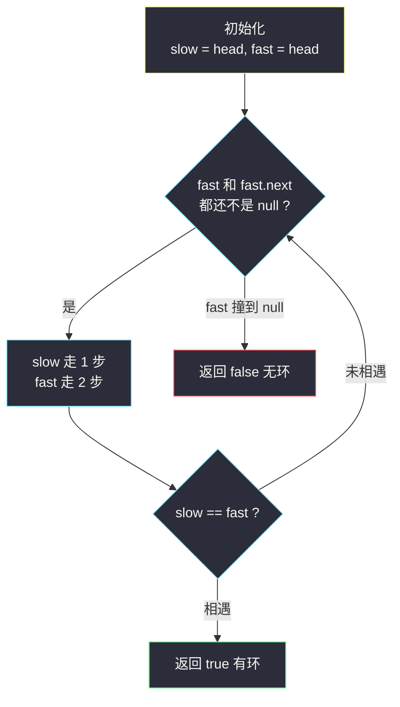
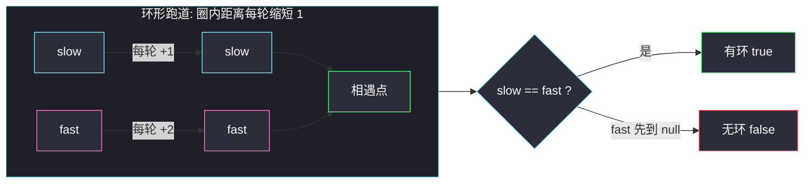

# 环形链表（快慢指针判环，Floyd 龟兔赛跑）

## 一、问题描述

给你一个链表的头节点 `head`，判断链表中**是否有环**。

如果链表中有某个节点，可以通过连续跟踪 `next` 指针再次到达该节点，则链表中存在环。参数 `pos` 表示链表尾接到链表中的位置（从索引 0 开始），**仅用于标识环的存在，不作为参数传入**。

节点的定义为：

```java
public class ListNode {
    int val;
    ListNode next;
}
```

> 🔗 LeetCode 141：https://leetcode.cn/problems/linked-list-cycle/

**示例 1**

```
输入：head = [3,2,0,-4], pos = 1
输出：true
解释：链表中有一个环，其尾部连接到第二个节点（索引 1）。
```

**示例 2**

```
输入：head = [1], pos = -1
输出：false
解释：链表中没有环。
```

**直观理解**

普通链表像一条直线，走到头（`null`）就结束了；带环的链表像一个「棒棒糖」——直线部分走到某个节点后拐进一个圈，**在圈里永远绕不出去**。

关键难点：链表节点没有下标、没有 `visited` 标记，光靠「往前走」根本发现不了自己正在兜圈子。怎么用极低的代价证明「这条路是圈」？

---

## 二、暴力解法（入门）

### 直观思路：哈希表记足迹

准备一个 `HashSet`，沿着 `next` 一路走，每到一个节点就问：「这个节点我来过吗？」

- 来过 → 说明绕回了自己，有环；
- 没来过 → 记入集合，继续走；
- 走到了 `null` → 无环。

```java
class Solution {
    public boolean hasCycle(ListNode head) {
        Set<ListNode> seen = new HashSet<>();
        ListNode cur = head;
        while (cur != null) {
            if (!seen.add(cur)) { // add 返回 false 说明已存在
                return true;
            }
            cur = cur.next;
        }
        return false;
    }
}
```

### 复杂度

- **时间**：`O(n)`，每个节点最多访问一次
- **空间**：`O(n)`，集合里存了所有节点

### 🔴 瓶颈在哪里

1. 要为**每个**节点保存一份引用，空间开销 `O(n)`。
2. 面试官追问「能不能不用任何额外空间？」时，这套做法直接出局。
3. 完全没有用到「环」的结构性质——它只是把「是否重复出现」这个老问题搬进了链表。

---

## 三、优化探索（核心章节）

### 3.1 观察特征

| 特征 | 说明 |
|------|------|
| 有环则永远走不到 `null` | 尾接圈，「链尾」这个概念消失了 |
| 环内每走一步，位置都在圈内轮转 | 快的人和慢的人**必然在圈内相遇** |
| 无环则必然走到 `null` | 直线有尽头 |

### 3.2 快慢指针（龟兔赛跑）

把链表想成跑道：

- `slow`（乌龟）每轮走 **1** 步；
- `fast`（兔子）每轮走 **2** 步。

**无环**：兔子先撞线（`fast` 或 `fast.next` 变成 `null`），直接返回 `false`。

**有环**：两个指针先后进圈。此时问题变成「在圆圈跑道上，快的能否追上慢的」——一定能：每轮兔子比乌龟**多走 1 步**，两者在圈内的距离每轮缩短 1，距离总会被磨到 0，也就是**相遇**。



### 3.3 关键推导问题

| 问题 | 答案 |
|------|------|
| 为什么快的走 2 步，不走 3 步、4 步？ | 走 2 步时每轮**恰好缩短距离 1**，保证不跳过；走 3 步可能每次缩短 2，当初始距离是奇数时会「错过」一轮再追上，虽然最终仍能相遇（距离模 3 轮转），但推理和教学都麻烦，2 是最干净的选择 |
| 会不会永远追不上？ | 不会。进圈后距离是有限整数，每轮严格减 1，最多环长轮必然归零 |
| 循环条件为什么是 `fast != null && fast.next != null`？ | fast 走得快，只会先于 slow 到头；它一次跨 2 步，所以要同时防「自己撞 null」和「下一步是 null」 |
| 空链表 / 单节点？ | 循环条件直接为假，返回 `false`，无需特判 |
| 相遇点有什么用？ | 142 题用它反推入环点：让一个指针回到 `head`，两指针同速前进，再次相遇处就是入环点 |

### 3.4 一句话核心

> **乌龟一步兔两步：兔子撞墙无环，兔子追上乌龟有环。**

---

## 四、代码实现详解

### Java（快慢指针 · 主解）

```java
class Solution {
    public boolean hasCycle(ListNode head) {
        ListNode slow = head;
        ListNode fast = head;
        while (fast != null && fast.next != null) {
            slow = slow.next;      // 乌龟 1 步
            fast = fast.next.next; // 兔子 2 步
            if (slow == fast) {    // 圈内追上
                return true;
            }
        }
        return false; // 兔子撞线，直线
    }
}
```

写法上讲究**先判后走**：循环条件负责「兔子是否还活着」，循环体内再检查相遇。这样空链表、单节点都天然安全。

> 📚 课源码对应：左程云 class034 `Code05_LinkedListCycleII.java`（142 环形链表 II）用的是同一套判环骨架（`slow` 与 `fast` 相遇返回有环），只是 142 还要多走一步反推入环点。本题即该骨架的「只判有无环」简化版。

### Java（哈希表 · 暴力参照）

```java
class Solution {
    public boolean hasCycle(ListNode head) {
        Set<ListNode> seen = new HashSet<>();
        for (ListNode cur = head; cur != null; cur = cur.next) {
            if (!seen.add(cur)) {
                return true;
            }
        }
        return false;
    }
}
```

### Python（两版同思路）

```python
class Solution:
    def hasCycle(self, head: ListNode | None) -> bool:
        slow = fast = head
        while fast is not None and fast.next is not None:
            slow = slow.next       # 乌龟 1 步
            fast = fast.next.next  # 兔子 2 步
            if slow is fast:       # 圈内追上
                return True
        return False
```

```python
class Solution:
    def hasCycle(self, head: ListNode | None) -> bool:
        seen = set()
        cur = head
        while cur is not None:
            if cur in seen:
                return True
            seen.add(cur)
            cur = cur.next
        return False
```

---

## 五、例子演示

以 `head = 3 → 2 → 0 → -4`，`-4` 接回 `2`（`pos = 1`）为例，端到端跟踪快慢指针。

### 初始

```
slow = 3, fast = 3   （同点出发，尚未移动）

3 → 2 → 0 → -4
↑               |
└───────┬───────┘
      (指回 2)
```

### 第 1 轮

```
slow = 3.next = 2
fast = 3.next.next = 0
slow == fast ? 2 == 0 否

slow        fast
 ↓           ↓
 3 → 2 → 0 → -4 ─┐
     ↑            │
     └────────────┘
```

### 第 2 轮

```
slow = 2.next = 0
fast = 0.next.next = 2     （0 → -4 → 2，兔子已经进圈绕回来了）
slow == fast ? 0 == 2 否

      slow  fast
       ↓     ↓
 3 → 2 → 0 → -4 ─┐
     ↑            │
     └────────────┘
```

此刻两指针都已在圈内，圈内的相对距离每轮缩小 1。

### 第 3 轮

```
slow = 0.next = -4
fast = 2.next.next = -4
slow == fast ? -4 == -4 是！返回 true

            slow fast
             ↓   ↓
 3 → 2 → 0 → -4 ─┐
     ↑            │
     └────────────┘
```

兔子在圈内整整多绕了一圈，正好和乌龟会合于 `-4`。

### 对照：无环情形

`head = 1 → 2 → 3 → null`：

```
第1轮: slow=2, fast=3, 不相等
第2轮: fast.next = null → 循环条件失败, 退出, 返回 false
```



---

## 六、复杂度分析

| 方法 | 时间 | 额外空间 | 说明 |
|------|------|----------|------|
| 哈希表 | `O(n)` | `O(n)` | 好想，但空间不达标 |
| **快慢指针** | **`O(n)`** | **`O(1)`** | 主解，两指针常数开销 |

快慢指针为何是 `O(n)`：无环时 fast 走约 2n 步到头；有环时 slow 进环后最多再走「环长」步就被追上，两指针都走不出 `O(n)` 量级。

---

## 七、对比总结

### 易错点

1. **循环条件写反**：把相遇判断写在移动之前 → 出发时 `slow == fast` 恒成立，空链表之外全部误报 `true`。必须**先移动、后判断**。
2. **条件漏掉 `fast.next != null`** → 单节点链表执行 `fast.next.next` 空指针异常。
3. **比较 `val` 而不是节点**：环上可能有两个节点值相同，比节点引用才可靠。
4. **用 `fast != null` 判无环的时机搞错**：只有 fast 这只「快脚」可能先撞 `null`，slow 永远在后面，不用管它。
5. 哈希表版往集合里存的是**节点对象**而不是 `val`（值会重复）。

### 哈希表 vs 快慢指针

| | 哈希表 | 快慢指针 |
|--|------|------|
| 空间 | `O(n)` | `O(1)` |
| 思路 | 记足迹查重复 | 追及问题 |
| 可扩展性 | 只能判环 | 相遇点可反推入环点（142） |
| 面试地位 | 入门垫脚石 | 必背标准解 |

### 模板口诀

> **龟兔同点出发走，龟一兔二不许停；兔若撞墙是直线，龟兔相逢必有环。**

---

## 八、举一反三

| 题目 | 链接 | 迁移点 |
|------|------|--------|
| 142. 环形链表 II | https://leetcode.cn/problems/linked-list-cycle-ii/ | 相遇后一指针回 `head` 同速走，再次相遇即入环点 |
| 202. 快乐数 | https://leetcode.cn/problems/happy-number/ | 数列隐式成环，快慢指针判是否进入死循环 |
| 287. 寻找重复数 | https://leetcode.cn/problems/find-the-duplicate-number/ | 把数组看成函数指针图，Floyd 判环 + 找入环点 |
| 876. 链表的中间结点 | https://leetcode.cn/problems/middle-of-the-linked-list/ | 同款快慢指针，只是用途从判环换找中点 |
| 141 → 进阶追问 | 面试常问 | 「证明为何 2 步一定追上」就是本题最值钱的推理 |

**迁移一句**：只要问题能翻译成「一条要么有尽头、要么绕圈的路径」，快慢指针就是 `O(1)` 空间的判环瑞士军刀。
