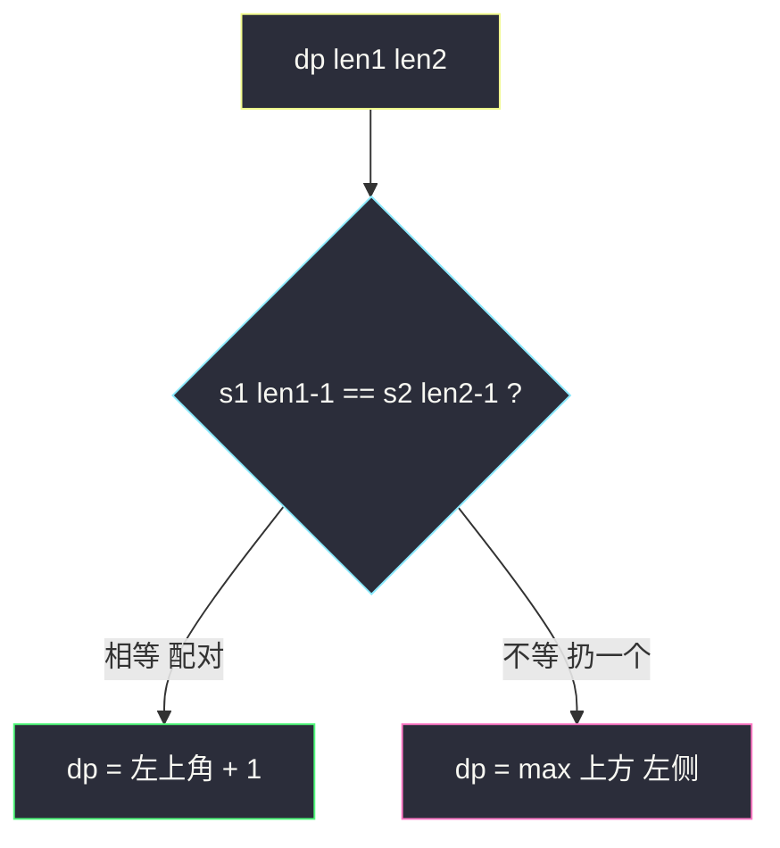
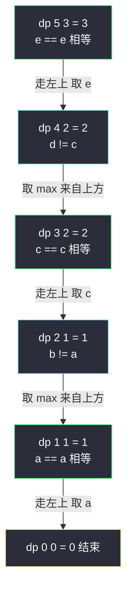

# 最长公共子序列 LCS（双串二维 DP 地基）

## 一、问题描述

给定两个字符串 `text1` 和 `text2`，返回它们**最长公共子序列**的长度；不存在返回 0。

「子序列」可跳着选但不改变相对顺序；「公共」即同属两个串。

> 🔗 LeetCode 1143：https://leetcode.cn/problems/longest-common-subsequence/

**示例 1**

```
输入：text1 = "abcde", text2 = "ace"
输出：3
解释：最长公共子序列是 "ace"
```

**示例 2**

```
输入：text1 = "abc", text2 = "abc"
输出：3
解释：整个字符串即公共子序列
```

**直观理解**

单串题（LIS）只有一个可变参数；这里**两个串**就有两个可变参数 `i1`、`i2`——按课上「几个可变参数就是几维表」的方法论，天然是**二维 DP**。比较两个串的**末尾字符**：相等则配对消耗掉；不等则至少有一个末尾用不上，扔掉哪个试试更大就取哪个。LCS 是编辑距离、diff 工具的数学模型。

---

## 二、暴力解法

### 直观思路

递归定义 `f(i1, i2)`：`s1[0..i1]` 与 `s1[0..i2]` 的 LCS 长度。按末尾字符分类（对齐 class067 Code03 的 f1，展开为四种可能取 max）：

```java
// 暴力递归（对齐 class067 Code03 的 f1）
public static int longestCommonSubsequence1(String str1, String str2) {
    char[] s1 = str1.toCharArray();
    char[] s2 = str2.toCharArray();
    return f1(s1, s2, s1.length - 1, s2.length - 1);
}

// s1[0....i1] 与 s2[0....i2] 的最长公共子序列长度
public static int f1(char[] s1, char[] s2, int i1, int i2) {
    if (i1 < 0 || i2 < 0) {
        return 0;
    }
    int p1 = f1(s1, s2, i1 - 1, i2 - 1);
    int p2 = f1(s1, s2, i1 - 1, i2);
    int p3 = f1(s1, s2, i1, i2 - 1);
    int p4 = s1[i1] == s2[i2] ? p1 + 1 : 0;
    return Math.max(Math.max(p1, p2), Math.max(p3, p4));
}
```

### 复杂度

- **时间**：`O(2^(n+m))` 级别，指数级
- **空间**：`O(n + m)` 递归栈

### 🔴 瓶颈在哪里

递归树里 `(i1, i2)` 组合大量重复展开。而状态总数只有 `(n+1) * (m+1)` 个——**重叠子问题**肉眼可见，加缓存立刻降为多项式。

---

## 三、优化探索

### 3.1 用「长度」定义尝试（课上关键技巧）

> 课上特别强调：**很多时候不用下标而用长度来定义尝试**——长度最小是 0，天然不越界，省去 `-1` 边界讨论。

`f(len1, len2)`：`s1` 的**前 len1 个字符**与 `s2` 的**前 len2 个字符**的 LCS 长度。

### 3.2 转移方程推导

看两个前缀的**最后一个字符** `s1[len1-1]` 与 `s2[len2-1]`：

- **相等**：这一对必然可以配对（贪心可证：存在最优解把它们配在一起），`f = f(len1-1, len2-1) + 1`
- **不等**：它们不可能同时进入公共子序列，扔掉一个：`f = max(f(len1-1, len2), f(len1, len2-1))`

```
f(0, _) = f(_, 0) = 0
f(len1, len2) =
    s1[len1-1] == s2[len2-1]
        ? f(len1-1, len2-1) + 1
        : max(f(len1-1, len2), f(len1, len2-1))
答案 = f(n, m)
```

### 3.3 关键问题

| 问题 | 答案 |
|------|------|
| 为什么用长度不用下标？ | 下标版要处理 `-1`；长度版边界就是 0，dp 表从 `(0,*)` 行 `(*,0)` 列全 0 开始，干净 |
| 末尾相等时为何敢直接配对？ | 交换论证：任一最优解若没配这对末尾，可调整成配这对而不变短（class067 课上证明） |
| 不等时要不要也考虑 `f(len1-1, len2-1)`？ | 不必——它是后两者的子情况，取 max 时已被覆盖（f1 展开四种写法等价，f2 收敛成两种） |
| 依赖方向？ | `dp[len1][len2]` 依赖左上、上、左三格 → 从上到下、从左到右填 |
| LCS 和 LIS 的关系？ | 都属子序列家族；LCS 双串二维，LIS 单串一维；特殊地，当两串各自无重复字符时 LCS 可归约为 LIS |

### 3.4 一句话核心

> **末尾相等配对 +1 回左上；不等扔一个，取上和左的最大。**



---

## 四、代码实现

### Java（主解：严格位置依赖 DP，对齐 class067 Code03 的 longestCommonSubsequence4）

```java
// 最长公共子序列
// 返回两个字符串最长公共子序列的长度
// 测试链接 : https://leetcode.cn/problems/longest-common-subsequence/
// 对齐 class067 Code03_LongestCommonSubsequence
public class Solution {

    // 时间复杂度 O(n*m)，空间复杂度 O(n*m)
    public static int longestCommonSubsequence(String str1, String str2) {
        char[] s1 = str1.toCharArray();
        char[] s2 = str2.toCharArray();
        int n = s1.length;
        int m = s2.length;
        // dp[len1][len2] :
        // s1 前缀长度 len1 与 s2 前缀长度 len2 的最长公共子序列长度
        // 第 0 行 / 第 0 列天然为 0（空前缀）
        int[][] dp = new int[n + 1][m + 1];
        // 依赖方向 : 只依赖左上/上/左，从上到下、从左到右填
        for (int len1 = 1; len1 <= n; len1++) {
            for (int len2 = 1; len2 <= m; len2++) {
                if (s1[len1 - 1] == s2[len2 - 1]) {
                    // 末尾配对，回到双双去掉末尾
                    dp[len1][len2] = 1 + dp[len1 - 1][len2 - 1];
                } else {
                    // 扔掉 s1 末尾 或 扔掉 s2 末尾
                    dp[len1][len2] = Math.max(dp[len1 - 1][len2], dp[len1][len2 - 1]);
                }
            }
        }
        return dp[n][m];
    }
}
```

### Java（进阶：空间压缩到一维，对齐 class067 Code03 的 longestCommonSubsequence5）

```java
// 每一行只依赖上一行 + 左上角 → 用一个一维数组滚动
// 关键 : leftUp 变量保存被覆盖前的左上角值
// 时间复杂度 O(n*m)，空间复杂度 O(min(n,m))
public class Solution {

    public static int longestCommonSubsequence(String str1, String str2) {
        char[] s1, s2;
        // 让内层更短，空间更省
        if (str1.length() >= str2.length()) {
            s1 = str1.toCharArray();
            s2 = str2.toCharArray();
        } else {
            s1 = str2.toCharArray();
            s2 = str1.toCharArray();
        }
        int n = s1.length;
        int m = s2.length;
        int[] dp = new int[m + 1]; // dp[len2] : 当前行的前缀长度 len2
        for (int len1 = 1; len1 <= n; len1++) {
            int leftUp = 0, backup; // leftUp : 上一行的 dp[len2-1]（即左上角）
            for (int len2 = 1; len2 <= m; len2++) {
                backup = dp[len2]; // 先备份，稍后它要变成下一轮的 leftUp
                if (s1[len1 - 1] == s2[len2 - 1]) {
                    dp[len2] = 1 + leftUp;
                } else {
                    dp[len2] = Math.max(dp[len2], dp[len2 - 1]);
                }
                leftUp = backup;
            }
        }
        return dp[m];
    }
}
```

### Python

```python
# 主解：二维 dp 表
class Solution:
    def longestCommonSubsequence(self, text1: str, text2: str) -> int:
        s1, s2 = text1, text2
        n, m = len(s1), len(s2)
        # dp[len1][len2] : 前缀长度 len1 与前缀长度 len2 的 LCS 长度
        dp = [[0] * (m + 1) for _ in range(n + 1)]
        for len1 in range(1, n + 1):
            for len2 in range(1, m + 1):
                if s1[len1 - 1] == s2[len2 - 1]:
                    dp[len1][len2] = 1 + dp[len1 - 1][len2 - 1]
                else:
                    dp[len1][len2] = max(dp[len1 - 1][len2],
                                         dp[len1][len2 - 1])
        return dp[n][m]
```

---

## 五、具体例子演示

以 `text1 = "abcde"`、`text2 = "ace"` 为例，dp 表尺寸 `6 × 4`（下标 = 前缀长度）。

### dp 表逐格填充（行优先）

| 填写顺序 | 格 | 末尾字符 | 判断 | 来源 | 值 |
|----------|-----|---------|------|------|-----|
| 行 1 | dp[1][1] | a vs a | 相等 | 左上 dp[0][0]+1 | **1** |
| 行 1 | dp[1][2] | a vs c | 不等 | max(上 0, 左 1) | 1 |
| 行 1 | dp[1][3] | a vs e | 不等 | max(0, 左 1) | 1 |
| 行 2 | dp[2][1] | b vs a | 不等 | max(上 1, 左 0) | 1 |
| 行 2 | dp[2][2] | b vs c | 不等 | max(上 1, 左 1) | 1 |
| 行 2 | dp[2][3] | b vs e | 不等 | max(1, 左 1) | 1 |
| 行 3 | dp[3][1] | c vs a | 不等 | max(上 1, 左 0) | 1 |
| 行 3 | dp[3][2] | c vs c | 相等 | 左上 dp[2][1]+1 | **2** |
| 行 3 | dp[3][3] | c vs e | 不等 | max(上 1, 左 2) | 2 |
| 行 4 | dp[4][1] | d vs a | 不等 | max(1, 0) | 1 |
| 行 4 | dp[4][2] | d vs c | 不等 | max(2, 1) | 2 |
| 行 4 | dp[4][3] | d vs e | 不等 | max(2, 左 2) | 2 |
| 行 5 | dp[5][1] | e vs a | 不等 | max(1, 0) | 1 |
| 行 5 | dp[5][2] | e vs c | 不等 | max(2, 1) | 2 |
| 行 5 | dp[5][3] | e vs e | 相等 | 左上 dp[4][2]+1 | **3** |

最终 `dp[5][3] = 3`，对应 LCS `"ace"`。完整表：

```
        ""  a   c   e
    ""   0  0   0   0
    a    0  1   1   1
    b    0  1   1   1
    c    0  1   2   2
    d    0  1   2   2
    e    0  1   2   3
```

### 回溯还原 LCS（从 dp[5][3] 走回起点）



绿框 = 相等配对（逆序收集得到 "ace"）；青框 = 不相等，沿 max 来源方向走。

---

## 六、复杂度分析

| 版本 | 时间 | 空间 | 说明 |
|------|------|------|------|
| 暴力递归 | `O(2^(n+m))` | `O(n+m)` | 指数展开，n=m=20 就跑不动 |
| 记忆化搜索 | `O(n*m)` | `O(n*m)` | 每个状态只算一次 |
| 二维 dp 表（主解） | `O(n*m)` | `O(n*m)` | 逐格转移，还能回溯还原 LCS 串 |
| 空间压缩 | `O(n*m)` | `O(min(n,m))` | 一维滚动 + leftUp 备份左上角 |

---

## 七、方法对比与总结

### 双串 DP 模板地位

LCS 的 `(len1, len2)` 双前缀定义 + 「末尾相等/不等」分类，是**所有双串题**的模板：

| 题 | 转移对比 LCS |
|----|-------------|
| 583 两串删除操作 | `n + m - 2*LCS`，直接复用本题 |
| 718 最长重复子**数组** | 相等 +1 回左上；**不等清零**（连续约束） |
| 72 编辑距离 | 相等回左上；不等时左上/上/左三种操作取 min+1 |

### 易错点

1. **下标偏移**：`dp[len1][len2]` 对应字符 `s1[len1-1]`，比较时别写成 `s1[len1]`。
2. **不等时漏掉某一侧**：必须同时考虑「扔 s1 末尾」和「扔 s2 末尾」。
3. **空间压缩时左上角被覆盖**：必须先 `backup = dp[len2]` 再更新，否则上一行信息丢失（课上 leftUp/backup 技巧）。
4. **回溯方向**：还原 LCS 要从 `dp[n][m]` **逆着依赖方向**走。

### 模板口诀

> **尾等回左上加一，尾异上左取大；表从零行列起，双串前缀定天下。**

---

## 八、举一反三

| 题目 | 链接 | 迁移点 |
|------|------|--------|
| 583. 两个字符串的删除操作 | https://leetcode.cn/problems/delete-operation-for-two-strings/ | 答案 = n+m−2×LCS |
| 718. 最长重复子数组 | https://leetcode.cn/problems/maximum-length-of-repeated-subarray/ | LCS 加「连续」约束：不等清零，只回左上 |
| 516. 最长回文子序列 | https://leetcode.cn/problems/longest-palindromic-subsequence/ | 串与自身反串做 LCS（class067 Code04 也给了区间 DP 版） |
| 1035. 不相交的线 | https://leetcode.cn/problems/uncrossed-lines/ | 换皮 LCS，转移一字不差 |
| 72. 编辑距离 | https://leetcode.cn/problems/edit-distance/ | 同一双前缀模板，max 换 min |

**迁移一句**：见到两个串同时出现、问「公共/匹配/删除次数」，直接套 `(len1, len2)` 双前缀二维表，从末尾字符分类开始推。
