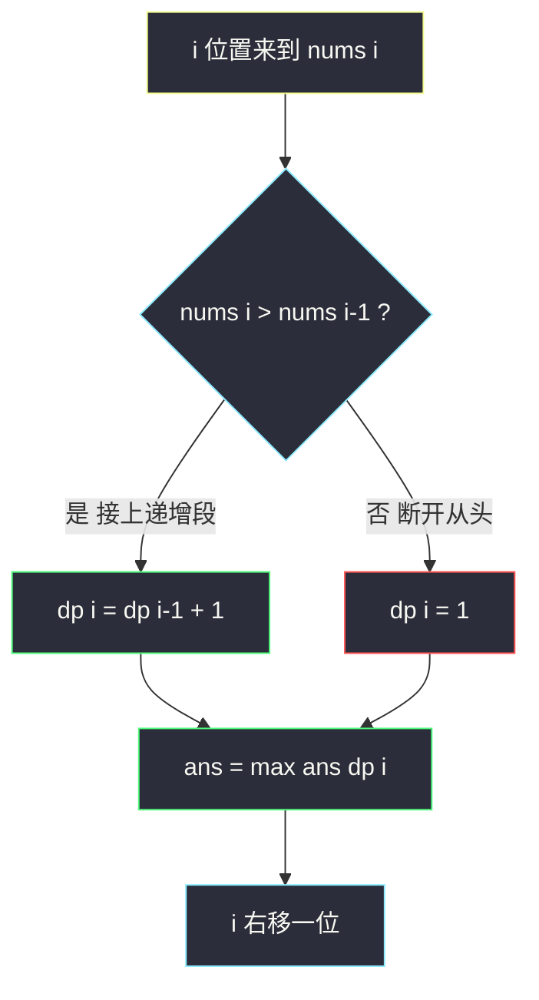
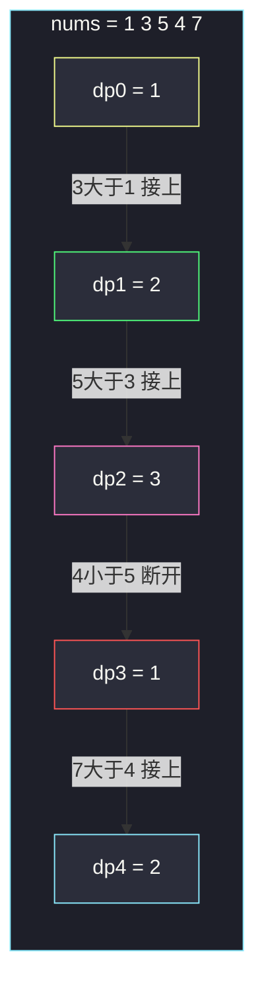

# 最长连续递增序列（线性 DP：只看前一个）

## 一、问题描述

给定一个**未经排序**的整数数组 `nums`，找到其中**最长的连续递增子序列**的长度。

「连续递增子序列」由**下标连续**的位置组成：`nums[l], nums[l+1], ..., nums[r]`，且每一步都严格大于前一个。

> 🔗 LeetCode 674：https://leetcode.cn/problems/longest-continuous-increasing-subsequence/

**示例 1**

```
输入：nums = [1,3,5,4,7]
输出：3
解释：最长连续递增序列是 [1,3,5]，长度为 3
（[1,3,5,4,7] 里 4 < 5 断开，[4,7] 只有 2）
```

**示例 2**

```
输入：nums = [2,2,2,2,2]
输出：1
解释：严格递增要求每步更大，任何相邻两数都不满足，最长为 1
```

**直观理解**

扫一遍数组，只要 `nums[i] > nums[i-1]`，当前递增段长度就加一；一旦断开，长度从头（1）再来。这是最朴素的一维线性 DP：**每个状态只依赖前一个状态**——可以看作爬楼梯（#70）家族的近亲：转移不再固定「+前两项」，而是带条件的「+前一项」。

---

## 二、暴力解法

### 直观思路

枚举每个起点 `l`，从它出发向右走，统计严格递增能延伸多远；所有起点的最大值即答案。

```java
// 暴力：枚举每个起点，向右延伸
public static int findLengthOfLCIS1(int[] nums) {
    int n = nums.length;
    int ans = 0;
    for (int l = 0; l < n; l++) {
        int r = l;
        // 只要还在严格递增就一直往右走
        while (r + 1 < n && nums[r + 1] > nums[r]) {
            r++;
        }
        ans = Math.max(ans, r - l + 1);
    }
    return ans;
}
```

### 复杂度

- **时间**：最坏 `O(n²)`——整个数组单调递增时，每个起点都要走到结尾
- **空间**：`O(1)`

### 🔴 瓶颈在哪里

起点 `l` 和起点 `l+1` 的延伸过程**大量重叠**：`nums = [1,2,3,...,10000]` 时，从 1 出发走到头，从 2 出发又走到头……同一个「断点」被反复重新发现。**子问题被重复求解**，这正是 DP 的第一个突破口。

---

## 三、优化探索

### 3.1 可变参数分析（课上方法：几个可变参数就是几维表）

要描述「以 `i` 结尾的最长连续递增段」这个子问题，**只有一个可变参数 `i`** → 一维表 `dp[i]`。

| dp 定义 | 含义 |
|---------|------|
| `dp[i]` | **以 nums[i] 结尾**的最长连续递增子序列的长度 |

### 3.2 转移方程推导

`dp[i]` 只看 `i-1` 位置：

- 若 `nums[i] > nums[i-1]`：递增不断，`dp[i] = dp[i-1] + 1`
- 否则：`nums[i]` 自成一段，`dp[i] = 1`

```
dp[0] = 1
dp[i] = nums[i] > nums[i-1] ? dp[i-1] + 1 : 1
答案 = max(dp[0..n-1])
```

### 3.3 关键问题

| 问题 | 答案 |
|------|------|
| 为什么只看前一个？ | 「连续」要求下标相邻，以 i 结尾的段必然是「以 i-1 结尾的段 + nums[i]」（若递增）或「nums[i] 自己」 |
| 和 #300 LIS 的区别？ | #674 是**连续**（下标相邻），只依赖 `dp[i-1]`；#300 是**子序列**（可跳着选），要扫所有 `j < i` 找 `nums[j] < nums[i]`，`O(n²)` 起步 |
| 严格递增还是非降？ | 本题严格递增（`>`）；改成 `>=` 就是「最长连续非降段」，转移结构不变 |
| 依赖方向？ | `dp[i]` 依赖 `dp[i-1]`，从左往右一遍填完 |

### 3.4 一句话核心

> **连续性让 dp[i] 只依赖 dp[i-1]：大于则加一，断开则归一，最大值就是答案。**



---

## 四、代码实现

### Java（主解：一维 dp 表）

```java
// 最长连续递增序列
// 给定一个未经排序的整数数组，找到最长且连续递增的子序列的长度
// 测试链接 : https://leetcode.cn/problems/longest-continuous-increasing-subsequence/
// 说明 : 课上 class072 讲 LIS（最长递增子序列），本题是「连续版」，
//        按同一体系的线性 DP 骨架对齐：dp[i] 只依赖 dp[i-1]
public class Solution {

    // 时间复杂度 O(n)，空间复杂度 O(n)
    public static int findLengthOfLCIS(int[] nums) {
        int n = nums.length;
        // dp[i] : 以 nums[i] 结尾的最长连续递增子序列长度
        int[] dp = new int[n];
        dp[0] = 1;
        int ans = 1;
        for (int i = 1; i < n; i++) {
            // 递增不断：接上前一段；断开：自己成段
            dp[i] = nums[i] > nums[i - 1] ? dp[i - 1] + 1 : 1;
            ans = Math.max(ans, dp[i]);
        }
        return ans;
    }
}
```

### Java（滚动变量版：O(1) 空间）

```java
// dp[i] 只依赖 dp[i-1]，整张表可以压缩成一个变量
// 时间复杂度 O(n)，空间复杂度 O(1)
public class Solution {

    public static int findLengthOfLCIS(int[] nums) {
        int n = nums.length;
        int ans = 1;
        int cur = 1; // 以当前位置结尾的连续递增长度
        for (int i = 1; i < n; i++) {
            cur = nums[i] > nums[i - 1] ? cur + 1 : 1;
            ans = Math.max(ans, cur);
        }
        return ans;
    }
}
```

### Python

```python
# 最长连续递增序列：滚动变量版，O(n) / O(1)
class Solution:
    def findLengthOfLCIS(self, nums: list[int]) -> int:
        ans = cur = 1
        for i in range(1, len(nums)):
            # 大于前一个：接上；否则断开归 1
            cur = cur + 1 if nums[i] > nums[i - 1] else 1
            ans = max(ans, cur)
        return ans
```

---

## 五、具体例子演示

以 `nums = [1,3,5,4,7]` 为例，逐格跟踪 dp 表。

### dp 表逐格填充

| i | nums[i] | 比较 nums[i] vs nums[i-1] | 转移 | dp[i] | ans |
|---|---------|--------------------------|------|-------|-----|
| 0 | 1 | —（初始） | dp[0] = 1 | 1 | 1 |
| 1 | 3 | 3 > 1 ✓ | dp[1] = dp[0] + 1 = 2 | 2 | 2 |
| 2 | 5 | 5 > 3 ✓ | dp[2] = dp[1] + 1 = 3 | 3 | **3** |
| 3 | 4 | 4 > 5 ✗ 断开 | dp[3] = 1 | 1 | 3 |
| 4 | 7 | 7 > 4 ✓ | dp[4] = dp[3] + 1 = 2 | 2 | 3 |

返回 `ans = 3`，对应最长连续递增段 `[1,3,5]`。

### 断点发生了什么

`i = 3` 时 `4 < 5`，无论前面 `[1,3,5]` 多长，连续性已断：以 4 结尾的段只能是 `[4]`，`dp[3]` 归 1；随后 `7 > 4` 接上，`[4,7]` 长度 2。



粉框 `dp2 = 3` 就是全程最大值；红框是断点归一的位置。

---

## 六、复杂度分析

| 版本 | 时间 | 空间 | 说明 |
|------|------|------|------|
| 暴力枚举起点 | `O(n²)` | `O(1)` | 单调数组最坏退化 |
| 一维 dp 表 | `O(n)` | `O(n)` | 每格 O(1) 转移 |
| 滚动变量（主解） | `O(n)` | `O(1)` | 只依赖前一项，表压缩成一个变量 |

---

## 七、方法对比与总结

### 对比 #674 vs #300（最重要的区分）

| | #674 连续递增 | #300 最长递增子序列 LIS |
|---|--------------|------------------------|
| 选法约束 | 下标必须相邻 | 可以跳着选 |
| dp[i] 含义 | 以 i **结尾**的连续递增长度 | 以 i 结尾（不要求连续）的递增子序列长度 |
| 转移 | 只看 `dp[i-1]`，`O(1)` | 扫所有 `j < i`，`O(i)` |
| 总复杂度 | `O(n)` | `O(n²)`，二分可到 `O(n log n)` |

**「连续」砍掉了几乎所有依赖**——这是判断一道 DP 能不能做到 O(n) 的关键直觉。

### 易错点

1. **严格大于写成大于等于**：`[2,2,2]` 应返回 1；写成 `>=` 会返回 3。
2. **忘记答案取全局 max**：`dp[n-1]` 不是答案！最长段可能在中间断开前。
3. **空数组**：题目保证 `1 ≤ nums.length`，但工程上注意 `n = 0` 返回 0。

### 模板口诀

> **大于加一、断开归一，一路扫过取最大。**

---

## 八、举一反三

| 题目 | 链接 | 迁移点 |
|------|------|--------|
| 300. 最长递增子序列 | https://leetcode.cn/problems/longest-increasing-subsequence/ | 去掉「连续」约束，转移变成扫全部前驱；有二分优化 |
| 718. 最长重复子数组 | https://leetcode.cn/problems/maximum-length-of-repeated-subarray/ | 「连续」思想搬到两数组上：`dp[i][j]` 只看左上角 |
| 978. 最长湍流子数组 | https://leetcode.cn/problems/longest-turbulent-subarray/ | 仍只依赖前一项，但比较符号交替，需要两个状态 |
| 152. 乘积最大子数组 | https://leetcode.cn/problems/maximum-product-subarray/ | 连续段 DP 的经典变体：乘法要同时维护最大最小 |

**迁移一句**：凡是「连续」字眼，先想「以 i 结尾」的定义，让 `dp[i]` 只依赖邻居；凡是「子序列」，就要做好扫前驱（或二分）的准备。
